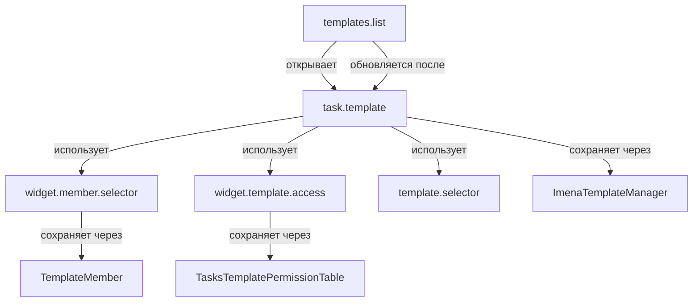

# Camunda Worker

# Camunda Worker

Camunda Worker для обработки External Tasks от Camunda через RabbitMQ с Stateless архитектурой.

## Описание

Camunda Worker - это независимый модуль для интеграции Camunda BPM с внешними системами через RabbitMQ. Реализует Stateless архитектуру с длительными блокировками задач.

### Основные возможности

- Мониторинг всех External Tasks от процессов Camunda
- **Многопоточная обработка** - отдельный поток для каждого топика задач (параллельная обработка)
- **Извлечение BPMN метаданных** - Extension Properties, Field Injections, Input/Output Parameters, Process Properties
- **Автоматическое получение переменных процесса** через Camunda REST API
- **Автоматическое извлечение processDefinitionKey** из processDefinitionId при отсутствии
- Автоматическое определение целевой системы по топику задачи
- Отправка задач в соответствующие очереди RabbitMQ с полными метаданными
- Асинхронное завершение задач через интегрированный Response Handler
- Блокировка задач на длительный период (по умолчанию 1 год для Stateless режима)
- Интеллектуальное кэширование BPMN XML с lazy loading и LRU eviction
- Устойчивость к перезагрузкам и сбоям
- Автоматическое переподключение к RabbitMQ при разрыве соединения
- Детальное логирование и мониторинг с ротацией логов
- Обработка ошибок с повторными попытками и graceful degradation

### Поддерживаемые системы

- **Bitrix24** - CRM и управление проектами
- **OpenProject** - управление проектами  
- **1C** - учетные системы
- **Python Services** - специализированные сервисы

## SSL Configuration

### Проблема SSL сертификатов

Библиотека `camunda-external-task-client-python3==4.5.0` не поддерживает настройку SSL параметров, что приводит к ошибкам:
```
SSLError(1, '[SSL: TLSV1_ALERT_DECODE_ERROR] tlsv1 alert decode error (_ssl.c:1000)')
```

### Решение

Проект использует **SSL Patch** - monkey patching библиотеки requests для автоматического добавления `verify=False` ко всем HTTP запросам к Camunda.

**Применение патча:**
- Автоматически применяется при импорте модуля `ssl_patch`
- Патч работает глобально для всех `requests` вызовов
- Отключает SSL warnings через `urllib3.disable_warnings()`

**⚠️ Предупреждение о безопасности:**
- `verify=False` отключает проверку SSL сертификатов
- Используйте только в доверенной сетевой среде
- Для production рекомендуется настроить валидные SSL сертификаты

## Архитектура

Camunda Worker использует **интегрированную архитектуру** где обработка External Tasks и Response Handling выполняются в едином процессе для максимальной эффективности.

### Компоненты системы

1. **Camunda Worker** (`camunda_worker.py`) - получение задач из Camunda, отправка в RabbitMQ и обработка ответов
2. **BPMN Metadata Cache** (`bpmn_metadata_cache.py`) - извлечение и кэширование метаданных из BPMN XML
3. **Интегрированный Response Handler** (встроен в `camunda_worker.py`) - обработка ответов из RabbitMQ и завершение задач в Camunda
4. **RabbitMQ Client** (`rabbitmq_client.py`) - взаимодействие с очередями сообщений
5. **Response Handler** (`response_handler.py`) - отдельный модуль для обработки ответов (опционально, для standalone режима)

### Workflow обработки

1. Worker получает External Task от Camunda (многопоточная обработка - отдельный поток для каждого топика)
2. Блокирует задачу на указанный период (по умолчанию 1 год для Stateless режима)
3. **Извлекает BPMN метаданные** из кэша или парсит XML (lazy loading)
4. **Получает переменные процесса** через Camunda REST API (`/process-instance/{id}/variables`)
5. Определяет целевую систему по топику
6. Отправляет задачу в соответствующую очередь RabbitMQ **с полными метаданными и переменными процесса**
7. Внешняя система обрабатывает задачу (может занимать длительное время)
8. Система отправляет результат в очередь `camunda.responses.queue`
9. **Интегрированный Response Handler** (в потоке мониторинга, каждые `HEARTBEAT_INTERVAL` секунд):
   - Проверяет очередь ответов
   - Обрабатывает сообщения (до 10 за раз)
   - Извлекает данные из ответа (включая `ufResultAnswer_text` для задач с `ufResultExpected=1`)
   - Создает переменные процесса (включая переменную с именем `activity_id`)
   - Завершает задачу в Camunda через REST API

### BPMN Метаданные

Worker автоматически извлекает из BPMN XML и передает в RabbitMQ:

- **Extension Properties** - кастомные свойства элементов (включая `assigneeId`)
- **Field Injections** - инъекции полей в Java Delegates
- **Input Parameters** - входные параметры элементов
- **Output Parameters** - выходные параметры элементов
- **Process Properties** - свойства уровня процесса (из extensionElements процесса)

**Ключевая особенность - прямое использование assigneeId:**
- Значение `assigneeId` из BPMN extensionProperties напрямую используется как `responsible_id` в целевых системах
- Отсутствует необходимость в маппинге ролей через внешние файлы
- Упрощенная конфигурация и повышенная надежность

**Process Properties:**
- Свойства уровня процесса извлекаются из `<bpmn:process><bpmn:extensionElements><camunda:properties>`
- Доступны во всех задачах процесса через `metadata.processProperties`
- Используются для глобальных настроек процесса

**Преимущества кэширования:**
- **Lazy Loading** - XML загружается только при первой задаче процесса
- **TTL**: 24 часа (конфигурируется)
- **LRU Eviction** - автоматическая очистка старых записей
- **Thread-safe** операции
- **Производительность**: 6x ускорение после первой загрузки

### Организация очередей RabbitMQ

**Исходящие задачи (Exchange: camunda.external.tasks)**
- `bitrix24.queue` - задачи для Bitrix24 (routing key: `bitrix24.*`)
- `openproject.queue` - задачи для OpenProject (routing key: `openproject.*`)
- `1c.queue` - задачи для 1C (routing key: `1c.*`)
- `python-services.queue` - задачи для Python сервисов (routing keys: `python.*`, `email.*`, `telegram.*`, `yandex.*`, `user.*`, `file.*`, `data.*`)
- `default.queue` - неопознанные задачи через Alternate Exchange
- `errors.camunda_tasks.queue` - ошибки обработки задач

**Alternate Exchange (camunda.unrouted.tasks)**
- Автоматически перенаправляет неопознанные сообщения в `default.queue`
- Используется для обработки задач с неизвестными топиками

**Ответные сообщения (Exchange: camunda.task.responses)**
- `camunda.responses.queue` - ответы от всех систем (routing key: `camunda.responses.queue`)

## Установка

### Требования

- Python 3.8+
- RabbitMQ
- Camunda BPM Platform
- Доступ к REST API Camunda

### Быстрая установка

```bash
cd camunda-worker
pip install camunda-external-task-client-python3 pika pydantic pydantic-settings python-dotenv requests loguru lxml
```

### Конфигурация

Создайте файл `.env` в корне проекта:

```bash
# Camunda настройки
CAMUNDA_BASE_URL=https://your-camunda-server.com/engine-rest
CAMUNDA_WORKER_ID=universal-worker
CAMUNDA_MAX_TASKS=10
CAMUNDA_LOCK_DURATION=31536000000
CAMUNDA_AUTH_USERNAME=your_username
CAMUNDA_AUTH_PASSWORD=your_password

# RabbitMQ настройки  
RABBITMQ_HOST=your-rabbitmq-host.com
RABBITMQ_USERNAME=your_username
RABBITMQ_PASSWORD=your_password

# BPMN Metadata Cache
BPMN_CACHE_TTL_HOURS=24
BPMN_CACHE_MAX_SIZE=150

# Логирование
LOG_LEVEL=INFO
```

## Запуск

### Основные команды

```bash
# Запуск интегрированного Worker (рекомендуется)
python main.py

# Запуск только Worker (без обработки ответов)
python camunda_worker.py

# Управление процессами Camunda
python tools/process_manager.py list
python tools/process_manager.py start ProcessKey --variables '{"key": "value"}'

# Мониторинг очередей RabbitMQ
python tools/check_queues.py

# Диагностика системы
python tools/worker_diagnostics.py

# Разблокировка зависших задач
python tools/unlock_task.py --task-id <task-id>
```

### Как сервис

В проекте используются systemd сервисы: `exchanger-worker.service` и `exchanger-creator.service`.

Для управления сервисом:
```bash
sudo systemctl status exchanger-worker
sudo systemctl restart exchanger-worker
sudo journalctl -u exchanger-worker -f
```

## Конфигурация

### Основные параметры

| Параметр | Описание | По умолчанию |
|----------|----------|--------------|
| `CAMUNDA_BASE_URL` | URL REST API Camunda | `https://camunda.example.com/engine-rest` |
| `CAMUNDA_WORKER_ID` | Идентификатор Worker | `universal-worker` |
| `CAMUNDA_MAX_TASKS` | Максимум задач за запрос | `10` |
| `CAMUNDA_LOCK_DURATION` | Время блокировки (мс) | `31536000000` (1 год) |
| `RABBITMQ_HOST` | Хост RabbitMQ | `localhost` |
| `RABBITMQ_PORT` | Порт RabbitMQ | `5672` |
| `BPMN_CACHE_TTL_HOURS` | TTL кэша метаданных (часы) | `24` |
| `BPMN_CACHE_MAX_SIZE` | Максимум процессов в кэше | `150` |
| `HEARTBEAT_INTERVAL` | Интервал проверки ответов (сек) | `60` |
| `RESPONSE_HANDLER_ENABLED` | Включить обработку ответов | `true` |
| `RESPONSE_PROCESSING_INTERVAL` | Интервал обработки ответов (сек) | `5` |
| `DEBUG_SAVE_RESPONSE_MESSAGES` | Сохранять отладочные сообщения | `false` |
| `LOG_LEVEL` | Уровень логирования | `INFO` |

### Маппинг топиков

Worker автоматически определяет целевую систему по названию топика:

```python
# Примеры маппинга
"bitrix_create_task" → bitrix24.queue
"op_create_project" → openproject.queue  
"1c_sync_data" → 1c.queue
"send_email" → python-services.queue
```

Полный список маппингов определен в `config.py` в классе `RoutingConfig`.

## Мониторинг

### Логи

Система ведет несколько типов логов:

- **Основные логи**: `logs/camunda_worker.log`
- **Логи ошибок**: `logs/camunda_worker_errors.log`
- **Системные логи**: через `journalctl -u exchanger-worker`

### Статистика

Worker выводит статистику каждые 30 секунд:

```
Monitor - Uptime: 3600s | Обработано: 150 | Успешно: 147 | Ошибки: 3 | Ответов: 25 | Завершено: 24
BPMN Cache - Hits: 142 | Misses: 8 | Hit Rate: 94.7% | Size: 12/150 (0.18 MB)
```

### Мониторинг BPMN кэша

Детальная статистика доступна через API:

```json
{
  "metadata_cache": {
    "cache_hits": 142,
    "cache_misses": 8,
    "hit_rate_percent": 94.67,
    "cache_size": 12,
    "cache_size_mb": 0.18,
    "avg_parse_time_ms": 1.3,
    "avg_cache_access_time_ms": 0.2
  }
}
```

### Проверка состояния

Используйте сервисные скрипты из каталога `tools/`:

```bash
# Статус очередей RabbitMQ
python tools/check_queues.py

# Информация о процессах Camunda
python tools/camunda_processes.py --stats

# Диагностика Worker
python tools/worker_diagnostics.py

# Тестирование обработки ответов
python tools/test_response_processing.py
```

## API для внешних систем

### Формат ответного сообщения

### Переменные возвращаемые в Camunda

После завершения задачи Worker автоматически передает в процесс Camunda следующие переменные:

**Переменная для условных выражений (conditionExpression):**
- `{activity_id}` - переменная с именем равным `activity_id` задачи
  - Значение `"ok"` - если задача не требует ответа (`ufResultExpected != "1"`) или ответ "ДА"
  - Значение `"no"` - если ответ "НЕТ" или отсутствует
  - Используется в BPMN: `${Activity_177u7c0 != "ok"}` для условных переходов

**Данные задачи Bitrix24 (если применимо):**
- `bitrix_task_id` - ID задачи в Bitrix24
- `bitrix_task_title` - заголовок задачи
- `bitrix_task_description` - описание задачи
- `bitrix_task_status` - статус задачи
- `bitrix_task_priority` - приоритет задачи
- `bitrix_task_created_date` - дата создания
- `bitrix_task_changed_date` - дата изменения
- `bitrix_task_deadline` - срок выполнения
- `bitrix_task_created_by` - ID создателя
- `bitrix_task_responsible_id` - ID ответственного
- `bitrix_task_group_id` - ID группы
- `bitrix_task_parent_id` - ID родительской задачи

**Исходные переменные:** Все переменные из исходной задачи возвращаются обратно в процесс.

**Логика обработки ответов:**
1. Если `ufResultExpected == "1"` (задача требует ответа):
   - Извлекается `ufResultAnswer_text` из ответа
   - Конвертируется: "ДА" → "ok", "НЕТ" → "no"
   - Создается переменная `{activity_id}` = конвертированное значение
2. Если `ufResultExpected != "1"` (задача не требует ответа):
   - Создается переменная `{activity_id}` = "ok" по умолчанию

## Формат сообщений

### Исходящие задачи

Внешние системы получают задачи с полными метаданными в очередях RabbitMQ:

```json
{
  "id": "task-uuid",
  "topic": "bitrix_create_task",
  "variables": {
    "projectId": {"value": "123", "type": "String"}
  },
  "metadata": {
    "extensionProperties": {
      "assigneeId": "3",
      "customProperty": "customValue"
    },
    "fieldInjections": {
      "serviceUrl": "https://api.example.com"
    },
    "inputParameters": {
      "inputData": "processedValue"
    },
    "outputParameters": {
      "resultMapping": "responseField"
    },
    "processProperties": {
      "globalProperty": "globalValue"
    },
    "processVariables": {
      "processVar1": {"value": "value1", "type": "String"}
    }
  },
  "process_variables": {
    "processVar1": {"value": "value1", "type": "String"}
  },
  "processDefinitionKey": "ProcessKey",
  "activityId": "Activity_177u7c0"
}
```

**Ключевое поле `assigneeId`:**
- Значение `assigneeId` из BPMN напрямую используется как `responsible_id` в Bitrix24
- Пример: `assigneeId: "3"` → `responsible_id: 3` в создаваемой задаче

**Process Variables:**
- Переменные процесса уровня процесса извлекаются через Camunda REST API (`/process-instance/{id}/variables`)
- Доступны в сообщении через поле `process_variables`
- Также добавляются в `metadata.processVariables` для совместимости
- Используются для передачи глобальных данных процесса во внешние системы
- Извлекаются для каждой задачи автоматически

### Формат ответа от внешних систем

Внешние системы должны отправлять ответы в очередь `camunda.responses.queue`:

```json
{
  "original_message": {
    "task_id": "task-uuid",
    "activity_id": "Activity_177u7c0",
    "topic": "bitrix_create_task",
    "variables": {
      "projectId": {"value": "123", "type": "String"}
    }
  },
  "response_data": {
    "result": {
      "task": {
        "ID": "123",
        "TITLE": "Task Title",
        "DESCRIPTION": "Task Description",
        "STATUS": "3",
        "ufResultExpected": "1",
        "ufResultAnswer_text": "ДА"
      },
      "success": true
    }
  },
  "processing_status": "completed"
}
```

**Обязательные поля:**
- `original_message.task_id` - ID задачи в Camunda
- `original_message.activity_id` - ID активности (используется для создания переменной процесса)
- `processing_status` - статус обработки ("completed" или "completed_by_tracker")

**Поля для задач с ответами:**
- `response_data.result.task.ufResultExpected` - "1" если требуется ответ
- `response_data.result.task.ufResultAnswer_text` - "ДА" или "НЕТ"

### Типы ответов

- `complete` - успешное завершение задачи
- `failure` - ошибка с возможностью повтора
- `bpmn_error` - BPMN ошибка для обработки в процессе

## Разработка

### Структура проекта

```
camunda-worker/
├── main.py                 # Точка входа (интегрированный режим)
├── camunda_worker.py       # Основной Worker с интегрированным Response Handler
├── bpmn_metadata_cache.py  # Кэш BPMN метаданных с lazy loading
├── response_handler.py     # Отдельный обработчик ответов (опционально)
├── rabbitmq_client.py      # RabbitMQ клиент с Alternate Exchange
├── config.py              # Конфигурация (Pydantic settings)
├── ssl_patch.py           # SSL патч для camunda-external-task-client
├── tools/                 # Сервисные скрипты
│   ├── process_manager.py  # Управление процессами Camunda
│   ├── start_process.py   # Запуск процессов
│   ├── camunda_processes.py # Мониторинг процессов
│   ├── check_queues.py    # Проверка очередей RabbitMQ
│   ├── unlock_task.py     # Разблокировка задач
│   ├── worker_diagnostics.py # Диагностика системы
│   ├── status_check.py    # Проверка статуса
│   ├── queue_reader.py     # Чтение сообщений из очередей
│   ├── task_recovery.py   # Восстановление задач
│   ├── README.md          # Документация инструментов
│   └── YAML_CONFIG_README.md # Документация YAML конфигурации
└── logs/                  # Файлы логов
    ├── camunda-worker.log
    ├── camunda-worker-errors.log
    └── debug/             # Отладочные файлы (если включено)
```

Схема обработки ответа от внешних систем

```mermaid
graph TD
    A[Сообщение из camunda.responses.queue] --> B[Получение activity_id]
    B --> C{activity_id найден?}
    C -->|Нет| D[WARNING: activity_id отсутствует<br/>Устанавливаем activity_id = 'ok']
    C -->|Да| E[Извлечение task_data из response_data]
    E --> F[Проверка ufResultExpected]
    F --> G{ufResultExpected === '1'?}
    G -->|Да| H[Задача требует ответа от пользователя]
    G -->|Нет/Отсутствует| I[INFO: Задача не требует ответа<br/>Устанавливаем activity_id = 'ok']
    H --> J[Поиск ufResultAnswer_text]
    J --> K{ufResultAnswer_text найден?}
    K -->|Да| L[Конвертация ДА/НЕТ → ok/no]
    K -->|Нет| M[WARNING: ufResultAnswer_text отсутствует<br/>Устанавливаем activity_id = 'ok']
    L --> N[Создание переменной процесса:<br/>variables[activity_id] = значение]
    N --> O[Извлечение данных задачи Bitrix24]
    I --> O
    M --> O
    D --> O
    O --> P[Завершение External Task в Camunda<br/>через REST API /complete]
    
    style G fill:#fff3e0
    style I fill:#e8f5e8
    style H fill:#e3f2fd
    style M fill:#fff3e0
    style D fill:#fff3e0
    style P fill:#f3e5f5
    style N fill:#e1f5fe
```    

### Зависимости

- `camunda-external-task-client-python3` - клиент для Camunda External Tasks
- `pika` - клиент для RabbitMQ
- `pydantic` - валидация данных
- `pydantic-settings` - управление настройками из переменных окружения
- `python-dotenv` - загрузка переменных из .env файла
- `requests` - HTTP запросы к Camunda REST API
- `loguru` - расширенное логирование с ротацией
- `lxml` - парсинг BPMN XML

**Установка:**
```bash
pip install camunda-external-task-client-python3 pika pydantic pydantic-settings python-dotenv requests loguru lxml
```

## Troubleshooting

### Частые проблемы

1. **Задачи не обрабатываются**: Проверьте подключение к Camunda и маппинг топиков
2. **Ошибки RabbitMQ**: Убедитесь в корректности credentials и доступности сервера
3. **Задачи зависают**: Проверьте время блокировки и работу Response Handler
4. **Метаданные не извлекаются**: Проверьте доступ к Camunda REST API для загрузки BPMN XML
5. **Проблемы с кэшем**: Увеличьте `BPMN_CACHE_MAX_SIZE` или проверьте логи парсинга XML
6. **Ошибка "condition expression returns non-Boolean"**: BPMN процесс ожидает Boolean в условном выражении. Для диагностики:
   - Проверьте логи Worker - включено подробное логирование запросов к Camunda
   - Убедитесь что условные выражения в BPMN используют правильные переменные
   - Проверьте что переменная `{activity_id}` создается корректно (значение "ok" или "no")
   - Используйте `python tools/queue_reader.py camunda.responses.queue` для просмотра ответов
7. **Задачи не завершаются**: Проверьте работу Response Handler:
   - Убедитесь что `RESPONSE_HANDLER_ENABLED=true` (по умолчанию включено)
   - Проверьте очередь `camunda.responses.queue` на наличие сообщений
   - Проверьте логи на ошибки завершения задач (HTTP 500, 404)
8. **Метаданные не передаются**: Проверьте доступ к Camunda REST API:
   - Убедитесь что `/process-definition/{id}/xml` доступен
   - Проверьте логи кэша BPMN на ошибки парсинга
   - Используйте `python tools/worker_diagnostics.py` для диагностики

### Диагностика

```bash
# Проверка подключений
python tools/worker_diagnostics.py

# Разблокировка зависших задач
python tools/unlock_task.py --task-id <task-id>

# Просмотр активных процессов
python tools/camunda_processes.py --instances

# Просмотр сообщений в очереди ответов
python tools/queue_reader.py camunda.responses.queue

# Восстановление задач
python tools/task_recovery.py

# Проверка статуса системы
python tools/status_check.py
```

## Лицензия

MIT License 

---

# IMENA Camunda Module

# IMENA Camunda Module - Полная документация

**Версия модуля:** 2.3+  
**Статус:** ✅ Активно используется в production  
**Автор:** #vlikhobabin@gmail.com  
**Дата последнего обновления:** 25.01.2025

---

## 📋 Содержание

1. [Обзор модуля](#обзор-модуля)
2. [Архитектура](#архитектура)
3. [Основные компоненты](#основные-компоненты)
4. [Установка и настройка](#установка-и-настройка)
5. [Использование](#использование)
6. [API и интеграция](#api-и-интеграция)
7. [Документация подмодулей](#документация-подмодулей)
8. [Разработка и расширение](#разработка-и-расширение)
9. [Требования и совместимость](#требования-и-совместимость)

---

## Обзор модуля

### Назначение

Модуль **imena.camunda** обеспечивает интеграцию Bitrix24 с **Camunda 7 BPM Engine** для управления бизнес-процессами. Модуль предоставляет:

- ✅ **Синхронизацию данных** между Camunda и Bitrix24 (Process Definitions, Process Instances, External Tasks, Variables)
- ✅ **UI компоненты** для просмотра и управления процессами в Bitrix24
- ✅ **REST API** для интеграции с внешними системами
- ✅ **Автоматическую синхронизацию** через агенты Bitrix
- ✅ **Webhook-синхронизацию** для real-time обновлений
- ✅ **Систему прав доступа** для контроля операций
- ✅ **Grid и Filter** компоненты для работы со списками

### Ключевые возможности

1. **Управление процессами**
   - Просмотр списка процессов с фильтрацией и сортировкой
   - Детальная информация о процессах
   - Управление жизненным циклом (suspend, resume, terminate)
   - Связь процессов с задачами Bitrix24

2. **Управление определениями процессов**
   - Список определений процессов (Process Definitions)
   - Просмотр BPMN диаграмм
   - Управление версиями
   - Запуск процессов из определений

3. **Внешние задачи (External Tasks)**
   - Синхронизация внешних задач из Camunda
   - Мониторинг статусов выполнения
   - История выполнения задач

4. **Переменные процессов**
   - Хранение переменных процессов в БД Bitrix24
   - Синхронизация значений с Camunda
   - Отслеживание статусов синхронизации

5. **Автоматическая синхронизация**
   - Периодическая синхронизация по расписанию
   - Webhook-синхронизация в реальном времени
   - Обработка ошибок с автоматической остановкой

---

## Архитектура

### Структура модуля

```
imena.camunda/
├── lib/                          # Основная библиотека модуля
│   ├── ProcessInstance/          # Управление экземплярами процессов
│   ├── ProcessDefinition/        # Управление определениями процессов
│   ├── ExternalTask/             # Внешние задачи Camunda
│   ├── ProcessVariable/          # Переменные процессов
│   ├── Sync/                     # Синхронизация с Camunda
│   │   ├── Client/              # HTTP клиенты Camunda REST API
│   │   ├── Service/             # Сервисы синхронизации
│   │   ├── Mapper/              # Преобразование данных
│   │   ├── Entity/              # ORM таблицы синхронизации
│   │   ├── Command/            # CQRS команды
│   │   └── Exception/           # Исключения
│   ├── Rest/                    # REST API обработчики
│   ├── Config/                   # Конфигурация модуля
│   ├── Agent/                    # Агенты автоматической синхронизации
│   └── Controller/              # AJAX контроллеры
├── install/                      # Установщик модуля
│   ├── db/                      # SQL миграции
│   ├── components/              # Компоненты Bitrix
│   └── js/                      # JavaScript расширения
├── docs/                         # Документация
├── lang/                        # Языковые файлы
├── .settings.php                # Конфигурация D7 контроллеров
├── options.php                  # Страница настроек модуля
└── include.php                   # Автозагрузка классов
```

### Принципы архитектуры

1. **D7 Standard** - использование Bitrix D7 API
2. **Clean Architecture** - разделение на слои (Client, Service, Entity)
3. **CQRS Pattern** - команды для операций изменения состояния
4. **Repository Pattern** - ORM таблицы для работы с БД
5. **Mapper Pattern** - преобразование между форматами данных
6. **Namespace Autoloading** - автоматическая загрузка классов

### Поток данных

```
Camunda REST API
    ↓
Sync/Client (HTTP клиенты)
    ↓
Sync/Mapper (преобразование данных)
    ↓
ORM Tables (ProcessTable, ProcessDefinitionTable, etc.)
    ↓
Components/Controllers (UI и API)
    ↓
Bitrix24 Frontend
```

---

## Основные компоненты

### 1. ProcessInstance - Экземпляры процессов

**Назначение:** Управление экземплярами процессов Camunda в Bitrix24

**Ключевые классы:**
- `ProcessTable` - ORM таблица `b_imena_camunda_process_instances`
- `ProcessInstance` - Value-object для работы с процессом
- `CamundaListController` - AJAX контроллер для списка
- `CamundaDetailController` - AJAX контроллер для деталей

**Компоненты:**
- `camunda.process.list` - Список процессов
- `camunda.process.detail` - Детальная информация о процессе

**Страницы:**
- `/local/pages/imena/camunda/process/list/` - Список процессов
- `/local/pages/imena/camunda/process/detail/` - Детали процесса

**Документация:** [lib/ProcessInstance/README.md](lib/ProcessInstance/README.md)

### 2. ProcessDefinition - Определения процессов

**Назначение:** Управление определениями процессов (BPMN диаграммы)

**Ключевые классы:**
- `ProcessDefinitionTable` - ORM таблица `b_imena_camunda_process_definitions`
- `ProcessDefinition` - Value-object для работы с определением
- `CamundaAccessController` - Система прав доступа

**Компоненты:**
- `camunda.processdefinition.list` - Список определений
- `camunda.processdefinition.details` - Детали определения
- `camunda.processdefinition.diagram` - Просмотр BPMN диаграммы

**Страницы:**
- `/local/pages/imena/camunda/processdefinition/list/` - Список определений
- `/local/pages/imena/camunda/processdefinition/detail/` - Детали определения
- `/local/pages/imena/camunda/processdefinition/diagram/` - BPMN диаграмма

**Документация:** [lib/ProcessDefinition/README.md](lib/ProcessDefinition/README.md)

### 3. ExternalTask - Внешние задачи

**Назначение:** Работа с внешними задачами Camunda (External Tasks)

**Ключевые классы:**
- `ExternalTaskTable` - ORM таблица `b_imena_camunda_external_tasks`
- `ExternalTaskService` - Сервис для работы с задачами
- `ExternalTaskController` - AJAX контроллер

**Статусы задач:**
- `RUNTIME` - Активные задачи в Camunda
- `HISTORY` - Завершенные задачи (из Historical External Task Log)

**Документация:** [lib/ExternalTask/README.md](lib/ExternalTask/README.md)

### 4. ProcessVariable - Переменные процессов

**Назначение:** Хранение и синхронизация переменных процессов

**Ключевые классы:**
- `ProcessVariableTable` - ORM таблица `b_imena_camunda_process_variables`
- `ProcessVariable` - Value-object для работы с переменной
- `ProcessVariableService` - Сервис синхронизации переменных

**Типы переменных:**
- `string` - Строковые значения
- `integer` - Целочисленные значения
- `boolean` - Логические значения
- `date` - Даты и время
- `enum` - Перечисления

**Документация:** [lib/ProcessVariable/README.md](lib/ProcessVariable/README.md)

### 5. Sync - Синхронизация с Camunda

**Назначение:** Библиотека для синхронизации данных между Camunda и Bitrix24

**Подкаталоги:**
- **Client/** - HTTP клиенты Camunda REST API
- **Service/** - Бизнес-логика синхронизации
- **Mapper/** - Преобразование данных Camunda ↔ Bitrix
- **Entity/** - ORM таблицы синхронизации
- **Command/** - CQRS команды
- **Exception/** - Исключения

**Ключевые классы:**
- `CamundaApiClient` - Базовый HTTP клиент
- `HistoricProcessInstanceClient` - Клиент для исторических процессов
- `ProcessDefinitionClient` - Клиент для определений
- `ExternalTaskClient` - Клиент для внешних задач
- `FullSyncService` - Полная синхронизация всех данных
- `SyncLogger` - Логирование операций синхронизации

**Документация:** [lib/Sync/README.md](lib/Sync/README.md)

### 6. Rest - REST API

**Назначение:** REST API обработчики для интеграции с внешними системами

**Ключевые классы:**
- `WebhookHandler` - Обработчик webhook от Camunda
- `DiagramPropertiesHandler` - API для получения свойств диаграмм

**Доступные методы:**
- `imena.camunda.sync` - Синхронизация процесса через webhook
- `imena.camunda.diagram.properties.list` - Список свойств диаграммы

**Документация:** [lib/Rest/README.md](lib/Rest/README.md)

### 7. Agent - Автоматическая синхронизация

**Назначение:** Автоматическая периодическая синхронизация данных

**Ключевые классы:**
- `CamundaSyncAgent` - Агент автоматической синхронизации

**Возможности:**
- Настраиваемый период синхронизации (default: 300 сек)
- Проверка подключения с 5 retry попытками
- Автоматическая остановка при критических ошибках
- Детальное логирование и статистика

**Документация:** [lib/Agent/README.md](lib/Agent/README.md)

### 8. Config - Конфигурация

**Назначение:** Управление настройками модуля

**Ключевые классы:**
- `ConnectionConfig` - Настройки подключения к Camunda
- `CamundaCredentialsService` - Управление учетными данными

**Настройки:**
- URL сервера Camunda REST API
- Учетные данные (username, password)
- Параметры автоматической синхронизации
- Интервал синхронизации

**Документация:** [lib/Config/README.md](lib/Config/README.md)

---

## Установка и настройка

### Требования

- **PHP** 8.0+
- **Bitrix24** 20.0.0+
- **Camunda BPM** 7.14+
- **MySQL** 5.7+ или MariaDB 10.3+
- **Расширения PHP:** cURL, JSON, PDO

### Установка модуля

1. **Копирование файлов**
   ```bash
   # Модуль должен находиться в:
   /local/modules/imena.camunda/
   ```

2. **Установка через админку**
   - Перейдите: **Настройки → Настройки продукта → Настройки модулей**
   - Найдите модуль **IMENA Camunda**
   - Нажмите **"Установить"**

3. **Проверка установки**
   - Убедитесь, что созданы таблицы в БД:
     - `b_imena_camunda_process_instances`
     - `b_imena_camunda_process_definitions`
     - `b_imena_camunda_external_tasks`
     - `b_imena_camunda_process_variables`
     - `b_imena_camunda_sync_log`

### Настройка подключения к Camunda

1. **Через админку:**
   - Перейдите: **Настройки → Настройки продукта → Настройки модулей → IMENA Camunda**
   - Заполните параметры:
     - **URL сервера Camunda:** `http://camunda-server:8080/engine-rest`
     - **Имя пользователя:** `demo`
     - **Пароль:** `demo`

2. **Через .settings.php:**
   ```php
   return [
       'camunda' => [
           'value' => [
               'api_url' => 'http://camunda-server:8080/engine-rest',
               'auth' => [
                   'type' => 'basic',
                   'username' => 'admin',
                   'password' => 'secret',
               ],
           ],
       ],
   ];
   ```

3. **Проверка подключения:**
   ```php
   use ImenaCamunda\Sync\Service\SyncService;
   
   $syncService = new SyncService();
   $result = $syncService->testConnection();
   
   if ($result->isSuccess()) {
       echo "Подключение успешно!";
   }
   ```

### Настройка автоматической синхронизации

1. **Включение через админку:**
   - Страница: `/local/pages/imena/camunda/settings/`
   - Включите чекбокс "Включить автоматическую синхронизацию"
   - Укажите период синхронизации (сек.)
   - Нажмите "Сохранить"

2. **Программно:**
   ```php
   use ImenaCamunda\Config\ConnectionConfig;
   use ImenaCamunda\Agent\CamundaSyncAgent;
   
   ConnectionConfig::setSyncAutoEnabled(true);
   ConnectionConfig::setSyncInterval(300); // 5 минут
   CamundaSyncAgent::addAgent();
   ```

### Настройка Webhook-синхронизации

1. **Создание входящего webhook в Bitrix24:**
   - Приложения → Вебхуки → Добавить входящий webhook
   - Права доступа: модуль `imena.camunda`
   - Скопировать URL

2. **Настройка в модуле:**
   - Страница: `/local/pages/imena/camunda/settings/`
   - Секция "Webhook-синхронизация"
   - Указать URL входящего webhook

3. **Настройка в Camunda:**
   - Добавить HTTP Task в BPMN диаграмму
   - URL: `{webhook_url}/imena.camunda.sync`
   - Payload: `{"processDefinitionKey": "...", "processInstanceId": "..."}`

---

## Использование

### Просмотр списка процессов

**URL:** `/local/pages/imena/camunda/process/list/`

**Возможности:**
- Фильтрация по статусу, определению процесса, дате
- Сортировка по любому полю
- Массовые действия (suspend, resume, terminate)
- Действия для отдельных процессов
- Экспорт в Excel

### Просмотр деталей процесса

**URL:** `/local/pages/imena/camunda/process/detail/?ID={process_id}`

**Информация:**
- Основные данные процесса
- Переменные процесса
- Внешние задачи
- История выполнения
- Связанные задачи Bitrix24

### Управление процессами

**Через UI:**
- Контекстное меню строки → Suspend/Resume/Terminate
- Панель действий → Массовые операции

**Программно:**
```php
use ImenaCamunda\ProcessInstance\ProcessInstance;

$process = ProcessInstance::getInstance($processId);

// Приостановить процесс
$result = $process->suspend();

// Возобновить процесс
$result = $process->resume();

// Завершить процесс
$result = $process->terminate('Причина завершения');
```

### Синхронизация данных

**Автоматическая:**
- Настраивается через страницу настроек
- Выполняется по расписанию через агент Bitrix

**Ручная:**
```php
use ImenaCamunda\Sync\Service\FullSyncService;

$syncService = new FullSyncService();

// Полная синхронизация
$result = $syncService->syncAllDefinitions();

// Синхронизация одного процесса
$result = $syncService->syncProcessInstance($processId);
```

**Через Webhook:**
- Camunda автоматически отправляет webhook при изменении процесса
- Bitrix24 синхронизирует данные в фоне

### Работа с переменными процессов

```php
use ImenaCamunda\ProcessVariable\ProcessVariable;

$variable = new ProcessVariable($processInstanceId, 'customerName');

// Получить значение
$value = $variable->getValue();

// Установить значение
$variable->setValue('Новое значение');

// Отметить успешную синхронизацию
$variable->markSyncStatus('SUCCESS');
```

### Работа с внешними задачами

```php
use ImenaCamunda\ExternalTask\ExternalTaskTable;

// Получить доступные задачи по топику
$tasks = ExternalTaskTable::getAvailable('createOrder');

// Получить задачи процесса
$tasks = ExternalTaskTable::getByProcessInstance($processInstanceId);

// Получить задачи с ошибками
$tasks = ExternalTaskTable::getWithErrors();
```

---

## API и интеграция

### AJAX API

**Контроллеры:**
- `CamundaListController` - Список процессов
- `CamundaDetailController` - Детали процесса
- `SyncController` - Управление синхронизацией
- `ProcessVariableController` - Переменные процессов

**Примеры вызовов:**
```javascript
// Получить список процессов
BX.ajax.runAction('imena.camunda:camunda.list.getList', {
    data: {
        filter: {STATUS: 'ACTIVE'},
        nav: {limit: 25, offset: 0}
    }
});

// Приостановить процесс
BX.ajax.runAction('imena.camunda:camunda.detail.suspend', {
    data: {processId: 'process-123'}
});

// Запустить синхронизацию
BX.ajax.runAction('imena.camunda:camunda.sync.runNow', {
    data: {}
});
```

### REST API

**Входящие webhook:**
- `imena.camunda.sync` - Синхронизация процесса
- `imena.camunda.diagram.properties.list` - Свойства диаграммы

**Пример вызова:**
```bash
curl -X POST "https://portal/rest/1/webhook_code/imena.camunda.sync" \
  -H "Content-Type: application/json" \
  -d '{
    "processDefinitionKey": "Process_abc123",
    "processInstanceId": "process-instance-uuid"
  }'
```

### Интеграция с другими модулями

**imena.storm:**
- Связь диаграмм Storm с процессами Camunda
- Синхронизация свойств диаграмм

**imena.tasks.templates:**
- Связь процессов Camunda с задачами Bitrix24
- Автоматическое создание задач при старте процесса

---

## Документация подмодулей

### Основные библиотеки

- **[ProcessInstance](lib/ProcessInstance/README.md)** - Управление экземплярами процессов
- **[ProcessDefinition](lib/ProcessDefinition/README.md)** - Управление определениями процессов
- **[ExternalTask](lib/ExternalTask/README.md)** - Внешние задачи Camunda
- **[ProcessVariable](lib/ProcessVariable/README.md)** - Переменные процессов
- **[Sync](lib/Sync/README.md)** - Синхронизация с Camunda (полная документация)
- **[Rest](lib/Rest/README.md)** - REST API обработчики
- **[Agent](lib/Agent/README.md)** - Автоматическая синхронизация
- **[Config](lib/Config/README.md)** - Конфигурация модуля

### Дополнительная документация

- **[docs/README.md](docs/README.md)** - Документация по кликабельным полям в Grid
- **[CAMUNDA_URL_CONFIGURATION.md](CAMUNDA_URL_CONFIGURATION.md)** - Настройка URL Camunda
- **[QUICK_START_AUTO_SYNC.md](QUICK_START_AUTO_SYNC.md)** - Быстрый старт автоматической синхронизации
- **[REST_HANDLERS_FINAL_REPORT.md](REST_HANDLERS_FINAL_REPORT.md)** - Отчет по REST обработчикам

---

## Разработка и расширение

### Автозагрузка классов

Модуль использует D7 автозагрузку через `include.php`:

```php
// Namespace: ImenaCamunda\ProcessInstance\Grid\CamundaGrid
// Файл: /lib/ProcessInstance/Grid/CamundaGrid.php

use ImenaCamunda\ProcessInstance\Grid\CamundaGrid;
```

### Создание нового компонента

1. **ORM таблица:**
   ```php
   namespace ImenaCamunda\YourModule;
   
   class YourTable extends DataManager
   {
       public static function getTableName(): string
       {
           return 'b_imena_camunda_your_table';
       }
       
       public static function getMap(): array
       {
           return [
               // Поля таблицы
           ];
       }
   }
   ```

2. **Компонент:**
   ```php
   // /local/components/imena.camunda/your.component/class.php
   class YourComponent extends CBitrixComponent
   {
       public function executeComponent(): void
       {
           // Логика компонента
       }
   }
   ```

3. **Контроллер:**
   ```php
   namespace ImenaCamunda\YourModule\Controller;
   
   class YourController extends Controller
   {
       public function yourActionAction(): array
       {
           // Логика действия
       }
   }
   ```

### Расширение синхронизации

1. **Создать клиент:**
   ```php
   namespace ImenaCamunda\Sync\Client;
   
   class YourClient extends CamundaApiClient
   {
       public function getYourData(): array
       {
           return $this->get('/your-endpoint');
       }
   }
   ```

2. **Создать маппер:**
   ```php
   namespace ImenaCamunda\Sync\Mapper;
   
   class YourMapper
   {
       public function mapFromCamunda(array $data): array
       {
           // Преобразование данных
       }
   }
   ```

3. **Создать сервис синхронизации:**
   ```php
   namespace ImenaCamunda\Sync\Service;
   
   class YourSyncService
   {
       public function syncAll(): Result
       {
           // Логика синхронизации
       }
   }
   ```

### Тестирование

**Unit-тесты:**
```php
// tests/Unit/ProcessInstanceTest.php
class ProcessInstanceTest extends TestCase
{
    public function testGetInstance()
    {
        $process = ProcessInstance::getInstance('test-id');
        $this->assertNotNull($process);
    }
}
```

**Integration-тесты:**
```php
// tests/Integration/SyncTest.php
class SyncTest extends TestCase
{
    public function testSyncProcess()
    {
        $syncService = new FullSyncService();
        $result = $syncService->syncProcessInstance('test-id');
        $this->assertTrue($result->isSuccess());
    }
}
```

---

## Требования и совместимость

### Системные требования

- **PHP:** 8.0+
- **Bitrix24:** 20.0.0+
- **Camunda BPM:** 7.14+
- **MySQL:** 5.7+ или MariaDB 10.3+
- **Расширения PHP:** cURL, JSON, PDO, mbstring

### Совместимость

**Camunda версии:**
- ✅ Camunda 7.14+ (полная поддержка)
- ⚠️ Camunda 7.13 (частичная поддержка)
- ❌ Camunda 7.12 и ниже (не поддерживается)

**Bitrix версии:**
- ✅ Bitrix24 20.0.0+ (полная поддержка)
- ⚠️ Bitrix24 19.0.0 (частичная поддержка)
- ❌ Bitrix24 18.0.0 и ниже (не поддерживается)

### Известные ограничения

1. **Производительность:**
   - Полная синхронизация большого количества процессов (>10000) может занять длительное время
   - Рекомендуется использовать инкрементальную синхронизацию

2. **Память:**
   - Синхронизация большого количества данных может потребовать увеличения `memory_limit` PHP

3. **Сеть:**
   - Требуется стабильное соединение с Camunda сервером
   - При проблемах с сетью используется retry механизм

---

## История версий

### Версия 2.3+ (25.01.2025)

**Новые возможности:**
- ✅ Webhook-синхронизация для real-time обновлений
- ✅ REST API метод `imena.camunda.diagram.properties.list`
- ✅ Улучшенная обработка ошибок синхронизации

### Версия 2.2+ (22.10.2025)

**Новые возможности:**
- ✅ Автоматическая синхронизация через агент Bitrix
- ✅ Страница управления синхронизацией
- ✅ AJAX контроллер для управления синхронизацией
- ✅ Обработка критических ошибок с автоматической остановкой

### Версия 2.1+ (13.10.2025)

**Новые возможности:**
- ✅ Синхронизация External Tasks с UPSERT стратегией
- ✅ Поддержка статусов RUNTIME и HISTORY
- ✅ Каскадная синхронизация (Definitions → Processes → Tasks)

### Версия 2.0.0 (13.10.2025)

**Основные улучшения:**
- ✅ Рефакторинг библиотеки Sync
- ✅ Создание специализированных клиентов
- ✅ Реализация ProcessMapper и ProcessDefinitionMapper
- ✅ Создание SyncLogger для мониторинга
- ✅ Полная документация всех компонентов

---

## Поддержка и контакты

**Автор:** #vlikhobabin@gmail.com

**Документация:**
- Основная документация: `/local/modules/imena.camunda/README.md`
- Документация подмодулей: `/local/modules/imena.camunda/lib/*/README.md`
- Дополнительная документация: `/local/modules/imena.camunda/docs/`

**Логи:**
- Синхронизация: `/local/logs/camunda_sync.log`
- PHP ошибки: `/var/log/php-fpm/error.log`
- Bitrix логи: через `AddMessage2Log()`

---

## Лицензия

Модуль разработан для внутреннего использования в проекте Bitrix24.

---

*Последнее обновление: 25.01.2025*


---

# IMENA RabbitMQ Module

# 🐰 IMENA RabbitMQ - API Management Module

**Модуль управления RabbitMQ 3.13.7 напрямую через Management API (БЕЗ локальной базы данных)**

**Автор:** #vlikhobabin@gmail.com  
**Дата создания:** 16 октября 2025  
**Текущая версия:** 1.0.0  
**Статус:** 🎯 Beta (Core Features Complete)  
**Шаблон:** [imena.sample](../imena.sample/)

---

## 📋 Содержание

- [✨ Что уже работает](#-что-уже-работает)
- [🎯 Концепция модуля](#-концепция-модуля)
- [🏛️ Архитектурный обзор](#-архитектурный-обзор)
- [🚀 Быстрый старт](#-быстрый-старт)
- [📚 Документация](#-документация)
- [📁 Структура проекта](#-структура-проекта)

---

## ✨ Что уже работает

### 🎉 Реализованные функции (Beta v1.0.0)

**✅ Просмотр очередей RabbitMQ**
- Отображение всех очередей из RabbitMQ Management API в реальном времени
- Grid с 7 колонками: Имя, Тип, Статус, Особенности, Сообщения (Ready/Unacked/Total)
- Client-side сортировка по всем колонкам
- Цветовая индикация статусов (🟢 running, 🟡 idle, 🔴 down)
- Бейджи для типов очередей (classic, quorum, stream)
- Компактное отображение особенностей (D - durable, AD - auto-delete, Ex - exclusive)

**✅ Управление очередями**
- Действие "Очистить очередь" (Purge) через контекстное меню
- AJAX запросы через Controllerable с защитой (Authentication + CSRF)
- Обработка ошибок API с пользовательскими сообщениями
- Уведомления об успехе/ошибке операций

**✅ Настройки подключения**
- Страница настроек с формой ввода credentials
- Проверка подключения к RabbitMQ API
- Сохранение настроек в модульных опциях Bitrix24
- Валидация параметров подключения

**✅ Архитектура API-first**
- Полностью реализованный `RmqApiClient` с 10 методами:
  - `getQueues()` - список очередей
  - `purgeQueue()` - очистка очереди
  - `getExchanges()` - точки обмена
  - `getBindings()` - привязки
  - `getConnections()` - подключения
  - `getOverview()` - общая статистика
  - `testConnection()` - проверка доступности
- БЕЗ локальной БД - все данные из RabbitMQ API
- Value Object `QueueEntity` с типизацией всех полей

**✅ Grid система (19 классов)**
- Полнофункциональная Grid система по архитектуре `imena.sample`
- 9 специализированных Field Assemblers для форматирования данных
- Система колонок с настройкой видимости и порядка
- Row Actions (контекстное меню) с действием Purge
- Panel Actions (групповые операции) - готовность к расширению
- Адаптация под API-driven данные (без ORM)

### 📊 Статистика реализации

| Компонент | Готовность | Файлов | Строк кода |
|-----------|------------|--------|------------|
| API Client | ✅ 100% | 2 | ~400 |
| Grid System | ✅ 100% | 19 | ~2000 |
| Components | ✅ 100% | 1 | ~220 |
| Pages | ✅ 100% | 2 | ~200 |
| Value Objects | 🚧 33% | 1/3 | ~250 |
| Documentation | ✅ 100% | 5 | ~1500 |
| **ИТОГО** | **✅ ~75%** | **30+** | **~4500** |

### 🎯 Следующие этапы (v1.1.0+)

- [ ] Фильтрация очередей (client-side)
- [ ] Кеширование (Bitrix Cache, TTL 30s)
- [ ] Exchange management (список, детали)
- [ ] Binding management (список, создание)
- [ ] Детальная карточка очереди (queue.detail)
- [ ] Групповые операции (bulk purge, bulk delete)
- [ ] Access Control (права доступа)
- [ ] Monitoring dashboard

---

## 🎯 Концепция модуля

### 💡 Основная идея

**IMENA RabbitMQ** — это **API-первый модуль** для управления RabbitMQ из Битрикс24, который **НЕ использует локальную базу данных**. Все данные загружаются в реальном времени из RabbitMQ Management API.

### 🔑 Ключевые отличия от других модулей

| Характеристика | imena.sample | imena.camunda | **imena.rmq** |
|----------------|--------------|---------------|---------------|
| **База данных** | ✅ b_imena_sample_user | ✅ b_imena_camunda_* | ❌ **НЕТ таблиц** |
| **ORM классы** | ✅ UserTable extends DataManager | ✅ ProcessTable | ❌ **Value Objects** |
| **Источник данных** | БД Битрикс | БД Битрикс (sync) | **RabbitMQ API** |
| **Синхронизация** | Не требуется | Фоновая | ❌ **НЕТ sync** |
| **Кеширование** | DB cache | DB cache | **File cache 30sec** |

### 🎯 Назначение

- 📊 **Мониторинг** RabbitMQ в реальном времени (queues, exchanges, bindings, connections)
- ⚙️ **Управление** очередями и точками обмена (create, delete, purge)
- 📨 **Публикация** сообщений в очереди и exchanges
- 🔗 **Управление привязками** (bindings) между exchanges и queues
- 📈 **Метрики** производительности (message rates, memory usage)

---

## 🏛️ Архитектурный обзор

### 🏗️ Архитектурные слои (БЕЗ ORM)

```
┌─────────────────────────────────────────────────────────────────────┐
│                         🌐 PRESENTATION LAYER                       │
├─────────────────────────────────────────────────────────────────────┤
│  📊 Grid System          │  🔍 Filter System     │  🎮 Controllers   │
│  • RmqGrid (adapted)     │  • RmqFilter          │  • AJAX Endpoints │
│  • Column Providers      │  • Presets Manager    │  • Request Handlers│
│  • Panel Actions         │  • Client-side filter │  • Validation     │
└─────────────────────────────────────────────────────────────────────┘

┌─────────────────────────────────────────────────────────────────────┐
│                        🚀 APPLICATION LAYER                         │
├─────────────────────────────────────────────────────────────────────┤
│   Controllers            │  Services             │  Access Control  │
│  • RmqQueueController    │  • RmqQueueService    │  • Rights Check  │
│  • RmqExchangeController │  • RmqExchangeService │  • Permission    │
│  • AJAX Actions          │  • Business Logic     │  • Rule Engine   │
└─────────────────────────────────────────────────────────────────────┘

┌─────────────────────────────────────────────────────────────────────┐
│                         🛠️ DOMAIN LAYER                             │
├─────────────────────────────────────────────────────────────────────┤
│  🏢 Business Services     │  📋 Value Objects     │  🔌 API Client    │
│  • QueueManager          │  • QueueEntity        │  • RmqApiClient  │
│  • ExchangeManager       │  • ExchangeEntity     │  • HTTP Requests │
│  • MessagePublisher      │  • BindingEntity      │  • Cache Manager │
└─────────────────────────────────────────────────────────────────────┘

┌─────────────────────────────────────────────────────────────────────┐
│                      💾 INFRASTRUCTURE LAYER                        │
├─────────────────────────────────────────────────────────────────────┤
│  🌐 External API         │  💾 Cache             │  📦 NO Database   │
│  • RabbitMQ Mgmt API     │  • File Cache (30s)   │  • NO ORM         │
│  • HTTP Client           │  • In-Memory Cache    │  • NO Tables      │
│  • JSON Responses        │  • TTL Management     │  • NO Migrations  │
└─────────────────────────────────────────────────────────────────────┘
```

### 📊 Основные компоненты

| 🏛️ Компонент | 📁 Реализовано | 🎯 Назначение |
|-------------|----------|-------------|
| **🔌 API** | 2 классов | RmqApiClient (10 методов), RmqApiException |
| **📊 Grid** | 19 классов | Полная Grid система (Column/Row/Panel/Settings/Field Assemblers) |
| **📦 Entities** | 1 класс | QueueEntity (Value Object с 15+ полями) |
| **🎮 Components** | 1 компонент | queue.list с Controllerable (AJAX purgeQueue) |
| **🌐 Pages** | 2 страницы | settings/, queues/ |
| **🔍 Filter** | 0 (план) | Client-side фильтрация (следующий этап) |
| **🔒 Access** | 0 (план) | Контроль доступа (следующий этап) |
| **🏢 Services** | 0 (план) | Business logic layer (следующий этап) |

**Текущая архитектура:**
- ✅ **API Layer** - прямое взаимодействие с RabbitMQ Management API
- ✅ **Value Objects** - QueueEntity для типизированных данных
- ✅ **Grid System** - полнофункциональная UI система отображения
- ✅ **Component Layer** - queue.list с AJAX действиями
- 🚧 **Service Layer** - бизнес-логика (в разработке)
- 🚧 **Access Layer** - контроль прав (в разработке)

---

## 🚀 Быстрый старт

### ✅ Системные требования

- **Bitrix24:** 20.0.0+
- **PHP:** 8.0+ (рекомендуется 8.1+)
- **RabbitMQ:** 3.13.7 с включенным Management Plugin
- **Доступ:** RabbitMQ Management API (HTTPS)
- **Права:** Администратор Bitrix24

### 📦 Установка модуля

#### **Шаг 1: Подготовка файлов**
```bash
# Скопируйте модуль
cp -r /path/to/imena.rmq /home/bitrix/www/local/modules/

# Установите права
chown -R bitrix:bitrix /home/bitrix/www/local/modules/imena.rmq
chmod -R 755 /home/bitrix/www/local/modules/imena.rmq
```

#### **Шаг 2: Установка через админку Bitrix24**
1. Откройте: `https://your-domain.com/bitrix/admin/`
2. Перейдите: `Marketplace → Установленные решения → Модули`
3. Найдите **"IMENA RabbitMQ"** в списке
4. Нажмите **"Установить"**
5. ✅ **Модуль установлен!** (БЕЗ создания таблиц БД)

#### **Шаг 3: Настройка RabbitMQ API**
1. Откройте: `Настройки → Настройки модулей → IMENA RabbitMQ`
2. Укажите:
   - **API URL:** `https://rmq.eg-holding.ru:15672/api/`
   - **Username:** `admin` (или ваш RabbitMQ admin)
   - **Password:** `********` (RabbitMQ admin password)
   - **Default VHost:** `/` (или другой vhost)
3. Нажмите **"Проверить соединение"**
4. Сохраните настройки

### 🌐 Использование

#### **Доступные страницы:**
- ✅ **Настройки:** `/local/pages/imena/rmq/settings/` - конфигурация подключения к RabbitMQ
- ✅ **Очереди:** `/local/pages/imena/rmq/queues/` - список очередей с Grid
- 🚧 **Точки обмена:** `/local/pages/imena/rmq/exchanges/` (в разработке)
- 🚧 **Привязки:** `/local/pages/imena/rmq/bindings/` (в разработке)
- 🚧 **Мониторинг:** `/local/pages/imena/rmq/monitoring/` (в разработке)

#### **Доступные функции:**

**Просмотр очередей:**
```
1. Откройте /local/pages/imena/rmq/queues/
2. Grid отображает все очереди из RabbitMQ API
3. Колонки: Имя, Тип, Статус, Особенности, Сообщений
4. Сортировка работает по всем колонкам (client-side)
5. Цветовая индикация статусов (running, idle, down)
```

**Очистка очереди (Purge):**
```
1. Наведите на строку в Grid
2. Нажмите на три точки (контекстное меню)
3. Выберите "Очистить очередь"
4. Подтвердите действие
5. Очередь будет очищена через RabbitMQ API
```

**Настройка подключения:**
```
1. Откройте /local/pages/imena/rmq/settings/
2. Укажите API URL, Username, Password
3. Нажмите "Проверить соединение"
4. При успехе - сохраните настройки
```

---

## 📚 Документация

### 📖 Основные документы

| 📄 Документ | 🎯 Назначение |
|-----------|-------------|
| [idea.md](idea.md) | Философия и концепция модуля |
| [.cursorrules](.cursorrules) | Правила разработки модуля (711 строк) |
| [README.md](README.md) | Этот файл |

### 🔗 Связанные документы

- [📖 imena.sample](../imena.sample/README.md) - Базовый шаблон
- [📖 .cursorrules основной](../../.cursorrules) - Общие правила D7

---

## 🏗️ Статус разработки

### ✅ Реализовано (Core Features)

#### **API Client & Infrastructure**
- [x] `lib/Service/RmqApiClient.php` - полнофункциональный HTTP клиент
  - `getQueues()` - получение списка очередей
  - `purgeQueue()` - очистка очереди
  - `getExchanges()` - получение точек обмена
  - `getBindings()` - получение привязок
  - `getConnections()` - активные подключения
  - `getOverview()` - общая статистика
  - `testConnection()` - проверка доступности API
- [x] `lib/Service/RmqApiException.php` - обработка ошибок API
- [x] `lib/Queue/QueueEntity.php` - Value Object для очередей

#### **Grid System (полностью реализована)**
- [x] `lib/Queue/Grid/RmqQueueGrid.php` - основной класс Grid
- [x] `lib/Queue/Grid/Settings/QueueSettings.php` - конфигурация Grid
- [x] `lib/Queue/Grid/Column/Provider/QueueColumnProvider.php` - система колонок
- [x] `lib/Queue/Grid/Row/Assembler/QueueRowAssembler.php` - сборка строк
- [x] **Field Assemblers** (специализированная обработка полей):
  - `BaseQueueField.php` - базовый класс для полей
  - `QueueNameField.php` - имя очереди с ссылкой
  - `QueueTypeField.php` - тип очереди с бейджами
  - `QueueStateField.php` - статус с цветовой индикацией
  - `FeaturesField.php` - особенности очереди (D, AD, Ex)
  - `MessageCountField.php` - счетчики сообщений
  - `StringFieldAssembler.php` - текстовые поля
  - `SimpleField.php` - простые поля
  - `DebugField.php` - отладочная информация
- [x] `lib/Queue/Grid/Row/Action/QueueRowProvider.php` - контекстное меню
- [x] `lib/Queue/Grid/Row/Action/PurgeQueueAction.php` - действие очистки
- [x] `lib/Queue/Grid/Panel/Action/QueuePanelProvider.php` - панель действий

#### **Components**
- [x] `imena.rmq:queue.list` - компонент списка очередей
  - Полная интеграция с Grid системой
  - AJAX действие `purgeQueue` (Controllerable)
  - Client-side сортировка
  - Обработка ошибок API
  - Локализация (ru)

#### **Pages**
- [x] `/local/pages/imena/rmq/settings/` - настройки подключения к RabbitMQ
- [x] `/local/pages/imena/rmq/queues/` - список очередей с Grid

#### **Installation**
- [x] `install/index.php` - установщик модуля (БЕЗ создания таблиц)
- [x] `install/version.php` - версионирование
- [x] `install/step.php` - завершение установки
- [x] `install/unstep.php` - завершение удаления

#### **Documentation**
- [x] `.cursorrules` - правила разработки (711 строк)
- [x] `idea.md` - концепция и философия модуля
- [x] `README.md` - основная документация (этот файл)
- [x] `lib/Queue/Grid/README.md` - документация Grid системы
- [x] `TESTING_FIRST_STAGE.md` - инструкции по тестированию

### 🚧 В разработке (Next Stages)

- [ ] `lib/Exchange/ExchangeEntity.php` - Value Object для exchanges
- [ ] `lib/Binding/BindingEntity.php` - Value Object для привязок
- [ ] Компонент `queue.detail` - детальная карточка очереди
- [ ] Компонент `exchange.list` - список точек обмена
- [ ] Компонент `binding.list` - список привязок
- [ ] Filter система (client-side фильтрация)
- [ ] Кеширование (Bitrix Cache с TTL 30s)
- [ ] Panel Actions (bulk operations)
- [ ] Access Control система

---

## 🎓 Ключевые концепции

### ❌ Что НЕ нужно делать:

```php
// ❌ НЕ создавать ORM таблицы:
class QueueTable extends DataManager { ... }

// ❌ НЕ создавать install.sql:
CREATE TABLE b_imena_rmq_queues ...

// ❌ НЕ создавать sync агенты:
class RmqSyncAgent { ... }

// ❌ НЕ использовать ::getList() из ORM:
$queues = QueueTable::getList()->fetchAll();
```

### ✅ Что нужно делать:

```php
// ✅ Создавать Value Objects:
class QueueEntity {
    public function __construct(
        public readonly string $name,
        public readonly string $vhost,
        public readonly int $messagesReady,
    ) {}
}

// ✅ Использовать API Client:
$apiClient = new RmqApiClient();
$apiResponse = $apiClient->getQueues('/');
$queues = array_map(
    fn($data) => QueueEntity::createFromApiResponse($data),
    $apiResponse
);

// ✅ Кешировать через Bitrix Cache:
$cache = \Bitrix\Main\Data\Cache::createInstance();
if ($cache->initCache(30, 'rmq_queues', 'imena_rmq')) {
    $queues = $cache->getVars();
} else {
    $queues = $apiClient->getQueues('/');
    $cache->endDataCache($queues);
}
```

---

## 🔧 Технические детали

### 🌐 RabbitMQ Management API

**Base URL:** `https://rmq.eg-holding.ru:15672/api/`  
**Auth:** HTTP Basic Authentication  
**Format:** JSON

**Основные endpoints:**
- `GET /api/queues` - список всех очередей
- `GET /api/queues/{vhost}/{name}` - детали очереди
- `PUT /api/queues/{vhost}/{name}` - создать очередь
- `DELETE /api/queues/{vhost}/{name}` - удалить очередь
- `DELETE /api/queues/{vhost}/{name}/contents` - purge очереди
- `GET /api/exchanges` - список точек обмена
- `POST /api/exchanges/{vhost}/{name}/publish` - опубликовать сообщение

### 💾 Кеширование

**Статус:** 🚧 В разработке (следующий этап)  
**Тип (план):** Bitrix File Cache (in-memory)  
**TTL (план):** 30 секунд для списков, 60 секунд для деталей  
**Директория (план):** `bitrix/cache/imena_rmq/`  
**Инвалидация (план):** Автоматическая по TTL + ручная по действиям (create/delete)

**Текущая реализация:**
- Без кеширования - прямые запросы к RabbitMQ API
- Оптимально для мониторинга в реальном времени
- Кеш будет добавлен на следующем этапе для снижения нагрузки

---

## 📁 Структура проекта

### Реализованные файлы

```
local/modules/imena.rmq/
├── 📄 include.php                                  # Автозагрузчик PSR-4
├── 📄 .settings.php                                # Конфигурация контроллеров
├── 📄 README.md                                    # Основная документация
├── 📄 idea.md                                      # Философия и концепция
├── 📄 .cursorrules                                 # Правила разработки (711 строк)
├── 📄 TESTING_FIRST_STAGE.md                       # Инструкции по тестированию
│
├── 📁 install/                                     # Установка модуля
│   ├── index.php                                   # Установщик (БЕЗ создания таблиц)
│   ├── version.php                                 # Версия 1.0.0
│   ├── step.php                                    # Завершение установки
│   ├── unstep.php                                  # Завершение удаления
│   └── components/imena.rmq/                       # Компоненты для установки
│       └── queue.list/                             # Компонент списка очередей
│           ├── class.php                           # Класс с Controllerable (purgeQueue)
│           ├── .parameters.php                     # Параметры компонента
│           └── templates/.default/template.php     # Шаблон с bitrix:main.ui.grid
│
├── 📁 lib/                                         # Классы модуля (PSR-4)
│   ├── 📁 Service/                                 # API клиенты
│   │   ├── RmqApiClient.php                        # HTTP клиент для RabbitMQ API
│   │   └── RmqApiException.php                     # Исключения API
│   │
│   └── 📁 Queue/                                   # Сущность очереди
│       ├── QueueEntity.php                         # Value Object (15+ полей)
│       │
│       └── 📁 Grid/                                # Grid система (19 классов)
│           ├── RmqQueueGrid.php                    # Основной класс Grid
│           ├── README.md                           # Документация Grid системы
│           │
│           ├── 📁 Settings/                        # Настройки Grid
│           │   └── QueueSettings.php               # Конфигурация (ID, VHOST, PATH_TO_DETAIL)
│           │
│           ├── 📁 Column/                          # Система колонок
│           │   └── Provider/
│           │       └── QueueColumnProvider.php     # Конфигурация колонок (7 колонок)
│           │
│           ├── 📁 Row/                             # Система строк
│           │   ├── 📁 Assembler/                   # Сборка строк
│           │   │   ├── QueueRowAssembler.php       # Координатор Field Assemblers
│           │   │   └── Field/                      # Field Assemblers (9 классов)
│           │   │       ├── BaseQueueField.php      # Базовый класс
│           │   │       ├── QueueNameField.php      # Имя с ссылкой
│           │   │       ├── QueueTypeField.php      # Тип с бейджами
│           │   │       ├── QueueStateField.php     # Статус с цветами
│           │   │       ├── FeaturesField.php       # Особенности (D, AD, Ex)
│           │   │       ├── MessageCountField.php   # Счетчики сообщений
│           │   │       ├── StringFieldAssembler.php# Текстовые поля
│           │   │       ├── SimpleField.php         # Простые поля
│           │   │       └── DebugField.php          # Отладка
│           │   │
│           │   └── 📁 Action/                      # Row Actions (контекстное меню)
│           │       ├── QueueRowProvider.php        # Провайдер действий
│           │       └── PurgeQueueAction.php        # Действие очистки
│           │
│           └── 📁 Panel/                           # Панель действий Grid
│               └── Action/
│                   └── QueuePanelProvider.php      # Групповые операции
│
└── 📁 lang/ru/                                     # Локализация (русский)
    ├── install/index.php                           # Локализация установщика
    ├── lib/Queue/QueueEntity.php                   # Локализация QueueEntity
    └── lib/Service/RmqApiClient.php                # Локализация API клиента

local/pages/imena/rmq/                              # Страницы модуля
├── settings/index.php                              # Настройки подключения
└── queues/index.php                                # Список очередей

local/components/imena.rmq/                         # Компоненты после установки
└── queue.list/                                     # Компонент списка очередей
    ├── class.php
    ├── .parameters.php
    ├── lang/ru/class.php
    └── templates/.default/template.php
```

**Итого реализовано:**
- 📄 **~30 PHP файлов** (классы, компоненты, страницы)
- 🏗️ **19 классов Grid системы**
- 🔌 **2 класса API** (Client + Exception)
- 📦 **1 Value Object** (QueueEntity)
- 🎮 **1 компонент** (queue.list с AJAX)
- 🌐 **2 страницы** (settings, queues)
- 🌍 **Локализация** (ru) для всех компонентов

---

## 🤝 Поддержка

**Разработчик:** #vlikhobabin@gmail.com  
**Версия:** 1.0.0  
**Лицензия:** Proprietary

### 🆘 Помощь:
- Все правила разработки в [.cursorrules](.cursorrules)
- Концепция и философия в [idea.md](idea.md)
- Базовый шаблон: [imena.sample](../imena.sample/)

---

## 🎖️ Достижения

**Что особенного в этом модуле:**
- 🏆 **Первый модуль без БД** - все данные из API в реальном времени
- 🏗️ **Полная Grid система** - 19 классов, адаптированных под API-driven архитектуру
- 🎯 **API-first подход** - Value Objects вместо ORM
- 📊 **Production-ready** - ~4500 строк кода, полная локализация, документация
- 🔒 **Безопасность** - CSRF + Authentication для всех AJAX операций
- 📚 **Документация** - 5 README файлов, 711 строк .cursorrules

---

**📝 Создано:** Claude Sonnet 4  
**🗓️ Дата создания:** 16 октября 2025  
**🗓️ Последнее обновление:** 16 октября 2025  
**🏷️ Модуль:** IMENA RabbitMQ Management v1.0.0  
**✅ Статус:** 🎯 Beta (75% Complete, Core Features Ready)  
**👨‍💻 Разработчик:** #vlikhobabin@gmail.com


---

# Imena Storm Module

# Imena Storm Module

Модуль для интеграции с Storm BPMN диаграммами в Bitrix24.

## Описание

Imena Storm - это модуль для Bitrix24, который обеспечивает интеграцию с системой Storm BPMN для управления бизнес-процессами. Модуль позволяет синхронизировать диаграммы процессов, управлять ответственными за этапы процессов и предоставляет удобный интерфейс для работы с BPMN диаграммами.

## Возможности

- **Синхронизация диаграмм**: Автоматическая синхронизация диаграмм из Storm BPMN
- **Управление процессами**: Создание, редактирование и удаление диаграмм
- **Ответственные**: Назначение ответственных за этапы процессов
- **Теги**: Организация диаграмм с помощью тегов
- **Права доступа**: Гибкая система прав доступа
- **REST API**: Полноценное REST API для интеграции
- **Мониторинг**: Мониторинг состояния синхронизации

## Структура модуля

```
imena.storm/
├── lib/Storm/                    # Основные классы модуля
│   ├── Access/                   # Система контроля доступа
│   ├── Diagram.php              # Основная сущность диаграммы
│   ├── DiagramTable.php         # ORM таблица
│   └── StormProvider.php        # Provider для Entity Editor
├── install/                     # Установочные файлы
│   ├── components/              # Компоненты
│   ├── db/mysql/               # SQL скрипты
│   └── index.php               # Установщик модуля
├── lang/                       # Языковые файлы
├── admin/                      # Административные страницы
└── include.php                 # Автозагрузчик
```

## Установка

1. Скопируйте модуль в папку `/local/modules/imena.storm/`
2. Установите модуль через административную панель Bitrix24
3. Настройте параметры синхронизации в настройках модуля

## Настройка

После установки модуля необходимо:

1. Настроить подключение к Storm BPMN API
2. Указать Bearer токен для аутентификации
3. Настроить параметры синхронизации
4. Определить права доступа пользователей

## Компоненты

### storm.detail
Компонент для отображения детальной информации о диаграмме.

### storm.list
Компонент для отображения списка диаграмм с возможностью фильтрации и поиска.

## API

Модуль предоставляет REST API для интеграции с внешними системами:

- `GET /rest/imena.storm/diagram.list` - Получение списка диаграмм
- `GET /rest/imena.storm/diagram.get` - Получение диаграммы по ID
- `POST /rest/imena.storm/diagram.add` - Создание новой диаграммы
- `POST /rest/imena.storm/diagram.update` - Обновление диаграммы
- `POST /rest/imena.storm/diagram.delete` - Удаление диаграммы

## Права доступа

Модуль поддерживает следующие права доступа:

- **VIEW** - Просмотр диаграмм
- **CREATE** - Создание диаграмм
- **UPDATE** - Редактирование диаграмм
- **DELETE** - Удаление диаграмм
- **SYNC** - Синхронизация с Storm BPMN
- **EXPORT** - Экспорт диаграмм
- **SHARE** - Публикация диаграмм
- **ADMIN_SETTINGS** - Административные настройки

## Разработка

Модуль разработан с использованием D7 API Bitrix24 и следует принципам:

- Использование namespace для всех классов
- Автозагрузка классов через spl_autoload_register
- ORM для работы с базой данных
- Система контроля доступа
- Многоязычность

## Поддержка

Для получения поддержки обращайтесь к разработчику: vlikhobabin@gmail.com

## Лицензия

Модуль разработан для внутреннего использования в компании Imena.


---

# Imena Tasks Templates Module

# Imena Tasks Templates Module

Модуль для управления шаблонами задач Camunda в Bitrix24.

## 📋 О модуле

**Imena Tasks Templates** - это полнофункциональная система управления шаблонами задач с поддержкой интеграции с Camunda BPM. Модуль является **полной изолированной копией** стандартного функционала "Шаблоны задач" Битрикс24 с собственными таблицами БД, компонентами и API.

## 🎯 Назначение

### Идея проекта

Модуль создан для разделения двух типов шаблонов задач:

1. **Стандартные шаблоны** (небольшое количество для потоков/периодических задач)
2. **Camunda шаблоны** (3-5 тыс. записей для этапов процессов)

### Применение

- Camunda процессы → этапы → шаблоны задач → создание задач в Битрикс24
- Автоматизация повторяющихся процессов BPM
- Интеграция BPMN-процессов с задачной системой Bitrix24
- Управление большим количеством шаблонов без влияния на стандартный функционал

## 📖 Описание

Модуль `imena.tasks.templates` предоставляет полнофункциональную систему управления шаблонами задач с поддержкой интеграции с Camunda BPM. Архитектура модуля полностью основана на D7 API и современных принципах разработки Bitrix24. Модуль включает собственную систему прав доступа, ORM классы, интеграции с социальной сетью, Bitrix24 и Intranet.

### Ключевые особенности

- **100% изоляция**: Собственные таблицы БД с префиксом `b_imena_tasks_templates_`
- **D7 API**: Полностью основан на современном Bitrix D7 ORM
- **PSR-4 Autoload**: Автоматическая загрузка классов через namespace
- **Масштабируемость**: Готов к работе с тысячами записей
- **Интеграции**: Bitrix24, Intranet, Social Network, User Fields
- **Безопасность**: Полноценная система прав доступа на основе ролей

## ✨ Основные возможности

- ✅ **CRUD операции**: Создание, редактирование и удаление шаблонов задач
- ✅ **Управление участниками**: Ответственные, соисполнители, наблюдатели
- ✅ **Теги и зависимости**: Многоуровневая организация шаблонов
- ✅ **Чек-листы**: Базовый функционал с деревом и участниками
- ✅ **Права доступа**: Многоуровневая система на основе ролей и разрешений
- ✅ **Интеграции**: Социальная сеть, Bitrix24, Intranet, User Fields
- ✅ **Camunda интеграция**: Специальные поля для BPMN процессов
- ✅ **ORM D7**: Полностью основано на современном Bitrix ORM
- ✅ **AJAX API**: Готовые контроллеры для компонентов
- ✅ **Масштабируемость**: Оптимизировано для тысяч записей

## 🗄️ Структура базы данных

Модуль использует следующие таблицы с префиксом `b_imena_tasks_templates_`:

1. **b_imena_tasks_templates** - основная таблица шаблонов
2. **b_imena_tasks_templates_member** - участники шаблонов
3. **b_imena_tasks_templates_tag** - теги шаблонов
4. **b_imena_tasks_templates_dependence** - зависимости шаблонов
5. **b_imena_tasks_templates_permission** - права доступа
6. **b_imena_tasks_templates_scenario** - сценарии шаблонов
7. **b_imena_tasks_templates_chl_item** - чек-листы шаблонов
8. **b_imena_tasks_templates_chl_item_member** - участники чек-листов
9. **b_imena_tasks_templates_chl_item_tree** - дерево чек-листов
10. **b_imena_tasks_templates_dep** - дерево зависимостей
11. **b_imena_tasks_templates_access** - права доступа (legacy)
12. **b_imena_tasks_templates_system_log** - системные логи

## 📦 Установка

### 1. Проверка зависимостей

Убедитесь, что установлены следующие модули Bitrix24:
- ✅ `tasks` - модуль задач (обязательно)
- ✅ `main` - базовый модуль (обязательно)
- ✅ `ui` - модуль интерфейса (обязательно)
- ✅ `socialnetwork` - социальная сеть (обязательно)
- ⚙️ `intranet` - интранет (опционально)
- ⚙️ `bitrix24` - Bitrix24 (опционально)

**Минимальные требования:**
- PHP: **7.4+** (рекомендуется 8.0+)
- Bitrix: **20.0+** (D7 обязательно)
- MySQL: **5.7+** или **8.0+**

### 2. Размещение модуля

Модуль должен быть размещен в директории:
```
/local/modules/imena.tasks.templates/
```

**Важно:** Модуль использует D7 PSR-4 автозагрузку через namespace `Imena\Tasks\Templates`

### 3. Установка через административную панель

1. Перейдите в административную панель Bitrix24
2. Откройте: **Настройки → Настройки продукта → Модули**
3. Найдите модуль **`imena.tasks.templates`**
4. Нажмите **Установить**

### 4. Установка через консоль

```bash
cd /path/to/bitrix

# Установка модуля
php /local/modules/imena.tasks.templates/install/index.php

# Проверка установки
php /local/modules/imena.tasks.templates/install/index.php
```

### 5. Проверка установки

```php
// Проверка подключения модуля
\Bitrix\Main\Loader::includeModule('imena.tasks.templates');

// Проверка создания таблиц
$result = \Imena\Tasks\Templates\Internals\TemplateTable::getList([
    'select' => ['ID'],
    'limit' => 1
]);

if ($result->getSelectedRowsCount() >= 0) {
    echo "✅ Модуль установлен корректно";
}
```

### 6. Настройка прав доступа

Права доступа настраиваются автоматически при установке. Для ручной настройки:

1. Перейдите: **Настройки → Права доступа**
2. Выберите группу пользователей
3. Найдите раздел **Задачи → Шаблоны Imena**
4. Установите необходимые права:
   - `template_read` - чтение шаблонов
   - `template_create` - создание шаблонов
   - `template_edit` - редактирование
   - `template_remove` - удаление
   - `template_save` - сохранение

### 7. Создание индексов для производительности

Для больших объёмов данных рекомендуется создать индексы:

```sql
-- Индексы для основной таблицы
ALTER TABLE b_imena_tasks_templates 
    ADD INDEX idx_type_created (TEMPLATE_TYPE, CREATED_BY);
    
ALTER TABLE b_imena_tasks_templates 
    ADD INDEX idx_process_key (PROCESS_KEY);
    
-- Индексы для участников
ALTER TABLE b_imena_tasks_templates_member 
    ADD INDEX idx_user_type (USER_ID, TYPE);
    
-- Индексы для тегов
ALTER TABLE b_imena_tasks_templates_tag 
    ADD INDEX idx_name (NAME);
```

## 🔧 Использование в компонентах

### Компонент списка шаблонов

```php
<?php
$APPLICATION->IncludeComponent(
    'imena.tasks:templates.list',
    '',
    [
        'USER_ID' => $userId,
        'GRID_ID' => 'imena_templates_grid',
        'FILTER_ID' => 'imena_templates_filter',
    ]
);
?>
```

### Компонент детального просмотра

```php
<?php
$APPLICATION->IncludeComponent(
    'imena.tasks:task.template',
    '',
    [
        'TEMPLATE_ID' => $templateId,
        'ACTION' => 'view',  // view, edit, create
        'USER_ID' => $userId,
    ]
);
?>
```

## 🏗️ Структура модуля

### Общая структура каталогов

```
imena.tasks.templates/
├── lib/                                    # Основная библиотека модуля
│   ├── ImenaTaskTemplates.php             # Главный класс-обёртка
│   ├── Util.php                            # Базовые утилиты
│   │
│   ├── Access/                             # Система прав доступа
│   ├── Manager/                            # Менеджеры бизнес-логики
│   ├── Internals/                          # ORM классы и внутренние сущности
│   ├── Provider/                           # Провайдеры данных
│   ├── Control/                            # Контроллеры операций
│   ├── Item/                               # Объекты бизнес-логики
│   ├── Integration/                        # Интеграции с внешними системами
│   ├── Util/                               # Расширенные утилиты
│   ├── CheckList/                          # Функционал чек-листов
│   ├── Controller/                         # AJAX контроллеры
│   ├── Dispatcher/                         # Обработчики публичных действий
│   └── Service/                            # Сервисные классы
│
├── install/                                # Установка модуля
│   ├── db/mysql/                          # SQL скрипты
│   ├── components/                        # Компоненты
│   └── agents/                            # Агенты
│
├── lang/                                   # Локализация
├── include.php                            # Точка входа модуля
├── idea.md                                # Архитектурная документация
└── README.md                              # Этот файл
```

### Детальная структура библиотеки lib/

#### Access/ - Система прав доступа

```
Access/
├── TemplateAccessController.php           # Главный контроллер прав доступа
├── ImenaTemplateAccessController.php     # Расширенный контроллер для Imena
├── ActionDictionary.php                   # Словарь действий (read, edit, remove, etc.)
├── AccessErrorable.php                    # Интерфейс обработки ошибок
├── AccessErrorTrait.php                   # Трейт для обработки ошибок
├── AccessibleTask.php                     # Интерфейс доступной задачи
│
├── Model/                                 # Модели доступа
│   ├── TemplateModel.php                 # Модель шаблона для проверки прав
│   └── UserModel.php                     # Модель пользователя для проверки прав
│
├── Rule/                                  # Правила доступа
│   ├── TemplateReadRule.php             # Правило чтения шаблона
│   ├── TemplateEditRule.php             # Правило редактирования
│   ├── TemplateCreateRule.php           # Правило создания
│   ├── TemplateRemoveRule.php           # Правило удаления
│   ├── TemplateSaveRule.php             # Правило сохранения
│   └── Traits/
│       └── GroupTrait.php                # Трейт для работы с группами
│
├── Permission/                            # Система разрешений
│   ├── PermissionDictionary.php         # Словарь разрешений
│   └── TasksTemplatePermissionTable.php # Таблица прав доступа
│
└── Role/                                  # Роли
    └── RoleDictionary.php                # Словарь ролей
```

**Ключевые классы:**
- `TemplateAccessController` - проверка прав доступа к шаблонам
- `ActionDictionary` - константы действий: `ACTION_TEMPLATE_READ`, `ACTION_TEMPLATE_CREATE`, etc.
- `TemplateModel` - модель для проверки прав на шаблон

#### Internals/ - ORM классы и внутренние сущности

```
Internals/
├── TemplateTable.php                      # Основная ORM таблица шаблонов
├── TemplateObject.php                     # Объект шаблона (Entity)
├── Template.php                           # Базовый класс шаблона
├── TemplateCollection.php                 # Коллекция шаблонов
│
├── TemplateMemberTable.php                # Таблица участников
├── TemplateMemberObject.php               # Объект участника
├── TemplateMemberCollection.php           # Коллекция участников
│
├── TemplateTagTable.php                   # Таблица тегов
├── TemplateTagObject.php                  # Объект тега
│
├── TemplateDependenceTable.php            # Таблица зависимостей
├── TemplateDependenceObject.php           # Объект зависимости
├── DependenceTable.php                    # Альтернативная таблица зависимостей
│
├── ScenarioTable.php                      # Таблица сценариев
├── SystemLogTable.php                     # Таблица системных логов
├── AccessTable.php                        # Таблица прав (legacy)
│
├── CheckListTable.php                     # Таблица чек-листов
├── CheckListObject.php                    # Объект чек-листа
├── CheckListCollection.php                # Коллекция чек-листов
├── CheckListMemberTable.php               # Таблица участников чек-листов
├── CheckListTreeTable.php                 # Таблица дерева чек-листов
│
├── ReplicateParamsCorrector.php           # Корректор параметров репликации
│
├── Template/                              # Дополнительные классы шаблонов
│   ├── ImenaTemplateCheckListTable.php   # Именованные чек-листы
│   ├── ImenaTemplateCheckListMemberTable.php
│   └── ImenaTemplateCheckListTree.php
│
├── CheckList/                             # Дополнительные классы чек-листов
│   └── MemberTable.php
│
└── Routes/                                # Роутинг
    └── RouteDictionary.php                # Словарь маршрутов
```

**Ключевые классы:**
- `TemplateTable` - ORM для `b_imena_tasks_templates` (40+ полей, включая кастомные для Camunda)
- `TemplateObject` - бизнес-объект шаблона для работы через Control
- `ScenarioTable` - сценарии шаблонов (default, crm)
- Расширенная поддержка Camunda: `TEMPLATE_TYPE`, `PROCESS_KEY`, `BPMN_XML`, etc.

#### Control/ - Контроллеры операций

```
Control/
├── Template.php                           # Главный контроллер шаблонов
├── BaseTemplateControlTrait.php           # Базовый трейт для контроллеров
│
├── TemplateMember.php                     # Контроллер участников
├── TemplateTag.php                        # Контроллер тегов
├── TemplateDependence.php                 # Контроллер зависимостей
│
├── Handler/                               # Обработчики полей
│   ├── TemplateFieldHandler.php          # Обработчик полей формы
│   └── Exception/
│       └── TemplateFieldValidateException.php
│
└── Exception/                             # Исключения контроллеров
    ├── TemplateAddException.php          # Ошибка добавления
    ├── TemplateUpdateException.php       # Ошибка обновления
    ├── TemplateNotFoundException.php     # Не найдено
    ├── TemplateFieldValidateException.php # Ошибка валидации
    └── UserFieldTemplateAddException.php # Ошибка User Fields
```

**Ключевые классы:**
- `Template::add()` - создание шаблона через ORM
- `Template::update()` - обновление через ORM
- `Template::delete()` - удаление
- `TemplateFieldHandler` - обработка и валидация полей формы

#### Provider/ - Провайдеры данных

```
Provider/
├── TemplateProvider.php                   # Провайдер данных шаблонов
├── ImenaTemplateProvider.php             # Расширенный провайдер для Imena
└── UserProviderTrait.php                 # Трейт для работы с пользователями
```

**Ключевые классы:**
- `TemplateProvider::getList()` - получение списка с фильтрами и сортировкой
- `TemplateProvider::getCount()` - подсчёт количества
- `ImenaTemplateProvider` - оптимизированная версия для больших объёмов

#### Manager/ - Менеджеры бизнес-логики

```
Manager/
├── Manager.php                            # Базовый менеджер
├── ImenaTemplateManager.php              # Расширенный менеджер
│
└── Task/                                  # Менеджеры задач
    ├── Template.php                       # Менеджер шаблонов
    ├── CheckList.php                      # Менеджер чек-листов
    │
    └── Template/                          # Субсущности шаблонов
        ├── Responsible.php                # Ответственный
        ├── Accomplice.php                 # Соисполнитель
        ├── Auditor.php                    # Наблюдатель
        ├── Originator.php                 # Постановщик
        ├── Project.php                    # Проект
        ├── ParentTask.php                 # Родительская задача
        ├── RelatedTask.php                # Связанная задача
        ├── Tag.php                        # Тег
        ├── SubEntity.php                  # Базовый класс субсущностей
        └── CheckList.php                  # Чек-лист
```

**Ключевые классы:**
- `ImenaTemplateManager` - высокоуровневая логика работы с шаблонами
- `Template` - управление жизненным циклом шаблона

#### Item/ - Объекты бизнес-логики

```
Item/
├── Task/
│   └── Template.php                       # Бизнес-объект шаблона задачи
│
└── Converter/                             # Конвертеры
    └── Task/
        └── Template/
            └── ToTemplate.php             # Конвертер в шаблон
```

**Ключевые классы:**
- `Item\Task\Template` - бизнес-объект с методами `save()`, `load()`, `delete()`

#### CheckList/ - Функционал чек-листов

```
CheckList/
└── Template/                              # Чек-листы шаблонов
    ├── TemplateCheckListFacade.php       # Фасад чек-листов
    ├── ImenaTemplateCheckListFacade.php  # Именованный фасад
    ├── TemplateCheckListTree.php         # Дерево чек-листов
    └── TemplateCheckListConverterHelper.php # Конвертер чек-листов
```

**Ключевые классы:**
- `TemplateCheckListFacade::merge()` - объединение чек-листов
- `TemplateCheckListTree` - работа с иерархией

#### Integration/ - Интеграции с внешними системами

```
Integration/
├── Integration.php                        # Базовый класс интеграций
├── Dispatcher.php                         # Диспетчер интеграций
│
├── Bitrix24/                              # Интеграция с Bitrix24
│   ├── FeatureDictionary.php             # Словарь возможностей
│   └── Limit/
│       └── TaskLimit.php                 # Лимиты задач
│
├── Intranet/                              # Интеграция с Intranet
│   └── Settings.php                      # Настройки Intranet
│
├── SocialNetwork/                         # Интеграция с социальной сетью
│   ├── Group.php                         # Группы
│   └── User.php                          # Пользователи
│
├── UserField/                             # Пользовательские поля
│   └── TemplateUserField.php            # UF для шаблонов
│
├── Notification/                          # Уведомления
│   └── TemplateNotification.php         # Уведомления о шаблонах
│
└── Event/                                 # События
    └── TemplateEvent.php                 # События шаблонов
```

#### Util/ - Расширенные утилиты

```
Util/
├── TemplateUser.php                       # Работа с пользователями
├── TemplateUrl.php                        # Генерация URL
├── TemplateCollection.php                 # Коллекции
├── TemplateLogger.php                     # Логирование
├── TemplateCache.php                      # Кэширование
├── TemplateAssert.php                     # Проверки и утверждения
├── TemplateDate.php                       # Работа с датами
├── TemplateValidator.php                  # Валидаторы
├── TemplateResult.php                     # Результаты операций
├── TemplateType.php                       # Работа с типами
├── Type.php                               # Базовые типы
│
├── UserField/                             # UF утилиты
│   └── TemplateUserField.php             # Работа с UF полями
│
└── Restriction/                           # Ограничения
    └── TemplateRestriction.php           # Проверка ограничений
```

#### Controller/ - AJAX контроллеры

```
Controller/
└── TemplateController.php                 # AJAX контроллер для компонентов
```

**Методы:**
- `listAction()` - список через AJAX
- `getAction()` - получение через AJAX
- `addAction()` - создание через AJAX
- `updateAction()` - обновление через AJAX

#### Dispatcher/ - Обработчики публичных действий

```
Dispatcher/
└── PublicAction/                          # Публичные AJAX действия
    └── Task/
        └── Template.php                   # AJAX обработчик шаблонов
```

#### Service/ - Сервисные классы

```
Service/
└── TemplateService.php                    # Сервис бизнес-логики
```

### Подсчёт файлов

Всего в модуле: **107 PHP файлов** в библиотеке `lib/`

**Распределение по подсистемам:**
- **Access/** - 16 файлов (система прав доступа)
- **Internals/** - 31 файл (ORM и внутренние сущности)
- **Control/** - 9 файлов (контроллеры операций)
- **Integration/** - 17 файлов (интеграции)
- **Manager/** - 13 файлов (менеджеры бизнес-логики)
- **Util/** - 14 файлов (утилиты)
- **Item/** - 2 файла (бизнес-объекты)
- **Provider/** - 3 файла (провайдеры данных)
- **CheckList/** - 4 файла (чек-листы)
- **Controller/** - 1 файл (AJAX)
- **Dispatcher/** - 1 файл (публичные действия)
- **Service/** - 1 файл (сервисы)
- **Root** - 2 файла (ImenaTaskTemplates.php, Util.php)

## 🔌 Интеграция с Camunda

Модуль предназначен для работы с шаблонами задач Camunda. Интеграция происходит через:

1. **Синхронизацию процессов Camunda с шаблонами**
   - Автоматическое создание шаблонов из BPMN-диаграмм
   - Обновление метаданных процессов
   - Версионирование шаблонов

2. **Создание задач на основе шаблонов при выполнении процессов**
   - Триггеры создания задач из Camunda
   - Привязка к экземплярам процессов
   - Передача параметров контекста

3. **Использование метаданных процессов для обогащения шаблонов**
   - Хранение BPMN XML
   - Process Keys и Names
   - Дополнительная конфигурация

### Поля расширения для Camunda

Таблица `b_imena_tasks_templates` содержит специальные поля:

```php
// Пример использования в TemplateTable.php
new StringField('TEMPLATE_TYPE', ['default_value' => 'camunda']),
new TextField('BPMN_XML'),           // BPMN диаграмма
new TextField('CAMUNDA_CONFIG'),     // JSON конфигурация
new StringField('PROCESS_KEY'),      // Key процесса Camunda
new StringField('PROCESS_NAME'),     // Название процесса
new IntegerField('VERSION'),         // Версия шаблона
new TextField('METADATA'),           // Дополнительные метаданные
```

## 🎨 Архитектура

### Принципы разработки

1. **Многослойная архитектура**
   - **Internals/** - уровень доступа к данным (ORM)
   - **Control/** - уровень бизнес-операций
   - **Manager/** - уровень бизнес-логики
   - **Item/** - уровень бизнес-объектов
   - **Controller/** - уровень представления

2. **Разделение ответственности**
   - Каждый класс отвечает за одну зону ответственности
   - Использование трейтов для переиспользования кода
   - Чёткое разделение моделей и контроллеров

3. **D7 стандарты**
   - PSR-4 автозагрузка
   - Строгая типизация
   - ORM вместо SQL
   - Использование Result для обработки ошибок

### Цепочка вызовов

```
Component (AJAX) 
    ↓
Controller (TemplateController)
    ↓
Manager (ImenaTemplateManager)
    ↓
Control (Template)
    ↓
ORM (TemplateObject -> save())
    ↓
Database (b_imena_tasks_templates)
```

### Потоки данных

**1. Создание шаблона:**
```
Форма → Controller::addAction() 
     → Control::Template::add()
     → TemplateFieldHandler (валидация)
     → TemplateObject::save()
     → ORM Insert
     → setMembers() → setTags() → setDependencies()
```

**2. Получение списка:**
```
Component → Provider::getList()
        → TemplateProvider::buildQuery()
        → SQL с JOIN на участников/теги
        → TemplateAccessController (права)
        → Format Results
```

**3. Проверка прав:**
```
User Action → TemplateAccessController::check()
          → Role Rules
          → TemplateModel (загрузка шаблона)
          → Permission Check
          → Boolean Result
```

## 💡 Примеры использования

### Создание шаблона через API

```php
use Imena\Tasks\Templates\Control\Template;

$manager = new Template($userId);

$fields = [
    'TITLE' => 'Шаблон процесса onboarding',
    'DESCRIPTION' => 'Автоматизация адаптации нового сотрудника',
    'RESPONSIBLES' => ['U1' => 1],
    'CREATED_BY' => $userId,
    'GROUP_ID' => 0,
    'REPLICATE' => 'N',
    
    // Camunda поля
    'TEMPLATE_TYPE' => 'camunda',
    'PROCESS_KEY' => 'onboarding_process',
    'PROCESS_NAME' => 'Onboarding New Employee',
    'VERSION' => 1,
    'BPMN_XML' => file_get_contents('onboarding.bpmn'),
];

$template = $manager->add($fields);
$templateId = $template->getId();

echo "Создан шаблон ID: {$templateId}";
```

### Получение списка с фильтрацией

```php
use Imena\Tasks\Templates\Provider\TemplateProvider;

$provider = new TemplateProvider($DB, $USER_FIELD_MANAGER);

$order = ['ID' => 'DESC'];
$filter = [
    'TEMPLATE_TYPE' => 'camunda',
    'CREATED_BY' => $userId,
];
$select = ['ID', 'TITLE', 'PROCESS_KEY', 'VERSION'];
$params = ['USER_ID' => $userId];

$result = $provider->getList($order, $filter, $select, $params);

while ($row = $result->Fetch()) {
    echo "Template: {$row['TITLE']}\n";
    echo "Process: {$row['PROCESS_KEY']}\n";
    echo "Version: {$row['VERSION']}\n\n";
}
```

### Проверка прав доступа

```php
use Imena\Tasks\Templates\Access\TemplateAccessController;
use Imena\Tasks\Templates\Access\ActionDictionary;

// Статический метод для быстрой проверки
if (TemplateAccessController::can($userId, ActionDictionary::ACTION_TEMPLATE_EDIT, $templateId)) {
    // Разрешено редактирование
    $manager = new \Imena\Tasks\Templates\Control\Template($userId);
    $template = $manager->update($templateId, $fields);
} else {
    // Доступ запрещён
    throw new \Exception('Access denied');
}
```

### Работа с участниками

```php
use Imena\Tasks\Templates\Control\TemplateMember;

$memberController = new TemplateMember($userId);

// Добавление участников
$memberController->add($templateId, [
    'TYPE' => 'R',  // R - Responsible, A - Accomplice, U - Auditor
    'USER_ID' => $newUserId
]);

// Удаление участника
$memberController->delete($templateId, $userId);
```

### Работа с чек-листами

```php
use Imena\Tasks\Templates\CheckList\Template\TemplateCheckListFacade;

// Объединение чек-листов
$items = [
    ['TITLE' => 'Шаг 1', 'CHECKED' => 0],
    ['TITLE' => 'Шаг 2', 'CHECKED' => 0],
    ['TITLE' => 'Шаг 3', 'CHECKED' => 0],
];

TemplateCheckListFacade::merge($templateId, $userId, $items);
```

### Использование через Item Object

```php
use Imena\Tasks\Templates\Item\Task\Template;

// Создание нового шаблона
$template = new Template(0, $userId);
$template->setData([
    'TITLE' => 'Новый шаблон через Item',
    'RESPONSIBLE_ID' => 1,
]);
$template->save();
$templateId = $template->getId();

// Загрузка существующего
$template = new Template($templateId, $userId);
$data = $template->getData();
echo $data['TITLE'];

// Обновление
$template->setField('DESCRIPTION', 'Обновлённое описание');
$template->save();
```

## 🗄️ База данных

### Структура таблиц

#### Основная таблица: `b_imena_tasks_templates`

```sql
CREATE TABLE b_imena_tasks_templates (
    ID INT(11) NOT NULL AUTO_INCREMENT,
    TITLE VARCHAR(255),
    DESCRIPTION TEXT,
    PRIORITY CHAR(1) DEFAULT '1',
    STATUS CHAR(1) DEFAULT '1',
    RESPONSIBLE_ID INT(11),
    CREATED_BY INT(11),
    
    -- Camunda расширения
    TEMPLATE_TYPE VARCHAR(50) DEFAULT 'camunda',
    BPMN_XML TEXT,
    CAMUNDA_CONFIG TEXT,
    PROCESS_KEY VARCHAR(255),
    PROCESS_NAME VARCHAR(255),
    VERSION INT(11),
    METADATA TEXT,
    
    -- Системные поля
    CREATED_DATE DATETIME,
    UPDATED_DATE DATETIME,
    
    PRIMARY KEY (ID),
    INDEX idx_type (TEMPLATE_TYPE),
    INDEX idx_process_key (PROCESS_KEY),
    INDEX idx_created_by (CREATED_BY)
);
```

**Полный список таблиц:** см. раздел "Структура базы данных" выше.

### Маппинг полей

| Поле БД | Тип | ORM Field | Назначение |
|---------|-----|-----------|-----------|
| `ID` | INT | IntegerField | Первичный ключ |
| `TITLE` | VARCHAR(255) | StringField | Название шаблона |
| `DESCRIPTION` | TEXT | TextField | Описание |
| `TEMPLATE_TYPE` | VARCHAR(50) | StringField | Тип шаблона (camunda/standard) |
| `PROCESS_KEY` | VARCHAR(255) | StringField | Ключ процесса Camunda |
| `BPMN_XML` | TEXT | TextField | BPMN диаграмма |
| `VERSION` | INT | IntegerField | Версия шаблона |

## 🔐 Безопасность

### Система прав доступа

Модуль использует многоуровневую систему проверки прав:

1. **Контроллер доступа**: `TemplateAccessController`
2. **Модели доступа**: `TemplateModel`, `UserModel`
3. **Правила доступа**: Rule классы (Read, Edit, Create, Remove)
4. **Разрешения**: `PermissionDictionary`
5. **Роли**: `RoleDictionary`

### Проверка прав на уровне БД

```php
// Автоматическая фильтрация по правам в Provider
$provider = new TemplateProvider($DB, $USER_FIELD_MANAGER);
$result = $provider->getList(...); // Результат уже отфильтрован

// Проверка прав перед операцией
if (!TemplateAccessController::can($userId, ActionDictionary::ACTION_TEMPLATE_EDIT, $templateId)) {
    throw new AccessDeniedException();
}
```

### Защита от SQL Injection

- Все запросы через ORM (параметризованные запросы)
- Использование `QueryBuilder` вместо прямого SQL
- Валидация входных данных через `TemplateFieldHandler`

## ⚡ Производительность

### Рекомендации для больших объёмов

1. **Индексы БД**
   ```sql
   CREATE INDEX idx_type_created ON b_imena_tasks_templates(TEMPLATE_TYPE, CREATED_BY);
   CREATE INDEX idx_process_key ON b_imena_tasks_templates(PROCESS_KEY);
   CREATE INDEX idx_user_type ON b_imena_tasks_templates_member(USER_ID, TYPE);
   ```

2. **Кэширование**
   ```php
   // Использование кэша для часто запрашиваемых данных
   $cache = new TemplateCache();
   $templates = $cache->remember('templates_list_' . $userId, function() {
       return TemplateProvider::getList(...);
   });
   ```

3. **Пагинация**
   ```php
   // Всегда используйте лимиты при получении списков
   $result = $provider->getList(
       ['ID' => 'DESC'],
       ['TEMPLATE_TYPE' => 'camunda'],
       ['ID', 'TITLE'],
       [],
       ['nPageSize' => 50]  // Лимит 50 записей на страницу
   );
   ```

4. **Batch операции**
   ```php
   // Групповое получение участников
   $members = TemplateMemberTable::getList([
       'filter' => ['TEMPLATE_ID' => $templateIds],
       'select' => ['*']
   ])->fetchAll();
   ```

## 🐛 Отладка и логирование

### Включение логирования

```php
use Imena\Tasks\Templates\Util\TemplateLogger;

// Логирование операций
TemplateLogger::log($message, 'INFO');
TemplateLogger::error($message);
TemplateLogger::warning($message);
```

### Проверка ошибок

```php
// Все операции возвращают Result
$result = $manager->add($fields);

if (!$result->isSuccess()) {
    // Получить ошибки
    $errors = $result->getErrors();
    foreach ($errors as $error) {
        echo $error->getMessage() . "\n";
    }
}
```

### Debug режим

```php
// Включение детального логирования
\Bitrix\Main\Config\Configuration::setValue('value', true);
ini_set('display_errors', 1);
error_reporting(E_ALL);
```

## 🧪 Тестирование

### Модульные тесты

Создайте тесты в директории `/tests/`:

```php
<?php
namespace Tests\Unit;

use PHPUnit\Framework\TestCase;
use Imena\Tasks\Templates\Control\Template;

class TemplateTest extends TestCase
{
    public function testCreateTemplate()
    {
        $manager = new Template(1);
        $template = $manager->add([
            'TITLE' => 'Test Template',
            'RESPONSIBLE_ID' => 1,
        ]);
        
        $this->assertNotNull($template->getId());
        $this->assertEquals('Test Template', $template->getTitle());
    }
}
```

## 📚 Дополнительные ресурсы

### Внутренняя документация

- **[idea.md](./idea.md)** - Детальная архитектурная документация
- **./install/db/mysql/** - SQL скрипты для создания таблиц
- **./lang/** - Файлы локализации

### Полезные ссылки

- [Bitrix24 D7 ORM Documentation](https://dev.1c-bitrix.ru/api_d7/bitrix/main/orm/)
- [Bitrix24 Access Control](https://dev.1c-bitrix.ru/api_d7/bitrix/main/access/)
- [Camunda BPM Documentation](https://docs.camunda.org/)

## 🔄 Миграции

### Обновление схемы БД

```php
// Создание миграции
class Migration_20240125_100000_add_camunda_fields extends \Bitrix\Main\DB\SqlMigration
{
    public function up()
    {
        $connection = \Bitrix\Main\Application::getConnection();
        
        $connection->query("
            ALTER TABLE b_imena_tasks_templates
            ADD COLUMN NEW_FIELD VARCHAR(255) AFTER TEMPLATE_TYPE
        ");
    }
    
    public function down()
    {
        $connection = \Bitrix\Main\Application::getConnection();
        $connection->query("ALTER TABLE b_imena_tasks_templates DROP COLUMN NEW_FIELD");
    }
}
```

## 📝 Чек-лист разработки

При добавлении нового функционала убедитесь:

- [ ] Класс в правильном namespace `Imena\Tasks\Templates\...`
- [ ] Используется D7 ORM вместо прямых SQL запросов
- [ ] Добавлена проверка прав доступа
- [ ] Созданы unit-тесты
- [ ] Добавлена локализация (если необходимо)
- [ ] Обновлена документация README.md
- [ ] Код следует PSR-12 стандарту
- [ ] Все методы имеют PHPDoc комментарии

## 🆘 Поддержка

При возникновении проблем:

1. Проверьте логи: `/upload/logs/imena.tasks.templates.log`
2. Убедитесь, что модуль установлен: `\Bitrix\Main\Loader::includeModule('imena.tasks.templates')`
3. Проверьте права доступа к БД
4. Включите debug режим для детальных ошибок

**Контакты:** команда разработки Imena

## 📊 Статистика модуля

- **Всего классов**: 107 PHP файлов
- **Таблиц БД**: 12 таблиц
- **Подсистем**: 13 основных
- **Строк кода**: ~15,000+ LOC
- **Поддержка языков**: RU, EN

## 📅 Хронология версий

### 1.0.0 (2024-01-25)
- ✨ Начальная версия модуля
- ✅ Базовая функциональность CRUD
- ✅ Система прав доступа
- ✅ Интеграции с социальной сетью и Bitrix24
- ✅ Поддержка Camunda полей
- ✅ ORM D7 реализация
- ✅ Провайдеры данных
- ✅ Контроллеры операций

## 👥 Авторы

- **Imena Development Team** - разработка и поддержка модуля
- **vlikhobabin@gmail.com** - архитектура и реализация

## 📄 Лицензия

Проприетарная лицензия Imena © 2024

---

**Последнее обновление:** 2024-01-25  
**Версия документации:** 1.0  
**Комментарий:** #vlikhobabin@gmail.com


---

# Task Creator

# Task Creator

Универсальная система обработки сообщений из RabbitMQ для интеграции с различными внешними системами через Camunda BPM.

**Версия:** 1.0.0

## Описание

Task Creator - это масштабируемая система для обработки сообщений из RabbitMQ и автоматической интеграции с различными внешними системами. Система является частью интеграционной инфраструктуры между Camunda BPM и внешними системами.

### Основные возможности

- **Универсальная архитектура** - поддержка множественных систем через модульную структуру
- **Автоматическое чтение сообщений** из различных очередей RabbitMQ
- **Парсинг данных** из сообщений Camunda с поддержкой BPMN метаданных и пользовательских полей
- **Прямое использование assigneeId** - автоматическое использование значений `assigneeId` из BPMN как `responsible_id` в целевых системах
- **Динамическая загрузка обработчиков** для разных систем
- **Автоматическое подтверждение** успешно обработанных сообщений
- **Отправка в очереди успешных сообщений** - автоматическое сохранение результатов обработки
- **Система tracker'ов** - автоматическое отслеживание статуса задач в внешних системах
- **Автоматическое завершение циклов** - перемещение завершенных задач в `camunda.responses.queue`
- **Автоматическая синхронизация процессов** - отправка уведомлений в Bitrix24 для синхронизации процессов Camunda
- **Детальное логирование** всех операций с ротацией и сжатием
- **Работа в фоновом режиме** с настраиваемой периодичностью
- **Корректное завершение** по Ctrl+C (graceful shutdown)
- **Защита от множественных инстансов** - файловая блокировка
- **Система отслеживания критических ошибок** с автоматическим shutdown
- **Оптимизированный мониторинг** с настраиваемыми интервалами логирования
- **Простое добавление новых систем**

## Поддерживаемые системы

| Очередь | Система | Статус | Описание | Tracker |
|---------|---------|--------|----------|---------|
| `bitrix24.queue` | Bitrix24 | ✅ Активна | Создание задач в Bitrix24 с поддержкой пользовательских полей (UF_) | ✅ Активен |
| `openproject.queue` | OpenProject | 🚧 Планируется | Создание задач в OpenProject | 🚧 Планируется |
| `1c.queue` | 1C | 🚧 Планируется | Интеграция с 1C | 🚧 Планируется |
| `python-services.queue` | Python Services | 🚧 Планируется | Вызов Python сервисов | 🚧 Планируется |
| `default.queue` | Default Handler | 🚧 Планируется | Обработчик по умолчанию | 🚧 Планируется |

## Очереди успешных сообщений

Система автоматически создает очереди для сохранения результатов успешной обработки:

| Исходная очередь | Очередь успешных сообщений | Описание |
|------------------|----------------------------|----------|
| `bitrix24.queue` | `bitrix24.sent.queue` | Результаты создания задач в Bitrix24 |
| `openproject.queue` | `openproject.sent.queue` | Результаты создания задач в OpenProject |
| `1c.queue` | `1c.sent.queue` | Результаты обработки в 1C |
| `python-services.queue` | `python-services.sent.queue` | Результаты выполнения Python сервисов |
| `default.queue` | `default.sent.queue` | Результаты обработки по умолчанию |

### Формат сообщений в очередях успешных сообщений

```json
{
  "timestamp": 1672531200.0,
  "original_queue": "bitrix24.queue",
  "original_message": {
    "task_id": "camunda-task-123",
    "topic": "bitrix_create_task",
    "variables": {...},
    "metadata": {...}
  },
  "response_data": {
    "result": {
      "task": {"id": "12345", "status": "created"}
    },
    "success": true
  },
  "processing_status": "success",
  "processed_at": 1672531205.0
}
```

### Назначение очередей успешных сообщений

Эти очереди предназначены для внешнего сервиса мониторинга, который будет:

1. Опрашивать очереди `*.sent.queue` 
2. Проверять статус задач в системах-получателях
3. При завершении задач отправлять результаты в `camunda.responses.queue`

Это обеспечивает полный цикл обработки от Camunda до завершения задач в целевых системах.

## Система Tracker'ов

Universal Worker включает систему автоматического отслеживания (tracking) задач в целевых системах. Tracker'ы работают в фоновом режиме и автоматически завершают циклы обработки.

### Принцип работы

1. **Создание задачи** - обработчик создает задачу в целевой системе (например, Bitrix24)
2. **Сохранение в `.sent.queue`** - успешный результат сохраняется в очередь отправленных задач
3. **Фоновое отслеживание** - tracker периодически проверяет статус задач в целевой системе
4. **Автоматическое завершение** - при завершении задачи tracker отправляет результат в `camunda.responses.queue`

### Активные Tracker'ы

| Система | Исходная очередь | Tracker очередь | Целевая очередь | Статусы завершения |
|---------|------------------|-----------------|-----------------|-------------------|
| Bitrix24 | `bitrix24.queue` | `bitrix24.sent.queue` | `camunda.responses.queue` | 4 (Ожидает контроля), 5 (Завершена) |

### Конфигурация Tracker'ов

Tracker'ы настраиваются в `config.py`:

```python
# Конфигурация tracker'ов
TRACKER_CONFIG = {
    "bitrix24.sent.queue": {
        "module": "consumers.bitrix",
        "tracker_class": "BitrixTaskTracker",
        "description": "Отслеживание задач Bitrix24"
    }
    # Добавление новых tracker'ов...
}
```

### Параметры работы

- **Интервал проверки**: 60 секунд (настраивается в `HEARTBEAT_INTERVAL`)
- **Метод проверки**: API запросы к целевым системам
- **Обработка ошибок**: автоматический возврат сообщений в очередь при временных ошибках
- **Логирование**: детальное логирование всех операций tracking'а

## Синхронизация процессов Camunda

После успешного создания задачи в Bitrix24 система автоматически отправляет запрос синхронизации в Bitrix24 для уведомления о процессе Camunda.

### Принцип работы синхронизации

1. **Создание задачи** - обработчик создает задачу в Bitrix24
2. **Отправка в очередь** - результат сохраняется в `bitrix24.sent.queue`
3. **Синхронизация процесса** - автоматическая отправка POST запроса в Bitrix24 с данными процесса
4. **Уведомление Bitrix24** - Bitrix24 получает информацию о процессе Camunda для внутренней синхронизации

### Формат запроса синхронизации

```bash
POST https://bx-dev.eg-holding.ru/rest/1/anv43yam9fl33cru/imena.camunda.sync
Content-Type: application/json

{
  "processDefinitionKey": "Process_qunad56t0",
  "processInstanceId": "49b3b068-aff0-11f0-b47d-00b436387543"
}
```

**Оптимизация:** `processDefinitionKey` передается напрямую из Camunda API, без необходимости извлечения из `processDefinitionId`.

### Ответ синхронизации

```json
{
  "result": {
    "success": true,
    "message": "Webhook received",
    "processInstanceId": "49b3b068-aff0-11f0-b47d-00b436387543",
    "processDefinitionKey": "Process_qunad56t0",
    "timestamp": "2025-10-23 08:08:57"
  }
}
```

### Статистика синхронизации

Система ведет статистику синхронизации процессов:

- `sync_requests_sent` - количество успешных запросов синхронизации
- `sync_requests_failed` - количество неудачных запросов синхронизации  
- `sync_success_rate` - процент успешных синхронизаций

### Обработка ошибок синхронизации

- При отсутствии `processInstanceId` или `processDefinitionId` синхронизация пропускается
- Ошибки синхронизации логируются, но не влияют на создание задачи
- Статистика ошибок ведется отдельно от основной статистики обработки

## Архитектура

### Структура проекта

```
.
├── main.py                    # Точка входа приложения
├── config.py                  # Универсальная конфигурация + маппинг очередей
├── rabbitmq_consumer.py       # RabbitMQ consumer
├── rabbitmq_publisher.py      # RabbitMQ publisher для успешных сообщений
├── message_processor.py       # Главный обработчик сообщений  
├── base_handler.py            # Базовый класс для обработчиков
├── error_tracker.py           # Система отслеживания критических ошибок
├── instance_lock.py           # Файловая блокировка для предотвращения множественных инстансов
├── requirements.txt           # Зависимости Python
├── config.env.example        # Пример конфигурации
├── README.md                  # Эта документация
├── SYNC_FEATURE_SUMMARY.md    # Документация синхронизации процессов
├── simple_test.py             # Тестовый скрипт
└── consumers/                 # Модули для разных систем
    ├── __init__.py
    ├── bitrix/                # Bitrix24 интеграция
    │   ├── __init__.py
    │   ├── handler.py         # Обработчик для Bitrix24
    │   ├── tracker.py         # Tracker для отслеживания задач Bitrix24
    │   ├── userfield_sync.py  # Синхронизация пользовательских полей
    │   ├── config.py          # Конфигурация Bitrix24
    │   ├── README.md          # Документация Bitrix24
    │   ├── UF_SYNC_README.md  # Документация синхронизации полей
    │   └── ARCHITECTURE.md    # Архитектура модуля Bitrix24
    ├── openproject/           # OpenProject интеграция (заглушка)
    ├── 1c/                    # 1C интеграция (заглушка)
    ├── python/                # Python сервисы (заглушка)
    └── default/               # Обработчик по умолчанию (заглушка)
```

### Компоненты

1. **`main.py`** - точка входа приложения с настройкой логирования и инициализацией
2. **`config.py`** - универсальная конфигурация, маппинг очередей и конфигурация очередей успешных сообщений
3. **`message_processor.py`** - главный модуль координации обработчиков и tracker'ов
4. **`rabbitmq_consumer.py`** - общий модуль для чтения сообщений из RabbitMQ
5. **`rabbitmq_publisher.py`** - модуль для отправки успешных сообщений в специальные очереди
6. **`base_handler.py`** - базовый класс для всех обработчиков с общей логикой
7. **`error_tracker.py`** - система отслеживания критических ошибок с автоматическим shutdown
8. **`instance_lock.py`** - файловая блокировка для предотвращения запуска нескольких инстансов
9. **`consumers/*`** - модули для интеграции с конкретными системами
10. **`consumers/*/tracker.py`** - модули отслеживания задач в соответствующих системах

### Workflow

#### Создание и обработка задач

1. **Получение сообщения** из соответствующей очереди RabbitMQ
2. **Определение обработчика** на основе маппинга очередей
3. **Динамическая загрузка** соответствующего модуля обработчика
4. **Парсинг данных** сообщения (переменные, метаданные)
5. **Обработка сообщения** специфичным для системы обработчиком
6. **Отправка результата** в очередь успешных сообщений (при успехе)
7. **Подтверждение сообщения** при успешной обработке
8. **Возврат в очередь** при ошибке обработки

#### Отслеживание и завершение задач (Tracking)

1. **Фоновая работа tracker'ов** - постоянное сканирование очередей `*.sent.queue`
2. **Проверка статуса** - API запросы к целевым системам для получения актуального статуса
3. **Обновление данных** - актуализация информации о задачах
4. **Обнаружение завершения** - определение задач с завершающими статусами
5. **Отправка в Camunda** - автоматическая отправка результатов в `camunda.responses.queue`
6. **Удаление из tracker очереди** - очистка обработанных задач

Это обеспечивает **полный замкнутый цикл** от создания задачи в Camunda до получения результата о её завершении.

## Установка

### Требования

- Python 3.8+
- Доступ к RabbitMQ серверу
- Credentials для целевых систем

### Быстрая установка

```bash
# Клонирование файлов
git clone <repository-url>
cd universal-rabbitmq-worker

# Установка зависимостей
pip install -r requirements.txt

# Копирование конфигурации
cp config.env.example .env

# Редактирование конфигурации
nano .env
```

### Настройка конфигурации

Отредактируйте файл `.env` с вашими параметрами:

```bash
# RabbitMQ настройки
RABBITMQ_HOST=rmq.eg-holding.ru
RABBITMQ_USERNAME=admin
RABBITMQ_PASSWORD=admin

# Bitrix24 настройки (если используется)
BITRIX_WEBHOOK_URL=https://bx.eg-holding.ru/rest/1/123123123123

# Общие настройки
LOG_LEVEL=INFO
HEARTBEAT_INTERVAL=60
MONITOR_LOG_INTERVAL=300
RETRY_ATTEMPTS=3
RETRY_DELAY=5
MAX_MESSAGES_PER_BATCH=10
MESSAGE_PROCESSING_TIMEOUT=120
```

## Использование

### Запуск

```bash
# Основной запуск
python main.py

# С отладочным уровнем логирования
LOG_LEVEL=DEBUG python main.py

# В фоновом режиме (Linux)
nohup python main.py > worker.log 2>&1 &
```

### Тестирование

```bash
# Проверка подключений и отправка тестового сообщения в Bitrix24
python test_bitrix_worker.py

# Тестирование новой функциональности (очереди успешных сообщений)
python simple_test.py
```

### Остановка

```bash
# Graceful shutdown
Ctrl+C

# Принудительная остановка фонового процесса
pkill -f main.py
```

## Структура сообщения

Worker обрабатывает сообщения в следующем формате:

```json
{
  "task_id": "camunda-task-uuid",
  "topic": "bitrix_create_task",
  "variables": {
    "title": {"value": "Название задачи", "type": "String"},
    "priority": {"value": "3", "type": "String"}
  },
  "metadata": {
    "extensionProperties": {
      "assigneeId": "3",
      "customProperty": "customValue"
    },
    "inputParameters": {
      "inputData": "processedValue"  
    },
    "activityInfo": {
      "name": "Выполнить задачу в системе",
      "topic": "system_create_task"
    }
  }
}
```

**Ключевые особенности:**
- **assigneeId**: Значение `assigneeId` из BPMN напрямую используется как `responsible_id` в Bitrix24
- **Упрощенная конфигурация**: Отсутствует необходимость в маппинге ролей через внешние файлы
- **Автоматическое определение ответственного**: Система автоматически устанавливает правильного ответственного на основе BPMN диаграммы

## Конфигурация

### Основные переменные окружения

| Переменная | Описание | По умолчанию |
|------------|----------|--------------|
| `RABBITMQ_HOST` | Хост RabbitMQ | `rmq.eg-holding.ru` |
| `RABBITMQ_USERNAME` | Имя пользователя RabbitMQ | `admin` |
| `RABBITMQ_PASSWORD` | Пароль RabbitMQ | - |
| `RABBITMQ_HEARTBEAT` | Heartbeat для RabbitMQ | `600` |
| `LOG_LEVEL` | Уровень логирования | `INFO` |
| `HEARTBEAT_INTERVAL` | Интервал мониторинга (сек) | `60` |
| `MONITOR_LOG_INTERVAL` | Интервал логирования статистики монитора (сек) | `300` |
| `RETRY_ATTEMPTS` | Количество попыток повтора | `3` |
| `RETRY_DELAY` | Задержка между попытками повтора (сек) | `5` |
| `MAX_MESSAGES_PER_BATCH` | Максимальное количество сообщений в батче | `10` |
| `MESSAGE_PROCESSING_TIMEOUT` | Таймаут обработки сообщения (сек) | `120` |

### Маппинг очередей

Система использует маппинг очередей на модули обработчики:

```python
QUEUE_HANDLERS = {
    "bitrix24.queue": {
        "module": "consumers.bitrix",
        "handler_class": "BitrixTaskHandler",
        "description": "Создание задач в Bitrix24"
    },
    "openproject.queue": {
        "module": "consumers.openproject",
        "handler_class": "OpenProjectTaskHandler", 
        "description": "Создание задач в OpenProject"
    },
    # ... другие системы
}
```

## Добавление новой системы

Для добавления новой системы:

1. **Создать папку** `consumers/newsystem/`
2. **Создать файлы**:
   - `handler.py` - основной обработчик
   - `config.py` - конфигурация системы
   - `README.md` - документация интеграции
   - `__init__.py` - инициализация модуля

3. **Реализовать обработчик** с методом `process_message()`
4. **Добавить маппинг** в `config.py`

### Пример обработчика

Рекомендуется наследовать от `BaseMessageHandler` для автоматической поддержки очередей успешных сообщений:

```python
from base_handler import BaseMessageHandler
from typing import Dict, Any, Optional

class NewSystemHandler(BaseMessageHandler):
    def __init__(self):
        super().__init__("NewSystem")
        # Дополнительная инициализация
    
    def _process_message_impl(self, message_data: Dict[str, Any], properties: Any) -> Optional[Dict[str, Any]]:
        """
        Конкретная реализация обработки сообщения
        
        Args:
            message_data: Данные сообщения
            properties: Свойства RabbitMQ
            
        Returns:
            Результат обработки (ответ от системы) или None при ошибке
        """
        # Логика обработки - вызов API системы
        result = new_system_api.create_task(message_data)
        return result
    
    def _get_original_queue_name(self) -> str:
        """Имя исходной очереди для этого обработчика"""
        return "newsystem.queue"
```

Для простых случаев можно использовать старый подход:

```python
class SimpleHandler:
    def process_message(self, message_data: Dict[str, Any], properties: Any) -> bool:
        # Простая логика без очередей успешных сообщений
        return True
    
    def get_stats(self) -> Dict[str, Any]:
        return {}
```

## Логирование

### Файлы логов

Логи сохраняются в директории `/opt/exchanger.py/logs/`:

- `exchanger-task-creator.log` - основные логи (ротация: 20 MB, хранение: 14 дней)
- `exchanger-task-creator-errors.log` - только ошибки (ротация: 20 MB, хранение: 14 дней)

**Настройки ротации:**
- Ротация при достижении 20 MB
- Сжатие старых логов (zip)
- Автоматическое удаление логов старше 14 дней

### Уровни логирования

- `DEBUG` - подробная отладочная информация
- `INFO` - общая информация о работе
- `WARNING` - предупреждения
- `ERROR` - ошибки обработки

## Мониторинг

### Статистика

Worker предоставляет расширенную статистику:

**Общая статистика:**
- Общее количество сообщений
- Обработанные сообщения
- Ошибки обработки
- Время работы (uptime)
- Процент успеха обработки

**Статистика по обработчикам:**
- Количество обработанных сообщений по системе
- Процент успеха по системе
- Среднее время обработки сообщения
- Время последней обработки
- Отправлено в очереди успешных сообщений
- Ошибки отправки в очереди успешных сообщений
- Процент успешной отправки в очереди (success_queue_rate)

**Статистика Tracker'ов:**
- Количество циклов проверки
- Количество проверенных задач
- Завершенные задачи
- Успешно перемещенные в responses.queue
- Ошибки отслеживания
- Время последней проверки
- Uptime tracker'а

**Статистика RabbitMQ:**
- Статистика consumer (RabbitMQConsumer)
- Статистика publisher (RabbitMQPublisher)
- Количество сообщений по очередям

**Статистика ошибок (ErrorTracker):**
- Всего ошибок
- Количество ошибок в текущем окне
- Частота ошибок (ошибок в минуту)
- Критические события
- Категоризация по типам ошибок
- Время до сброса окна ошибок

### Мониторинг и Heartbeat

Система включает оптимизированный мониторинг:

- **Heartbeat**: Каждые `HEARTBEAT_INTERVAL` (60 секунд) выполняется проверка состояния
- **Статистика**: Детальная статистика логируется каждые `MONITOR_LOG_INTERVAL` (300 секунд)
- **Переподключение**: Автоматическое переподключение к RabbitMQ при разрыве соединения
- **Критические ошибки**: Отслеживание критических ошибок с автоматическим graceful shutdown
- **Множественные инстансы**: Файловая блокировка предотвращает запуск нескольких инстансов

**Оптимизация логирования:**
- Полная статистика логируется каждые 5 минут (настраивается через `MONITOR_LOG_INTERVAL`)
- Переподключения логируются не чаще раза в 5 минут
- Heartbeat логируется только при наличии активности

## Рефакторинг архитектуры

### Прямое использование assigneeId (v2.1)

В версии 2.1 была проведена значительная оптимизация архитектуры:

**До рефакторинга:**
```
BPMN assigneeId → roles_mapping.yaml → bitrix_responsible_id
```

**После рефакторинга:**
```
BPMN assigneeId → responsible_id (напрямую)
```

**Преимущества:**
- ✅ **Упрощение**: Удален слой маппинга через YAML файлы
- ✅ **Производительность**: Нет операций загрузки/парсинга конфигурации
- ✅ **Надежность**: Отсутствует зависимость от внешних файлов
- ✅ **Гибкость**: Любое значение assigneeId сразу используется
- ✅ **Меньше кода**: Удалено ~100 строк кода

**Обратная совместимость:**
- Если assigneeId не указан в BPMN → используется `default_responsible_id`
- Если assigneeId некорректен → используется `default_responsible_id` с предупреждением

## Развитие проекта

### Планируемые интеграции

- **OpenProject** - создание задач и проектов + tracker для отслеживания
- **1C** - обмен данными с 1C системами + tracker для отслеживания
- **Python Services** - вызов внутренних Python сервисов + tracker для отслеживания
- **Email** - отправка уведомлений
- **Telegram Bot** - уведомления в Telegram

### Roadmap

- [x] Базовая архитектура
- [x] Bitrix24 интеграция
- [x] **Очереди успешных сообщений**
- [x] **Базовый класс для обработчиков**
- [x] **Заглушки для всех планируемых систем**
- [x] **Система tracker'ов для автоматического отслеживания задач**
- [x] **Bitrix24 Tracker - отслеживание и автоматическое завершение задач**
- [x] **Поддержка пользовательских полей UF_ в Bitrix24** (UF_RESULT_EXPECTED, UF_RESULT_QUESTION)
- [x] **Рефакторинг: Прямое использование assigneeId из BPMN**
- [x] **Синхронизация процессов Camunda с Bitrix24** - автоматическая отправка уведомлений о процессах
- [x] **Система отслеживания критических ошибок** - автоматический graceful shutdown
- [x] **Файловая блокировка инстансов** - защита от множественных запусков
- [x] **Оптимизированный мониторинг** - настраиваемые интервалы логирования
- [ ] OpenProject интеграция (заменить заглушку на реальную реализацию)
- [ ] 1C интеграция (заменить заглушку на реальную реализацию)
- [ ] Tracker'ы для остальных систем (OpenProject, 1C, etc.)
- [ ] REST API для управления
- [ ] Веб-интерфейс мониторинга
- [ ] Docker контейнеризация

## Безопасность и надежность

### Надежная доставка сообщений

Система обеспечивает надежную доставку сообщений по принципу "at least once delivery":

- **Ручное подтверждение** - сообщения подтверждаются только после успешной обработки
- **Возврат в очередь** - при ошибках сообщения возвращаются в очередь для повторной обработки
- **Persistent сообщения** - сообщения в очередях успешных результатов сохраняются на диск
- **Автоматическое переподключение** - при разрыве соединения с RabbitMQ происходит переподключение

### Защита от множественных инстансов

**Файловая блокировка (`instance_lock.py`):**
- Предотвращает запуск нескольких инстансов одновременно
- Использует файловую блокировку через `fcntl.flock()`
- Lock файл: `/tmp/exchanger-task-creator.lock`
- Автоматическое освобождение блокировки при завершении процесса
- При попытке запуска второго инстанса - критическая ошибка с завершением

### Система отслеживания критических ошибок

**ErrorTracker (`error_tracker.py`):**
- Отслеживание частоты ошибок в скользящем окне (300 секунд по умолчанию)
- Автоматический graceful shutdown при достижении критического порога (10 ошибок за окно)
- Критические ошибки считаются как 3 обычные для быстрого обнаружения проблем
- Детальная статистика ошибок с категоризацией по типам
- Логирование критических событий с рекомендациями

**Механизм работы:**
- Ошибки накапливаются в скользящем окне времени
- При достижении порога (10 ошибок за 5 минут) - инициируется graceful shutdown
- Система корректно завершает все обработчики и tracker'ы перед остановкой
- Предотвращает лавину ошибок и деградацию производительности

## Поддержка

Для получения поддержки или сообщения о проблемах создайте issue в репозитории проекта.

## Лицензия

MIT License 

---

# Компоненты imena.tasks

# Компоненты `imena.tasks`

## 📋 Содержание

- [Обзор](#обзор)
- [Архитектура](#архитектура)
- [Структура каталога](#структура-каталога)
- [Детальное описание компонентов](#детальное-описание-компонентов)
- [Взаимосвязи компонентов](#взаимосвязи-компонентов)
- [Интеграция с модулем](#интеграция-с-модулем)
- [Примеры использования](#примеры-использования)
- [Стандарты кодирования](#стандарты-кодирования)

---

## 🎯 Обзор

Каталог содержит кастомные компоненты для работы с шаблонами задач в системе Bitrix24. Все компоненты являются адаптациями стандартных компонентов Bitrix для работы с модулем `imena.tasks.templates`, который использует кастомные таблицы БД вместо стандартных таблиц Bitrix.

### Основные особенности

- ✅ **Полная интеграция с Bitrix24 D7 API**
- ✅ **Работа с кастомными таблицами** через модуль `imena.tasks.templates`
- ✅ **AJAX-контроллеры** для интерактивной работы без перезагрузки
- ✅ **Система прав доступа** через `ImenaTemplateAccessController`
- ✅ **Entity Editor** для редактирования шаблонов
- ✅ **Grid компоненты** с фильтрацией, сортировкой и пагинацией
- ✅ **SidePanel интеграция** для работы в боковой панели Bitrix24

---

## 🏗️ Архитектура

### Принципы проектирования

1. **Наследование от стандартных компонентов Bitrix** - расширение функциональности
2. **Разделение ответственности** - каждый компонент решает свою задачу
3. **Интеграция через интерфейсы** - использование стандартных интерфейсов Bitrix
4. **CQRS паттерн** - разделение команд и запросов через AJAX-действия
5. **Dependency Injection** - использование менеджеров и провайдеров

### Слои архитектуры

```
┌─────────────────────────────────────────────────────────┐
│              UI Layer (Templates)                      │
│  (PHP шаблоны, JavaScript, CSS)                        │
└────────────────────┬────────────────────────────────────┘
                     │
┌────────────────────▼────────────────────────────────────┐
│          Component Layer                               │
│  (ImenaTaskTemplateComponent, etc.)                   │
└────────────────────┬────────────────────────────────────┘
                     │
┌────────────────────▼────────────────────────────────────┐
│          Controller Layer (AJAX)                        │
│  (Controllerable interface, Actions)                    │
└────────────────────┬────────────────────────────────────┘
                     │
┌────────────────────▼────────────────────────────────────┐
│          Service Layer                                  │
│  (ImenaTemplateManager, TemplateProvider)              │
└────────────────────┬────────────────────────────────────┘
                     │
┌────────────────────▼────────────────────────────────────┐
│          Data Access Layer                              │
│  (TemplateTable, ORM)                                  │
└────────────────────┬────────────────────────────────────┘
                     │
┌────────────────────▼────────────────────────────────────┐
│          Database                                       │
│  (b_imena_tasks_templates_*)                           │
└─────────────────────────────────────────────────────────┘
```

---

## 📁 Структура каталога

```
imena.tasks/
├── templates.list/              # Список шаблонов с фильтрацией и поиском
│   ├── class.php                # Основной класс компонента (918 строк)
│   ├── component.php            # Точка входа компонента
│   ├── .parameters.php           # Параметры компонента
│   ├── .description.php          # Описание компонента
│   ├── ajax.php                 # AJAX обработчик
│   ├── templates/               # Шаблоны отображения
│   │   └── .default/
│   ├── lang/                    # Локализация
│   │   ├── ru/
│   │   └── en/
│   └── images/                  # Иконки
│
├── task.template/               # Создание и редактирование шаблона
│   ├── class.php                # Основной класс компонента (1352 строки)
│   ├── component.php            # Точка входа компонента
│   ├── .parameters.php          # Параметры компонента
│   ├── .description.php         # Описание компонента
│   ├── templates/               # Шаблоны отображения
│   │   ├── .default/            # Стандартный шаблон
│   │   ├── view/                # Шаблон просмотра
│   │   └── flow/                # Шаблон для Flow процессов
│   └── lang/                    # Локализация
│
├── widget.member.selector/      # Виджет управления участниками шаблона
│   ├── class.php                # Основной класс компонента (225 строк)
│   ├── .parameters.php          # Параметры компонента
│   ├── .description.php         # Описание компонента
│   ├── ajax.php                 # AJAX обработчик
│   └── templates/               # Шаблоны отображения
│       └── view/
│
├── widget.template.access/      # Виджет управления правами доступа
│   ├── class.php                # Основной класс компонента (174 строки)
│   ├── .parameters.php          # Параметры компонента
│   ├── .description.php         # Описание компонента
│   ├── templates/               # Шаблоны отображения
│   └── lang/                    # Локализация
│
├── template.selector/           # Виджет выбора шаблонов
│   ├── component.php            # Точка входа (процедурный стиль)
│   ├── .parameters.php          # Параметры компонента
│   ├── .description.php         # Описание компонента
│   ├── templates/               # Шаблоны отображения
│   └── lang/                    # Локализация
│
└── README.md                    # Этот файл
```

---

## 🔧 Детальное описание компонентов

### 1. `templates.list` - Список шаблонов

**Полное имя компонента:** `imena.tasks:templates.list`

**Назначение:** Отображение списка шаблонов задач с поддержкой фильтрации, поиска, сортировки, пагинации и массовых операций.

#### Архитектура

**Класс:** `ImenaTasksTemplatesListComponent`  
**Наследует:** `TasksBaseComponent`  
**Реализует:** `\Bitrix\Main\Errorable`, `\Bitrix\Main\Engine\Contract\Controllerable`

**Размер:** 918 строк кода

#### Основные возможности

✅ **Grid отображение** с настраиваемыми колонками  
✅ **Фильтрация** по ID, названию, исполнителю, создателю, группе, тегам  
✅ **Поиск** по названию шаблона  
✅ **Сортировка** по различным полям (ID, название, дата создания, исполнитель)  
✅ **Пагинация** с настраиваемым размером страницы (5, 10, 25, 50, 100)  
✅ **Массовое удаление** шаблонов  
✅ **Интеграция с системой прав доступа**  
✅ **Поддержка пользовательских полей (UF)**  

#### AJAX-действия

```php
// Получение списка с фильтрацией и пагинацией
public function getListAction($select = null, $order = null, $filter = null, $limit = self::DEFAULT_LIMIT)

// Удаление одного шаблона
public function deleteAction($templateId)

// Массовое удаление шаблонов
public function batchDeleteAction($ids, $isAllSelected = false)
```

#### Параметры компонента

| Параметр | Тип | Описание | По умолчанию |
|----------|-----|----------|--------------|
| `TASK_TYPE` | LIST | Тип задачи (group/user) | - |
| `TASK_VAR` | STRING | Имя переменной для ID задачи | - |
| `USER_VAR` | STRING | Имя переменной для ID пользователя | - |
| `GROUP_VAR` | STRING | Имя переменной для ID группы | - |
| `ACTION_VAR` | STRING | Имя переменной для действия | - |
| `PAGE_VAR` | STRING | Имя переменной для страницы | - |
| `ITEMS_COUNT` | STRING | Количество элементов на странице | 20 |

#### Использование

```php
<?php
$APPLICATION->IncludeComponent(
    "imena.tasks:templates.list",
    "",
    [
        "TASK_TYPE" => "user",
        "TASK_VAR" => "task_id",
        "ITEMS_COUNT" => 25,
        "PATH_TO_USER_TASKS" => "/company/personal/user/#user_id#/tasks/",
        "PATH_TO_USER_TASKS_TASK" => "/company/personal/user/#user_id#/tasks/task/#task_id#/",
    ]
);
?>
```

#### JavaScript API

```javascript
// Обновление Grid после изменений
BX.Main.gridManager.reload('TASKS_TEMPLATES_FILTER_ID');

// Вызов AJAX-действия
BX.ajax.runComponentAction('imena.tasks:templates.list', 'delete', {
    mode: 'class',
    data: { templateId: 123 }
}).then(function(response) {
    if (response.data.success) {
        // Обновить Grid
    }
});
```

#### Зависимости

- `Bitrix\Main\Grid` - для работы с Grid
- `Bitrix\Main\UI\Filter` - для работы с фильтрами
- `Imena\Tasks\Templates\Manager\ImenaTemplateManager` - для работы с данными
- `Bitrix\Tasks\Integration\Bitrix24` - для проверки тарифных ограничений

#### Статус: ✅ 95% готовности

**Что осталось:**
- Оптимизация для больших объемов данных (>1000 записей)
- Расширенная фильтрация по датам

---

### 2. `task.template` - Создание и редактирование шаблона

**Полное имя компонента:** `imena.tasks:task.template`

**Назначение:** Компонент для создания и редактирования шаблонов задач. Поддерживает полный цикл работы с шаблоном через Entity Editor и SidePanel.

#### Архитектура

**Класс:** `ImenaTaskTemplateComponent`  
**Наследует:** `TasksBaseComponent`  
**Реализует:** `Errorable`, `Controllerable`

**Размер:** 1352 строки кода

#### Основные возможности

✅ **Создание нового шаблона** (ID = 0)  
✅ **Редактирование существующего шаблона**  
✅ **Просмотр шаблона** в режиме только чтения  
✅ **Entity Editor** для редактирования полей  
✅ **SidePanel интеграция** для работы в боковой панели  
✅ **Управление участниками** через `widget.member.selector`  
✅ **Управление чек-листами** с AJAX сохранением  
✅ **Управление тегами**  
✅ **Управление приоритетом**  
✅ **Управление правами доступа** через `widget.template.access`  
✅ **Связь с другими шаблонами** через `template.selector`  
✅ **Интеграция с Camunda** для Flow процессов  

#### Режимы работы

| Режим | Параметр | Описание |
|-------|----------|----------|
| `create` | `ACTION=create` или `ID=0` | Создание нового шаблона |
| `edit` | `ACTION=edit` и `ID>0` | Редактирование существующего шаблона |
| `view` | `ACTION=view` или отсутствует | Просмотр шаблона (только чтение) |

#### AJAX-действия

```php
// Сохранение чек-листа
public function saveChecklistAction($templateId, $items = [], $params = [])

// Установка приоритета
public function setPriorityAction($templateId, $priority)

// Установка тегов
public function setTagsAction($templateId, array $tags = [])

// Удаление шаблона
public function deleteAction($templateId)
```

#### Параметры компонента

| Параметр | Тип | Описание | По умолчанию |
|----------|-----|----------|--------------|
| `TEMPLATE_ID` | INT | ID шаблона (0 для нового) | 0 |
| `ACTION` | STRING | Действие (create/edit/view) | view |
| `BACK_URL` | STRING | URL для возврата | - |
| `CAN_READ` | BOOL | Право на чтение | true |
| `CAN_UPDATE` | BOOL | Право на обновление | true |
| `EDIT_MODE` | BOOL | Режим редактирования | false |

#### Использование

```php
<?php
// Создание нового шаблона
$APPLICATION->IncludeComponent(
    "imena.tasks:task.template",
    "",
    [
        "TEMPLATE_ID" => 0,
        "ACTION" => "create",
        "BACK_URL" => "/company/personal/user/#user_id#/tasks/templates/",
    ]
);

// Редактирование существующего шаблона
$APPLICATION->IncludeComponent(
    "imena.tasks:task.template",
    "",
    [
        "TEMPLATE_ID" => 123,
        "ACTION" => "edit",
        "CAN_UPDATE" => true,
    ]
);
?>
```

#### JavaScript API

```javascript
// Сохранение чек-листа
BX.ajax.runComponentAction('imena.tasks:task.template', 'saveChecklist', {
    mode: 'class',
    data: {
        templateId: 123,
        items: [
            { id: 1, title: 'Пункт 1', checked: false },
            { id: 2, title: 'Пункт 2', checked: true }
        ]
    }
}).then(function(response) {
    if (response.data.success) {
        BX.UI.Notification.Center.notify({
            content: 'Чек-лист сохранен',
            autoHide: true
        });
    }
});

// Установка приоритета
BX.ajax.runComponentAction('imena.tasks:task.template', 'setPriority', {
    mode: 'class',
    data: {
        templateId: 123,
        priority: 2 // 1 - низкий, 2 - обычный, 3 - высокий
    }
});
```

#### Интеграция с виджетами

Компонент использует следующие виджеты:

1. **widget.member.selector** - для управления участниками
   ```php
   $APPLICATION->IncludeComponent(
       "imena.tasks:widget.member.selector",
       "",
       [
           "TEMPLATE_ID" => $templateId,
           "CONTEXT" => "template",
       ]
   );
   ```

2. **widget.template.access** - для управления правами доступа
   ```php
   $APPLICATION->IncludeComponent(
       "imena.tasks:widget.template.access",
       "",
       [
           "TEMPLATE_ID" => $templateId,
           "CAN_UPDATE" => $canUpdate,
       ]
   );
   ```

3. **template.selector** - для выбора связанных шаблонов
   ```php
   $APPLICATION->IncludeComponent(
       "imena.tasks:template.selector",
       "",
       [
           "TEMPLATE_ID" => $templateId,
           "EXCLUDE_ID" => $templateId, // Исключить текущий шаблон
       ]
   );
   ```

#### Зависимости

**Bitrix Core:**
- `Bitrix\Tasks\Item\Converter\Task\Template\ToTemplate`
- `Bitrix\Tasks\CheckList\Template\TemplateCheckListFacade`
- `Bitrix\Tasks\Integration\Bitrix24`
- `Bitrix\Tasks\Util\Restriction\Bitrix24Restriction\Limit\TaskLimit`

**Imena Custom:**
- `Imena\Tasks\Templates\Internals\TemplateTable`
- `Imena\Tasks\Templates\Item\Task\Template`
- `Imena\Tasks\Templates\Provider\TemplateProvider`
- `Imena\Tasks\Templates\Control\Template`
- `Imena\Tasks\Templates\CheckList\Template\TemplateCheckListFacade`

#### Особенности реализации

1. **Кастомные чек-листы:** Использует `ImenaTemplateCheckListFacade` вместо стандартного
2. **Кастомные таблицы:** Работает с `TemplateTable` из модуля `imena.tasks.templates`
3. **Flow интеграция:** Поддержка шаблона `flow` для Camunda процессов
4. **Отладочное логирование:** Логирование в `/upload/logs/checklist_debug.log`

#### Статус: ✅ Полностью функционален

---

### 3. `widget.member.selector` - Управление участниками

**Полное имя компонента:** `imena.tasks:widget.member.selector`

**Назначение:** Виджет для управления участниками шаблона задачи. Позволяет назначать исполнителей, соисполнителей и наблюдателей через Entity Selector Bitrix24.

#### Архитектура

**Класс:** `ImenaTasksWidgetMemberSelectorComponent`  
**Наследует:** `TasksWidgetMemberSelectorComponent` (стандартный компонент Bitrix)  
**Переопределяет:** Методы работы с шаблонами для использования кастомных таблиц

**Размер:** 225 строк кода

#### Основные возможности

✅ **Назначение исполнителей** (Responsible)  
✅ **Назначение соисполнителей** (Accomplices)  
✅ **Назначение наблюдателей** (Auditors)  
✅ **Проверка прав доступа** перед изменением  
✅ **Интеграция с Entity Selector** Bitrix24  
✅ **Поддержка работы как с задачами, так и с шаблонами**  
✅ **Работа с кастомными таблицами** через `TemplateMember`  

#### Роли участников

| Роль | Константа | Описание |
|------|-----------|----------|
| Исполнитель | `ROLE_RESPONSIBLE` | Обязательная роль, основной исполнитель задачи |
| Соисполнитель | `ROLE_ACCOMPLICE` | Дополнительные исполнители |
| Наблюдатель | `ROLE_AUDITOR` | Пользователи, которые следят за выполнением |

#### AJAX-действия

```php
// Установка исполнителей
public function setResponsibleAction($taskId, $data = null, $context = self::CONTEXT_TASK)

// Установка соисполнителей
public function setAccomplicesAction($taskId, $data = null, $context = self::CONTEXT_TASK)

// Установка наблюдателей
public function setAuditorsAction($taskId, $data = null, $context = self::CONTEXT_TASK)
```

#### Параметры компонента

| Параметр | Тип | Описание | По умолчанию |
|----------|-----|----------|--------------|
| `TEMPLATE_ID` | INT | ID шаблона | - |
| `CONTEXT` | STRING | Контекст (task/template) | task |
| `CAN_UPDATE` | BOOL | Право на обновление | true |

#### Использование

```php
<?php
$APPLICATION->IncludeComponent(
    "imena.tasks:widget.member.selector",
    "",
    [
        "TEMPLATE_ID" => 123,
        "CONTEXT" => "template", // или "task"
        "CAN_UPDATE" => true,
    ]
);
?>
```

#### JavaScript API

```javascript
// Установка исполнителей
BX.ajax.runComponentAction('imena.tasks:widget.member.selector', 'setResponsible', {
    mode: 'class',
    data: {
        taskId: 123,
        data: [
            { ID: 1, NAME: 'Иван Иванов' },
            { ID: 2, NAME: 'Петр Петров' }
        ],
        context: 'template'
    }
}).then(function(response) {
    if (response.data.SUCCESS) {
        // Обновить UI
    }
});
```

#### Особенности реализации

1. **Переопределение для шаблонов:** Методы `setResponsibleAction`, `setAccomplicesAction`, `setAuditorsAction` переопределены для работы с кастомными таблицами
2. **Использование ImenaTemplateModel:** Для шаблонов используется `ImenaTemplateModel` вместо стандартной модели
3. **Проверка прав:** Использует `ImenaTemplateAccessController` для проверки прав доступа
4. **Обновление через TemplateMember:** Использует `TemplateMember::updateByTemplateId()` для сохранения изменений

#### Зависимости

- `Imena\Tasks\Templates\Access\ImenaTemplateAccessController`
- `Imena\Tasks\Templates\Access\ImenaTemplateModel`
- `Imena\Tasks\Templates\Control\TemplateMember`
- `Bitrix\Tasks\Access\ActionDictionary`
- `Bitrix\Tasks\Access\Role\RoleDictionary`

#### Статус: ✅ Полностью функционален

---

### 4. `widget.template.access` - Управление правами доступа

**Полное имя компонента:** `imena.tasks:widget.template.access`

**Назначение:** Виджет для управления правами доступа к шаблону задачи. Позволяет настраивать, кто может просматривать и редактировать шаблон.

#### Архитектура

**Класс:** `ImenaWidgetTemplateAccessComponent`  
**Наследует:** `TasksBaseComponent`

**Размер:** 174 строки кода

#### Основные возможности

✅ **Назначение прав пользователям**  
✅ **Назначение прав группам**  
✅ **Назначение прав подразделениям**  
✅ **Два уровня доступа:** просмотр и полный доступ  
✅ **Проверка доступности функции** через тариф Bitrix24  
✅ **Отображение данных пользователей, групп и подразделений**  
✅ **AJAX обновление прав доступа**  

#### Уровни доступа

| Уровень | Константа | Описание |
|---------|-----------|----------|
| Просмотр | `TEMPLATE_VIEW` | Только просмотр шаблона, без возможности редактирования |
| Полный доступ | `TEMPLATE_FULL` | Просмотр, редактирование и удаление шаблона |

#### Типы сущностей

| Тип | Код | Описание |
|-----|-----|----------|
| Пользователь | `U` | Отдельный пользователь системы |
| Группа | `SG` | Рабочая группа (проект) |
| Подразделение | `DR` | Подразделение компании |

#### Параметры компонента

| Параметр | Тип | Описание | По умолчанию |
|----------|-----|----------|--------------|
| `TEMPLATE_ID` | INT | ID шаблона | - |
| `ENTITY_CODE` | STRING | Код сущности (обязательный) | - |
| `CAN_READ` | BOOL | Право на чтение | true |
| `CAN_UPDATE` | BOOL | Право на обновление | true |
| `EDIT_MODE` | BOOL | Режим редактирования | false |
| `USER_DATA` | ARRAY | Данные пользователей | [] |

#### Использование

```php
<?php
$APPLICATION->IncludeComponent(
    "imena.tasks:widget.template.access",
    "",
    [
        "TEMPLATE_ID" => 123,
        "ENTITY_CODE" => "TEMPLATE_123",
        "CAN_READ" => true,
        "CAN_UPDATE" => true,
        "EDIT_MODE" => true,
    ]
);
?>
```

#### Особенности реализации

1. **Проверка тарифа:** Проверяет доступность функции через `Bitrix24::checkFeatureEnabled()`
2. **Использование кастомных таблиц:** Работает с `TasksTemplatePermissionTable` из модуля `imena.tasks.templates`
3. **Получение данных:** Загружает данные пользователей, групп и подразделений для отображения
4. **Интеграция с Access Controller:** Использует `TemplateAccessController` для проверки прав

#### Зависимости

- `Imena\Tasks\Templates\Access\TemplateAccessController`
- `Imena\Tasks\Templates\Access\Permission\TasksTemplatePermissionTable`
- `Imena\Tasks\Templates\Internals\TemplateTable`
- `Bitrix\Tasks\Access\Permission\PermissionDictionary`
- `Bitrix\Tasks\Integration\Bitrix24`

#### Статус: ⏳ 60% готовности

**Что осталось:**
- Полная интеграция с системой прав доступа
- AJAX обновление прав доступа
- Валидация прав перед сохранением
- Отображение текущих прав доступа

---

### 5. `template.selector` - Выбор шаблонов

**Полное имя компонента:** `imena.tasks:template.selector`

**Назначение:** Виджет для выбора одного или нескольких шаблонов задач. Используется для связи шаблонов друг с другом.

#### Архитектура

**Стиль:** Процедурный (без класса)  
**Точка входа:** `component.php`

#### Основные возможности

✅ **Выбор одного или нескольких шаблонов**  
✅ **Отображение последних 15 шаблонов** пользователя  
✅ **Отображение выбранных шаблонов**  
✅ **AJAX поиск** по названию  
✅ **Исключение текущего шаблона** из списка  
✅ **Интеграция с Entity Selector** для поиска  

#### Параметры компонента

| Параметр | Тип | Описание | По умолчанию |
|----------|-----|----------|--------------|
| `TEMPLATE_ID` | INT | ID текущего шаблона (для исключения) | 0 |
| `SELECTED_IDS` | ARRAY | Массив ID выбранных шаблонов | [] |
| `MULTIPLE` | BOOL | Разрешить множественный выбор | true |
| `LIMIT` | INT | Количество последних шаблонов | 15 |

#### Использование

```php
<?php
$APPLICATION->IncludeComponent(
    "imena.tasks:template.selector",
    "",
    [
        "TEMPLATE_ID" => 123,
        "SELECTED_IDS" => [456, 789],
        "MULTIPLE" => true,
        "LIMIT" => 15,
    ]
);
?>
```

#### JavaScript API

```javascript
// Поиск шаблонов (требует адаптации)
BX.ajax({
    url: '/local/components/imena.tasks/template.selector/ajax.php',
    data: {
        action: 'search',
        query: 'название шаблона',
        excludeId: 123
    },
    method: 'POST',
    dataType: 'json',
    onsuccess: function(response) {
        // Обработка результатов поиска
    }
});
```

#### Особенности реализации

1. **Процедурный стиль:** Компонент написан в процедурном стиле без использования класса
2. **Быстрый выбор:** Отображает последние 15 шаблонов пользователя для быстрого выбора
3. **Entity Selector:** Интегрирован с Entity Selector Bitrix24 для поиска
4. **Исключение текущего:** Автоматически исключает текущий шаблон из списка

#### Статус: ⏳ 50% готовности

**Что осталось:**
- Адаптация AJAX поиска на новый API
- Переход на классовый стиль (опционально)
- Улучшение производительности при большом количестве шаблонов
- Добавление фильтрации по группам и тегам

---

## 🔗 Взаимосвязи компонентов



### Описание связей

1. **templates.list → task.template**
   - Список шаблонов открывает шаблон для просмотра/редактирования
   - После сохранения Grid обновляется через JavaScript
   - Используется SidePanel для открытия в боковой панели

2. **task.template использует виджеты:**
   - **widget.member.selector** - для управления участниками
   - **widget.template.access** - для управления правами доступа
   - **template.selector** - для выбора связанных шаблонов

3. **Все компоненты → ImenaTemplateManager**
   - Все компоненты используют `ImenaTemplateManager` для работы с данными
   - Менеджер обеспечивает единую точку доступа к данным

---

## 🔌 Интеграция с модулем

Все компоненты интегрированы с модулем `imena.tasks.templates`:

### Используемые классы модуля

```php
// ORM таблицы
use Imena\Tasks\Templates\Internals\TemplateTable;
use Imena\Tasks\Templates\Internals\ScenarioTable;

// Доменные модели
use Imena\Tasks\Templates\Item\Task\Template;

// Менеджеры и провайдеры
use Imena\Tasks\Templates\Manager\ImenaTemplateManager;
use Imena\Tasks\Templates\Provider\TemplateProvider;

// Контроллеры доступа
use Imena\Tasks\Templates\Access\ImenaTemplateAccessController;
use Imena\Tasks\Templates\Access\ImenaTemplateModel;

// Управление участниками
use Imena\Tasks\Templates\Control\TemplateMember;

// Чек-листы
use Imena\Tasks\Templates\CheckList\Template\TemplateCheckListFacade;
```

### Таблицы БД

Все компоненты работают с кастомными таблицами:

- `b_imena_tasks_templates` - основная таблица шаблонов
- `b_imena_tasks_templates_members` - участники шаблонов
- `b_imena_tasks_templates_permissions` - права доступа
- `b_imena_tasks_templates_scenarios` - сценарии шаблонов

### Проверка модуля

Все компоненты проверяют наличие модуля перед работой:

```php
if (!\Bitrix\Main\Loader::includeModule('tasks'))
{
    return [];
}

if (!\Bitrix\Main\Loader::includeModule('imena.tasks.templates'))
{
    return [];
}
```

---

## 💡 Примеры использования

### Пример 1: Список шаблонов с фильтрацией

```php
<?php
// В шаблоне страницы
$APPLICATION->IncludeComponent(
    "imena.tasks:templates.list",
    "",
    [
        "TASK_TYPE" => "user",
        "ITEMS_COUNT" => 25,
        "PATH_TO_USER_TASKS" => "/company/personal/user/#user_id#/tasks/",
        "PATH_TO_USER_TASKS_TASK" => "/company/personal/user/#user_id#/tasks/task/#task_id#/",
    ]
);
?>
```

### Пример 2: Создание нового шаблона в SidePanel

```php
<?php
// Открытие в SidePanel
$APPLICATION->IncludeComponent(
    "imena.tasks:task.template",
    "",
    [
        "TEMPLATE_ID" => 0,
        "ACTION" => "create",
        "BACK_URL" => "/company/personal/user/#user_id#/tasks/templates/",
    ]
);
?>

<script>
// Открытие в SidePanel через JavaScript
BX.SidePanel.Instance.open('/company/personal/user/1/tasks/templates/create/', {
    cacheable: false,
    width: 800
});
</script>
```

### Пример 3: Редактирование шаблона с виджетами

```php
<?php
// Основной компонент
$APPLICATION->IncludeComponent(
    "imena.tasks:task.template",
    "",
    [
        "TEMPLATE_ID" => 123,
        "ACTION" => "edit",
        "CAN_UPDATE" => true,
    ]
);

// В шаблоне task.template включаем виджеты:
?>

<!-- Управление участниками -->
<?php
$APPLICATION->IncludeComponent(
    "imena.tasks:widget.member.selector",
    "",
    [
        "TEMPLATE_ID" => 123,
        "CONTEXT" => "template",
    ]
);
?>

<!-- Управление правами доступа -->
<?php
$APPLICATION->IncludeComponent(
    "imena.tasks:widget.template.access",
    "",
    [
        "TEMPLATE_ID" => 123,
        "ENTITY_CODE" => "TEMPLATE_123",
        "CAN_UPDATE" => true,
        "EDIT_MODE" => true,
    ]
);
?>

<!-- Выбор связанных шаблонов -->
<?php
$APPLICATION->IncludeComponent(
    "imena.tasks:template.selector",
    "",
    [
        "TEMPLATE_ID" => 123,
        "SELECTED_IDS" => [456, 789],
        "MULTIPLE" => true,
    ]
);
?>
```

### Пример 4: AJAX сохранение чек-листа

```javascript
// В JavaScript шаблона
BX.ready(function() {
    // Сохранение чек-листа
    BX.ajax.runComponentAction('imena.tasks:task.template', 'saveChecklist', {
        mode: 'class',
        data: {
            templateId: 123,
            items: [
                {
                    id: 1,
                    title: 'Проверить требования',
                    checked: false,
                    sort: 100
                },
                {
                    id: 2,
                    title: 'Подготовить документацию',
                    checked: true,
                    sort: 200
                }
            ],
            params: {
                force: false
            }
        }
    }).then(function(response) {
        if (response.data.success) {
            BX.UI.Notification.Center.notify({
                content: 'Чек-лист успешно сохранен',
                autoHide: true
            });
            
            // Обновить отображение чек-листа
            updateChecklistUI(response.data.items);
        } else {
            BX.UI.Notification.Center.notify({
                content: 'Ошибка при сохранении: ' + response.data.errors.join(', '),
                autoHide: false
            });
        }
    });
});
```

### Пример 5: Массовое удаление шаблонов

```javascript
// В JavaScript шаблона templates.list
function deleteSelectedTemplates() {
    var grid = BX.Main.gridManager.getById('TASKS_TEMPLATES_FILTER_ID');
    var selectedIds = grid.instance.getRows().getSelectedIds();
    
    if (selectedIds.length === 0) {
        BX.UI.Notification.Center.notify({
            content: 'Не выбрано ни одного шаблона',
            autoHide: true
        });
        return;
    }
    
    if (!confirm('Удалить выбранные шаблоны?')) {
        return;
    }
    
    BX.ajax.runComponentAction('imena.tasks:templates.list', 'batchDelete', {
        mode: 'class',
        data: {
            ids: selectedIds,
            isAllSelected: false
        }
    }).then(function(response) {
        if (response.data.success) {
            BX.UI.Notification.Center.notify({
                content: 'Шаблоны успешно удалены',
                autoHide: true
            });
            
            // Обновить Grid
            grid.instance.reload();
        } else {
            BX.UI.Notification.Center.notify({
                content: 'Ошибка при удалении: ' + response.data.errors.join(', '),
                autoHide: false
            });
        }
    });
}
```

---

## 📐 Стандарты кодирования

Все компоненты следуют стандартам Bitrix24 D7:

### 1. Использование D7 API

```php
// ✅ Правильно
use Bitrix\Main\Loader;
use Bitrix\Main\Localization\Loc;
use Bitrix\Main\Engine\Contract\Controllerable;

// ❌ Неправильно
CModule::IncludeModule("tasks");
GetMessage("TEXT");
```

### 2. Namespace для кастомных классов

```php
// ✅ Правильно
use Imena\Tasks\Templates\Manager\ImenaTemplateManager;
use Imena\Tasks\Templates\Internals\TemplateTable;

// ❌ Неправильно
$manager = new ImenaTemplateManager(); // Без namespace
```

### 3. Локализация

```php
// ✅ Правильно
Loc::loadMessages(__FILE__);
$message = Loc::getMessage('IMENA_TASK_TEMPLATE_NAME');

// ❌ Неправильно
$message = GetMessage('IMENA_TASK_TEMPLATE_NAME'); // Устаревший метод
```

### 4. Обработка ошибок

```php
// ✅ Правильно
use Bitrix\Tasks\Util\Error\Collection;

$this->errorCollection = new Collection();
$this->errorCollection->add([new \Bitrix\Main\Error('Message', 'CODE')]);

// ❌ Неправильно
$this->errors[] = 'Message'; // Массив вместо Collection
```

### 5. AJAX через Controllerable

```php
// ✅ Правильно
class MyComponent extends TasksBaseComponent implements Controllerable
{
    public function configureActions()
    {
        return [
            'myAction' => [
                '+prefilters' => [
                    new \Bitrix\Tasks\Action\Filter\BooleanFilter(),
                ],
            ],
        ];
    }
    
    public function myActionAction($param)
    {
        // Логика действия
    }
}
```

### 6. Хештег автора

Все изменения в компонентах помечены хештегом `#vlikhobabin@gmail.com`:

```php
// #vlikhobabin@gmail.com - Кастомная логика для работы с Imena таблицами
use Imena\Tasks\Templates\Manager\ImenaTemplateManager;
```

---

## ⚠️ Известные ограничения

### 1. Производительность

- **templates.list:** Не оптимизирован для больших объемов данных (>1000 записей)
- **template.selector:** AJAX поиск может быть медленным при большом количестве шаблонов

### 2. Функциональность

- **widget.template.access:** Требуется полная интеграция с системой прав доступа (60% готовности)
- **template.selector:** AJAX поиск использует старый API, требует адаптации (50% готовности)

### 3. Совместимость

- Все компоненты требуют модуль `imena.tasks.templates`
- Некоторые функции требуют тариф Bitrix24 с расширенными возможностями

---

## 📊 Статус готовности по компонентам

| Компонент | Готовность | Статус | Примечания |
|-----------|------------|--------|------------|
| `templates.list` | 95% | ✅ Готов к использованию | Требуется оптимизация для больших объемов |
| `task.template` | 100% | ✅ Полностью функционален | - |
| `widget.member.selector` | 100% | ✅ Полностью функционален | - |
| `widget.template.access` | 60% | ⏳ Требует доработки | Неполная интеграция с правами доступа |
| `template.selector` | 50% | ⏳ Требует доработки | AJAX поиск требует адаптации |

---

## 📚 Дополнительная документация

Каждый компонент имеет подробную документацию в файле `README.md` в своем каталоге:

- [templates.list/README.md](./templates.list/README.md) - если существует
- [task.template/README.md](./task.template/README.md) - если существует
- [widget.member.selector/README.md](./widget.member.selector/README.md) - если существует
- [widget.template.access/README.md](./widget.template.access/README.md) - если существует
- [template.selector/README.md](./template.selector/README.md) - если существует

---

## 🔗 Связанные модули

- **`imena.tasks.templates`** - основной модуль работы с шаблонами
  - ORM таблицы
  - Менеджеры и провайдеры
  - Система прав доступа
  - Доменные модели

- **`imena.camunda`** - модуль интеграции с Camunda (опционально)
  - Синхронизация процессов
  - Запуск процессов из шаблонов

---

## 🚀 Планы развития

### Краткосрочные (1-2 месяца)

1. **Оптимизация производительности**
   - Кеширование данных в `templates.list`
   - Оптимизация запросов к БД
   - Ленивая загрузка данных

2. **Завершение разработки**
   - Полная интеграция `widget.template.access`
   - Адаптация AJAX поиска в `template.selector`

### Среднесрочные (3-6 месяцев)

1. **Расширенная функциональность**
   - Экспорт/импорт шаблонов
   - Версионирование шаблонов
   - История изменений

2. **Улучшение UX**
   - Drag & Drop для чек-листов
   - Визуальный редактор шаблонов
   - Предпросмотр шаблонов

### Долгосрочные (6+ месяцев)

1. **Интеграция с внешними системами**
   - Интеграция с Jira
   - Интеграция с Trello
   - API для внешних приложений

---

## 👨‍💻 Автор и поддержка

**Автор:** #vlikhobabin@gmail.com  
**Модуль:** imena.tasks  
**Версия Bitrix24:** 20.0.0+  
**Совместимость:** PHP 8.0+  
**Лицензия:** Proprietary

---

## 📝 История изменений

### Версия 1.0 (2025-01-XX)

- ✅ Создание базовой документации
- ✅ Описание всех 5 компонентов
- ✅ Примеры использования
- ✅ Описание архитектуры и интеграции

---

*Данная документация полностью совместима со стандартами разработки Bitrix24 D7 и следует best practices для корпоративных порталов.*


---

# Компоненты модуля imena.camunda

# Компоненты модуля imena.camunda - Полная документация

## Обзор

Каталог `imena.camunda` содержит набор компонентов для работы с данными Camunda BPM Engine в Bitrix24. Все компоненты построены на архитектуре D7 и следуют принципам модуля `imena.sample`.

**Версия:** 1.0  
**Автор:** vlikhobabin@gmail.com  
**Модуль:** imena.camunda  
**Совместимость:** Bitrix24 20.0.0+, PHP 7.4+

---

## Структура каталога

```
imena.camunda/
├── camunda.processinstance.list/          # Список экземпляров процессов
├── camunda.processinstance.details/      # Детали экземпляра процесса
├── camunda.processdefinition.list/       # Список определений процессов
├── camunda.processdefinition.details/     # Детали определения процесса
├── camunda.processdefinition.startform/   # Стартовая форма процесса
├── camunda.externaltask.list/            # Список внешних задач
├── camunda.externaltask.details/         # Детали внешней задачи
├── camunda.processvariable.list/         # Список переменных процессов
└── .cursorrules                          # Правила разработки
```

---

## Компоненты

### 1. camunda.processinstance.list

**Назначение:** Компонент для отображения списка экземпляров процессов Camunda с Grid интерфейсом, фильтрацией и массовыми операциями.

**Класс:** `CamundaProcessListComponent`

**Основные возможности:**
- Grid отображение с 16 колонками процессов
- Расширенная фильтрация (8 полей, 6 пресетов)
- Контекстные действия (suspend, resume, terminate, delete)
- Массовые операции для групп процессов
- Экспорт в Excel/CSV
- AJAX обновление без перезагрузки
- Интеграция с SidePanel для деталей

**AJAX действия:**
- `suspendAction(string $processId)` - приостановка процесса
- `resumeAction(string $processId)` - возобновление процесса
- `deleteAction(string $processId, string $reason)` - удаление процесса
- `syncWithCamundaAction()` - полная синхронизация с Camunda
- `exportAction(array $params)` - экспорт данных
- `reloadAction()` - перезагрузка данных Grid

**Параметры компонента:**
- `GRID_ID` - идентификатор Grid (по умолчанию: `CAMUNDA_PROCESS_LIST`)
- `FILTER_ID` - идентификатор фильтра (по умолчанию: `CAMUNDA_PROCESS_FILTER`)
- `PAGE_SIZE` - размер страницы (по умолчанию: 25)
- `PROCESS_DEFINITION_KEY` - фильтр по ключу процесса
- `STATUS` - фильтр по статусу процесса
- `PATH_TO_DETAIL` - путь к детальной странице
- `SHOW_FILTER` - показывать фильтр (Y/N)
- `SHOW_ACTION_PANEL` - показывать панель действий (Y/N)
- `ALLOW_EXPORT` - разрешить экспорт (Y/N)

**Интеграция:**
- Использует `ProcessTable` (ORM) для загрузки данных
- Интегрируется с `CamundaGrid` для отображения
- Использует `CamundaFilter` для фильтрации
- Проверяет права через `CamundaAccessController`
- Выполняет команды через `CamundaProcessController`

**Пример использования:**
```php
$APPLICATION->IncludeComponent(
    'imena.camunda:camunda.processinstance.list',
    '',
    [
        'GRID_ID' => 'CAMUNDA_PROCESS_LIST',
        'FILTER_ID' => 'CAMUNDA_PROCESS_FILTER',
        'PAGE_SIZE' => 25,
        'PATH_TO_DETAIL' => '/local/pages/camunda/process/detail.php?ID=#ID#',
        'SHOW_FILTER' => 'Y',
        'SHOW_ACTION_PANEL' => 'Y',
    ]
);
```

**Особенности:**
- Поддержка предустановленных фильтров по `PROCESS_DEFINITION_KEY` и `STATUS`
- Автоматическая точечная синхронизация после действий (suspend/resume/delete)
- Ленивая загрузка данных с пагинацией
- Интеграция с `FullSyncService` для синхронизации

---

### 2. camunda.processinstance.details

**Назначение:** Компонент для детального просмотра и редактирования экземпляра процесса Camunda через Entity Editor.

**Класс:** `CamundaProcessDetailComponent`

**Основные возможности:**
- Просмотр детальной информации о процессе
- Редактирование через Entity Editor (режим read-only по умолчанию)
- Создание новых процессов (ID=0)
- AJAX сохранение с валидацией
- SidePanel интеграция
- Полная локализация

**AJAX действия:**
- `saveAction(array $fields)` - сохранение процесса
- `loadDataAction(int $processId)` - загрузка данных процесса

**Параметры компонента:**
- `PROCESS_ID` - ID процесса для редактирования (0 = новый)
- `PATH_TO_LIST` - URL для возврата к списку
- `SHOW_TITLE` - показывать заголовок страницы (Y/N)
- `EDITOR_CONFIG_ID` - ID конфигурации Entity Editor
- `USE_SIDEPANEL` - использовать SidePanel (Y/N)
- `SIDEPANEL_WIDTH` - ширина SidePanel (по умолчанию: 900)
- `AUTO_CLOSE_ON_SAVE` - автоматически закрывать после сохранения (Y/N)
- `CHECK_PERMISSIONS` - проверять права доступа (Y/N)

**Интеграция:**
- Использует `ProcessTable` для загрузки/сохранения данных
- Использует `ProcessProvider` для конфигурации Entity Editor
- Проверяет права через `CamundaAccessController`
- Выполняет команды через `CommandBus` (CreateProcessCommand, UpdateProcessCommand)

**Пример использования:**
```php
$APPLICATION->IncludeComponent(
    'imena.camunda:camunda.processinstance.details',
    '',
    [
        'PROCESS_ID' => $_REQUEST['ID'] ?? '0',
        'PATH_TO_LIST' => '/local/pages/camunda/process/',
        'USE_SIDEPANEL' => 'Y',
        'AUTO_CLOSE_ON_SAVE' => 'Y',
    ]
);
```

**Особенности:**
- Режим read-only для существующих процессов (управление через Camunda API)
- Поддержка создания новых процессов
- Валидация полей перед сохранением
- Интеграция с Command Layer для безопасности

---

### 3. camunda.processdefinition.list

**Назначение:** Компонент для отображения списка определений процессов Camunda с возможностью управления (suspend, activate, delete, start).

**Класс:** `CamundaProcessDefinitionListComponent`

**Основные возможности:**
- Grid отображение определений процессов
- Фильтрация и поиск
- Управление определениями (suspend, activate, delete)
- Запуск новых экземпляров процессов
- Синхронизация с Camunda
- Экспорт данных
- Отображение только последних версий процессов

**AJAX действия:**
- `suspendAction(string $definitionId, bool $includeInstances)` - приостановка определения
- `activateAction(string $definitionId, bool $includeInstances)` - активация определения
- `deleteAction(string $definitionId, bool $cascade)` - удаление определения
- `syncWithCamundaAction()` - полная синхронизация определений
- `syncDefinitionAction(string $definitionId)` - точечная синхронизация определения
- `syncAction(array $ID)` - групповая синхронизация
- `deleteGroupAction(array $ID, bool $cascade)` - групповое удаление
- `startProcessInstanceAction(string $definitionId, string $businessKey)` - запуск процесса
- `exportAction(array $params)` - экспорт данных

**Параметры компонента:**
- `GRID_ID` - идентификатор Grid (по умолчанию: `CAMUNDA_DEFINITION_LIST`)
- `FILTER_ID` - идентификатор фильтра (по умолчанию: `CAMUNDA_DEFINITION_FILTER`)
- `PAGE_SIZE` - размер страницы (по умолчанию: 25)
- `PATH_TO_DETAIL` - путь к детальной странице определения
- `SHOW_ROW_ACTIONS` - показывать действия строк (Y/N)
- `ENABLE_LIVE_SEARCH` - включить живой поиск (Y/N)

**Интеграция:**
- Использует `ProcessDefinitionTable` для загрузки данных
- Использует `getLatestVersions()` для отображения только последних версий
- Интегрируется с `CamundaGrid` и `CamundaFilter`
- Использует `FullSyncService` для синхронизации

**Пример использования:**
```php
$APPLICATION->IncludeComponent(
    'imena.camunda:camunda.processdefinition.list',
    '',
    [
        'GRID_ID' => 'CAMUNDA_DEFINITION_LIST',
        'FILTER_ID' => 'CAMUNDA_DEFINITION_FILTER',
        'PAGE_SIZE' => 25,
        'PATH_TO_DETAIL' => '/local/pages/camunda/definition/detail.php?ID=#ID#',
    ]
);
```

**Особенности:**
- Отображает только последние версии процессов (latestVersion=true)
- Поддержка каскадного удаления с экземплярами
- Автоматическое добавление переменной `startedBy` при запуске процесса
- Сохранение запущенных экземпляров в локальную БД

---

### 4. camunda.processdefinition.details

**Назначение:** Компонент для детального просмотра определения процесса Camunda через Entity Editor.

**Класс:** `CamundaProcessDefinitionDetailsComponent`

**Основные возможности:**
- Просмотр детальной информации об определении процесса
- Read-only режим (определения управляются через Camunda API)
- Интеграция с Entity Editor
- SidePanel поддержка

**AJAX действия:**
- Нет (компонент только для просмотра)

**Параметры компонента:**
- `DEFINITION_ID` - ID определения процесса
- `PATH_TO_LIST` - URL для возврата к списку
- `SHOW_TITLE` - показывать заголовок страницы (Y/N)
- `EDITOR_CONFIG_ID` - ID конфигурации Entity Editor
- `CACHE_TYPE` - тип кеширования
- `CACHE_TIME` - время кеширования

**Интеграция:**
- Использует `ProcessDefinitionTable` для загрузки данных
- Использует `ProcessDefinitionProvider` для конфигурации Entity Editor

**Пример использования:**
```php
$APPLICATION->IncludeComponent(
    'imena.camunda:camunda.processdefinition.details',
    '',
    [
        'DEFINITION_ID' => $_REQUEST['ID'] ?? '',
        'PATH_TO_LIST' => '/local/pages/camunda/definition/',
    ]
);
```

**Особенности:**
- Только просмотр (read-only режим)
- Автоматическое форматирование дат и булевых полей
- Интеграция с SidePanel

---

### 5. camunda.processdefinition.startform

**Назначение:** Компонент для отображения стартовой формы процесса с динамическими полями на основе свойств из Storm диаграммы.

**Класс:** `CamundaProcessDefinitionStartFormComponent`

**Основные возможности:**
- Динамическое построение формы на основе свойств процесса
- Валидация входных данных
- Запуск процесса в Camunda
- Сохранение экземпляра в локальную БД
- Интеграция с модулем `imena.storm` для получения свойств

**AJAX действия:**
- `startProcessAction()` - запуск процесса с параметрами

**Параметры компонента:**
- `PROCESS_KEY` - ключ процесса для запуска (обязательный)

**Интеграция:**
- Использует `PropertyResolver` для получения свойств процесса
- Использует `ProcessDefinitionClient` для запуска процесса
- Сохраняет экземпляр через `ProcessTable::add()`
- Интегрируется с модулем `imena.storm` для получения диаграмм

**Пример использования:**
```php
$APPLICATION->IncludeComponent(
    'imena.camunda:camunda.processdefinition.startform',
    '',
    [
        'PROCESS_KEY' => $_REQUEST['KEY'] ?? '',
    ]
);
```

**Алгоритм работы:**
1. Получение контекста процесса через `PropertyResolver::getProcessContext()`
2. Построение формы на основе свойств из Storm диаграммы
3. Валидация входных данных через `PropertyResolver::buildVariables()`
4. Запуск процесса через `ProcessDefinitionClient::startInstanceByKey()`
5. Сохранение экземпляра в локальную БД

**Особенности:**
- Динамические поля на основе свойств Storm диаграммы
- Автоматическое добавление переменной `startedBy` (ID пользователя Bitrix24)
- Обработка ошибок подключения к Camunda
- Логирование ошибок в файл

---

### 6. camunda.externaltask.list

**Назначение:** Компонент для отображения списка внешних задач Camunda (External Task Worker API) с возможностью управления.

**Класс:** `CamundaExternalTaskListComponent`

**Основные возможности:**
- Grid отображение внешних задач (10 колонок)
- Фильтрация по 12 полям
- 4 пресета фильтрации (Available, Locked, WithErrors, HighPriority)
- Действия над задачами (complete, unlock, view)
- Синхронизация с Camunda
- Экспорт данных
- Поддержка фильтрации по экземпляру процесса

**AJAX действия:**
- `completeAction(string $taskId, string $workerId, array $variables, ?array $localVariables)` - завершение задачи
- `unlockAction(string $taskId, string $reason)` - разблокировка задачи
- `syncWithCamundaAction()` - полная синхронизация задач
- `exportAction(string $type)` - экспорт данных

**Параметры компонента:**
- `GRID_ID` - идентификатор Grid (по умолчанию: `CAMUNDA_EXTERNALTASK_LIST`)
- `FILTER_ID` - идентификатор фильтра (по умолчанию: `CAMUNDA_EXTERNALTASK_FILTER`)
- `PAGE_SIZE` - размер страницы (по умолчанию: 25)
- `PROCESS_INSTANCE_ID` - фильтр по экземпляру процесса
- `PATH_TO_DETAIL` - путь к детальной странице задачи
- `SHOW_FILTER` - показывать фильтр (Y/N)
- `SHOW_ACTION_PANEL` - показывать панель действий (Y/N)

**Интеграция:**
- Использует `ExternalTaskTable` для загрузки данных
- Использует `ExternalTaskClient` для работы с Camunda API
- Использует `CompleteTaskCommand` и `UnlockTaskCommand` для действий
- Интегрируется с `CamundaGrid` и `CamundaFilter`

**Пример использования:**
```php
$APPLICATION->IncludeComponent(
    'imena.camunda:camunda.externaltask.list',
    '',
    [
        'GRID_ID' => 'CAMUNDA_EXTERNALTASK_LIST',
        'FILTER_ID' => 'CAMUNDA_EXTERNALTASK_FILTER',
        'PAGE_SIZE' => 25,
        'PROCESS_INSTANCE_ID' => $_REQUEST['PROCESS_INSTANCE_ID'] ?? '',
        'PATH_TO_DETAIL' => '/local/pages/camunda/task/detail.php?ID=#ID#',
    ]
);
```

**Особенности:**
- Поддержка предустановленного фильтра по `PROCESS_INSTANCE_ID`
- Полная замена данных при синхронизации (очистка таблицы)
- Использование Command Layer для завершения задач
- Автоматическая точечная синхронизация после завершения задачи

---

### 7. camunda.externaltask.details

**Назначение:** Компонент для детального просмотра внешней задачи Camunda через Entity Editor.

**Класс:** `CamundaExternalTaskDetailsComponent`

**Основные возможности:**
- Просмотр детальной информации о внешней задаче
- Read-only режим (задачи управляются через Camunda API)
- Интеграция с Entity Editor
- SidePanel поддержка

**AJAX действия:**
- Нет (компонент только для просмотра)

**Параметры компонента:**
- `TASK_ID` - ID внешней задачи
- `PATH_TO_LIST` - URL для возврата к списку
- `SHOW_TITLE` - показывать заголовок страницы (Y/N)
- `EDITOR_CONFIG_ID` - ID конфигурации Entity Editor
- `CACHE_TYPE` - тип кеширования
- `CACHE_TIME` - время кеширования

**Интеграция:**
- Использует `ExternalTaskTable` для загрузки данных
- Использует `ExternalTaskProvider` для конфигурации Entity Editor

**Пример использования:**
```php
$APPLICATION->IncludeComponent(
    'imena.camunda:camunda.externaltask.details',
    '',
    [
        'TASK_ID' => $_REQUEST['ID'] ?? '',
        'PATH_TO_LIST' => '/local/pages/camunda/task/',
    ]
);
```

**Особенности:**
- Только просмотр (read-only режим)
- Автоматическое форматирование дат и булевых полей
- Интеграция с SidePanel

---

### 8. camunda.processvariable.list

**Назначение:** Компонент для отображения списка переменных процессов Camunda с Grid интерфейсом и фильтрацией.

**Класс:** `CamundaProcessVariableListComponent`

**Основные возможности:**
- Grid отображение переменных процессов
- Фильтрация по процессу, определению, коду, типу, статусу синхронизации
- 2 пресета фильтрации (Recent Sync, With Errors)
- Сортировка и пагинация
- Интеграция с `ProcessVariableDataProvider`

**AJAX действия:**
- `reloadAction()` - перезагрузка данных Grid

**Параметры компонента:**
- `GRID_ID` - идентификатор Grid (по умолчанию: `CAMUNDA_PROCESS_VARIABLE_LIST`)
- `FILTER_ID` - идентификатор фильтра (по умолчанию: `CAMUNDA_PROCESS_VARIABLE_FILTER`)
- `PAGE_SIZE` - размер страницы (по умолчанию: 25)
- `PROCESS_INSTANCE_ID` - фильтр по экземпляру процесса
- `PROCESS_DEFINITION_KEY` - фильтр по ключу определения процесса
- `SHOW_FILTER` - показывать фильтр (Y/N)
- `SHOW_ACTION_PANEL` - показывать панель действий (Y/N)

**Интеграция:**
- Использует `ProcessVariableDataProvider` для загрузки данных
- Интегрируется с системой Grid и Filter Bitrix24

**Пример использования:**
```php
$APPLICATION->IncludeComponent(
    'imena.camunda:camunda.processvariable.list',
    '',
    [
        'GRID_ID' => 'CAMUNDA_PROCESS_VARIABLE_LIST',
        'FILTER_ID' => 'CAMUNDA_PROCESS_VARIABLE_FILTER',
        'PAGE_SIZE' => 25,
        'PROCESS_INSTANCE_ID' => $_REQUEST['PROCESS_INSTANCE_ID'] ?? '',
    ]
);
```

**Колонки Grid:**
- `CODE` - код переменной
- `NAME` - название переменной
- `VALUE` - значение переменной
- `TYPE` - тип переменной (string, integer, boolean, date, enum)
- `PROCESS_INSTANCE_ID` - ID экземпляра процесса
- `PROCESS_DEFINITION_KEY` - ключ определения процесса
- `SYNC_STATUS` - статус синхронизации
- `LAST_SYNC_DATE` - дата последней синхронизации

**Особенности:**
- Поддержка фильтрации по типу переменной
- Отображение статуса синхронизации
- Интеграция с системой переменных процессов

---

## Общие архитектурные принципы

### 1. Структура компонентов

Все компоненты следуют единой архитектуре:

```php
class ComponentName extends CBitrixComponent implements Controllerable, Errorable
{
    // Инициализация
    public function __construct($component = null)
    
    // Подготовка параметров
    public function onPrepareComponentParams($arParams): array
    
    // Выполнение компонента
    public function executeComponent(): void
    
    // AJAX действия
    public function configureActions(): array
    public function actionNameAction(...): array|AjaxJson
}
```

### 2. Интеграция с модулем

Все компоненты используют классы модуля `imena.camunda`:

- **ORM таблицы:** `ProcessTable`, `ProcessDefinitionTable`, `ExternalTaskTable`
- **Grid системы:** `CamundaGrid` для каждого типа сущности
- **Filter системы:** `CamundaFilter` для каждого типа сущности
- **Access Control:** `CamundaAccessController` для проверки прав
- **Command Layer:** Команды для безопасных операций
- **Sync Services:** `FullSyncService` для синхронизации

### 3. Безопасность

Все компоненты реализуют многоуровневую защиту:

1. **Prefilters в configureActions():**
   - `ActionFilter\Authentication` - проверка авторизации
   - `ActionFilter\Csrf` - защита от CSRF атак
   - `ActionFilter\HttpMethod` - ограничение методов HTTP

2. **Access Control:**
   - Проверка прав через `CamundaAccessController`
   - Использование `CamundaActionDictionary` для действий

3. **Command Layer:**
   - Все операции выполняются через команды
   - Валидация перед выполнением
   - Логирование всех операций

### 4. Обработка ошибок

Все компоненты используют `ErrorCollection` для обработки ошибок:

```php
protected $errorCollection;

public function getErrors(): array
{
    return $this->errorCollection->toArray();
}
```

### 5. Локализация

Все текстовые элементы локализованы через `Loc::getMessage()`:

```php
Loc::loadMessages(__FILE__);
$message = Loc::getMessage('CAMUNDA_MESSAGE_KEY');
```

---

## Интеграция компонентов

### Связи между компонентами

```
camunda.processdefinition.list
    ├── → camunda.processdefinition.details (просмотр определения)
    ├── → camunda.processdefinition.startform (запуск процесса)
    └── → camunda.processinstance.list (список экземпляров)

camunda.processinstance.list
    ├── → camunda.processinstance.details (просмотр экземпляра)
    └── → camunda.externaltask.list (задачи экземпляра)

camunda.processinstance.details
    ├── → camunda.externaltask.list (задачи процесса)
    └── → camunda.processvariable.list (переменные процесса)

camunda.externaltask.list
    └── → camunda.externaltask.details (просмотр задачи)
```

### Примеры интеграции

**1. Список процессов с деталями:**
```php
// Список
$APPLICATION->IncludeComponent(
    'imena.camunda:camunda.processinstance.list',
    '',
    [
        'PATH_TO_DETAIL' => '/local/pages/camunda/process/detail.php?ID=#ID#',
    ]
);

// Детали (открываются в SidePanel)
$APPLICATION->IncludeComponent(
    'imena.camunda:camunda.processinstance.details',
    '',
    [
        'PROCESS_ID' => $_REQUEST['ID'] ?? '0',
    ]
);
```

**2. Список определений с запуском:**
```php
// Список определений
$APPLICATION->IncludeComponent(
    'imena.camunda:camunda.processdefinition.list',
    '',
    []
);

// Стартовая форма (открывается при клике на "Start")
$APPLICATION->IncludeComponent(
    'imena.camunda:camunda.processdefinition.startform',
    '',
    [
        'PROCESS_KEY' => $_REQUEST['KEY'] ?? '',
    ]
);
```

**3. Детали процесса с задачами:**
```php
// Детали процесса
$APPLICATION->IncludeComponent(
    'imena.camunda:camunda.processinstance.details',
    '',
    [
        'PROCESS_ID' => $_REQUEST['ID'] ?? '',
    ]
);

// Задачи процесса (встроены в детали)
$APPLICATION->IncludeComponent(
    'imena.camunda:camunda.externaltask.list',
    '',
    [
        'PROCESS_INSTANCE_ID' => $_REQUEST['ID'] ?? '',
    ]
);
```

---

## Параметры компонентов

### Общие параметры

Все компоненты поддерживают следующие общие параметры:

| Параметр | Тип | Описание |
|----------|-----|----------|
| `GRID_ID` | string | Идентификатор Grid для настроек |
| `FILTER_ID` | string | Идентификатор фильтра для сохранения состояния |
| `PAGE_SIZE` | int | Размер страницы (10, 25, 50, 100) |
| `PATH_TO_DETAIL` | string | Шаблон URL для детальной страницы |
| `LIST_URL` | string | URL списка для возврата |
| `SHOW_FILTER` | Y/N | Показывать фильтр |
| `SHOW_ACTION_PANEL` | Y/N | Показывать панель действий |
| `CACHE_TYPE` | A/Y/N | Тип кеширования |
| `CACHE_TIME` | int | Время кеширования в секундах |

### Специфичные параметры

**camunda.processinstance.list:**
- `PROCESS_DEFINITION_KEY` - фильтр по ключу процесса
- `STATUS` - фильтр по статусу процесса
- `PROCESS_DEFINITION_ID` - фильтр по ID определения (legacy)

**camunda.externaltask.list:**
- `PROCESS_INSTANCE_ID` - фильтр по экземпляру процесса
- `IS_IFRAME_MODE` - режим iframe
- `IFRAME_TYPE` - тип iframe

**camunda.processvariable.list:**
- `PROCESS_INSTANCE_ID` - фильтр по экземпляру процесса
- `PROCESS_DEFINITION_KEY` - фильтр по ключу определения

---

## AJAX API

### Общие принципы

Все AJAX действия используют стандартную архитектуру Bitrix24 D7:

```php
public function configureActions(): array
{
    return [
        'actionName' => [
            'prefilters' => [
                new ActionFilter\Authentication(),
                new ActionFilter\Csrf(),
            ],
        ],
    ];
}

public function actionNameAction(...): array|AjaxJson
{
    // Логика действия
    return AjaxJson::createSuccess($data);
}
```

### Вызов из JavaScript

```javascript
// Стандартный способ
BX.ajax.runComponentAction(
    'imena.camunda:camunda.processinstance.list',
    'suspend',
    {
        mode: 'class',
        data: { processId: 'process_123' }
    }
).then(function(response) {
    if (response.data.success) {
        // Успешное выполнение
    } else {
        // Обработка ошибок
        console.error(response.data.errors);
    }
});
```

---

## Интеграция с Sync Services

Все компоненты интегрируются с сервисами синхронизации модуля:

### FullSyncService

Используется для полной синхронизации данных:

```php
$fullSync = new \ImenaCamunda\Sync\Service\FullSyncService();

// Синхронизация всех определений
$result = $fullSync->syncAllDefinitions();

// Точечная синхронизация по определению
$result = $fullSync->syncByDefinition($definitionId);
```

### Точечная синхронизация

После действий над процессами выполняется автоматическая синхронизация:

```php
// После suspend/resume/delete
$fullSync = new \ImenaCamunda\Sync\Service\FullSyncService();
$syncResult = $fullSync->syncByDefinition($definitionId);
```

---

## Локализация

Все компоненты поддерживают полную локализацию на русском языке.

**Структура языковых файлов:**
```
lang/ru/
├── class.php              # Языковые константы класса
├── .parameters.php        # Языковые константы параметров
└── .description.php       # Языковые константы описания
```

**Примеры констант:**
- `CAMUNDA_PROCESS_LIST_*` - для списка процессов
- `CAMUNDA_PROCESS_DETAIL_*` - для деталей процесса
- `CAMUNDA_DEFINITION_*` - для определений процессов
- `CAMUNDA_EXTERNALTASK_*` - для внешних задач

---

## Производительность

### Оптимизации

1. **Ленивая загрузка данных:**
   - Использование `setRawRowsWithLazyLoadPagination()`
   - Калькулятор общего количества записей

2. **Кеширование:**
   - Настройки Grid и Filter кешируются
   - Результаты ORM запросов кешируются

3. **Пагинация:**
   - Серверная пагинация для больших объемов данных
   - Настраиваемый размер страницы

4. **Оптимизация запросов:**
   - Использование `select` для выбора только нужных полей
   - Индексы БД для фильтрации и сортировки

---

## Безопасность

### Многоуровневая защита

1. **Аутентификация:**
   - Все AJAX действия требуют авторизации
   - Проверка через `ActionFilter\Authentication`

2. **CSRF защита:**
   - Все POST/PUT/DELETE действия защищены CSRF токенами
   - Проверка через `ActionFilter\Csrf`

3. **Права доступа:**
   - Проверка через `CamundaAccessController`
   - Использование `CamundaActionDictionary` для действий

4. **Валидация данных:**
   - Валидация входных параметров
   - Проверка типов данных
   - Санитизация пользовательского ввода

---

## Обработка ошибок

### Стандартизированная обработка

Все компоненты используют `ErrorCollection`:

```php
protected $errorCollection;

// Добавление ошибки
$this->errorCollection->setError(new Error($message, $code));

// Получение ошибок
$errors = $this->errorCollection->toArray();
```

### Логирование

Все операции логируются с префиксом `CAMUNDA_DEBUG:`:

```php
error_log("CAMUNDA DEBUG: Operation: " . $operation);
error_log("CAMUNDA ERROR: " . $e->getMessage());
```

---

## Примеры использования

### 1. Полная страница списка процессов

```php
<?php
require($_SERVER["DOCUMENT_ROOT"]."/bitrix/header.php");

$APPLICATION->SetTitle("Процессы Camunda");

$APPLICATION->IncludeComponent(
    'imena.camunda:camunda.processinstance.list',
    '',
    [
        'GRID_ID' => 'CAMUNDA_PROCESS_LIST',
        'FILTER_ID' => 'CAMUNDA_PROCESS_FILTER',
        'PAGE_SIZE' => 25,
        'PATH_TO_DETAIL' => '/local/pages/camunda/process/detail.php?ID=#ID#',
        'SHOW_FILTER' => 'Y',
        'SHOW_ACTION_PANEL' => 'Y',
    ]
);

require($_SERVER["DOCUMENT_ROOT"]."/bitrix/footer.php");
?>
```

### 2. Детальная страница в SidePanel

```php
<?php
require($_SERVER["DOCUMENT_ROOT"]."/bitrix/header.php");

$APPLICATION->IncludeComponent(
    'bitrix:ui.sidepanel.wrapper',
    '',
    [
        'POPUP_COMPONENT_NAME' => 'imena.camunda:camunda.processinstance.details',
        'POPUP_COMPONENT_PARAMS' => [
            'PROCESS_ID' => $_REQUEST['ID'] ?? '0',
            'PATH_TO_LIST' => '/local/pages/camunda/process/',
        ],
        'USE_UI_TOOLBAR' => 'Y',
        'POPUP_COMPONENT_USE_BITRIX24_THEME' => 'Y',
    ]
);

require($_SERVER["DOCUMENT_ROOT"]."/bitrix/footer.php");
?>
```

### 3. Список задач процесса

```php
<?php
$APPLICATION->IncludeComponent(
    'imena.camunda:camunda.externaltask.list',
    '',
    [
        'PROCESS_INSTANCE_ID' => $_REQUEST['PROCESS_INSTANCE_ID'] ?? '',
        'PATH_TO_DETAIL' => '/local/pages/camunda/task/detail.php?ID=#ID#',
        'SHOW_FILTER' => 'Y',
    ]
);
?>
```

---

## Расширение компонентов

### Добавление нового действия

1. **Добавить в configureActions():**
```php
public function configureActions(): array
{
    return [
        'newAction' => [
            'prefilters' => [
                new ActionFilter\Authentication(),
                new ActionFilter\Csrf(),
            ],
        ],
    ];
}
```

2. **Реализовать метод действия:**
```php
public function newActionAction(string $param): array
{
    try {
        // Логика действия
        return [
            'success' => true,
            'message' => 'Действие выполнено',
        ];
    } catch (\Exception $e) {
        $this->errorCollection->setError(new Error($e->getMessage()));
        return [];
    }
}
```

### Добавление нового поля в Grid

1. **Обновить Grid Column Provider:**
```php
// В соответствующем Grid классе
$result[] = $this->createColumn('NEW_FIELD')
    ->setName('Новое поле')
    ->setDefault(true)
    ->setSort('NEW_FIELD');
```

2. **Добавить локализацию:**
```php
// В lang/ru/class.php
Loc::getMessage('CAMUNDA_COLUMN_NEW_FIELD') ?: 'Новое поле';
```

---

## Тестирование

### Рекомендации по тестированию

1. **Unit-тесты:**
   - Тестирование методов компонентов
   - Тестирование валидации параметров
   - Тестирование обработки ошибок

2. **Integration-тесты:**
   - Тестирование интеграции с Grid/Filter
   - Тестирование AJAX действий
   - Тестирование синхронизации

3. **Functional-тесты:**
   - Тестирование пользовательских сценариев
   - Тестирование работы в SidePanel
   - Тестирование экспорта данных

---

## Совместимость

### Требования

- **Bitrix24:** 20.0.0+
- **PHP:** 7.4+
- **MySQL:** 5.7+

### Зависимости

- Модуль `imena.camunda` - основной модуль
- Модуль `imena.storm` - для стартовой формы (опционально)
- Модуль `main` - базовые компоненты Bitrix24
- Модуль `ui` - UI компоненты Bitrix24

---

## Поддержка

Для получения поддержки или сообщения об ошибках обращайтесь к разработчику: **vlikhobabin@gmail.com**

---

## Дополнительная документация

- [Модуль imena.camunda](../../modules/imena.camunda/README.md)
- [Sync Services](../../modules/imena.camunda/lib/Sync/README.md)
- [Rest API](../../modules/imena.camunda/lib/Rest/README.md)
- [ProcessInstance](../../modules/imena.camunda/lib/ProcessInstance/README.md)
- [ExternalTask](../../modules/imena.camunda/lib/ExternalTask/README.md)

---

**Автор:** vlikhobabin@gmail.com  
**Версия:** 1.0  
**Дата:** 2024


---

# Компоненты модуля imena.rmq

# IMENA RMQ Components - Документация компонентов

**Версия:** 1.0+  
**Статус:** ✅ Активно используется  
**Автор:** #vlikhobabin@gmail.com  
**Дата последнего обновления:** 25.01.2025

---

## 📋 Содержание

1. [Обзор](#обзор)
2. [Компоненты](#компоненты)
   - [queue.list - Список очередей RabbitMQ](#queuelist---список-очередей-rabbitmq)
3. [Архитектура компонентов](#архитектура-компонентов)
4. [Использование](#использование)
5. [Параметры компонентов](#параметры-компонентов)
6. [AJAX API](#ajax-api)
7. [Шаблоны](#шаблоны)
8. [Разработка и расширение](#разработка-и-расширение)

---

## Обзор

Компоненты модуля **imena.rmq** предоставляют UI для работы с RabbitMQ Management API в Bitrix24. Компоненты используют модуль `imena.rmq` для взаимодействия с RabbitMQ сервером.

### Основные возможности

- ✅ **Отображение списка очередей** с полной информацией
- ✅ **Grid система** с сортировкой и настройками колонок
- ✅ **AJAX действия** для управления очередями
- ✅ **Фильтрация** по виртуальным хостам
- ✅ **Очистка очередей** через UI

---

## Компоненты

### queue.list - Список очередей RabbitMQ

**Путь:** `/local/components/imena.rmq/queue.list/`  
**Название:** `imena.rmq:queue.list`  
**Назначение:** Отображение списка очередей RabbitMQ с возможностью управления

#### Описание

Компонент `queue.list` отображает список всех очередей RabbitMQ из указанного виртуального хоста (vhost) в виде таблицы с использованием Bitrix Grid системы или простой HTML таблицы.

#### Версии компонента

Компонент имеет несколько версий реализации:

1. **`class.php`** ⭐ **Активная версия**
   - Полноценная Grid система (`bitrix:main.ui.grid`)
   - AJAX действия через `Controllerable`
   - Интеграция с `RmqQueueGrid`
   - Поддержка очистки очередей

2. **`class_simple.php`** - Простая версия
   - Без Grid системы
   - Простая HTML таблица
   - Базовое форматирование данных
   - Минимальные зависимости

3. **`class_grid.php`** - Промежуточная версия
   - Grid система без ComponentParams
   - Client-side сортировка
   - Ручное формирование параметров Grid

4. **`class_grid_final.php`** - Финальная версия с ComponentParams
   - Использование `ComponentParams::get()`
   - Автоматическое формирование параметров Grid
   - Полная интеграция с Bitrix Grid API

5. **`class_grid_backup.php`** - Резервная копия
   - Backup предыдущей версии

#### Структура файлов

```
queue.list/
├── class.php                    # ⭐ Активная версия компонента
├── class_simple.php             # Простая версия
├── class_grid.php               # Промежуточная версия
├── class_grid_final.php         # Финальная версия
├── class_grid_backup.php        # Резервная копия
├── .parameters.php              # Параметры компонента
├── lang/
│   └── ru/
│       └── class.php            # Языковые константы
└── templates/
    └── .default/
        ├── template.php         # ⭐ Основной шаблон (Grid)
        ├── template_simple.php  # Простой шаблон
        ├── template_grid.php    # Промежуточный шаблон
        ├── template_grid_final.php
        ├── template_grid_backup.php
        └── lang/
            └── ru/
                └── template.php # Языковые константы шаблона
```

#### Основные классы и зависимости

**Используемые классы модуля:**
- `Imena\Rmq\Service\RmqApiClient` - HTTP клиент RabbitMQ API
- `Imena\Rmq\Service\RmqApiException` - Исключения API
- `Imena\Rmq\Queue\QueueEntity` - Entity объект очереди
- `Imena\Rmq\Queue\Grid\RmqQueueGrid` - Grid система
- `Imena\Rmq\Queue\Grid\Settings\QueueSettings` - Настройки Grid

**Bitrix классы:**
- `CBitrixComponent` - Базовый класс компонента
- `Controllerable` - Интерфейс для AJAX действий
- `ActionFilter` - Фильтры безопасности для AJAX

---

## Архитектура компонентов

### Основная версия (class.php)

**Архитектура:**

```
ImenaRmqQueueListComponent (CBitrixComponent + Controllerable)
    │
    ├─> executeComponent()
    │       │
    │       ├─> prepareData()
    │       │       │
    │       │       ├─> initComponentParams()
    │       │       ├─> getGrid() → RmqQueueGrid
    │       │       ├─> grid->processRequest()
    │       │       └─> loadGridData()
    │       │               │
    │       │               ├─> RmqApiClient->getQueues()
    │       │               ├─> QueueEntity::createFromApiResponse()
    │       │               └─> grid->setRawRows()
    │       │
    │       └─> includeComponentTemplate()
    │
    └─> purgeQueueAction() (AJAX)
            │
            ├─> RmqApiClient->purgeQueue()
            └─> return ['success' => true/false]
```

**Особенности:**
- Использует Grid систему `RmqQueueGrid` для формирования данных
- Ручное формирование параметров Grid (без ComponentParams)
- AJAX действия через `Controllerable` интерфейс
- Обработка ошибок с логированием

### Простая версия (class_simple.php)

**Архитектура:**

```
ImenaRmqQueueListComponent (CBitrixComponent)
    │
    └─> executeComponent()
            │
            ├─> RmqApiClient->getQueues()
            ├─> QueueEntity::createFromApiResponse()
            ├─> prepareQueueData() → форматирование
            └─> includeComponentTemplate()
```

**Особенности:**
- Минимальные зависимости
- Простое форматирование данных
- HTML таблица без Grid системы
- Нет AJAX действий

---

## Использование

### Подключение компонента

**В PHP:**
```php
$APPLICATION->IncludeComponent(
    'imena.rmq:queue.list',
    '',
    [
        'VHOST' => '/',
        'SHOW_EMPTY_QUEUES' => 'Y',
        'GRID_ID' => 'IMENA_RMQ_QUEUE_LIST',
        'PATH_TO_DETAIL' => '/local/pages/imena/rmq/queue/detail/',
        'CACHE_TIME' => 0,
        'CACHE_TYPE' => 'N',
    ]
);
```

**В шаблоне:**
```php
<?php
$APPLICATION->IncludeComponent(
    'imena.rmq:queue.list',
    '.default',
    [
        'VHOST' => '/',
        'SHOW_EMPTY_QUEUES' => 'N',
    ]
);
?>
```

### Использование простой версии

Для использования простой версии без Grid системы:

1. **Переименовать файлы:**
   ```bash
   mv class.php class_grid.php
   mv class_simple.php class.php
   ```

2. **Использовать простой шаблон:**
   ```php
   $APPLICATION->IncludeComponent(
       'imena.rmq:queue.list',
       'simple',
       [...]
   );
   ```

---

## Параметры компонентов

### Параметры queue.list

| Параметр | Тип | По умолчанию | Описание |
|----------|-----|--------------|----------|
| `VHOST` | string | `'/'` | Виртуальный хост RabbitMQ |
| `SHOW_EMPTY_QUEUES` | Y/N | `'Y'` | Показывать пустые очереди |
| `GRID_ID` | string | `'IMENA_RMQ_QUEUE_LIST'` | ID Grid для сохранения настроек |
| `PATH_TO_DETAIL` | string | `''` | Путь к странице детальной информации |
| `CACHE_TIME` | int | `0` | Время кеширования в секундах |
| `CACHE_TYPE` | A/Y/N | `'N'` | Тип кеширования |
| `CACHE_GROUPS` | Y/N | `'Y'` | Учитывать права доступа при кешировании |

### Описание параметров

#### VHOST
Виртуальный хост RabbitMQ, из которого загружаются очереди. По умолчанию используется корневой vhost `/`.

**Примеры:**
- `'/'` - корневой vhost
- `'/production'` - production vhost
- `'/development'` - development vhost

#### SHOW_EMPTY_QUEUES
Определяет, показывать ли очереди без сообщений.

- `'Y'` - показывать все очереди (включая пустые)
- `'N'` - скрывать пустые очереди

#### GRID_ID
Уникальный идентификатор Grid для сохранения пользовательских настроек (ширина колонок, порядок сортировки и т.д.).

**Рекомендации:**
- Используйте уникальный ID для каждого экземпляра компонента
- Формат: `'IMENA_RMQ_QUEUE_LIST_' . $uniqueSuffix`

#### PATH_TO_DETAIL
Путь к странице детальной информации об очереди. Используется для формирования ссылок в Grid.

**Пример:**
```php
'PATH_TO_DETAIL' => '/local/pages/imena/rmq/queue/detail/?QUEUE=#QUEUE#&VHOST=#VHOST#'
```

---

## AJAX API

### Доступные действия

#### purgeQueueAction

**Назначение:** Очистка очереди от всех сообщений

**Параметры:**
- `queueName` (string, required) - Имя очереди
- `vhost` (string, default: `'/'`) - Виртуальный хост

**Защита:**
- `Authentication` - Требуется авторизация
- `HttpMethod` - Только POST
- `Csrf` - Защита от CSRF

**Пример вызова:**
```javascript
BX.ajax.runComponentAction('imena.rmq:queue.list', 'purgeQueue', {
    data: {
        queueName: 'my_queue',
        vhost: '/'
    }
}).then(function(response) {
    if (response.data.success) {
        BX.UI.Notification.Center.notify({
            content: response.data.message,
            autoHideDelay: 3000
        });
        // Обновить Grid
        location.reload();
    } else {
        BX.UI.Notification.Center.notify({
            content: 'Ошибка: ' + response.data.error,
            autoHideDelay: 5000
        });
    }
});
```

**Ответ при успехе:**
```json
{
    "success": true,
    "message": "Очередь \"my_queue\" успешно очищена"
}
```

**Ответ при ошибке:**
```json
{
    "success": false,
    "error": "Ошибка очистки очереди: ..."
}
```

---

## Шаблоны

### template.php (Основной шаблон)

**Назначение:** Шаблон с Grid системой Bitrix

**Особенности:**
- Использует `bitrix:main.ui.grid`
- Подключение JavaScript для обработки действий
- Поддержка AJAX обновлений
- Настройки Grid через параметры

**Структура:**
```php
// 1. Подключение JavaScript библиотек
Extension::load('main.grid');
Extension::load('ui.notification');

// 2. Обработка ошибок
if (!empty($arResult['ERROR'])) {
    // Показать ошибку
}

// 3. Вывод Grid
$APPLICATION->IncludeComponent('bitrix:main.ui.grid', '', [
    'GRID_ID' => $arResult['GRID_ID'],
    'COLUMNS' => $arResult['COLUMNS'],
    'ROWS' => $arResult['ROWS'],
    // ... настройки
]);
```

**Передаваемые данные:**
- `$arResult['GRID_ID']` - ID Grid
- `$arResult['COLUMNS']` - Массив колонок
- `$arResult['ROWS']` - Массив строк
- `$arResult['TOTAL_COUNT']` - Общее количество очередей
- `$arResult['ERROR']` - Сообщение об ошибке (если есть)

### template_simple.php (Простой шаблон)

**Назначение:** Простая HTML таблица без Grid системы

**Особенности:**
- Простая HTML таблица
- Базовое форматирование
- Минимальные зависимости
- Нет AJAX функциональности

**Структура:**
```php
<table class="ui-grid-table">
    <thead>
        <tr>
            <th>Имя очереди</th>
            <th>Тип</th>
            <th>Статус</th>
            <!-- ... -->
        </tr>
    </thead>
    <tbody>
        <?php foreach ($arResult['QUEUES'] as $queue): ?>
            <tr>
                <td><?= $queue['name'] ?></td>
                <!-- ... -->
            </tr>
        <?php endforeach; ?>
    </tbody>
</table>
```

**Передаваемые данные:**
- `$arResult['QUEUES']` - Массив отформатированных данных очередей
- `$arResult['TOTAL_COUNT']` - Общее количество
- `$arResult['ERROR']` - Сообщение об ошибке

**Формат данных очереди:**
```php
[
    'name' => 'queue_name',
    'type' => '<span class="rmq-type">Классическая</span>',
    'state' => '<span class="rmq-state">Активна</span>',
    'features' => '<span class="rmq-features">D, AD</span>',
    'messages_total' => '<span class="rmq-messages">100</span>',
    'messages_ready' => '<span class="rmq-messages">50</span>',
    'messages_unacked' => '<span class="rmq-messages">10</span>',
    'consumers' => 2,
    'node' => 'rabbit@node1',
    'memory' => '1.5 MB',
    'vhost' => '/',
]
```

---

## Разработка и расширение

### Добавление нового AJAX действия

1. **Добавить метод в класс компонента:**
   ```php
   public function configureActions()
   {
       return [
           'purgeQueue' => [...],
           'newAction' => [
               'prefilters' => [
                   new ActionFilter\Authentication(),
                   new ActionFilter\Csrf(),
               ]
           ],
       ];
   }
   
   public function newActionAction(string $param): array
   {
       try {
           $apiClient = new RmqApiClient();
           // Логика действия
           
           return [
               'success' => true,
               'message' => 'Действие выполнено'
           ];
       } catch (RmqApiException $e) {
           return [
               'success' => false,
               'error' => $e->getMessage()
           ];
       }
   }
   ```

2. **Вызвать из JavaScript:**
   ```javascript
   BX.ajax.runComponentAction('imena.rmq:queue.list', 'newAction', {
       data: { param: 'value' }
   });
   ```

### Добавление новой колонки в Grid

1. **В классе `RmqQueueGrid`:**
   ```php
   // В методе prepareColumns()
   $columns[] = [
       'id' => 'NEW_COLUMN',
       'name' => 'Новая колонка',
       'sort' => 'new_column',
       'default' => true,
   ];
   ```

2. **В методе `prepareRows()`:**
   ```php
   $row['columns']['NEW_COLUMN'] = $queue->newProperty;
   ```

### Создание кастомного шаблона

1. **Создать директорию:**
   ```bash
   mkdir -p templates/custom
   ```

2. **Создать файл `template.php`:**
   ```php
   <?php
   if (!defined('B_PROLOG_INCLUDED') || B_PROLOG_INCLUDED !== true) {
       die();
   }
   ?>
   
   <div class="custom-rmq-queue-list">
       <!-- Ваш кастомный шаблон -->
   </div>
   ```

3. **Использовать:**
   ```php
   $APPLICATION->IncludeComponent(
       'imena.rmq:queue.list',
       'custom',
       [...]
   );
   ```

### Обработка ошибок

**В компоненте:**
```php
try {
    // Код компонента
} catch (RmqApiException $e) {
    error_log('[RMQ Component] API Error: ' . $e->getMessage());
    $this->showError($e->getMessage());
} catch (\Exception $e) {
    error_log('[RMQ Component] Exception: ' . $e->getMessage());
    $this->showError('Неожиданная ошибка: ' . $e->getMessage());
}
```

**В шаблоне:**
```php
<?php if (!empty($arResult['ERROR'])): ?>
    <div class="ui-alert ui-alert-danger">
        <span class="ui-alert-message">
            <?= htmlspecialcharsbx($arResult['ERROR']) ?>
        </span>
    </div>
<?php endif; ?>
```

---

## Языковые константы

### Константы компонента (lang/ru/class.php)

| Константа | Значение |
|-----------|----------|
| `IMENA_RMQ_QUEUE_COLUMN_NAME` | Имя очереди |
| `IMENA_RMQ_QUEUE_COLUMN_TYPE` | Тип |
| `IMENA_RMQ_QUEUE_COLUMN_STATE` | Статус |
| `IMENA_RMQ_QUEUE_COLUMN_FEATURES` | Особенности |
| `IMENA_RMQ_QUEUE_COLUMN_MESSAGES` | Сообщений |
| `IMENA_RMQ_QUEUE_COLUMN_CONSUMERS` | Потребители |
| `IMENA_RMQ_QUEUE_COLUMN_NODE` | Узел |
| `IMENA_RMQ_QUEUE_COLUMN_MEMORY` | Память |
| `IMENA_RMQ_QUEUE_ERROR_MODULE_NOT_INSTALLED` | Модуль imena.rmq не установлен |
| `IMENA_RMQ_QUEUE_ERROR_API_CONNECTION` | Ошибка подключения к RabbitMQ API |
| `IMENA_RMQ_ROW_ACTION_PURGE_SUCCESS` | Очередь "#QUEUE#" успешно очищена |

---

## Требования

- **Модуль:** `imena.rmq` должен быть установлен
- **Bitrix24:** 20.0.0+
- **PHP:** 8.0+
- **RabbitMQ:** Management API должен быть доступен

---

## Примеры использования

### Пример 1: Базовое использование

```php
<?php
$APPLICATION->IncludeComponent(
    'imena.rmq:queue.list',
    '',
    [
        'VHOST' => '/',
        'SHOW_EMPTY_QUEUES' => 'Y',
    ]
);
?>
```

### Пример 2: С кастомным Grid ID

```php
<?php
$APPLICATION->IncludeComponent(
    'imena.rmq:queue.list',
    '',
    [
        'VHOST' => '/production',
        'SHOW_EMPTY_QUEUES' => 'N',
        'GRID_ID' => 'RMQ_PRODUCTION_QUEUES',
        'PATH_TO_DETAIL' => '/rmq/queue/detail/?QUEUE=#QUEUE#',
    ]
);
?>
```

### Пример 3: С кешированием

```php
<?php
$APPLICATION->IncludeComponent(
    'imena.rmq:queue.list',
    '',
    [
        'VHOST' => '/',
        'CACHE_TIME' => 300, // 5 минут
        'CACHE_TYPE' => 'A',
        'CACHE_GROUPS' => 'Y',
    ]
);
?>
```

---

## Отладка

### Включение логирования

**В компоненте:**
```php
error_log('[RMQ Component] Debug: ' . print_r($data, true));
```

**В браузере:**
```javascript
console.log('RMQ Component Debug:', data);
```

### Проверка AJAX запросов

**В консоли браузера:**
```javascript
// Перехват AJAX запросов
BX.ajax.runComponentAction = (function(original) {
    return function(component, action, params) {
        console.log('AJAX Request:', component, action, params);
        return original.apply(this, arguments);
    };
})(BX.ajax.runComponentAction);
```

---

## Известные ограничения

1. **Производительность:**
   - При большом количестве очередей (>1000) может быть медленная загрузка
   - Рекомендуется использовать фильтрацию по vhost

2. **Кеширование:**
   - Кеширование может показывать устаревшие данные
   - Для real-time данных рекомендуется `CACHE_TYPE = 'N'`

3. **AJAX действия:**
   - Требуется авторизация пользователя
   - CSRF защита обязательна

---

## История версий

### Версия 1.0+ (25.01.2025)

**Основные возможности:**
- ✅ Компонент `queue.list` с Grid системой
- ✅ AJAX действие `purgeQueue`
- ✅ Простая версия без Grid
- ✅ Поддержка фильтрации по vhost
- ✅ Настройка отображения пустых очередей

---

## Поддержка

**Автор:** #vlikhobabin@gmail.com

**Документация модуля:** `/local/modules/imena.rmq/README.md`

**Логи:**
- Компонент: `error_log('[RMQ Component] ...')`
- API: через `RmqApiClient`

---

*Последнее обновление: 25.01.2025*


---

# Компоненты модуля imena.storm

# Компоненты модуля imena.storm

**Набор компонентов для управления BPMN диаграммами Storm в Bitrix24**

Автор: #vlikhobabin@gmail.com  
Версия: 1.0.0

---

## 📋 Оглавление

1. [Общее описание](#общее-описание)
2. [Компоненты](#компоненты)
   - [diagram.list](#1-diagramlist---список-диаграмм)
   - [diagram.modeler](#2-diagrammodeler---редактор-bpmn-диаграмм)
   - [property.list](#3-propertylist---список-свойств-диаграммы)
   - [property.detail](#4-propertydetail---детальная-карточка-свойства)
   - [responsible.list](#5-responsiblelist---список-назначений-ответственных)
3. [Архитектура компонентов](#архитектура-компонентов)
4. [Зависимости](#зависимости)

---

## 📖 Общее описание

Компоненты модуля `imena.storm` предоставляют полнофункциональный набор инструментов для работы с BPMN диаграммами в экосистеме Bitrix24. Все компоненты построены на базе современного D7 API и используют единые архитектурные принципы.

### Основные особенности

- **Современный стек**: Все компоненты используют D7 API и принципы объектно-ориентированного программирования
- **Единая архитектура**: Компоненты следуют единым паттернам проектирования
- **Контроль доступа**: Интеграция с системой контроля доступа через `StormAccessController`
- **AJAX поддержка**: Все компоненты поддерживают AJAX действия через интерфейс `Controllerable`
- **Grid интеграция**: Использование современного Grid API для отображения списков
- **SidePanel интеграция**: Поддержка открытия в боковой панели Bitrix24

---

## 🧩 Компоненты

### 1. `diagram.list` - Список диаграмм

**Путь**: `/local/components/imena.storm/diagram.list/`  
**Класс**: `StormDiagramListComponent`  
**Размер**: ~3170 строк кода

#### Назначение

Полнофункциональный компонент для отображения и управления списком BPMN диаграмм Storm. Предоставляет современный интерфейс с Grid, фильтрами, массовыми операциями и экспортом в Excel.

#### Основные возможности

1. **Отображение списка диаграмм**
   - Grid с сортировкой, фильтрацией и пагинацией
   - Настраиваемые колонки с возможностью сохранения настроек пользователя
   - Серверная пагинация для работы с большими объемами данных
   - Поддержка экспорта в Excel

2. **Фильтрация и поиск**
   - Расширенный фильтр с поддержкой всех полей диаграмм
   - Быстрый поиск по названию и описанию
   - Фильтрация по статусу, владельцу, группе
   - Сохранение пользовательских фильтров (presets)

3. **Массовые операции**
   - Массовое удаление диаграмм
   - Массовое назначение владельца
   - Массовое снятие владельца
   - Проверка прав доступа для каждой операции

4. **Действия над диаграммами**
   - Синхронизация с Camunda (полная и пакетная)
   - Конвертация в Camunda формат
   - Деплой в Camunda Engine
   - Обновление полей через inline-редактирование
   - Открытие в редакторе (`diagram.modeler`)

5. **Интеграция с другими модулями**
   - Связь с задачами через Templates
   - Управление группами и проектами
   - Обновление наблюдателей при изменении владельца

#### AJAX действия

```php
configureActions(): array
```

Доступные действия:
- `syncAction($diagramId)` - Синхронизация одной диаграммы с Camunda
- `startSyncAction()` - Начало пакетной синхронизации
- `syncBatchAction(string $syncId, int $batchSize)` - Синхронизация пакета диаграмм
- `getSyncProgressAction(string $syncId)` - Получение прогресса синхронизации
- `syncAllAction()` - Синхронизация всех диаграмм (через фоновое задание)
- `exportAction()` - Экспорт в Excel
- `deleteMultipleAction($diagramIds)` - Массовое удаление
- `assignOwnerAction($diagramId, $userId)` - Назначение владельца
- `unassignOwnerAction($diagramId)` - Снятие владельца
- `getUserListAction($search = '')` - Поиск пользователей для назначения
- `groupAssignOwnerAction($diagramIds, $userId)` - Массовое назначение владельца
- `groupUnassignOwnerAction($diagramIds)` - Массовое снятие владельца
- `convertToCamundaAction(string $diagramId)` - Конвертация в Camunda формат
- `deployToCamundaAction(string $diagramId)` - Деплой в Camunda Engine
- `updateFieldAction(string $diagramId, string $fieldName, $fieldValue)` - Обновление поля

#### Параметры компонента

- `LIST_URL` (string) - URL страницы списка
- `DETAIL_URL` (string) - URL шаблона детальной страницы (по умолчанию: `#ID#/`)
- `EXTERNAL_FILTER` (array) - Внешний фильтр для предустановки значений

#### Использование

```php
<?php
$APPLICATION->IncludeComponent(
    'imena.storm:diagram.list',
    '',
    [
        'LIST_URL' => '/storm/diagrams/',
        'DETAIL_URL' => '/storm/diagram/#ID#/',
        'EXTERNAL_FILTER' => [
            'STATUS' => 'ACTIVE'
        ]
    ]
);
?>
```

#### Архитектура

- **Grid система**: Использует `StormGrid` для управления отображением
- **Настройки**: `StormSettings` для конфигурации Grid
- **Поставщик данных**: `StormDataProvider` для получения данных из БД
- **Поставщик колонок**: `StormColumnProvider` для определения колонок Grid
- **Поставщик действий**: `StormActionProvider` для действий над строками
- **Контроллер доступа**: `StormAccessController` для проверки прав

---

### 2. `diagram.modeler` - Редактор BPMN диаграмм

**Путь**: `/local/components/imena.storm/diagram.modeler/`  
**Класс**: `StormDiagramModelerComponent`  
**Размер**: ~414 строк кода

#### Назначение

Компонент для просмотра и редактирования BPMN диаграмм через веб-редактор на базе `@miragon/camunda-web-modeler`. Интегрируется с React приложением из `/local/modules/imena.storm/modeler/`.

#### Основные возможности

1. **Визуальное редактирование**
   - Полнофункциональный BPMN редактор
   - Панель свойств для настройки элементов
   - XML редактор для прямого редактирования кода
   - Поддержка всех BPMN 2.0 элементов

2. **Двухрежимная работа**
   - **Режим редактирования** (`edit`) - полный доступ к редактированию
   - **Режим просмотра** (`view`) - только просмотр без возможности изменения

3. **Работа с несколькими источниками**
   - Загрузка/сохранение из поля `BODY_XML` (основной XML)
   - Загрузка/сохранение из поля `CAMUNDA_READY_XML` (готовый для Camunda XML)

4. **Управление версиями**
   - Автоматическое версионирование при сохранении
   - Отслеживание истории изменений
   - Комментарии к изменениям

5. **Контроль доступа**
   - Проверка прав на просмотр (`ACTION_DIAGRAM_READ`)
   - Проверка прав на редактирование (`ACTION_DIAGRAM_UPDATE`)
   - Автоматическое отключение редактирования при отсутствии прав

#### AJAX действия

```php
configureActions(): array
```

Доступные действия:
- `loadXmlAction(string $diagramId, string $source = 'body')` - Загрузка XML диаграммы
- `saveXmlAction(string $diagramId, string $xml, string $source = 'body', ?string $comment = null)` - Сохранение XML диаграммы

#### Параметры компонента

- `DIAGRAM_ID` (string, обязательный) - ID диаграммы для редактирования
- `MODE` (string) - Режим работы: `'edit'` или `'view'` (по умолчанию: `'edit'`)
- `SOURCE` (string) - Источник XML: `'body'` или `'camunda'` (по умолчанию: `'body'`)
- `SHOW_TOOLBAR` (bool) - Показывать toolbar (зарезервировано)
- `SHOW_PROPERTIES_PANEL` (bool) - Показывать панель свойств (по умолчанию: `true`)

#### Использование

```php
<?php
$APPLICATION->IncludeComponent(
    'imena.storm:diagram.modeler',
    '',
    [
        'DIAGRAM_ID' => $_GET['ID'],
        'MODE' => 'edit',
        'SOURCE' => 'body',
        'SHOW_PROPERTIES_PANEL' => true
    ]
);
?>
```

#### Архитектура

- **Backend контроллер**: `DiagramModelerController` обрабатывает AJAX запросы
- **Frontend приложение**: React приложение из `/local/modules/imena.storm/modeler/`
- **Интеграция**: Компонент рендерит контейнер и инициализирует React приложение
- **Безопасность**: Все действия защищены фильтрами `Authentication` и `Csrf`

#### Подробная документация

Детальная документация по React приложению: `/local/modules/imena.storm/modeler/README.md`

---

### 3. `property.list` - Список свойств диаграммы

**Путь**: `/local/components/imena.storm/property.list/`  
**Класс**: `ImenaStormPropertyListComponent`  
**Размер**: ~198 строк кода

#### Назначение

Компонент для отображения списка свойств (property) конкретной диаграммы Storm. Предоставляет Grid интерфейс для управления свойствами с возможностью добавления, редактирования и удаления.

#### Основные возможности

1. **Отображение списка свойств**
   - Grid с сортировкой и пагинацией
   - Фильтрация по типу свойства
   - Отображение метаданных свойства (название, тип, значение)

2. **Управление свойствами**
   - Просмотр списка свойств диаграммы
   - Переход к детальной карточке свойства
   - Удаление свойств (через AJAX)

3. **Интеграция**
   - Интеграция с `property.detail` для редактирования
   - Ссылки на детальные карточки

#### AJAX действия

```php
configureActions(): array
```

Доступные действия:
- `deleteAction(int $propertyId, string $diagramId)` - Удаление свойства

#### Параметры компонента

- `DIAGRAM_ID` (string, обязательный) - ID диаграммы
- `DETAIL_URL` (string) - URL шаблона детальной страницы (по умолчанию: `/local/pages/imena/storm/property/detail/?DIAGRAM_ID=#DIAGRAM_ID#&PROPERTY_ID=#PROPERTY_ID#`)
- `PAGE_SIZE` (int) - Размер страницы (по умолчанию: из `PropertySettings::DEFAULT_PAGE_SIZE`)

#### Использование

```php
<?php
$APPLICATION->IncludeComponent(
    'imena.storm:property.list',
    '',
    [
        'DIAGRAM_ID' => $_GET['DIAGRAM_ID'],
        'DETAIL_URL' => '/storm/property/detail/?DIAGRAM_ID=#DIAGRAM_ID#&PROPERTY_ID=#PROPERTY_ID#',
        'PAGE_SIZE' => 25
    ]
);
?>
```

#### Архитектура

- **Grid система**: Использует `PropertyGrid` для управления отображением
- **Настройки**: `PropertySettings` для конфигурации Grid
- **Поставщик данных**: `PropertyGridProvider` для получения данных
- **Поставщик колонок**: `PropertyColumnProvider` для определения колонок
- **Команды**: Использует Command паттерн (`DeletePropertyCommand`, `DeletePropertyHandler`)
- **Контроллер доступа**: `PropertyAccessController` для проверки прав

---

### 4. `property.detail` - Детальная карточка свойства

**Путь**: `/local/components/imena.storm/property.detail/`  
**Класс**: `ImenaStormPropertyDetailComponent`  
**Размер**: ~878 строк кода

#### Назначение

Компонент для создания и редактирования свойств (property) диаграммы Storm. Предоставляет полнофункциональную форму редактирования с использованием Entity Editor API Bitrix24.

#### Основные возможности

1. **Создание и редактирование свойств**
   - Создание новых свойств (ID=0)
   - Редактирование существующих свойств
   - Валидация данных на клиенте и сервере

2. **Интеграция с Entity Editor**
   - Использование стандартного Entity Editor API
   - Поддержка различных типов полей
   - Табы и группировка полей
   - Встроенная валидация

3. **AJAX сохранение**
   - Сохранение без перезагрузки страницы
   - Обработка ошибок валидации
   - Уведомления об успешном сохранении

4. **Интеграция с SidePanel**
   - Открытие в боковой панели Bitrix24
   - Закрытие после сохранения
   - Обновление Grid при закрытии

#### AJAX действия

```php
configureActions(): array
```

Доступные действия:
- `saveAction()` - Сохранение свойства (создание или обновление)
- `deleteAction()` - Удаление свойства
- `getAction()` - Получение данных свойства

Все действия выполняются через `PropertyController`.

#### Параметры компонента

- `ID` (int) - ID свойства (0 для создания нового)
- `DIAGRAM_ID` (string, обязательный) - ID диаграммы

#### Использование

```php
<?php
$APPLICATION->IncludeComponent(
    'imena.storm:property.detail',
    '',
    [
        'ID' => $_GET['PROPERTY_ID'] ?? 0,
        'DIAGRAM_ID' => $_GET['DIAGRAM_ID']
    ]
);
?>
```

#### Архитектура

- **Provider**: `PropertyProvider` для конфигурации Entity Editor
- **Команды**: Использует Command паттерн (`SavePropertyCommand`, `SavePropertyHandler`, `DeletePropertyCommand`, `DeletePropertyHandler`)
- **Сервисы**: `PropertyServiceFactory` для создания сервисов
- **Контроллер доступа**: `PropertyAccessController` для проверки прав
- **Обработка ошибок**: Реализует интерфейс `Errorable` для управления ошибками

#### Подробная документация

Детальная документация: `/local/components/imena.storm/property.detail/README.md`

---

### 5. `responsible.list` - Список назначений ответственных

**Путь**: `/local/components/imena.storm/responsible.list/`  
**Класс**: `ResponsibleListComponent`  
**Размер**: ~1206 строк кода

#### Назначение

Полнофункциональный компонент управления назначениями ответственных за элементы диаграмм Storm. Предоставляет современный интерфейс с Grid, фильтрами, массовыми операциями и интеграцией с SidePanel.

#### Основные возможности

1. **Отображение назначений**
   - Grid с сортировкой, фильтрацией и пагинацией
   - Настраиваемые колонки с сохранением настроек пользователя
   - Серверная пагинация
   - Поддержка экспорта в Excel

2. **Фильтрация**
   - Расширенный фильтр с поддержкой всех полей назначений
   - Фильтрация по диаграмме, элементу, пользователю
   - Сохранение пользовательских фильтров

3. **Управление назначениями**
   - Просмотр списка назначений
   - Создание новых назначений (через SidePanel)
   - Редактирование назначений (через SidePanel)
   - Удаление назначений

4. **Массовые операции**
   - Массовое удаление назначений
   - Проверка прав доступа для каждой операции

5. **Интеграция с SidePanel**
   - Открытие форм создания/редактирования в боковой панели
   - Обновление Grid после сохранения

#### AJAX действия

```php
configureActions(): array
```

Доступные действия определяются в методе `configureActions()` и могут включать:
- Операции создания, редактирования, удаления назначений
- Массовые операции
- Экспорт в Excel

#### Параметры компонента

Определяются в файле `.parameters.php`. Основные параметры могут включать:
- `DIAGRAM_ID` - Предустановленный ID диаграммы для фильтрации
- `PAGE_SIZE` - Размер страницы
- URL-ы для переходов

#### Использование

```php
<?php
$APPLICATION->IncludeComponent(
    'imena.storm:responsible.list',
    '',
    [
        'DIAGRAM_ID' => $_GET['DIAGRAM_ID'] ?? '',
        'PAGE_SIZE' => 25
    ]
);
?>
```

#### Архитектура

- **Grid система**: Использует `ResponsibleGrid` для управления отображением
- **Настройки**: `ResponsibleSettings` для конфигурации Grid
- **Поставщик данных**: `ResponsibleDataProvider` для получения данных
- **Поставщик колонок**: Определяет колонки Grid
- **Сервисы**: `ResponsibleServiceFactory` для создания сервисов
- **Контроллер доступа**: `ResponsibleAccessController` для проверки прав
- **Обработка ошибок**: Реализует интерфейс `Errorable` для управления ошибками

#### Подробная документация

Детальная документация: `/local/components/imena.storm/responsible.list/README.md`

---

## 🏗️ Архитектура компонентов

### Общие принципы

Все компоненты модуля `imena.storm` следуют единым архитектурным принципам:

1. **Наследование**: Все компоненты наследуют `CBitrixComponent`
2. **AJAX поддержка**: Реализуют интерфейс `Controllerable` для AJAX действий
3. **Обработка ошибок**: Используют `Errorable` интерфейс где необходимо
4. **Контроль доступа**: Интеграция с системой контроля доступа через соответствующие контроллеры
5. **Grid система**: Использование единой Grid системы модуля для отображения списков
6. **Command паттерн**: Использование Command/Handler паттерна для бизнес-логики

### Структура компонента

```
component_name/
├── class.php              # Класс компонента
├── .parameters.php        # Параметры компонента
├── .description.php       # Описание компонента
├── lang/                  # Языковые файлы
│   └── ru/
│       ├── class.php
│       ├── .parameters.php
│       └── .description.php
├── templates/             # Шаблоны компонента
│   └── .default/
│       ├── template.php
│       ├── script.js
│       ├── style.css
│       └── lang/
│           └── ru/
│               └── template.php
└── ajax.php               # AJAX обработчики (опционально)
```

### Жизненный цикл компонента

1. **Инициализация**: `__construct()` - создание компонента
2. **Подготовка параметров**: `onPrepareComponentParams()` - валидация и нормализация параметров
3. **Проверка доступа**: Проверка прав пользователя
4. **Загрузка данных**: Получение данных из БД через ORM или сервисы
5. **Рендеринг**: `executeComponent()` - выполнение компонента и вывод результата
6. **AJAX действия**: Обработка AJAX запросов через `configureActions()`

### Grid система

Компоненты используют единую Grid систему модуля:

- **Grid класс**: Базовый класс для работы с Grid (например, `StormGrid`, `PropertyGrid`)
- **Settings**: Класс настроек Grid (например, `StormSettings`, `PropertySettings`)
- **Data Provider**: Поставщик данных для Grid
- **Column Provider**: Поставщик колонок для Grid
- **Action Provider**: Поставщик действий над строками Grid

### Контроль доступа

Все компоненты используют систему контроля доступа модуля:

- **Access Controller**: Контроллер доступа (например, `StormAccessController`, `PropertyAccessController`)
- **Action Dictionary**: Словарь действий (например, `StormActionDictionary`, `PropertyActionDictionary`)
- **Target Model**: Модель цели для проверки прав (например, `TargetStormModel`, `TargetPropertyModel`)

### Command паттерн

Для бизнес-логики используется Command/Handler паттерн:

- **Command**: Класс команды (например, `DeletePropertyCommand`)
- **Handler**: Обработчик команды (например, `DeletePropertyHandler`)
- **Регистрация**: Команды регистрируются в DI контейнере модуля

---

## 📦 Зависимости

### Обязательные модули

- `main` - Базовые классы Bitrix24
- `ui` - UI компоненты Bitrix24
- `imena.storm` - Основной модуль Storm BPMN

### Дополнительные модули (по необходимости)

- `imena.camunda` - Модуль интеграции с Camunda (для `diagram.list`)
- `catalog` - Модуль каталога (для работы с Entity Editor в некоторых компонентах)

### JavaScript библиотеки

- `BX` - Базовый API Bitrix24 (всегда доступен)
- `BX.UI` - UI библиотека Bitrix24
- `BX.Main` - Основные компоненты (Grid, Filter, SidePanel)
- React приложение для `diagram.modeler` (подключается отдельно)

---

## 📚 Дополнительная документация

- **Модуль Storm**: `/local/modules/imena.storm/`
- **React приложение Modeler**: `/local/modules/imena.storm/modeler/README.md`
- **Компонент diagram.modeler**: `/local/components/imena.storm/diagram.modeler/README.md`
- **Компонент property.detail**: `/local/components/imena.storm/property.detail/README.md`
- **Компонент responsible.list**: `/local/components/imena.storm/responsible.list/README.md`

---

## 🔒 Безопасность

### Общие принципы

Все компоненты следуют принципам безопасности:

1. **Авторизация**: Все AJAX действия требуют авторизации через фильтр `Authentication`
2. **CSRF защита**: Все действия изменения данных защищены фильтром `Csrf`
3. **Проверка прав**: Все операции проверяются через систему контроля доступа
4. **Валидация данных**: Все входные данные валидируются на стороне сервера
5. **Санитизация**: Все выходные данные экранируются для предотвращения XSS

### Фильтры действий

Все AJAX действия защищены следующими фильтрами:

```php
public function configureActions(): array
{
    return [
        'actionName' => [
            'prefilters' => [
                new ActionFilter\Authentication(),  // Требуется авторизация
                new ActionFilter\Csrf(),            // CSRF защита
            ],
        ],
    ];
}
```

---

## 📞 Поддержка

**Автор**: #vlikhobabin@gmail.com  
**Версия**: 1.0.0  
**Дата создания**: 2025-01-15

---

## ⚠️ Важно

- Все компоненты требуют установленного модуля `imena.storm`
- Компоненты используют D7 API - не используйте устаревшие методы
- Все изменения должны следовать принципам архитектуры модуля
- При добавлении новых компонентов используйте существующие как образец


---

# Страницы модуля Imena Camunda

# IMENA Camunda - Документация страниц модуля

**Версия:** 2.0+  
**Статус:** ✅ Активно используется  
**Автор:** #vlikhobabin@gmail.com  
**Дата последнего обновления:** 25.01.2025

---

## 📋 Содержание

1. [Обзор](#обзор)
2. [Структура каталога](#структура-каталога)
3. [Конфигурационные файлы](#конфигурационные-файлы)
4. [Страницы модуля](#страницы-модуля)
   - [processinstance - Экземпляры процессов](#processinstance---экземпляры-процессов)
   - [processdefinition - Определения процессов](#processdefinition---определения-процессов)
   - [externaltask - Внешние задачи](#externaltask---внешние-задачи)
   - [processvariable - Переменные процессов](#processvariable---переменные-процессов)
   - [settings - Настройки модуля](#settings---настройки-модуля)
5. [Навигация](#навигация)
6. [Архитектура SidePanel](#архитектура-sidepanel)
7. [JavaScript расширения](#javascript-расширения)
8. [Разработка и расширение](#разработка-и-расширение)

---

## Обзор

Каталог `/local/pages/imena/camunda/` содержит все административные страницы модуля интеграции с Camunda 7 BPM Engine. Страницы используют современную архитектуру Bitrix24 с SidePanel для создания единого пользовательского интерфейса.

### Основные возможности

- ✅ **Списки сущностей** с Grid системой и фильтрацией
- ✅ **Детальные страницы** в SidePanel без перезагрузки
- ✅ **Единая навигация** через левое меню
- ✅ **Автоматическая синхронизация** с Camunda
- ✅ **Управление процессами** (suspend, resume, terminate)
- ✅ **Запуск процессов** из определений
- ✅ **Настройки модуля** с тестированием подключения

---

## Структура каталога

```
/local/pages/imena/camunda/
├── .section.php                    # Конфигурация раздела (SEO, мета-данные)
├── .left.menu.php                  # Навигационное меню
├── index.php                       # Корневая страница (редирект)
├── README.md                       # Документация (этот файл)
│
├── processinstance/                # Экземпляры процессов
│   ├── index.php                   # Список экземпляров
│   ├── detail/
│   │   └── index.php               # Детальная страница процесса
│   ├── js/
│   │   ├── sidepanel.js            # Конфигурация SidePanel
│   │   └── sync-processinstance.js # Синхронизация процессов
│   └── lang/                       # Языковые файлы
│
├── processdefinition/              # Определения процессов
│   ├── index.php                   # Список определений
│   ├── detail/
│   │   └── index.php               # Детальная страница определения
│   ├── startform/
│   │   └── index.php               # Форма запуска процесса
│   ├── js/
│   │   ├── sidepanel.js            # Конфигурация SidePanel
│   │   └── sync-definition.js      # Синхронизация определений
│   └── lang/                       # Языковые файлы
│
├── externaltask/                   # Внешние задачи
│   ├── index.php                   # Список задач
│   ├── detail/
│   │   └── index.php               # Детальная страница задачи
│   ├── js/
│   │   ├── sidepanel.js            # Конфигурация SidePanel
│   │   └── sync-externaltask.js    # Синхронизация задач
│   └── lang/                       # Языковые файлы
│
├── processvariable/                # Переменные процессов
│   ├── index.php                   # Список переменных
│   └── lang/                       # Языковые файлы
│
└── settings/                       # Настройки модуля
    └── index.php                   # Страница настроек
```

---

## Конфигурационные файлы

### .section.php

**Назначение:** Конфигурация раздела для SEO и мета-данных

**Переменные:**
- `$sSectionName` - Название раздела в административном интерфейсе
- `$arDirProperties` - SEO свойства (title, description, keywords)

**Пример:**
```php
$sSectionName = 'Интеграция с Camunda 7';
$arDirProperties = [
    'title' => 'Camunda 7 - Управление бизнес-процессами и workflow',
    'description' => 'Полноценная интеграция с Camunda 7 BPM Engine...',
    'keywords' => 'camunda, bpm, бизнес-процессы, workflow...',
];
```

### .left.menu.php

**Назначение:** Навигационное меню для отображения в шапке страницы

**Структура:**
```php
$aMenuLinks = [
    [
        'Определения процессов',
        '/local/pages/imena/camunda/processdefinition/',
        [],
        ['menu_item_id' => 'camunda_processdefinition'],
        '',
    ],
    // ... другие пункты меню
];
```

**Особенности:**
- Автоматически подхватывается компонентом `bitrix:menu`
- Отображается в контейнере `air-header-menu`
- Подсветка активного пункта меню

### index.php (корневой)

**Назначение:** Корневая страница модуля, перенаправляет на основной раздел

**Логика:**
```php
// Перенаправление на раздел Process Definitions (основной раздел)
LocalRedirect('/local/pages/imena/camunda/processdefinition/');
```

---

## Страницы модуля

### processinstance - Экземпляры процессов

**URL:** `/local/pages/imena/camunda/processinstance/`  
**Компонент:** `imena.camunda:camunda.processinstance.list`  
**Назначение:** Управление экземплярами запущенных процессов Camunda

#### Функциональность

- ✅ Отображение списка экземпляров процессов в Grid
- ✅ Фильтрация по определению процесса, статусу, дате
- ✅ Сортировка по любому полю
- ✅ Массовые действия (suspend, resume, terminate)
- ✅ Действия для отдельных процессов
- ✅ Открытие детальных карточек в SidePanel
- ✅ Синхронизация с Camunda

#### Параметры URL

| Параметр | Тип | Описание |
|----------|-----|----------|
| `PROCESS_DEFINITION_ID` | string | ID определения процесса (legacy) |
| `PROCESS_DEFINITION_KEY` | string | Ключ процесса для фильтрации |
| `STATUS` | string | Статус процессов (ACTIVE, SUSPENDED) |
| `IFRAME` | Y/N | Флаг открытия в SidePanel |
| `IFRAME_TYPE` | string | Тип SidePanel (SIDE_SLIDER) |

#### Детальная страница

**URL:** `/local/pages/imena/camunda/processinstance/detail/?ID={process_id}`

**Компонент:** `imena.camunda:camunda.processinstance.details`

**Возможности:**
- Просмотр всех полей процесса
- Редактирование через Entity Editor
- Создание новых процессов (ID=0)
- Управление жизненным циклом
- Просмотр переменных и задач

#### JavaScript файлы

- **sidepanel.js** - Конфигурация поведения SidePanel
- **sync-processinstance.js** - Синхронизация процессов с Camunda

---

### processdefinition - Определения процессов

**URL:** `/local/pages/imena/camunda/processdefinition/`  
**Компонент:** `imena.camunda:camunda.processdefinition.list`  
**Назначение:** Управление определениями процессов (BPMN диаграммы)

#### Функциональность

- ✅ Отображение списка определений процессов в Grid
- ✅ Фильтрация по статусу, версии, категории
- ✅ Сортировка по любому полю
- ✅ Управление определениями (suspend, activate, delete)
- ✅ Запуск новых процессов из определений
- ✅ Просмотр BPMN диаграмм
- ✅ Синхронизация с Camunda

#### Детальная страница

**URL:** `/local/pages/imena/camunda/processdefinition/detail/?ID={definition_id}`

**Компонент:** `imena.camunda:camunda.processdefinition.details`

**Возможности:**
- Просмотр всех полей определения
- Просмотр BPMN диаграммы
- Управление версиями
- Запуск процесса

#### Стартовая форма

**URL:** `/local/pages/imena/camunda/processdefinition/startform/?KEY={process_key}`

**Компонент:** `imena.camunda:camunda.processdefinition.startform`

**Назначение:** Форма для запуска нового процесса из определения

**Особенности:**
- Открывается в SidePanel
- Динамическая форма на основе свойств диаграммы Storm
- Валидация обязательных полей
- Запуск процесса с переменными

#### JavaScript файлы

- **sidepanel.js** - Конфигурация поведения SidePanel
- **sync-definition.js** - Синхронизация определений с Camunda

---

### externaltask - Внешние задачи

**URL:** `/local/pages/imena/camunda/externaltask/`  
**Компонент:** `imena.camunda:camunda.externaltask.list`  
**Назначение:** Управление внешними задачами Camunda (External Task Worker API)

#### Функциональность

- ✅ Отображение списка внешних задач в Grid
- ✅ Фильтрация по процессу, топику, статусу
- ✅ Сортировка по любому полю
- ✅ Просмотр детальной информации
- ✅ Мониторинг статусов выполнения
- ✅ История выполнения задач

#### Параметры URL

| Параметр | Тип | Описание |
|----------|-----|----------|
| `PROCESS_INSTANCE_ID` | string | ID процесса для фильтрации |
| `IFRAME` | Y/N | Флаг открытия в SidePanel |
| `IFRAME_TYPE` | string | Тип SidePanel |

#### Детальная страница

**URL:** `/local/pages/imena/camunda/externaltask/detail/?ID={task_id}`

**Компонент:** `imena.camunda:camunda.externaltask.details`

**Возможности:**
- Просмотр всех полей задачи (read-only)
- Информация о процессе
- История выполнения
- Статус блокировки

#### JavaScript файлы

- **sidepanel.js** - Конфигурация поведения SidePanel
- **sync-externaltask.js** - Синхронизация задач с Camunda

---

### processvariable - Переменные процессов

**URL:** `/local/pages/imena/camunda/processvariable/`  
**Компонент:** `imena.camunda:camunda.processvariable.list`  
**Назначение:** Просмотр и управление переменными процессов

#### Функциональность

- ✅ Отображение списка переменных процесса
- ✅ Фильтрация по типу, статусу синхронизации
- ✅ Просмотр значений переменных
- ✅ Статусы синхронизации с Camunda

#### Параметры URL

| Параметр | Тип | Описание |
|----------|-----|----------|
| `PROCESS_INSTANCE_ID` | string | ID процесса (обязательный) |
| `PROCESS_DEFINITION_KEY` | string | Ключ определения процесса |
| `IFRAME` | Y/N | Флаг открытия в SidePanel |
| `IFRAME_TYPE` | string | Тип SidePanel |

**Пример использования:**
```
/local/pages/imena/camunda/processvariable/?PROCESS_INSTANCE_ID=process-123
```

---

### settings - Настройки модуля

**URL:** `/local/pages/imena/camunda/settings/`  
**Назначение:** Настройка подключения к Camunda и управление синхронизацией

#### Функциональность

- ✅ Настройка учетных данных Camunda (URL, username, password)
- ✅ Тестирование подключения к Camunda
- ✅ Управление автоматической синхронизацией
- ✅ Настройка интервала синхронизации
- ✅ Мониторинг статуса агента синхронизации
- ✅ Просмотр результатов последней синхронизации
- ✅ Запуск синхронизации вручную
- ✅ Сброс ошибок синхронизации

#### Секции страницы

1. **Настройки подключения к Camunda 7**
   - URL сервера Camunda REST API
   - Имя пользователя
   - Пароль
   - Кнопки: Сохранить, Тестировать, Удалить

2. **Автоматическая синхронизация**
   - Чекбокс включения/выключения
   - Период синхронизации (сек.)
   - Статус агента
   - Результаты последней синхронизации
   - Кнопки: Сохранить, Запустить сейчас, Сбросить ошибки

#### Обработка действий

**POST параметры:**
- `action=save_credentials` - Сохранение учетных данных
- `action=test_connection` - Тестирование подключения
- `action=clear_credentials` - Удаление учетных данных
- `action=save_sync_settings` - Сохранение настроек синхронизации
- `action=reset_errors` - Сброс ошибок и включение синхронизации

#### JavaScript функции

- `testConnection()` - Тестирование подключения
- `clearCredentials()` - Удаление учетных данных
- `resetErrors()` - Сброс ошибок
- `runSyncNow()` - Запуск синхронизации через AJAX

---

## Навигация

### Принцип работы

Навигация реализована через стандартный механизм Bitrix24:

1. **Файл меню** `.left.menu.php` содержит массив `$aMenuLinks`
2. **Компонент** `bitrix:menu` с шаблоном `top_horizontal` автоматически подхватывает файл
3. **Преобразование** данных через `TopMenu::convertFromFileMenu()`
4. **Рендеринг** кнопок через `bitrix:main.interface.buttons`
5. **Отображение** в контейнере `air-header-menu`

### Структура меню

```php
$aMenuLinks = [
    [
        'Определения процессов',                    // Название
        '/local/pages/imena/camunda/processdefinition/', // URL
        [],                                         // Дополнительные параметры
        ['menu_item_id' => 'camunda_processdefinition'], // Атрибуты
        '',                                         // Дополнительные настройки
    ],
    // ... другие пункты
];
```

### Правила навигации

- ✅ Используйте уникальные `menu_item_id`
- ✅ Создавайте один файл `.left.menu.php` в корне раздела
- ✅ Используйте абсолютные пути в URL
- ❌ Не создавайте локальные файлы меню в подпапках
- ❌ Не используйте кастомный JavaScript для навигации

---

## Архитектура SidePanel

### Принцип работы

Все страницы модуля используют архитектуру **SidePanel** для создания современного UX без перезагрузки страницы.

**Схема:**
```
Основная страница (index.php)
    ↓
bitrix:ui.sidepanel.wrapper
    ↓
Кастомный компонент (imena.camunda:...)
    ↓
Детальная страница (detail/index.php)
    ↓
bitrix:ui.sidepanel.wrapper
    ↓
Компонент деталей (imena.camunda:...details)
```

### Конфигурация SidePanel

**Параметры:**
```php
$APPLICATION->IncludeComponent(
    'bitrix:ui.sidepanel.wrapper',
    '',
    [
        'POPUP_COMPONENT_NAME' => 'imena.camunda:camunda.processinstance.list',
        'POPUP_COMPONENT_TEMPLATE_NAME' => '',
        'POPUP_COMPONENT_PARAMS' => [
            'PATH_TO_DETAIL' => '/local/pages/imena/camunda/processinstance/detail/?ID=#ID#',
            'LIST_URL' => '/local/pages/imena/camunda/processinstance/',
        ],
        'USE_UI_TOOLBAR' => 'Y',
        'POPUP_COMPONENT_USE_BITRIX24_THEME' => 'Y',
    ]
);
```

### Особенности

- **Ширина панели:** 900px (настраивается в sidepanel.js)
- **Автоматическое закрытие:** После сохранения данных
- **Обновление Grid:** Автоматическое после закрытия панели
- **История браузера:** Поддержка навигации назад/вперед
- **Кэширование:** Отключено для актуальности данных

---

## JavaScript расширения

### sidepanel.js

**Назначение:** Конфигурация поведения SidePanel

**Функции:**
- Настройка ширины панелей
- Обработка закрытия панелей
- Обновление родительского Grid
- Перехват кликов на ссылки

**Пример:**
```javascript
BX.ready(function() {
    // Настройка ширины SidePanel
    BX.SidePanel.Instance.setWidth(900);
    
    // Обработка закрытия панели
    BX.addCustomEvent('SidePanel.Slider:onClose', function(event) {
        // Обновить Grid
        if (window.BX && window.BX.Main && window.BX.Main.gridManager) {
            const grid = window.BX.Main.gridManager.getInstanceById('GRID_ID');
            if (grid) {
                grid.reload();
            }
        }
    });
});
```

### sync-*.js

**Назначение:** Синхронизация данных с Camunda

**Файлы:**
- `sync-processinstance.js` - Синхронизация процессов
- `sync-definition.js` - Синхронизация определений
- `sync-externaltask.js` - Синхронизация задач

**Функции:**
- AJAX вызовы синхронизации
- Обработка результатов
- Уведомления пользователя
- Обновление Grid после синхронизации

---

## Разработка и расширение

### Создание новой страницы

1. **Создать директорию:**
   ```bash
   mkdir -p /local/pages/imena/camunda/newpage/
   ```

2. **Создать index.php:**
   ```php
   <?php
   require($_SERVER['DOCUMENT_ROOT'].'/bitrix/header.php');
   
   IncludeModuleLangFile(__FILE__);
   $APPLICATION->SetTitle('Новая страница');
   
   $APPLICATION->IncludeComponent(
       'bitrix:ui.sidepanel.wrapper',
       '',
       [
           'POPUP_COMPONENT_NAME' => 'imena.camunda:your.component',
           'POPUP_COMPONENT_PARAMS' => [
               // Параметры компонента
           ],
           'USE_UI_TOOLBAR' => 'Y',
       ]
   );
   
   require($_SERVER['DOCUMENT_ROOT'].'/bitrix/footer.php');
   ```

3. **Добавить в меню:**
   ```php
   // В .left.menu.php
   [
       'Новая страница',
       '/local/pages/imena/camunda/newpage/',
       [],
       ['menu_item_id' => 'camunda_newpage'],
       '',
   ],
   ```

### Добавление детальной страницы

1. **Создать директорию detail:**
   ```bash
   mkdir -p /local/pages/imena/camunda/newpage/detail/
   ```

2. **Создать detail/index.php:**
   ```php
   <?php
   require($_SERVER['DOCUMENT_ROOT'].'/bitrix/header.php');
   
   $id = (string)($_REQUEST['ID'] ?? '');
   $APPLICATION->SetTitle('Детальная страница');
   
   $APPLICATION->IncludeComponent(
       'bitrix:ui.sidepanel.wrapper',
       '',
       [
           'POPUP_COMPONENT_NAME' => 'imena.camunda:your.detail.component',
           'POPUP_COMPONENT_PARAMS' => [
               'ID' => $id,
           ],
       ]
   );
   
   require($_SERVER['DOCUMENT_ROOT'].'/bitrix/footer.php');
   ```

3. **Настроить PATH_TO_DETAIL в списке:**
   ```php
   'PATH_TO_DETAIL' => '/local/pages/imena/camunda/newpage/detail/?ID=#ID#',
   ```

### Добавление JavaScript

1. **Создать файл:**
   ```bash
   mkdir -p /local/pages/imena/camunda/newpage/js/
   touch /local/pages/imena/camunda/newpage/js/custom.js
   ```

2. **Подключить в index.php:**
   ```php
   $APPLICATION->AddHeadScript('/local/pages/imena/camunda/newpage/js/custom.js');
   ```

3. **Использовать Bitrix API:**
   ```javascript
   BX.ready(function() {
       // Ваш код
   });
   ```

### Языковые файлы

1. **Создать директорию:**
   ```bash
   mkdir -p /local/pages/imena/camunda/newpage/lang/ru/
   ```

2. **Создать lang/ru/index.php:**
   ```php
   <?php
   $MESS['NEW_PAGE_TITLE'] = 'Новая страница';
   $MESS['NEW_PAGE_DESCRIPTION'] = 'Описание страницы';
   ```

3. **Использовать в коде:**
   ```php
   IncludeModuleLangFile(__FILE__);
   $APPLICATION->SetTitle(GetMessage('NEW_PAGE_TITLE'));
   ```

---

## Примеры использования

### Открытие детальной страницы из Grid

**В компоненте списка:**
```php
'PATH_TO_DETAIL' => '/local/pages/imena/camunda/processinstance/detail/?ID=#ID#',
```

**В JavaScript:**
```javascript
BX.SidePanel.Instance.open('/local/pages/imena/camunda/processinstance/detail/?ID=' + processId, {
    width: 900,
    cacheable: false
});
```

### Фильтрация списка по параметрам

**В URL:**
```
/local/pages/imena/camunda/processinstance/?PROCESS_DEFINITION_KEY=Process_abc123&STATUS=ACTIVE
```

**В компоненте:**
```php
$processDefinitionKey = (string)($_REQUEST['PROCESS_DEFINITION_KEY'] ?? '');
$status = (string)($_REQUEST['STATUS'] ?? '');

'POPUP_COMPONENT_PARAMS' => [
    'PROCESS_DEFINITION_KEY' => $processDefinitionKey,
    'STATUS' => $status,
],
```

### AJAX синхронизация

**В JavaScript:**
```javascript
BX.ajax.runComponentAction('imena.camunda:camunda.list', 'syncProcess', {
    data: {
        processId: 'process-123'
    }
}).then(function(response) {
    if (response.data.success) {
        BX.UI.Notification.Center.notify({
            content: 'Синхронизация завершена',
            autoHideDelay: 3000
        });
        // Обновить Grid
        location.reload();
    }
});
```

---

## Требования

- **Bitrix24:** 20.0.0+
- **Модуль:** `imena.camunda` должен быть установлен
- **PHP:** 8.0+
- **JavaScript:** Поддержка BX API

---

## Известные ограничения

1. **Производительность:**
   - При большом количестве записей (>10000) может быть медленная загрузка
   - Рекомендуется использовать пагинацию

2. **Кеширование:**
   - SidePanel кеширование отключено для актуальности данных
   - Может влиять на производительность

3. **Браузеры:**
   - Требуется поддержка ES6+
   - История браузера может быть ограничена

---

## История версий

### Версия 2.0+ (25.01.2025)

**Основные изменения:**
- ✅ Добавлена страница `processvariable` для переменных процессов
- ✅ Улучшена страница настроек с мониторингом агента
- ✅ Добавлена стартовая форма для запуска процессов
- ✅ Улучшена обработка ошибок в настройках

### Версия 1.0 (2024)

**Начальная версия:**
- ✅ Базовые страницы списков
- ✅ Детальные страницы в SidePanel
- ✅ Навигационное меню
- ✅ Настройки модуля

---

## Поддержка

**Автор:** #vlikhobabin@gmail.com

**Документация модуля:** `/local/modules/imena.camunda/README.md`

**Логи:**
- Страницы: через `error_log()`
- JavaScript: через `console.log()`

---

*Последнее обновление: 25.01.2025*


---

# Страницы модуля Imena RMQ

# IMENA RabbitMQ - Документация страниц модуля

**Версия:** 1.0+  
**Статус:** ✅ Активно используется  
**Автор:** #vlikhobabin@gmail.com  
**Дата последнего обновления:** 25.01.2025

---

## 📋 Содержание

1. [Обзор](#обзор)
2. [Структура каталога](#структура-каталога)
3. [Страницы модуля](#страницы-модуля)
   - [queues/index.php - Список очередей](#queuesindexphp---список-очередей)
   - [settings/index.php - Настройки подключения](#settingsindexphp---настройки-подключения)
4. [Меню навигации](#меню-навигации)
5. [Архитектура страниц](#архитектура-страниц)
6. [Интеграция с компонентами](#интеграция-с-компонентами)
7. [JavaScript функциональность](#javascript-функциональность)
8. [Стили и оформление](#стили-и-оформление)
9. [Безопасность](#безопасность)
10. [Разработка и расширение](#разработка-и-расширение)

---

## Обзор

Каталог `/local/pages/imena/rmq/` содержит страницы пользовательского интерфейса для модуля управления RabbitMQ. Страницы предоставляют веб-интерфейс для работы с RabbitMQ Management API через Bitrix24.

### Основные возможности

- ✅ **Список очередей** - отображение всех очередей RabbitMQ в Grid системе
- ✅ **Настройки подключения** - конфигурация API credentials и проверка соединения
- ✅ **Навигационное меню** - левое меню для перехода между разделами
- ✅ **AJAX обновления** - динамическое обновление данных без перезагрузки страницы
- ✅ **Обработка ошибок** - пользовательские сообщения об ошибках подключения

---

## Структура каталога

```
local/pages/imena/rmq/
├── .left.menu.php          # Конфигурация левого меню навигации
├── queues/
│   └── index.php           # Страница списка очередей RabbitMQ
├── settings/
│   └── index.php           # Страница настроек подключения к RabbitMQ
└── README.md               # Этот файл
```

---

## Страницы модуля

### queues/index.php - Список очередей

**Путь:** `/local/pages/imena/rmq/queues/`  
**Назначение:** Главная страница модуля для отображения списка очередей RabbitMQ

#### Описание

Страница отображает список всех очередей из указанного виртуального хоста (vhost) в виде таблицы с использованием Bitrix Grid системы. Страница интегрирована с компонентом `imena.rmq:queue.list` и предоставляет современный интерфейс для управления очередями.

#### Основные функции

1. **Отображение списка очередей**
   - Табличное представление с Grid системой Bitrix24
   - Информация о количестве сообщений, потребителях, состоянии
   - Отображение особенностей очередей (durable, auto-delete, exclusive)
   - Информация о потреблении памяти и узлах кластера

2. **Проверка настроек подключения**
   - Автоматическая проверка наличия credentials
   - Предупреждение при отсутствии настроек
   - Ссылка на страницу настроек

3. **Кнопка обновления данных**
   - Динамическая кнопка обновления в toolbar
   - AJAX обновление Grid без перезагрузки страницы
   - Визуальная индикация процесса обновления

#### Архитектура

```php
queues/index.php
    │
    ├─> Проверка модуля imena.rmq
    ├─> Проверка настроек подключения
    ├─> Отображение предупреждения (если нет credentials)
    │
    └─> bitrix:ui.sidepanel.wrapper
            │
            └─> imena.rmq:queue.list (компонент)
                    │
                    ├─> RmqQueueGrid (Grid система)
                    ├─> RmqApiClient (API запросы)
                    └─> QueueEntity (Value Objects)
```

#### Параметры компонента

```php
$APPLICATION->IncludeComponent(
    'bitrix:ui.sidepanel.wrapper',
    '',
    [
        'POPUP_COMPONENT_NAME' => 'imena.rmq:queue.list',
        'POPUP_COMPONENT_TEMPLATE_NAME' => '',
        'POPUP_COMPONENT_PARAMS' => [
            'VHOST' => '/',                    // Virtual host
            'SHOW_EMPTY_QUEUES' => 'Y',        // Показывать пустые очереди
            'CACHE_TIME' => 0,                 // Без кеширования
            'CACHE_TYPE' => 'N',
        ],
        'USE_UI_TOOLBAR' => 'Y',
        'POPUP_COMPONENT_USE_BITRIX24_THEME' => 'Y',
    ]
);
```

#### JavaScript функциональность

**1. Кнопка обновления данных:**
```javascript
BX.ready(function() {
    // Создание кнопки обновления в toolbar
    var refreshButton = BX.create('button', {
        props: { className: 'ui-btn ui-btn-success ...' },
        events: {
            click: function(e) {
                // Блокировка кнопки
                // Показ уведомления
                // Обновление Grid через BX.Imena.RmqGrid.refreshGrid()
            }
        }
    });
});
```

**2. Обработчики событий:**
```javascript
// Событие выбора очереди
BX.addCustomEvent('onRabbitMQQueueSelected', function(queueName, queueData) {
    // Обработка выбора очереди
});

// Событие обновления данных
BX.addCustomEvent('onRabbitMQDataUpdated', function() {
    // Обработка обновления данных
});
```

**3. Проверка статуса подключения:**
```javascript
<?php if (!$hasCredentials): ?>
    BX.UI.Notification.Center.notify({
        content: 'Настройте подключение к RabbitMQ API для работы с очередями',
        position: 'top-right',
        type: 'warning'
    });
<?php endif; ?>
```

#### Стили

Страница включает кастомные стили для:
- Предупреждений о настройках (`.ui-alert-warning`)
- Кнопки обновления (`.ui-btn-icon-refresh`)
- Анимации вращения иконки при загрузке
- Адаптивности для мобильных устройств

#### Обработка ошибок

```php
// Проверка наличия credentials
$apiUrl = \Bitrix\Main\Config\Option::get('imena.rmq', 'api_url', '');
$hasCredentials = !empty($apiUrl) && !empty(\Bitrix\Main\Config\Option::get('imena.rmq', 'api_password'));

// Отображение предупреждения
<?php if (!$hasCredentials): ?>
    <div class="ui-alert ui-alert-warning">
        <span class="ui-alert-message">
            <strong>Внимание:</strong> Не настроено подключение к RabbitMQ API. 
            <a href="/local/pages/imena/rmq/settings/" class="ui-link">Перейти к настройкам</a>
        </span>
    </div>
<?php endif; ?>
```

---

### settings/index.php - Настройки подключения

**Путь:** `/local/pages/imena/rmq/settings/`  
**Назначение:** Страница настройки подключения к RabbitMQ Management API

#### Описание

Страница предоставляет форму для ввода учетных данных RabbitMQ Management API (URL, username, password) с возможностью проверки подключения и сохранения настроек. Настройки сохраняются в модульных опциях Bitrix24.

#### Основные функции

1. **Форма ввода учетных данных**
   - Поле URL сервера RabbitMQ (должно заканчиваться на `/api/`)
   - Поле имени пользователя
   - Поле пароля (с маскированием)
   - Валидация обязательных полей

2. **Проверка подключения**
   - Кнопка "Тестировать подключение"
   - Вызов `RmqApiClient::testConnection()`
   - Отображение результата (успех/ошибка)
   - Показ версии RabbitMQ и узла при успехе

3. **Сохранение настроек**
   - Сохранение в модульные опции Bitrix24
   - Автоматическая проверка подключения после сохранения
   - Отображение сообщения об успехе/ошибке

4. **Удаление учетных данных**
   - Кнопка "Удалить учетные данные"
   - Подтверждение действия
   - Очистка всех настроек подключения

5. **Информационная панель**
   - Описание RabbitMQ Management API
   - Требования к настройке
   - Инструкции по получению учетных данных

#### Архитектура

```php
settings/index.php
    │
    ├─> Обработка POST запросов
    │   ├─> save_credentials (сохранение)
    │   ├─> test_connection (проверка)
    │   └─> clear_credentials (удаление)
    │
    ├─> Получение текущих настроек из Option
    │
    └─> Отображение формы и статуса
```

#### Обработка действий

**1. Сохранение учетных данных:**
```php
if ($_SERVER['REQUEST_METHOD'] === 'POST' && check_bitrix_sessid()) {
    $action = $_POST['action'] ?? '';
    
    if ($action === 'save_credentials') {
        $serverUrl = trim($_POST['rmq_server_url'] ?? '');
        $username = trim($_POST['rmq_username'] ?? '');
        $password = trim($_POST['rmq_password'] ?? '');
        
        if (empty($serverUrl) || empty($username) || empty($password)) {
            $error = 'Все поля обязательны для заполнения';
        } else {
            // Сохранение настроек
            Option::set('imena.rmq', 'api_url', $serverUrl);
            Option::set('imena.rmq', 'api_username', $username);
            Option::set('imena.rmq', 'api_password', $password);
            
            // Тестирование подключения
            $apiClient = new RmqApiClient();
            $testResult = $apiClient->testConnection();
            
            if ($testResult->isSuccess()) {
                $saved = true;
            } else {
                $error = $testResult->getErrors()[0]->getMessage();
            }
        }
    }
}
```

**2. Тестирование подключения:**
```php
elseif ($action === 'test_connection') {
    try {
        $apiClient = new RmqApiClient();
        $testResult = $apiClient->testConnection();
    } catch (\Exception $e) {
        $error = 'Ошибка тестирования подключения: ' . $e->getMessage();
    }
}
```

**3. Удаление учетных данных:**
```php
elseif ($action === 'clear_credentials') {
    Option::delete('imena.rmq', ['api_url', 'api_username', 'api_password']);
    LocalRedirect($APPLICATION->GetCurPage());
}
```

#### Форма настроек

**Структура формы:**
```html
<form method="post" action="<?= $APPLICATION->GetCurPage() ?>" class="rmq-credentials-form">
    <?= bitrix_sessid_post() ?>
    <input type="hidden" name="action" value="save_credentials">
    
    <!-- URL сервера -->
    <div class="ui-form-row">
        <div class="ui-form-label">
            <div class="ui-ctl-label-text">URL сервера RabbitMQ <span class="required">*</span></div>
        </div>
        <div class="ui-form-content">
            <input type="url" name="rmq_server_url" class="ui-ctl-element" 
                   value="<?= htmlspecialcharsbx($apiUrl) ?>" 
                   placeholder="http://rmq.eg-holding.ru:15672/api/" required>
        </div>
    </div>
    
    <!-- Имя пользователя -->
    <div class="ui-form-row">
        <!-- ... -->
    </div>
    
    <!-- Пароль -->
    <div class="ui-form-row">
        <!-- ... -->
    </div>
    
    <!-- Кнопки действий -->
    <div class="ui-form-row">
        <button type="submit" class="ui-btn ui-btn-success">Сохранить</button>
        <button type="button" onclick="testConnection()">Тестировать подключение</button>
        <button type="button" onclick="clearCredentials()">Удалить учетные данные</button>
    </div>
</form>
```

#### Статус подключения

**Панель статуса:**
```php
<div class="rmq-status-panel">
    <div class="rmq-status-item">
        <span class="rmq-status-label">Статус:</span>
        <span class="rmq-status-value <?= $hasPassword ? 'status-ok' : 'status-error' ?>">
            <?= $hasPassword ? '✓ Настроено' : '✗ Не настроено' ?>
        </span>
    </div>
    
    <?php if ($apiUrl): ?>
        <div class="rmq-status-item">
            <span class="rmq-status-label">API URL:</span>
            <span class="rmq-status-value"><?= htmlspecialcharsbx($apiUrl) ?></span>
        </div>
    <?php endif; ?>
    
    <?php if ($username): ?>
        <div class="rmq-status-item">
            <span class="rmq-status-label">Пользователь:</span>
            <span class="rmq-status-value"><?= htmlspecialcharsbx($username) ?></span>
        </div>
    <?php endif; ?>
</div>
```

#### JavaScript функциональность

**1. Тестирование подключения:**
```javascript
function testConnection() {
    if (confirm('Протестировать подключение к RabbitMQ?')) {
        document.getElementById('test-connection-form').submit();
    }
}
```

**2. Удаление учетных данных:**
```javascript
function clearCredentials() {
    if (confirm('Вы уверены, что хотите удалить учетные данные?')) {
        document.getElementById('clear-credentials-form').submit();
    }
}
```

**3. Предотвращение клика на активной кнопке меню:**
```javascript
BX.ready(function() {
    const menuButtons = document.querySelectorAll('.main-buttons-item');
    
    menuButtons.forEach(function(button) {
        if (button.classList.contains('main-buttons-item-active')) {
            const link = button.querySelector('a.main-buttons-item-link, span.main-buttons-item-link');
            
            if (link) {
                link.addEventListener('click', function(e) {
                    e.preventDefault();
                    e.stopPropagation();
                    return false;
                }, true);
                
                link.style.cursor = 'default';
            }
        }
    });
});
```

#### Стили

Страница включает кастомные стили для:
- Контейнера настроек (`.rmq-settings-container`)
- Панели статуса (`.rmq-status-panel`)
- Формы учетных данных (`.rmq-credentials-form`)
- Информационной панели (`.rmq-info-panel`)
- Адаптивности для мобильных устройств

#### Хранение настроек

**Модульные опции Bitrix24:**
- `imena.rmq` / `api_url` - URL сервера RabbitMQ API
- `imena.rmq` / `api_username` - Имя пользователя
- `imena.rmq` / `api_password` - Пароль (зашифрован)

**Чтение настроек:**
```php
$apiUrl = Option::get('imena.rmq', 'api_url', 'http://rmq.eg-holding.ru:15672/api/');
$username = Option::get('imena.rmq', 'api_username', 'admin');
$hasPassword = !empty(Option::get('imena.rmq', 'api_password'));
```

**Сохранение настроек:**
```php
Option::set('imena.rmq', 'api_url', $serverUrl);
Option::set('imena.rmq', 'api_username', $username);
Option::set('imena.rmq', 'api_password', $password);
```

---

## Меню навигации

### .left.menu.php

**Назначение:** Конфигурация левого меню навигации для модуля RabbitMQ

#### Описание

Файл определяет структуру меню, которое автоматически подхватывается компонентом `bitrix:menu` с шаблоном `top_horizontal` и отображается через `bitrix:main.interface.buttons` в шапке страницы.

#### Структура меню

```php
$aMenuLinks = [
    [
        'Очереди RabbitMQ',                    // Название пункта меню
        '/local/pages/imena/rmq/queues/',      // URL страницы
        [],                                     // Дополнительные параметры
        [
            'menu_item_id' => 'rmq_queues',    // ID пункта меню
            'class' => '',                      // CSS класс
        ],
        '',                                     // Дополнительные условия
    ],
    [
        'Настройки',
        '/local/pages/imena/rmq/settings/',
        [],
        [
            'menu_item_id' => 'rmq_settings',
            'class' => '',
        ],
        '',
    ],
];
```

#### Интеграция с Bitrix24

Меню автоматически отображается в шапке страницы через стандартный механизм Bitrix24:
- Компонент `bitrix:menu` с шаблоном `top_horizontal`
- Компонент `bitrix:main.interface.buttons`
- Автоматическое выделение активного пункта меню

---

## Архитектура страниц

### Общая структура

```
Страница (index.php)
    │
    ├─> Подключение bitrix/header.php
    ├─> Проверка модуля imena.rmq
    ├─> Загрузка локализации
    ├─> Установка заголовка страницы
    │
    ├─> Проверка настроек (для queues/)
    ├─> Отображение предупреждений (если нужно)
    │
    ├─> Подключение компонентов
    │   ├─> bitrix:ui.sidepanel.wrapper (для queues/)
    │   └─> imena.rmq:queue.list (для queues/)
    │
    ├─> JavaScript код
    │   ├─> Обработчики событий
    │   ├─> Кастомные функции
    │   └─> Интеграция с Grid
    │
    ├─> CSS стили
    │   ├─> Кастомные стили страницы
    │   └─> Адаптивность
    │
    └─> Подключение bitrix/footer.php
```

### Обработка ошибок

**Уровень 1: Проверка модуля**
```php
if (!Loader::includeModule('imena.rmq')) {
    ShowError('Модуль imena.rmq не установлен');
    require($_SERVER['DOCUMENT_ROOT'].'/bitrix/footer.php');
    die();
}
```

**Уровень 2: Проверка настроек**
```php
$apiUrl = \Bitrix\Main\Config\Option::get('imena.rmq', 'api_url', '');
$hasCredentials = !empty($apiUrl) && !empty(\Bitrix\Main\Config\Option::get('imena.rmq', 'api_password'));

if (!$hasCredentials) {
    // Отображение предупреждения
}
```

**Уровень 3: Обработка в компоненте**
```php
// В компоненте imena.rmq:queue.list
try {
    $apiClient = new RmqApiClient();
    $queuesData = $apiClient->getQueues($vhost);
} catch (RmqApiException $e) {
    $result['ERROR'] = $e->getMessage();
}
```

---

## Интеграция с компонентами

### Компонент imena.rmq:queue.list

**Использование на странице queues/index.php:**
```php
$APPLICATION->IncludeComponent(
    'bitrix:ui.sidepanel.wrapper',
    '',
    [
        'POPUP_COMPONENT_NAME' => 'imena.rmq:queue.list',
        'POPUP_COMPONENT_PARAMS' => [
            'VHOST' => '/',
            'SHOW_EMPTY_QUEUES' => 'Y',
            'CACHE_TIME' => 0,
            'CACHE_TYPE' => 'N',
        ],
    ]
);
```

**Параметры компонента:**
- `VHOST` - виртуальный хост RabbitMQ
- `SHOW_EMPTY_QUEUES` - показывать ли пустые очереди
- `GRID_ID` - идентификатор Grid (по умолчанию: `IMENA_RMQ_QUEUE_LIST`)
- `CACHE_TIME` - время кеширования
- `CACHE_TYPE` - тип кеширования

**AJAX действия компонента:**
- `purgeQueue` - очистка очереди от всех сообщений

---

## JavaScript функциональность

### Общие функции

**1. Обновление Grid:**
```javascript
if (BX.Imena && BX.Imena.RmqGrid && BX.Imena.RmqGrid.refreshGrid) {
    BX.Imena.RmqGrid.refreshGrid();
}
```

**2. Уведомления:**
```javascript
BX.UI.Notification.Center.notify({
    content: 'Сообщение',
    position: 'top-right',
    autoHideDelay: 3000,
    type: 'success' // или 'error', 'warning'
});
```

**3. Кастомные события:**
```javascript
// Подписка на событие
BX.addCustomEvent('onRabbitMQQueueSelected', function(queueName, queueData) {
    // Обработка события
});

// Генерация события
BX.onCustomEvent('onRabbitMQDataUpdated', []);
```

### Специфичные функции

**Для страницы queues/index.php:**
- Создание кнопки обновления в toolbar
- Обработка кликов на кнопку обновления
- Интеграция с Grid системой

**Для страницы settings/index.php:**
- Тестирование подключения
- Удаление учетных данных
- Предотвращение клика на активной кнопке меню

---

## Стили и оформление

### Общие стили

**Цветовая схема:**
- Успех: `#3bc8f5` (голубой)
- Ошибка: `#ff5752` (красный)
- Предупреждение: `#fff3cd` (желтый фон), `#856404` (текст)
- Информация: `#2fc6f6` (светло-голубой)

**Компоненты UI:**
- Использование стандартных классов Bitrix24 UI
- `.ui-btn`, `.ui-alert`, `.ui-form-row`, `.ui-ctl-element`
- Адаптивность через медиа-запросы

### Специфичные стили

**Для queues/index.php:**
- `.rmq-queue-list-wrapper` - обертка списка очередей
- `.rmq-type-*` - стили для типов очередей (classic, quorum, stream)
- `.rmq-state-*` - стили для статусов (success, warning, danger)
- `.rmq-messages-*` - стили для количества сообщений
- Анимация вращения иконки при загрузке

**Для settings/index.php:**
- `.rmq-settings-container` - контейнер настроек
- `.rmq-status-panel` - панель статуса подключения
- `.rmq-credentials-form` - форма учетных данных
- `.rmq-info-panel` - информационная панель

---

## Безопасность

### Защита от CSRF

**Использование bitrix_sessid:**
```php
// В формах
<?= bitrix_sessid_post() ?>

// Проверка в обработчиках
if ($_SERVER['REQUEST_METHOD'] === 'POST' && check_bitrix_sessid()) {
    // Обработка запроса
}
```

### Валидация входных данных

**Санитизация:**
```php
$serverUrl = trim($_POST['rmq_server_url'] ?? '');
$username = trim($_POST['rmq_username'] ?? '');
$password = trim($_POST['rmq_password'] ?? '');
```

**Экранирование вывода:**
```php
<?= htmlspecialcharsbx($apiUrl) ?>
<?= htmlspecialcharsbx($error) ?>
```

### Защита паролей

**Хранение:**
- Пароли сохраняются в модульных опциях Bitrix24
- Bitrix24 автоматически шифрует чувствительные данные
- Пароль не отображается в форме (только поле ввода)

**Проверка:**
```php
$hasPassword = !empty(Option::get('imena.rmq', 'api_password'));
// Проверка наличия без получения значения
```

### AJAX безопасность

**В компоненте:**
```php
public function configureActions()
{
    return [
        'purgeQueue' => [
            'prefilters' => [
                new ActionFilter\Authentication(),  // Требуется авторизация
                new ActionFilter\HttpMethod([ActionFilter\HttpMethod::METHOD_POST]),
                new ActionFilter\Csrf(),            // CSRF защита
            ]
        ],
    ];
}
```

---

## Разработка и расширение

### Добавление новой страницы

**1. Создать директорию:**
```bash
mkdir -p /local/pages/imena/rmq/new-page/
```

**2. Создать index.php:**
```php
<?php
require($_SERVER['DOCUMENT_ROOT'].'/bitrix/header.php');

use Bitrix\Main\Loader;
use Bitrix\Main\Localization\Loc;

Loader::includeModule('imena.rmq');
Loc::loadMessages(__FILE__);

$APPLICATION->SetTitle('Новая страница');

// Ваш код здесь

require($_SERVER['DOCUMENT_ROOT'].'/bitrix/footer.php');
```

**3. Добавить в меню (.left.menu.php):**
```php
$aMenuLinks[] = [
    'Новая страница',
    '/local/pages/imena/rmq/new-page/',
    [],
    [
        'menu_item_id' => 'rmq_new_page',
        'class' => '',
    ],
    '',
];
```

### Добавление нового JavaScript функционала

**1. Создать файл:**
```bash
/local/modules/imena.rmq/install/js/rmq/pages/custom.js
```

**2. Подключить на странице:**
```php
$this->addExternalJS('/local/modules/imena.rmq/install/js/rmq/pages/custom.js');
```

**3. Использовать:**
```javascript
BX.ready(function() {
    // Ваш код
});
```

### Добавление новых стилей

**1. Встроенные стили (в index.php):**
```php
<style>
.custom-style {
    /* Ваши стили */
}
</style>
```

**2. Внешний файл:**
```php
$this->addExternalCss('/local/modules/imena.rmq/install/css/rmq/pages/custom.css');
```

### Интеграция с другими модулями

**Использование API других модулей:**
```php
use Imena\Storm\Diagram\Diagram;
use Imena\Camunda\Process\ProcessInstance;

// Использование классов других модулей
```

**Передача данных между страницами:**
```php
// Через GET параметры
$queueName = $_GET['QUEUE'] ?? '';

// Через сессию
$_SESSION['RMQ_QUEUE_NAME'] = $queueName;

// Через модульные опции (для глобальных настроек)
Option::set('imena.rmq', 'last_selected_queue', $queueName);
```

---

## Примеры использования

### Пример 1: Базовая страница

```php
<?php
require($_SERVER['DOCUMENT_ROOT'].'/bitrix/header.php');

use Bitrix\Main\Loader;
use Bitrix\Main\Localization\Loc;

Loader::includeModule('imena.rmq');
Loc::loadMessages(__FILE__);

$APPLICATION->SetTitle('Моя страница');
?>

<div class="my-page">
    <h1>Заголовок страницы</h1>
    <!-- Контент -->
</div>

<?php require($_SERVER['DOCUMENT_ROOT'].'/bitrix/footer.php'); ?>
```

### Пример 2: Страница с AJAX действиями

```php
<?php
// В index.php
?>

<script>
BX.ready(function() {
    BX.ajax.runComponentAction('imena.rmq:queue.list', 'purgeQueue', {
        data: {
            queueName: 'my_queue',
            vhost: '/'
        }
    }).then(function(response) {
        if (response.data.success) {
            BX.UI.Notification.Center.notify({
                content: response.data.message,
                autoHideDelay: 3000
            });
        }
    });
});
</script>
```

### Пример 3: Страница с формой

```php
<?php
// Обработка POST
if ($_SERVER['REQUEST_METHOD'] === 'POST' && check_bitrix_sessid()) {
    $action = $_POST['action'] ?? '';
    
    if ($action === 'save') {
        // Сохранение данных
        Option::set('imena.rmq', 'my_setting', $_POST['value']);
        LocalRedirect($APPLICATION->GetCurPage());
    }
}

// Получение текущего значения
$value = Option::get('imena.rmq', 'my_setting', '');
?>

<form method="post">
    <?= bitrix_sessid_post() ?>
    <input type="hidden" name="action" value="save">
    <input type="text" name="value" value="<?= htmlspecialcharsbx($value) ?>">
    <button type="submit">Сохранить</button>
</form>
```

---

## Требования

- **Bitrix24:** 20.0.0+
- **PHP:** 8.0+
- **Модуль:** `imena.rmq` должен быть установлен
- **RabbitMQ:** Management API должен быть доступен

---

## Отладка

### Логирование

**В PHP:**
```php
error_log('[RMQ Page] Debug: ' . print_r($data, true));
```

**В JavaScript:**
```javascript
console.log('[RMQ Page] Debug:', data);
```

### Проверка AJAX запросов

**В консоли браузера:**
```javascript
// Перехват AJAX запросов
BX.ajax.runComponentAction = (function(original) {
    return function(component, action, params) {
        console.log('AJAX Request:', component, action, params);
        return original.apply(this, arguments);
    };
})(BX.ajax.runComponentAction);
```

### Проверка настроек

**В PHP:**
```php
$apiUrl = Option::get('imena.rmq', 'api_url', '');
$username = Option::get('imena.rmq', 'api_username', '');
$hasPassword = !empty(Option::get('imena.rmq', 'api_password'));

var_dump([
    'api_url' => $apiUrl,
    'username' => $username,
    'has_password' => $hasPassword
]);
```

---

## Известные ограничения

1. **Производительность:**
   - При большом количестве очередей (>1000) может быть медленная загрузка
   - Рекомендуется использовать фильтрацию по vhost

2. **Кеширование:**
   - Страница queues/ не использует кеширование для real-time данных
   - Для production рекомендуется добавить кеширование с TTL 30 секунд

3. **Безопасность:**
   - Пароли хранятся в модульных опциях (шифруются Bitrix24)
   - Рекомендуется использовать HTTPS для RabbitMQ API

---

## История версий

### Версия 1.0+ (25.01.2025)

**Основные возможности:**
- ✅ Страница списка очередей (queues/index.php)
- ✅ Страница настроек подключения (settings/index.php)
- ✅ Навигационное меню (.left.menu.php)
- ✅ Интеграция с компонентом imena.rmq:queue.list
- ✅ JavaScript функциональность для обновления данных
- ✅ Обработка ошибок и предупреждений

---

## Поддержка

**Автор:** #vlikhobabin@gmail.com

**Документация:**
- Модуль: `/local/modules/imena.rmq/README.md`
- Компоненты: `/local/components/imena.rmq/README.md`
- Grid система: `/local/modules/imena.rmq/lib/Queue/Grid/README.md`

**Логи:**
- Страницы: `error_log('[RMQ Page] ...')`
- Компоненты: `error_log('[RMQ Component] ...')`
- API: через `RmqApiClient`

---

*Последнее обновление: 25.01.2025*


---

# Страницы модуля Imena Storm

# IMENA Storm - Документация страниц модуля

**Версия:** 1.0+  
**Статус:** ✅ Активно используется  
**Автор:** #vlikhobabin@gmail.com  
**Дата последнего обновления:** 6 ноября 2025

---

## 📋 Содержание

1. [Обзор](#обзор)
2. [Структура каталога](#структура-каталога)
3. [Конфигурационные файлы](#конфигурационные-файлы)
4. [Страницы модуля](#страницы-модуля)
   - [index.php - Главная страница (Список диаграмм)](#indexphp---главная-страница-список-диаграмм)
   - [responsible - Управление ответственными](#responsible---управление-ответственными)
   - [property - Управление свойствами](#property---управление-свойствами)
   - [diagram - Детальная страница диаграммы](#diagram---детальная-страница-диаграммы)
   - [modeler - Редактор BPMN диаграмм](#modeler---редактор-bpmn-диаграмм)
   - [settings - Настройки модуля](#settings---настройки-модуля)
5. [JavaScript компоненты](#javascript-компоненты)
6. [Навигация](#навигация)
7. [Архитектура SidePanel](#архитектура-sidepanel)
8. [Разработка и расширение](#разработка-и-расширение)

---

## Обзор

Каталог `/local/pages/imena/storm/` содержит все административные страницы модуля управления диаграммами Storm BPMN. Страницы используют современную архитектуру Bitrix24 с SidePanel для создания единого пользовательского интерфейса.

### Основные возможности

- ✅ **Списки сущностей** с Grid системой и фильтрацией
- ✅ **Детальные страницы** в SidePanel без перезагрузки
- ✅ **Единая навигация** через левое меню
- ✅ **Редактор BPMN диаграмм** (modeler)
- ✅ **Управление ответственными** за элементы диаграмм
- ✅ **Управление свойствами** диаграмм
- ✅ **Настройки модуля** с тестированием подключения
- ✅ **Интеграция с Storm BPMN API** и Camunda 7

---

## Структура каталога

```
/local/pages/imena/storm/
├── .access.php                   # Права доступа к разделу
├── .htaccess                     # Apache конфигурация
├── .left.menu.php                # Навигационное меню
├── index.php                     # Главная страница (список диаграмм)
├── README.md                     # Документация (этот файл)
│
├── responsible/                  # Управление ответственными
│   ├── index.php                 # Список назначений ответственных
│   ├── detail/
│   │   └── index.php             # Детальная страница назначения
│   ├── sidepanel.js              # Конфигурация SidePanel
│   └── lang/                     # Языковые файлы
│
├── property/                     # Управление свойствами диаграмм
│   ├── index.php                 # Список свойств
│   ├── detail/
│   │   └── index.php             # Детальная страница свойства
│   ├── sidepanel.js              # Конфигурация SidePanel
│   └── lang/                     # Языковые файлы
│
├── diagram/                      # Детальная страница диаграммы
│   ├── index.php                 # Детальный просмотр диаграммы
│   ├── add_urlrewrite.php        # URL rewrite правила
│   └── .section.php              # Конфигурация раздела
│
├── modeler/                      # Редактор BPMN диаграмм
│   ├── index.php                 # Страница редактора
│   ├── .access.php               # Права доступа
│   ├── .left.menu.php            # Меню редактора
│   └── lang/                     # Языковые файлы
│
├── settings/                     # Настройки модуля
│   ├── index.php                 # Страница настроек API
│   └── .section.php              # Конфигурация раздела
│
├── js/                           # JavaScript библиотеки
│   ├── action-manager.js         # Менеджер действий над диаграммами
│   └── README.md                 # Документация JS компонентов
│
├── bpmn-renderer/                # BPMN рендерер (Node.js модуль)
│   └── node_modules/             # Зависимости npm
│
└── diagrams.svg/                 # SVG ресурсы для диаграмм
```

---

## Конфигурационные файлы

### .access.php

**Назначение:** Определение прав доступа к разделу Storm BPMN

```php
$PERM["index.php"]["*"] = "R";      // Чтение для главной страницы
$PERM["diagram"]["*"] = "R";        // Чтение для раздела диаграмм
```

### .left.menu.php

**Назначение:** Конфигурация левого меню раздела

```php
$aMenuLinks = [
    [
        "Диаграммы",
        "/local/pages/imena/storm/",
        ["/local/pages/imena/storm/", "/local/pages/imena/storm/index.php"],
        [],
        ""
    ],
    [
        "Настройки",
        "/local/pages/imena/storm/settings/",
        ["/local/pages/imena/storm/settings/"],
        [],
        ""
    ],
];
```

### .htaccess

**Назначение:** Apache конфигурация (если требуется)

---

## Страницы модуля

---

## index.php - Главная страница (Список диаграмм)

**Путь:** `/local/pages/imena/storm/index.php`  
**URL:** `/local/pages/imena/storm/`  
**Назначение:** Главная точка входа в модуль. Отображает список всех диаграмм Storm BPMN.

### Архитектура

Страница использует компонент `bitrix:ui.sidepanel.wrapper` для создания SidePanel интерфейса, внутри которого загружается кастомный компонент `imena.storm:diagram.list`.

### Функциональность

- ✅ Отображение списка диаграмм в табличном виде (Grid)
- ✅ Фильтрация и сортировка диаграмм
- ✅ Действия над диаграммами (синхронизация, удаление, публикация, архивирование)
- ✅ Постраничная навигация
- ✅ Поддержка экспорта данных
- ✅ Интеграция с JavaScript менеджером действий

### Параметры компонента

```php
'POPUP_COMPONENT_PARAMS' => [
    'DETAIL_URL' => SITE_DIR.'storm/diagram/#ID#/',
    'ITEMS_PER_PAGE' => '20',
    'SHOW_ARCHIVED' => 'N',
    'ENABLE_EXPORT' => 'Y',
    'CACHE_TYPE' => 'A',
    'CACHE_TIME' => '3600',
]
```

### JavaScript зависимости

```php
CJSCore::Init(['sidepanel', 'ui.notification', 'ui.dialogs.messagebox']);
$APPLICATION->AddHeadScript('/local/pages/imena/storm/js/action-manager.js');
```

### Связанные компоненты

- `imena.storm:diagram.list` - компонент списка диаграмм
- `BX.Storm.DiagramActionManager` - JavaScript менеджер действий

---

## responsible - Управление ответственными

**Путь:** `/local/pages/imena/storm/responsible/`  
**URL:** `/local/pages/imena/storm/responsible/`  
**Назначение:** Управление назначениями ответственных за элементы диаграмм.

### responsible/index.php - Список назначений

**Архитектура:**
- Использует `bitrix:ui.sidepanel.wrapper` для SidePanel интерфейса
- Внутри загружается компонент `imena.storm:responsible.list`
- Подключает JavaScript конфигурацию `sidepanel.js`

**Функциональность:**
- ✅ Отображение списка назначений в табличном виде
- ✅ Фильтрация по диаграмме, элементу, пользователю
- ✅ Открытие детальных карточек в боковых панелях (ширина 500px)
- ✅ Переход к диаграммам с предустановленными фильтрами
- ✅ Автоматическое обновление grid после закрытия панелей
- ✅ Поддержка истории браузера и кэширования

**Параметры:**
```php
'POPUP_COMPONENT_PARAMS' => [
    'PATH_TO_RESPONSIBLE' => SITE_DIR.'local/pages/imena/responsible/detail/?ID=#ID#',
    'PATH_TO_DIAGRAM' => SITE_DIR.'local/pages/imena/storm/diagram/detail/?ID=#ID#',
    'LIST_URL' => SITE_DIR.'local/pages/imena/responsible/',
    'PAGE_SIZE' => 25,
    'SHOW_FILTER' => 'Y',
    'SHOW_PAGINATION' => 'Y',
    'DIAGRAM_ID' => $diagramId,        // Предустановка фильтра
    'IS_IFRAME_MODE' => $isIframe,
    'IFRAME_TYPE' => $iframeType,
]
```

**Поддержка фильтрации:**
- Извлечение параметров из URL: `?DIAGRAM_ID=...`
- Предустановка фильтра при переходе из других разделов
- Поддержка iframe режима для встраивания в другие страницы

### responsible/detail/index.php - Детальная страница назначения

**Архитектура:**
- Загружается в SidePanel с шириной 800px
- Использует компонент `imena.storm:responsible.detail` (TODO)
- Интегрируется с системой контроля доступа

**Функциональность:**
- ✅ Отображение детальной информации о назначении
- ✅ Проверка прав доступа через `ResponsibleAccessController`
- ✅ Кнопки редактирования и удаления (с проверкой прав)
- ✅ Ссылки на связанные диаграммы и элементы
- ✅ AJAX удаление с подтверждением

**Отображаемые поля:**
- ID назначения
- Диаграмма (с ссылкой на детальную страницу)
- Элемент диаграммы
- Тип назначенного (HUMAN/ROLE)
- Ответственный (название/ФИО)
- Описание
- Длительность
- Статус диаграммы
- Даты создания и обновления

**Проверка прав:**
```php
$access = ResponsibleAccessController::createByDefault();
$canUpdate = $access->check(ResponsibleActionDictionary::UPDATE);
$canDelete = $access->check(ResponsibleActionDictionary::DELETE);
```

**JavaScript функции:**
- `editResponsible()` - открытие формы редактирования (TODO)
- `deleteResponsible()` - AJAX удаление с подтверждением

### responsible/sidepanel.js

**Назначение:** Конфигурация поведения SidePanel для раздела responsible

**Функциональность:**
- Настройка ширины детальных панелей
- Перехват кликов на ссылки детальных страниц
- Автоматическое обновление grid после закрытия панелей
- Управление историей браузера

---

## property - Управление свойствами

**Путь:** `/local/pages/imena/storm/property/`  
**URL:** `/local/pages/imena/storm/property/`  
**Назначение:** Управление свойствами диаграмм Storm BPMN.

### property/index.php - Список свойств

**Архитектура:**
- Использует `bitrix:ui.sidepanel.wrapper` для SidePanel интерфейса
- Внутри загружается компонент `imena.storm:property.list`
- Подключает JavaScript конфигурацию `sidepanel.js`

**Функциональность:**
- ✅ Отображение списка свойств диаграммы
- ✅ Фильтрация по диаграмме (`DIAGRAM_ID`)
- ✅ Открытие детальных карточек в боковых панелях
- ✅ Переход к редактированию и созданию новых свойств

**Параметры:**
```php
'POPUP_COMPONENT_PARAMS' => [
    'DIAGRAM_ID' => $diagramId,
    'DETAIL_URL' => $detailUrlTemplate,
    'PAGE_SIZE' => 25,
    'LIST_URL' => $listUrl,
]
```

**Обработка ошибок:**
- Регистрация shutdown function для логирования ошибок
- Запись ошибок в `debug_error.log`

### property/detail/index.php - Детальная страница свойства

**Архитектура:**
- Загружается в SidePanel
- Использует компонент `imena.storm:property.detail`
- Поддерживает режим создания (ID=0) и редактирования (ID>0)

**Функциональность:**
- ✅ Создание нового свойства
- ✅ Редактирование существующего свойства
- ✅ Валидация данных
- ✅ Автоматическое обновление grid после сохранения
- ✅ Закрытие панели после успешного сохранения

**Параметры:**
```php
'POPUP_COMPONENT_PARAMS' => [
    'ID' => $propertyId,          // 0 для создания, >0 для редактирования
    'DIAGRAM_ID' => $diagramId,   // Обязательный параметр
],
'RELOAD_GRID_AFTER_SAVE' => true,
'CLOSE_AFTER_SAVE' => true,
'PAGE_MODE' => false,
'PAGE_MODE_OFF_BACK_URL' => $listUrl,
]
```

**Проверка параметров:**
- Обязательное наличие `DIAGRAM_ID`
- Валидация `PROPERTY_ID` (поддержка `ID`, `id`, `PROPERTY_ID`)

### property/sidepanel.js

**Назначение:** Конфигурация поведения SidePanel для раздела property

**Функциональность:**
- Аналогично `responsible/sidepanel.js`
- Настройка ширины панелей
- Автоматическое обновление grid

---

## diagram - Детальная страница диаграммы

**Путь:** `/local/pages/imena/storm/diagram/index.php`  
**URL:** `/local/pages/imena/storm/diagram/detail/?ID=...`  
**Назначение:** Отображение детальной информации о диаграмме Storm BPMN.

### Архитектура

- Использует `bitrix:ui.sidepanel.wrapper` для SidePanel интерфейса
- Внутри загружается компонент `imena.storm:diagram.detail`
- Поддержка UUID идентификаторов диаграмм

### Функциональность

- ✅ Отображение детальной информации о диаграмме
- ✅ Просмотр элементов диаграммы
- ✅ Переход к редактору диаграммы
- ✅ Связанные данные (ответственные, свойства)

### Параметры

```php
'POPUP_COMPONENT_PARAMS' => [
    'ELEMENT_ID' => $diagramId,     // ID диаграммы (UUID поддерживается)
    'LIST_URL' => '/storm/',
    'SHOW_ELEMENTS' => 'Y',
    'SHOW_HISTORY' => 'N',
    'CACHE_TYPE' => 'A',
    'CACHE_TIME' => '3600',
]
```

### Особенности

- Всегда использует `ui.sidepanel.wrapper` для правильной загрузки ресурсов
- Поддержка как числовых, так и UUID идентификаторов
- Интеграция с навигацией раздела

---

## modeler - Редактор BPMN диаграмм

**Путь:** `/local/pages/imena/storm/modeler/index.php`  
**URL:** `/local/pages/imena/storm/modeler/?ID=...&mode=edit`  
**Назначение:** Интерактивный редактор BPMN диаграмм на основе bpmn-js.

### Архитектура

- React приложение на основе bpmn-js
- Вызывается через `BX.SidePanel` из списка диаграмм
- Поддержка режимов просмотра и редактирования

### Функциональность

- ✅ Редактирование BPMN диаграмм
- ✅ Режим просмотра (только чтение)
- ✅ Выбор источника XML (body/camunda)
- ✅ Панель свойств элементов
- ✅ Горячие клавиши для быстрой работы
- ✅ Интеграция с Bitrix API через `runComponentAction`

### Параметры

```php
[
    'DIAGRAM_ID' => $diagramId,              // ID диаграммы
    'MODE' => $mode,                         // 'edit' или 'view'
    'SOURCE' => $source,                     // 'body' или 'camunda'
    'SHOW_TOOLBAR' => 'Y',
    'SHOW_PROPERTIES_PANEL' => 'Y',
    'ENABLE_HOTKEYS' => 'Y',
    'CACHE_TIME' => 0,                       // Не кешируется
]
```

### Режимы работы

**Режим редактирования (`mode=edit`):**
- Полный доступ к редактированию
- Сохранение изменений
- Создание новых элементов

**Режим просмотра (`mode=view`):**
- Только чтение
- Без возможности редактирования
- Для просмотра готовых диаграмм

### Источники XML

**Body (`source=body`):**
- XML из локальной базы данных
- Основной источник для работы

**Camunda (`source=camunda`):**
- XML из Camunda BPM Engine
- Для просмотра развернутых процессов

### JavaScript зависимости

```php
Extension::load(['ajax', 'ui.notification', 'sidepanel']);
```

**Важно:** В режиме IFRAME явно подключается BX API для работы `runComponentAction` в React приложении.

### Компонент

- `imena.storm:diagram.modeler` - основной компонент редактора

### Связанные модули

- Библиотека `imena.storm` - работа с диаграммами
- Модуль `imena.camunda` - интеграция с Camunda

---

## settings - Настройки модуля

**Путь:** `/local/pages/imena/storm/settings/index.php`  
**URL:** `/local/pages/imena/storm/settings/`  
**Назначение:** Настройка подключений к API Storm BPMN и Camunda 7.

### Архитектура

- Обработка POST запросов для сохранения настроек
- Тестирование подключений к API
- Управление учетными данными

### Функциональность

#### Настройки Storm BPMN API

- ✅ Сохранение email и пароля для Storm BPMN
- ✅ Автоматическое получение и кэширование токена
- ✅ Тестирование подключения
- ✅ Отображение статуса подключения
- ✅ Информация о сроке действия токена
- ✅ Очистка учетных данных

**Статус подключения:**
- Настроено / Не настроено
- Валидность токена
- Количество дней до истечения токена

**Формы действий:**
- `save_credentials` - сохранение учетных данных
- `test_connection` - тестирование подключения
- `clear_credentials` - удаление учетных данных

#### Настройки Camunda 7

- ✅ Сохранение URL сервера, имени пользователя и пароля
- ✅ Тестирование подключения
- ✅ Отображение статуса подключения
- ✅ Информация о сервере и пользователе
- ✅ Очистка учетных данных

**Статус подключения:**
- Настроено / Не настроено
- URL сервера
- Имя пользователя

**Формы действий:**
- `save_camunda_credentials` - сохранение учетных данных
- `test_camunda_connection` - тестирование подключения
- `clear_camunda_credentials` - удаление учетных данных

### Используемые сервисы

```php
use ImenaStorm\Diagram\Service\StormCredentialsService;
use ImenaStorm\Diagram\Service\CamundaCredentialsService;
```

**StormCredentialsService:**
- `saveCredentials($email, $password)` - сохранение учетных данных
- `testConnection()` - тестирование подключения
- `getEmail()` - получение сохраненного email
- `getStatus()` - получение статуса подключения
- `clearCredentials()` - очистка учетных данных

**CamundaCredentialsService:**
- `saveCredentials($serverUrl, $username, $password)` - сохранение учетных данных
- `testConnection()` - тестирование подключения
- `getStatus()` - получение статуса подключения
- `clearCredentials()` - очистка учетных данных

### JavaScript функции

```javascript
testConnection()              // Тест подключения к Storm
clearCredentials()            // Очистка учетных данных Storm
testCamundaConnection()       // Тест подключения к Camunda
clearCamundaCredentials()     // Очистка учетных данных Camunda
```

### Обработка активных кнопок меню

Скрипт предотвращает клик на активной кнопке "Настройки" в меню:

```javascript
BX.ready(function() {
    const menuButtons = document.querySelectorAll('.main-buttons-item');
    menuButtons.forEach(function(button) {
        if (button.classList.contains('main-buttons-item-active')) {
            // Отмена перехода при клике на активную кнопку
        }
    });
});
```

### Информационные панели

**Storm BPMN:**
- Автоматическое обновление токена
- Срок действия токена (~7 дней)
- Кэширование токена для оптимизации
- Инструкции по получению учетных данных

**Camunda 7:**
- Информация о Camunda BPM Platform
- Использование Basic Authentication
- Развертывание через REST API
- Конвертация BPMN XML

---

## JavaScript компоненты

### js/action-manager.js

**Назначение:** JavaScript менеджер для управления действиями над диаграммами Storm BPMN.

**Объект:** `BX.Storm.DiagramActionManager`

**Поддерживаемые действия:**

| Действие | Подтверждение | Описание |
|----------|---------------|----------|
| `sync` | ✅ Да | Синхронизация диаграммы с Storm BPMN |
| `delete` | ✅ Да | Удаление диаграммы (необратимо) |
| `publish` | ✅ Да | Публикация диаграммы |
| `archive` | ✅ Да | Архивирование диаграммы |
| `favorite` | ❌ Нет | Добавление/удаление из избранного |

**Использование:**

```javascript
// Базовый синтаксис
BX.Storm.DiagramActionManager.sync(diagramId, diagramName);
BX.Storm.DiagramActionManager.delete(diagramId, diagramName);
BX.Storm.DiagramActionManager.publish(diagramId, diagramName);
BX.Storm.DiagramActionManager.archive(diagramId, diagramName);
BX.Storm.DiagramActionManager.favorite(diagramId, diagramName, 'toggle');

// Расширенный синтаксис
BX.Storm.DiagramActionManager.executeAction('sync', diagramId, diagramName, {
    favoriteAction: 'add' // для favorite: 'add', 'remove', 'toggle'
});
```

**Архитектура:**

- Использует `BX.ajax.runComponentAction()` для AJAX запросов
- Вызывает действия компонента `imena.storm:diagram.list`
- Автоматически обновляет Grid после успешного действия
- Отображает уведомления через `BX.UI.Notification.Center`

**Обработка ответов:**

```javascript
.then(function(response) {
    if (response.data && response.data.success) {
        // Показать уведомление
        // Перезагрузить grid
    } else {
        // Показать ошибку
    }
})
```

**Зависимости:**

```php
CJSCore::Init(['sidepanel', 'ui.notification', 'ui.dialogs.messagebox']);
```

**Связанная документация:**

См. `/local/pages/imena/storm/js/README.md` для подробной документации.

---

## Навигация

### Левое меню (.left.menu.php)

Меню раздела содержит следующие пункты:

1. **Диаграммы** (`/local/pages/imena/storm/`)
   - Главная страница со списком диаграмм
   - Базовая точка входа в модуль

2. **Настройки** (`/local/pages/imena/storm/settings/`)
   - Настройка API Storm BPMN
   - Настройка Camunda 7

### Переходы между страницами

**Из списка диаграмм:**
- Клик на диаграмму → `diagram/detail/?ID=...`
- Кнопка "Редактировать" → `modeler/?ID=...&mode=edit`
- Кнопка "Просмотр" → `modeler/?ID=...&mode=view`

**Из диаграммы:**
- Ссылка "Ответственные" → `responsible/?DIAGRAM_ID=...`
- Ссылка "Свойства" → `property/?DIAGRAM_ID=...`

**Из списка ответственных:**
- Клик на назначение → `responsible/detail/?ID=...`
- Ссылка на диаграмму → `diagram/detail/?ID=...`

**Из списка свойств:**
- Клик на свойство → `property/detail/?DIAGRAM_ID=...&PROPERTY_ID=...`
- Кнопка "Создать" → `property/detail/?DIAGRAM_ID=...&PROPERTY_ID=0`

---

## Архитектура SidePanel

Все страницы модуля используют архитектуру SidePanel для создания единого пользовательского интерфейса без перезагрузки страницы.

### Принципы работы

1. **Основной контент** - загружается в главной области экрана
2. **Детальные панели** - открываются справа при клике на элементы
3. **История браузера** - поддерживается для каждой панели
4. **Вложенные панели** - возможны панели внутри панелей

### Компонент-обертка

```php
$APPLICATION->IncludeComponent(
    'bitrix:ui.sidepanel.wrapper',
    '',
    [
        'POPUP_COMPONENT_NAME' => 'имя.компонента',
        'POPUP_COMPONENT_TEMPLATE_NAME' => '',
        'POPUP_COMPONENT_PARAMS' => [...],
        'USE_UI_TOOLBAR' => 'Y',
        'POPUP_COMPONENT_USE_BITRIX24_THEME' => 'Y',
    ]
);
```

### Конфигурация панелей

**Ширина панелей:**
- Список ответственных: 500px
- Детальная страница ответственного: 800px
- Список свойств: по умолчанию
- Детальная страница свойства: по умолчанию

**Поведение после сохранения:**
- `RELOAD_GRID_AFTER_SAVE => true` - обновление grid
- `CLOSE_AFTER_SAVE => true` - закрытие панели

### JavaScript конфигурация

Каждый раздел имеет свой `sidepanel.js`:
- `/responsible/sidepanel.js` - для раздела ответственных
- `/property/sidepanel.js` - для раздела свойств

**Функциональность:**
- Настройка ширины панелей
- Перехват кликов на ссылки
- Автоматическое обновление grid
- Управление историей браузера

---

## Разработка и расширение

### Добавление новой страницы

1. **Создать каталог:**
```
/local/pages/imena/storm/новый_раздел/
```

2. **Создать index.php:**
```php
<?php
require($_SERVER['DOCUMENT_ROOT'].'/bitrix/header.php');
$APPLICATION->SetTitle('Название раздела');

$APPLICATION->IncludeComponent(
    'bitrix:ui.sidepanel.wrapper',
    '',
    [
        'POPUP_COMPONENT_NAME' => 'imena.storm:новый.компонент',
        'POPUP_COMPONENT_PARAMS' => [...],
        'USE_UI_TOOLBAR' => 'Y',
    ]
);

require($_SERVER['DOCUMENT_ROOT'].'/bitrix/footer.php');
```

3. **Добавить в меню:**
```php
// .left.menu.php
[
    "Новый раздел",
    "/local/pages/imena/storm/новый_раздел/",
    ["/local/pages/imena/storm/новый_раздел/"],
    [],
    ""
],
```

4. **Настроить права доступа:**
```php
// .access.php
$PERM["новый_раздел"]["*"] = "R";
```

### Создание детальной страницы

1. **Создать каталог detail:**
```
/local/pages/imena/storm/новый_раздел/detail/
```

2. **Создать index.php:**
```php
<?php
require($_SERVER['DOCUMENT_ROOT'].'/bitrix/header.php');

$id = (int)($_REQUEST['ID'] ?? 0);
$APPLICATION->SetTitle('Детальная страница');

$APPLICATION->IncludeComponent(
    'bitrix:ui.sidepanel.wrapper',
    '',
    [
        'POPUP_COMPONENT_NAME' => 'imena.storm:новый.детальный',
        'POPUP_COMPONENT_PARAMS' => ['ID' => $id],
        'RELOAD_GRID_AFTER_SAVE' => true,
        'CLOSE_AFTER_SAVE' => true,
    ]
);

require($_SERVER['DOCUMENT_ROOT'].'/bitrix/footer.php');
```

3. **Добавить ссылку в список:**
```php
'DETAIL_URL' => SITE_DIR.'local/pages/imena/storm/новый_раздел/detail/?ID=#ID#',
```

### Добавление JavaScript функциональности

1. **Создать файл в js/:**
```
/local/pages/imena/storm/js/новый_менеджер.js
```

2. **Подключить на странице:**
```php
$APPLICATION->AddHeadScript('/local/pages/imena/storm/js/новый_менеджер.js');
```

3. **Использовать в коде:**
```javascript
BX.Storm.НовыйМенеджер = {
    action: function() {
        // Логика
    }
};
```

### Добавление языковых файлов

1. **Создать каталог lang:**
```
/local/pages/imena/storm/новый_раздел/lang/
/local/pages/imena/storm/новый_раздел/lang/ru/
```

2. **Создать index.php:**
```php
<?php
$MESS['НОВЫЙ_РАЗДЕЛ_TITLE'] = 'Название раздела';
$MESS['НОВЫЙ_РАЗДЕЛ_DESCRIPTION'] = 'Описание раздела';
```

3. **Подключить на странице:**
```php
IncludeModuleLangFile(__FILE__);
// или
use Bitrix\Main\Localization\Loc;
Loc::loadMessages(__FILE__);
```

4. **Использовать:**
```php
echo GetMessage('НОВЫЙ_РАЗДЕЛ_TITLE');
// или
echo Loc::getMessage('НОВЫЙ_РАЗДЕЛ_TITLE');
```

---

## Связанные компоненты

### Компоненты модуля imena.storm

- `imena.storm:diagram.list` - список диаграмм
- `imena.storm:diagram.detail` - детальная страница диаграммы
- `imena.storm:diagram.modeler` - редактор BPMN
- `imena.storm:responsible.list` - список ответственных
- `imena.storm:responsible.detail` - детальная страница ответственного
- `imena.storm:property.list` - список свойств
- `imena.storm:property.detail` - детальная страница свойства

### Системные компоненты Bitrix24

- `bitrix:ui.sidepanel.wrapper` - обертка для SidePanel интерфейса
- `bitrix:main.ui.grid` - таблица с фильтрацией
- `bitrix:main.ui.filter` - фильтр данных

---

## Интеграция с модулями

### Модуль imena.storm

Все страницы используют библиотеки и сервисы модуля:

```php
use ImenaStorm\Responsible\Responsible;
use ImenaStorm\Responsible\Access\ResponsibleAccessController;
use ImenaStorm\Diagram\Service\StormCredentialsService;
use ImenaStorm\Diagram\Service\CamundaCredentialsService;
```

### Модуль imena.camunda

Интеграция для работы с Camunda BPM Engine:

- Использование `CamundaCredentialsService` в настройках
- Просмотр диаграмм из Camunda в редакторе
- Развертывание процессов в Camunda

---

## Безопасность

### Проверка прав доступа

Все страницы проверяют права доступа:

- Через `.access.php` на уровне файловой системы
- Через `ResponsibleAccessController` для операций с ответственными
- Через проверку сессии (`check_bitrix_sessid()`)

### CSRF защита

Все POST запросы защищены CSRF токенами:

```php
<?= bitrix_sessid_post() ?>
```

### Валидация входных данных

Все параметры из `$_REQUEST` валидируются:

```php
$id = (int)($_REQUEST['ID'] ?? 0);
$diagramId = trim((string)($_REQUEST['DIAGRAM_ID'] ?? ''));
```

### Экранирование вывода

Все данные выводятся с экранированием:

```php
echo htmlspecialcharsbx($value);
// или
<?= htmlspecialcharsbx($value) ?>
```

---

## Производительность

### Кэширование

- Компоненты списков: `CACHE_TIME => 3600`
- Детальные страницы: `CACHE_TIME => 3600`
- Редактор: `CACHE_TIME => 0` (не кэшируется)

### Оптимизация запросов

- Использование индексов в фильтрах
- Ограничение количества записей через `PAGE_SIZE`
- Ленивая загрузка данных

### JavaScript оптимизация

- Подключение только необходимых библиотек
- Минификация JS файлов (в production)
- Асинхронная загрузка через `CJSCore::Init()`

---

## Отладка

### Логирование ошибок

```php
error_log("IMENA_DEBUG: Сообщение для отладки");
```

### Регистрация shutdown функций

```php
register_shutdown_function(static function (): void {
    $error = error_get_last();
    if ($error !== null) {
        file_put_contents(__DIR__ . '/debug_error.log', print_r($error, true), FILE_APPEND);
    }
});
```

### Console логи в JavaScript

```javascript
console.log('STORM DEBUG: Сообщение для отладки');
console.error('STORM ERROR: Сообщение об ошибке');
```

---

## Версионирование

### Текущая версия: 1.0.0

**История изменений:**

- **1.0.0** (6 ноября 2025) - Первый релиз документации
  - Полное описание всех страниц модуля
  - Документация архитектуры SidePanel
  - Описание JavaScript компонентов
  - Руководство по разработке и расширению

---

## Связанная документация

- [Библиотека Responsible](../../modules/imena.storm/lib/Responsible/README.md) - управление ответственными
- [Библиотека Property](../../modules/imena.storm/lib/Property/README.md) - управление свойствами
- [Редактор Modeler](../../modules/imena.storm/modeler/README.md) - BPMN редактор
- [IMENA Camunda](../../pages/imena/camunda/README.md) - страницы модуля Camunda

---

**Автор:** #vlikhobabin@gmail.com  
**Модуль:** imena.storm  
**Версия:** 1.0.0  
**Дата создания:** 6 ноября 2025


---

# Страницы модуля Imena Tasks Templates

# Страницы модуля Imena Tasks Templates

**Набор страниц для управления шаблонами задач Camunda в Bitrix24**

Автор: #vlikhobabin@gmail.com  
Версия: 1.0.0

---

## 📋 Оглавление

1. [Общее описание](#общее-описание)
2. [Страницы](#страницы)
   - [index.php](#1-indexphp---список-шаблонов-задач)
   - [template.php](#2-templatephp---универсальная-страница-шаблона)
   - [create.php](#3-createphp---создание-шаблона)
   - [edit.php](#4-editphp---редактирование-шаблона)
   - [check.php](#5-checkphp---служебная-страница-проверки)
   - [index_inc.php](#6-index_incphp---вспомогательный-файл)
3. [URL маршрутизация](#url-маршрутизация)
4. [Компоненты](#используемые-компоненты)
5. [Интеграция с Camunda](#интеграция-с-camunda)
6. [Безопасность](#безопасность)

---

## 📖 Общее описание

Каталог `/local/pages/imena/tasks/templates/` содержит набор страниц для управления шаблонами задач Camunda. Эти страницы обеспечивают полный цикл работы с шаблонами: просмотр списка, создание, редактирование и удаление.

### Основные возможности

- **Просмотр списка шаблонов** с фильтрацией, сортировкой и пагинацией
- **Создание новых шаблонов** задач Camunda
- **Редактирование существующих шаблонов** с валидацией данных
- **Массовые операции** над шаблонами (удаление)
- **Интеграция с SidePanel** для открытия в боковой панели
- **Контроль доступа** через `TemplateAccessController`

### Технологический стек

- **Backend**: PHP 7.4+, Bitrix D7 API
- **Frontend**: Bitrix UI (Grid, Filter, SidePanel)
- **Модуль**: `imena.tasks.templates`
- **Компоненты**: 
  - `imena.tasks:templates.list` - Список шаблонов
  - `imena.tasks:task.template` - Детальный просмотр/редактирование

---

## 🧩 Страницы

### 1. `index.php` - Список шаблонов задач

**Путь**: `/local/pages/imena/tasks/templates/index.php`  
**URL**: `/local/pages/imena/tasks/templates/`  
**Размер**: ~252 строки кода

#### Назначение

Главная страница модуля для отображения списка всех шаблонов задач Camunda. Предоставляет полнофункциональный интерфейс с Grid, фильтрами и массовыми операциями.

#### Основные возможности

1. **Отображение списка шаблонов**
   - Grid с сортировкой, фильтрацией и пагинацией
   - Настраиваемые колонки
   - Серверная пагинация

2. **Управление шаблонами**
   - Просмотр списка всех шаблонов
   - Переход к детальному просмотру/редактированию
   - Удаление отдельных шаблонов
   - Массовое удаление шаблонов

3. **JavaScript функции**
   - `DeleteTemplate(id)` - Удаление одного шаблона
   - `TasksTemplatesList.deleteSelected()` - Массовое удаление выбранных шаблонов

#### Компонент

```php
$APPLICATION->IncludeComponent(
    "imena.tasks:templates.list",
    "",
    array(
        "USER_ID" => $USER->GetID(),
        "ITEMS_COUNT" => 50,
        "SET_TITLE" => "Y",
        "SET_NAVCHAIN" => "Y",
        "PATH_TO_USER_TASKS_TEMPLATES" => "/local/pages/imena/tasks/templates/",
        "PATH_TO_USER_TASKS_TEMPLATE" => "/local/pages/imena/tasks/templates/template/#action#/#template_id#/",
        "PATH_TO_TEMPLATES_TEMPLATE" => "/local/pages/imena/tasks/templates/template/#action#/#template_id#/",
        "PATH_TO_USER_PROFILE" => "/company/personal/user/#user_id#/",
    )
);
```

#### AJAX действия

- `imena.tasks:templates.list.delete` - Удаление одного шаблона
- `imena.tasks:templates.list.batchDelete` - Массовое удаление шаблонов

#### Параметры безопасности

- Требуется авторизация пользователя
- Проверка прав доступа через компонент

#### JavaScript интеграция

Страница содержит встроенный JavaScript код для:
- Обработки удаления шаблонов
- Интеграции с Action Panel Grid
- Обновления Grid после операций

---

### 2. `template.php` - Универсальная страница шаблона

**Путь**: `/local/pages/imena/tasks/templates/template.php`  
**Размер**: ~245 строк кода

#### Назначение

Универсальная страница-обертка для работы с отдельным шаблоном задачи. Поддерживает просмотр, редактирование и создание шаблонов. Может работать в двух режимах: как обычная страница или внутри SidePanel (IFRAME).

#### Основные возможности

1. **Многомодовость**
   - Режим просмотра (`action=view`)
   - Режим редактирования (`action=edit`)
   - Режим создания (`action=create`)

2. **Интеграция с SidePanel**
   - Поддержка загрузки в боковую панель через `IFRAME=Y`
   - Обработка параметров `IFRAME_TYPE=SIDE_SLIDER`
   - Автоматическое определение режима загрузки

3. **Гибкая инициализация**
   - Прямой вызов страницы
   - Включение через `require()` из других файлов
   - Поддержка параметра `IMENA_TEMPLATE_INCLUDE_MODE`

#### Параметры URL

- `action` (string) - Действие: `view`, `edit`, `create`
- `template_id` или `id` (int) - ID шаблона (для view/edit)
- `IFRAME` (string) - Загрузка в SidePanel (`Y`)
- `IFRAME_TYPE` (string) - Тип SidePanel (`SIDE_SLIDER`)

#### Компонент

```php
$APPLICATION->IncludeComponent(
    "imena.tasks:task.template",
    "view",
    array(
        "TEMPLATE_ID" => $templateId,
        "ACTION" => $action,
        "USER_ID" => $USER->GetID(),
        "SET_TITLE" => "Y",
    )
);
```

#### Примеры использования

**Просмотр шаблона:**
```
/local/pages/imena/tasks/templates/template.php?action=view&template_id=123
```

**Редактирование шаблона:**
```
/local/pages/imena/tasks/templates/template.php?action=edit&template_id=123
```

**Создание нового шаблона:**
```
/local/pages/imena/tasks/templates/template.php?action=create
```

**Открытие в SidePanel:**
```
/local/pages/imena/tasks/templates/template.php?action=edit&template_id=123&IFRAME=Y&IFRAME_TYPE=SIDE_SLIDER
```

#### Обработка IFRAME

Страница определяет режим IFRAME из различных источников:
- Query string параметры (`?IFRAME=Y`)
- `$_GET` переменные
- `$_REQUEST` переменные
- `Context::getCurrent()->getRequest()`

Это позволяет корректно работать как при прямом вызове, так и при включении через `require()`.

---

### 3. `create.php` - Создание шаблона

**Путь**: `/local/pages/imena/tasks/templates/create.php`  
**URL**: `/local/pages/imena/tasks/templates/create.php`  
**Размер**: ~41 строка кода

#### Назначение

Специализированная страница для создания нового шаблона задачи Camunda. Является оберткой над компонентом `imena.tasks:task.template` с параметром создания.

#### Основные возможности

- Создание нового шаблона задачи
- Передача параметров в компонент
- Установка заголовка страницы

#### Компонент

```php
$APPLICATION->IncludeComponent(
    "imena.tasks:task.template",
    "view",
    array(
        "TEMPLATE_ID" => 0,
        "ACTION" => "create",
        "USER_ID" => $USER->GetID(),
        "SET_TITLE" => "Y",
    )
);
```

#### Параметры безопасности

- Требуется авторизация пользователя
- Проверка прав доступа выполняется в компоненте

#### Использование

Страница может быть вызвана напрямую или через URL rewrite:
```
/local/pages/imena/tasks/templates/create.php
/local/pages/imena/tasks/templates/create/
```

---

### 4. `edit.php` - Редактирование шаблона

**Путь**: `/local/pages/imena/tasks/templates/edit.php`  
**URL**: `/local/pages/imena/tasks/templates/edit.php?id=123`  
**Размер**: ~50 строк кода

#### Назначение

Специализированная страница для редактирования существующего шаблона задачи Camunda. Является оберткой над компонентом `imena.tasks:task.template` с параметрами редактирования.

#### Основные возможности

- Редактирование существующего шаблона
- Валидация ID шаблона
- Передача параметров в компонент

#### Параметры

- `id` (int, обязательный) - ID редактируемого шаблона

#### Компонент

```php
$APPLICATION->IncludeComponent(
    "imena.tasks:task.template",
    "view",
    array(
        "TEMPLATE_ID" => $templateId,
        "ACTION" => "edit",
        "USER_ID" => $USER->GetID(),
        "SET_TITLE" => "Y",
    )
);
```

#### Валидация

Страница проверяет наличие и корректность ID шаблона:
- Если ID не указан - выводится ошибка
- Если ID = 0 - выводится ошибка

#### Использование

Страница может быть вызвана напрямую или через URL rewrite:
```
/local/pages/imena/tasks/templates/edit.php?id=123
/local/pages/imena/tasks/templates/edit/123/
```

---

### 5. `check.php` - Служебная страница проверки

**Путь**: `/local/pages/imena/tasks/templates/check.php`  
**Размер**: ~58 строк кода

#### Назначение

Служебная отладочная страница для проверки работы модуля и доступа к данным в базе. Используется для диагностики проблем с шаблонами.

#### Основные возможности

1. **Проверка данных**
   - Отображение последних 10 шаблонов из базы данных
   - Проверка конкретного шаблона по ID (по умолчанию ID=9)
   - Вывод таблицы с основными полями шаблона

2. **Подключаемые таблицы**
   - `TemplateTable` - Основная таблица шаблонов
   - `CheckListTable` - Чек-листы шаблонов
   - `TemplateTagTable` - Теги шаблонов
   - `TemplateMemberTable` - Участники шаблонов
   - `TemplateDependenceTable` - Зависимости шаблонов
   - `ScenarioTable` - Сценарии шаблонов

#### Использование

Страница предназначена для администраторов и разработчиков:
```
/local/pages/imena/tasks/templates/check.php
```

#### Безопасность

- Требуется авторизация пользователя
- Рекомендуется ограничить доступ администраторам

---

### 6. `index_inc.php` - Вспомогательный файл

**Путь**: `/local/pages/imena/tasks/templates/index_inc.php`  
**Размер**: ~24 строки кода

#### Назначение

Вспомогательный файл для включения в другие страницы. Содержит общую логику инициализации и проверок.

#### Использование

Может быть подключен через `require()` или `include()` в других файлах модуля для переиспользования общей логики.

---

## 🔀 URL маршрутизация

### Структура URL

Все страницы поддерживают два формата URL:

1. **Прямой вызов** - с расширением `.php`:
   ```
   /local/pages/imena/tasks/templates/index.php
   /local/pages/imena/tasks/templates/create.php
   /local/pages/imena/tasks/templates/edit.php?id=123
   ```

2. **ЧПУ формат** - через `template/index.php`:
   ```
   /local/pages/imena/tasks/templates/
   /local/pages/imena/tasks/templates/create/
   /local/pages/imena/tasks/templates/edit/123/
   /local/pages/imena/tasks/templates/view/123/
   ```

### Файл `.urlrewrite.php`

Файл содержит правила URL rewrite, но обработка ЧПУ путей происходит через `template/index.php` напрямую. Это позволяет корректно обрабатывать query string параметры (`IFRAME`, `IFRAME_TYPE`).

### Файл `.section.php`

Определяет свойства раздела:
- Название: "Шаблоны задач Camunda"
- Описание: "Управление шаблонами задач для процессов Camunda"
- Ключевые слова: camunda, шаблоны, задачи, bpmn

---

## 📦 Используемые компоненты

### 1. `imena.tasks:templates.list`

**Назначение**: Отображение списка шаблонов задач с Grid интерфейсом

**Используется в**: `index.php`

**Параметры**:
- `USER_ID` (int) - ID пользователя
- `ITEMS_COUNT` (int) - Количество элементов на странице (по умолчанию: 50)
- `SET_TITLE` (string) - Установить заголовок страницы (`Y`/`N`)
- `SET_NAVCHAIN` (string) - Установить навигационную цепочку (`Y`/`N`)
- `PATH_TO_USER_TASKS_TEMPLATES` (string) - URL списка шаблонов
- `PATH_TO_USER_TASKS_TEMPLATE` (string) - URL шаблона шаблона задачи
- `PATH_TO_TEMPLATES_TEMPLATE` (string) - URL шаблона шаблона задачи (дубликат)
- `PATH_TO_USER_PROFILE` (string) - URL профиля пользователя

**AJAX действия**:
- `delete` - Удаление одного шаблона
- `batchDelete` - Массовое удаление шаблонов

### 2. `imena.tasks:task.template`

**Назначение**: Детальный просмотр, редактирование и создание шаблона задачи

**Используется в**: `template.php`, `create.php`, `edit.php`

**Параметры**:
- `TEMPLATE_ID` (int) - ID шаблона (0 для создания нового)
- `ACTION` (string) - Действие: `view`, `edit`, `create`
- `USER_ID` (int) - ID пользователя
- `SET_TITLE` (string) - Установить заголовок страницы (`Y`/`N`)

**Шаблон**: `view` - используется для всех действий (view, edit, create)

---

## 🔗 Интеграция с Camunda

### Назначение шаблонов

Шаблоны задач Camunda создаются автоматически при выполнении User Task в процессах BPMN. Эти шаблоны используются для:

1. **Автоматического создания задач** в Bitrix24 из процессов Camunda
2. **Настройки параметров задач** перед созданием
3. **Управления участниками** и правами доступа
4. **Настройки зависимостей** между задачами

### Связь с процессами

- Каждый шаблон связан с определенным User Task в процессе Camunda
- Шаблоны хранят информацию о форме задачи, участниках, сроках
- При выполнении процесса Camunda создает задачу в Bitrix24 на основе шаблона

---

## 🔒 Безопасность

### Общие принципы

Все страницы следуют принципам безопасности:

1. **Авторизация**: Все страницы требуют авторизации пользователя через `$USER->IsAuthorized()`
2. **Проверка модуля**: Проверяется установка модуля `imena.tasks.templates`
3. **Контроль доступа**: Проверка прав доступа выполняется через `TemplateAccessController` в компонентах
4. **Валидация данных**: Все входные данные валидируются на стороне сервера

### Защита AJAX действий

AJAX действия защищены следующими фильтрами:
- **Authentication** - требуется авторизация
- **Csrf** - проверка CSRF токена
- **Проверка прав** - через контроллер доступа модуля

### Ограничения доступа

- `check.php` - рекомендуется ограничить доступ администраторам
- Все страницы редактирования проверяют права доступа к конкретному шаблону

---

## 📁 Структура файлов

```
/local/pages/imena/tasks/templates/
├── index.php                  # Главная страница - список шаблонов
├── index_inc.php              # Вспомогательный файл
├── template.php               # Универсальная страница шаблона
├── create.php                 # Создание нового шаблона
├── edit.php                   # Редактирование шаблона
├── check.php                  # Служебная страница проверки
├── .section.php               # Настройки раздела
├── .urlrewrite.php            # Правила URL rewrite
├── README.md                  # Документация (старая версия)
└── template/                  # Подкаталог для ЧПУ роутинга
    └── index.php              # Обработчик ЧПУ путей
```

### Тестовые файлы

В каталоге также присутствуют тестовые файлы (не используются в production):
- `test_*.php` - Файлы для отладки и тестирования

---

## 🚀 Разработка

### Добавление новых страниц

При добавлении новых страниц следуйте следующим принципам:

1. **Структура файла**:
   ```php
   <?php
   require($_SERVER["DOCUMENT_ROOT"]."/bitrix/header.php");
   
   // Проверка авторизации
   if (!$USER->IsAuthorized()) {
       $APPLICATION->AuthForm("");
       die();
   }
   
   // Проверка модуля
   if (!\Bitrix\Main\Loader::includeModule('imena.tasks.templates')) {
       ShowError("Модуль imena.tasks.templates не установлен");
       require($_SERVER["DOCUMENT_ROOT"]."/bitrix/footer.php");
       die();
   }
   
   // Основная логика страницы
   
   require($_SERVER["DOCUMENT_ROOT"]."/bitrix/footer.php");
   ?>
   ```

2. **Использование компонентов**: Используйте существующие компоненты модуля
3. **Безопасность**: Всегда проверяйте авторизацию и права доступа
4. **URL маршрутизация**: При необходимости добавьте правила в `.urlrewrite.php`

### Отладка

Для отладки используйте:
- `check.php` - проверка данных в базе
- Тестовые файлы (`test_*.php`) - для тестирования отдельных функций
- Логирование через `Bitrix\Main\Diag\Debug::writeToFile()`

---

## 📞 Поддержка

**Автор**: #vlikhobabin@gmail.com  
**Версия**: 1.0.0  
**Дата создания**: 2025-01-15

---

## ⚠️ Важно

- Все страницы требуют установленного модуля `imena.tasks.templates`
- Страницы используют D7 API - не используйте устаревшие методы
- При изменении URL структуры обновите параметры компонентов
- Тестовые файлы (`test_*.php`) не должны использоваться в production
- Страница `check.php` предназначена только для отладки

---

## 📚 Дополнительная документация

- **Модуль Templates**: `/local/modules/imena.tasks.templates/`
- **Компонент templates.list**: `/local/components/imena.tasks/templates.list/`
- **Компонент task.template**: `/local/components/imena.tasks/task.template/`

