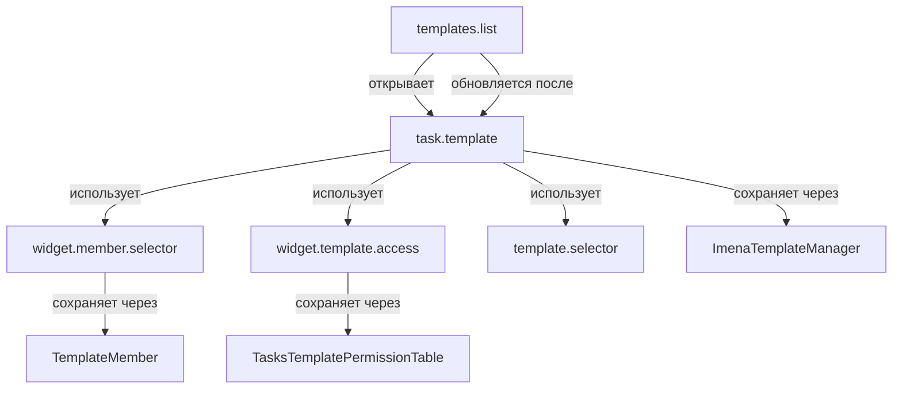

# Компоненты `imena.tasks`

## 📋 Содержание

- [Обзор](#обзор)
- [Архитектура](#архитектура)
- [Структура каталога](#структура-каталога)
- [Детальное описание компонентов](#детальное-описание-компонентов)
- [Взаимосвязи компонентов](#взаимосвязи-компонентов)
- [Интеграция с модулем](#интеграция-с-модулем)
- [Примеры использования](#примеры-использования)
- [Стандарты кодирования](#стандарты-кодирования)

---

## 🎯 Обзор

Каталог содержит кастомные компоненты для работы с шаблонами задач в системе Bitrix24. Все компоненты являются адаптациями стандартных компонентов Bitrix для работы с модулем `imena.tasks.templates`, который использует кастомные таблицы БД вместо стандартных таблиц Bitrix.

### Основные особенности

- ✅ **Полная интеграция с Bitrix24 D7 API**
- ✅ **Работа с кастомными таблицами** через модуль `imena.tasks.templates`
- ✅ **AJAX-контроллеры** для интерактивной работы без перезагрузки
- ✅ **Система прав доступа** через `ImenaTemplateAccessController`
- ✅ **Entity Editor** для редактирования шаблонов
- ✅ **Grid компоненты** с фильтрацией, сортировкой и пагинацией
- ✅ **SidePanel интеграция** для работы в боковой панели Bitrix24

---

## 🏗️ Архитектура

### Принципы проектирования

1. **Наследование от стандартных компонентов Bitrix** - расширение функциональности
2. **Разделение ответственности** - каждый компонент решает свою задачу
3. **Интеграция через интерфейсы** - использование стандартных интерфейсов Bitrix
4. **CQRS паттерн** - разделение команд и запросов через AJAX-действия
5. **Dependency Injection** - использование менеджеров и провайдеров

### Слои архитектуры

```
┌─────────────────────────────────────────────────────────┐
│              UI Layer (Templates)                      │
│  (PHP шаблоны, JavaScript, CSS)                        │
└────────────────────┬────────────────────────────────────┘
                     │
┌────────────────────▼────────────────────────────────────┐
│          Component Layer                               │
│  (ImenaTaskTemplateComponent, etc.)                   │
└────────────────────┬────────────────────────────────────┘
                     │
┌────────────────────▼────────────────────────────────────┐
│          Controller Layer (AJAX)                        │
│  (Controllerable interface, Actions)                    │
└────────────────────┬────────────────────────────────────┘
                     │
┌────────────────────▼────────────────────────────────────┐
│          Service Layer                                  │
│  (ImenaTemplateManager, TemplateProvider)              │
└────────────────────┬────────────────────────────────────┘
                     │
┌────────────────────▼────────────────────────────────────┐
│          Data Access Layer                              │
│  (TemplateTable, ORM)                                  │
└────────────────────┬────────────────────────────────────┘
                     │
┌────────────────────▼────────────────────────────────────┐
│          Database                                       │
│  (b_imena_tasks_templates_*)                           │
└─────────────────────────────────────────────────────────┘
```

---

## 📁 Структура каталога

```
imena.tasks/
├── templates.list/              # Список шаблонов с фильтрацией и поиском
│   ├── class.php                # Основной класс компонента (918 строк)
│   ├── component.php            # Точка входа компонента
│   ├── .parameters.php           # Параметры компонента
│   ├── .description.php          # Описание компонента
│   ├── ajax.php                 # AJAX обработчик
│   ├── templates/               # Шаблоны отображения
│   │   └── .default/
│   ├── lang/                    # Локализация
│   │   ├── ru/
│   │   └── en/
│   └── images/                  # Иконки
│
├── task.template/               # Создание и редактирование шаблона
│   ├── class.php                # Основной класс компонента (1352 строки)
│   ├── component.php            # Точка входа компонента
│   ├── .parameters.php          # Параметры компонента
│   ├── .description.php         # Описание компонента
│   ├── templates/               # Шаблоны отображения
│   │   ├── .default/            # Стандартный шаблон
│   │   ├── view/                # Шаблон просмотра
│   │   └── flow/                # Шаблон для Flow процессов
│   └── lang/                    # Локализация
│
├── widget.member.selector/      # Виджет управления участниками шаблона
│   ├── class.php                # Основной класс компонента (225 строк)
│   ├── .parameters.php          # Параметры компонента
│   ├── .description.php         # Описание компонента
│   ├── ajax.php                 # AJAX обработчик
│   └── templates/               # Шаблоны отображения
│       └── view/
│
├── widget.template.access/      # Виджет управления правами доступа
│   ├── class.php                # Основной класс компонента (174 строки)
│   ├── .parameters.php          # Параметры компонента
│   ├── .description.php         # Описание компонента
│   ├── templates/               # Шаблоны отображения
│   └── lang/                    # Локализация
│
├── template.selector/           # Виджет выбора шаблонов
│   ├── component.php            # Точка входа (процедурный стиль)
│   ├── .parameters.php          # Параметры компонента
│   ├── .description.php         # Описание компонента
│   ├── templates/               # Шаблоны отображения
│   └── lang/                    # Локализация
│
└── README.md                    # Этот файл
```

---

## 🔧 Детальное описание компонентов

### 1. `templates.list` - Список шаблонов

**Полное имя компонента:** `imena.tasks:templates.list`

**Назначение:** Отображение списка шаблонов задач с поддержкой фильтрации, поиска, сортировки, пагинации и массовых операций.

#### Архитектура

**Класс:** `ImenaTasksTemplatesListComponent`  
**Наследует:** `TasksBaseComponent`  
**Реализует:** `\Bitrix\Main\Errorable`, `\Bitrix\Main\Engine\Contract\Controllerable`

**Размер:** 918 строк кода

#### Основные возможности

✅ **Grid отображение** с настраиваемыми колонками  
✅ **Фильтрация** по ID, названию, исполнителю, создателю, группе, тегам  
✅ **Поиск** по названию шаблона  
✅ **Сортировка** по различным полям (ID, название, дата создания, исполнитель)  
✅ **Пагинация** с настраиваемым размером страницы (5, 10, 25, 50, 100)  
✅ **Массовое удаление** шаблонов  
✅ **Интеграция с системой прав доступа**  
✅ **Поддержка пользовательских полей (UF)**  

#### AJAX-действия

```php
// Получение списка с фильтрацией и пагинацией
public function getListAction($select = null, $order = null, $filter = null, $limit = self::DEFAULT_LIMIT)

// Удаление одного шаблона
public function deleteAction($templateId)

// Массовое удаление шаблонов
public function batchDeleteAction($ids, $isAllSelected = false)
```

#### Параметры компонента

| Параметр | Тип | Описание | По умолчанию |
|----------|-----|----------|--------------|
| `TASK_TYPE` | LIST | Тип задачи (group/user) | - |
| `TASK_VAR` | STRING | Имя переменной для ID задачи | - |
| `USER_VAR` | STRING | Имя переменной для ID пользователя | - |
| `GROUP_VAR` | STRING | Имя переменной для ID группы | - |
| `ACTION_VAR` | STRING | Имя переменной для действия | - |
| `PAGE_VAR` | STRING | Имя переменной для страницы | - |
| `ITEMS_COUNT` | STRING | Количество элементов на странице | 20 |

#### Использование

```php
<?php
$APPLICATION->IncludeComponent(
    "imena.tasks:templates.list",
    "",
    [
        "TASK_TYPE" => "user",
        "TASK_VAR" => "task_id",
        "ITEMS_COUNT" => 25,
        "PATH_TO_USER_TASKS" => "/company/personal/user/#user_id#/tasks/",
        "PATH_TO_USER_TASKS_TASK" => "/company/personal/user/#user_id#/tasks/task/#task_id#/",
    ]
);
?>
```

#### JavaScript API

```javascript
// Обновление Grid после изменений
BX.Main.gridManager.reload('TASKS_TEMPLATES_FILTER_ID');

// Вызов AJAX-действия
BX.ajax.runComponentAction('imena.tasks:templates.list', 'delete', {
    mode: 'class',
    data: { templateId: 123 }
}).then(function(response) {
    if (response.data.success) {
        // Обновить Grid
    }
});
```

#### Зависимости

- `Bitrix\Main\Grid` - для работы с Grid
- `Bitrix\Main\UI\Filter` - для работы с фильтрами
- `Imena\Tasks\Templates\Manager\ImenaTemplateManager` - для работы с данными
- `Bitrix\Tasks\Integration\Bitrix24` - для проверки тарифных ограничений

#### Статус: ✅ 95% готовности

**Что осталось:**
- Оптимизация для больших объемов данных (>1000 записей)
- Расширенная фильтрация по датам

---

### 2. `task.template` - Создание и редактирование шаблона

**Полное имя компонента:** `imena.tasks:task.template`

**Назначение:** Компонент для создания и редактирования шаблонов задач. Поддерживает полный цикл работы с шаблоном через Entity Editor и SidePanel.

#### Архитектура

**Класс:** `ImenaTaskTemplateComponent`  
**Наследует:** `TasksBaseComponent`  
**Реализует:** `Errorable`, `Controllerable`

**Размер:** 1352 строки кода

#### Основные возможности

✅ **Создание нового шаблона** (ID = 0)  
✅ **Редактирование существующего шаблона**  
✅ **Просмотр шаблона** в режиме только чтения  
✅ **Entity Editor** для редактирования полей  
✅ **SidePanel интеграция** для работы в боковой панели  
✅ **Управление участниками** через `widget.member.selector`  
✅ **Управление чек-листами** с AJAX сохранением  
✅ **Управление тегами**  
✅ **Управление приоритетом**  
✅ **Управление правами доступа** через `widget.template.access`  
✅ **Связь с другими шаблонами** через `template.selector`  
✅ **Интеграция с Camunda** для Flow процессов  

#### Режимы работы

| Режим | Параметр | Описание |
|-------|----------|----------|
| `create` | `ACTION=create` или `ID=0` | Создание нового шаблона |
| `edit` | `ACTION=edit` и `ID>0` | Редактирование существующего шаблона |
| `view` | `ACTION=view` или отсутствует | Просмотр шаблона (только чтение) |

#### AJAX-действия

```php
// Сохранение чек-листа
public function saveChecklistAction($templateId, $items = [], $params = [])

// Установка приоритета
public function setPriorityAction($templateId, $priority)

// Установка тегов
public function setTagsAction($templateId, array $tags = [])

// Удаление шаблона
public function deleteAction($templateId)
```

#### Параметры компонента

| Параметр | Тип | Описание | По умолчанию |
|----------|-----|----------|--------------|
| `TEMPLATE_ID` | INT | ID шаблона (0 для нового) | 0 |
| `ACTION` | STRING | Действие (create/edit/view) | view |
| `BACK_URL` | STRING | URL для возврата | - |
| `CAN_READ` | BOOL | Право на чтение | true |
| `CAN_UPDATE` | BOOL | Право на обновление | true |
| `EDIT_MODE` | BOOL | Режим редактирования | false |

#### Использование

```php
<?php
// Создание нового шаблона
$APPLICATION->IncludeComponent(
    "imena.tasks:task.template",
    "",
    [
        "TEMPLATE_ID" => 0,
        "ACTION" => "create",
        "BACK_URL" => "/company/personal/user/#user_id#/tasks/templates/",
    ]
);

// Редактирование существующего шаблона
$APPLICATION->IncludeComponent(
    "imena.tasks:task.template",
    "",
    [
        "TEMPLATE_ID" => 123,
        "ACTION" => "edit",
        "CAN_UPDATE" => true,
    ]
);
?>
```

#### JavaScript API

```javascript
// Сохранение чек-листа
BX.ajax.runComponentAction('imena.tasks:task.template', 'saveChecklist', {
    mode: 'class',
    data: {
        templateId: 123,
        items: [
            { id: 1, title: 'Пункт 1', checked: false },
            { id: 2, title: 'Пункт 2', checked: true }
        ]
    }
}).then(function(response) {
    if (response.data.success) {
        BX.UI.Notification.Center.notify({
            content: 'Чек-лист сохранен',
            autoHide: true
        });
    }
});

// Установка приоритета
BX.ajax.runComponentAction('imena.tasks:task.template', 'setPriority', {
    mode: 'class',
    data: {
        templateId: 123,
        priority: 2 // 1 - низкий, 2 - обычный, 3 - высокий
    }
});
```

#### Интеграция с виджетами

Компонент использует следующие виджеты:

1. **widget.member.selector** - для управления участниками
   ```php
   $APPLICATION->IncludeComponent(
       "imena.tasks:widget.member.selector",
       "",
       [
           "TEMPLATE_ID" => $templateId,
           "CONTEXT" => "template",
       ]
   );
   ```

2. **widget.template.access** - для управления правами доступа
   ```php
   $APPLICATION->IncludeComponent(
       "imena.tasks:widget.template.access",
       "",
       [
           "TEMPLATE_ID" => $templateId,
           "CAN_UPDATE" => $canUpdate,
       ]
   );
   ```

3. **template.selector** - для выбора связанных шаблонов
   ```php
   $APPLICATION->IncludeComponent(
       "imena.tasks:template.selector",
       "",
       [
           "TEMPLATE_ID" => $templateId,
           "EXCLUDE_ID" => $templateId, // Исключить текущий шаблон
       ]
   );
   ```

#### Зависимости

**Bitrix Core:**
- `Bitrix\Tasks\Item\Converter\Task\Template\ToTemplate`
- `Bitrix\Tasks\CheckList\Template\TemplateCheckListFacade`
- `Bitrix\Tasks\Integration\Bitrix24`
- `Bitrix\Tasks\Util\Restriction\Bitrix24Restriction\Limit\TaskLimit`

**Imena Custom:**
- `Imena\Tasks\Templates\Internals\TemplateTable`
- `Imena\Tasks\Templates\Item\Task\Template`
- `Imena\Tasks\Templates\Provider\TemplateProvider`
- `Imena\Tasks\Templates\Control\Template`
- `Imena\Tasks\Templates\CheckList\Template\TemplateCheckListFacade`

#### Особенности реализации

1. **Кастомные чек-листы:** Использует `ImenaTemplateCheckListFacade` вместо стандартного
2. **Кастомные таблицы:** Работает с `TemplateTable` из модуля `imena.tasks.templates`
3. **Flow интеграция:** Поддержка шаблона `flow` для Camunda процессов
4. **Отладочное логирование:** Логирование в `/upload/logs/checklist_debug.log`

#### Статус: ✅ Полностью функционален

---

### 3. `widget.member.selector` - Управление участниками

**Полное имя компонента:** `imena.tasks:widget.member.selector`

**Назначение:** Виджет для управления участниками шаблона задачи. Позволяет назначать исполнителей, соисполнителей и наблюдателей через Entity Selector Bitrix24.

#### Архитектура

**Класс:** `ImenaTasksWidgetMemberSelectorComponent`  
**Наследует:** `TasksWidgetMemberSelectorComponent` (стандартный компонент Bitrix)  
**Переопределяет:** Методы работы с шаблонами для использования кастомных таблиц

**Размер:** 225 строк кода

#### Основные возможности

✅ **Назначение исполнителей** (Responsible)  
✅ **Назначение соисполнителей** (Accomplices)  
✅ **Назначение наблюдателей** (Auditors)  
✅ **Проверка прав доступа** перед изменением  
✅ **Интеграция с Entity Selector** Bitrix24  
✅ **Поддержка работы как с задачами, так и с шаблонами**  
✅ **Работа с кастомными таблицами** через `TemplateMember`  

#### Роли участников

| Роль | Константа | Описание |
|------|-----------|----------|
| Исполнитель | `ROLE_RESPONSIBLE` | Обязательная роль, основной исполнитель задачи |
| Соисполнитель | `ROLE_ACCOMPLICE` | Дополнительные исполнители |
| Наблюдатель | `ROLE_AUDITOR` | Пользователи, которые следят за выполнением |

#### AJAX-действия

```php
// Установка исполнителей
public function setResponsibleAction($taskId, $data = null, $context = self::CONTEXT_TASK)

// Установка соисполнителей
public function setAccomplicesAction($taskId, $data = null, $context = self::CONTEXT_TASK)

// Установка наблюдателей
public function setAuditorsAction($taskId, $data = null, $context = self::CONTEXT_TASK)
```

#### Параметры компонента

| Параметр | Тип | Описание | По умолчанию |
|----------|-----|----------|--------------|
| `TEMPLATE_ID` | INT | ID шаблона | - |
| `CONTEXT` | STRING | Контекст (task/template) | task |
| `CAN_UPDATE` | BOOL | Право на обновление | true |

#### Использование

```php
<?php
$APPLICATION->IncludeComponent(
    "imena.tasks:widget.member.selector",
    "",
    [
        "TEMPLATE_ID" => 123,
        "CONTEXT" => "template", // или "task"
        "CAN_UPDATE" => true,
    ]
);
?>
```

#### JavaScript API

```javascript
// Установка исполнителей
BX.ajax.runComponentAction('imena.tasks:widget.member.selector', 'setResponsible', {
    mode: 'class',
    data: {
        taskId: 123,
        data: [
            { ID: 1, NAME: 'Иван Иванов' },
            { ID: 2, NAME: 'Петр Петров' }
        ],
        context: 'template'
    }
}).then(function(response) {
    if (response.data.SUCCESS) {
        // Обновить UI
    }
});
```

#### Особенности реализации

1. **Переопределение для шаблонов:** Методы `setResponsibleAction`, `setAccomplicesAction`, `setAuditorsAction` переопределены для работы с кастомными таблицами
2. **Использование ImenaTemplateModel:** Для шаблонов используется `ImenaTemplateModel` вместо стандартной модели
3. **Проверка прав:** Использует `ImenaTemplateAccessController` для проверки прав доступа
4. **Обновление через TemplateMember:** Использует `TemplateMember::updateByTemplateId()` для сохранения изменений

#### Зависимости

- `Imena\Tasks\Templates\Access\ImenaTemplateAccessController`
- `Imena\Tasks\Templates\Access\ImenaTemplateModel`
- `Imena\Tasks\Templates\Control\TemplateMember`
- `Bitrix\Tasks\Access\ActionDictionary`
- `Bitrix\Tasks\Access\Role\RoleDictionary`

#### Статус: ✅ Полностью функционален

---

### 4. `widget.template.access` - Управление правами доступа

**Полное имя компонента:** `imena.tasks:widget.template.access`

**Назначение:** Виджет для управления правами доступа к шаблону задачи. Позволяет настраивать, кто может просматривать и редактировать шаблон.

#### Архитектура

**Класс:** `ImenaWidgetTemplateAccessComponent`  
**Наследует:** `TasksBaseComponent`

**Размер:** 174 строки кода

#### Основные возможности

✅ **Назначение прав пользователям**  
✅ **Назначение прав группам**  
✅ **Назначение прав подразделениям**  
✅ **Два уровня доступа:** просмотр и полный доступ  
✅ **Проверка доступности функции** через тариф Bitrix24  
✅ **Отображение данных пользователей, групп и подразделений**  
✅ **AJAX обновление прав доступа**  

#### Уровни доступа

| Уровень | Константа | Описание |
|---------|-----------|----------|
| Просмотр | `TEMPLATE_VIEW` | Только просмотр шаблона, без возможности редактирования |
| Полный доступ | `TEMPLATE_FULL` | Просмотр, редактирование и удаление шаблона |

#### Типы сущностей

| Тип | Код | Описание |
|-----|-----|----------|
| Пользователь | `U` | Отдельный пользователь системы |
| Группа | `SG` | Рабочая группа (проект) |
| Подразделение | `DR` | Подразделение компании |

#### Параметры компонента

| Параметр | Тип | Описание | По умолчанию |
|----------|-----|----------|--------------|
| `TEMPLATE_ID` | INT | ID шаблона | - |
| `ENTITY_CODE` | STRING | Код сущности (обязательный) | - |
| `CAN_READ` | BOOL | Право на чтение | true |
| `CAN_UPDATE` | BOOL | Право на обновление | true |
| `EDIT_MODE` | BOOL | Режим редактирования | false |
| `USER_DATA` | ARRAY | Данные пользователей | [] |

#### Использование

```php
<?php
$APPLICATION->IncludeComponent(
    "imena.tasks:widget.template.access",
    "",
    [
        "TEMPLATE_ID" => 123,
        "ENTITY_CODE" => "TEMPLATE_123",
        "CAN_READ" => true,
        "CAN_UPDATE" => true,
        "EDIT_MODE" => true,
    ]
);
?>
```

#### Особенности реализации

1. **Проверка тарифа:** Проверяет доступность функции через `Bitrix24::checkFeatureEnabled()`
2. **Использование кастомных таблиц:** Работает с `TasksTemplatePermissionTable` из модуля `imena.tasks.templates`
3. **Получение данных:** Загружает данные пользователей, групп и подразделений для отображения
4. **Интеграция с Access Controller:** Использует `TemplateAccessController` для проверки прав

#### Зависимости

- `Imena\Tasks\Templates\Access\TemplateAccessController`
- `Imena\Tasks\Templates\Access\Permission\TasksTemplatePermissionTable`
- `Imena\Tasks\Templates\Internals\TemplateTable`
- `Bitrix\Tasks\Access\Permission\PermissionDictionary`
- `Bitrix\Tasks\Integration\Bitrix24`

#### Статус: ⏳ 60% готовности

**Что осталось:**
- Полная интеграция с системой прав доступа
- AJAX обновление прав доступа
- Валидация прав перед сохранением
- Отображение текущих прав доступа

---

### 5. `template.selector` - Выбор шаблонов

**Полное имя компонента:** `imena.tasks:template.selector`

**Назначение:** Виджет для выбора одного или нескольких шаблонов задач. Используется для связи шаблонов друг с другом.

#### Архитектура

**Стиль:** Процедурный (без класса)  
**Точка входа:** `component.php`

#### Основные возможности

✅ **Выбор одного или нескольких шаблонов**  
✅ **Отображение последних 15 шаблонов** пользователя  
✅ **Отображение выбранных шаблонов**  
✅ **AJAX поиск** по названию  
✅ **Исключение текущего шаблона** из списка  
✅ **Интеграция с Entity Selector** для поиска  

#### Параметры компонента

| Параметр | Тип | Описание | По умолчанию |
|----------|-----|----------|--------------|
| `TEMPLATE_ID` | INT | ID текущего шаблона (для исключения) | 0 |
| `SELECTED_IDS` | ARRAY | Массив ID выбранных шаблонов | [] |
| `MULTIPLE` | BOOL | Разрешить множественный выбор | true |
| `LIMIT` | INT | Количество последних шаблонов | 15 |

#### Использование

```php
<?php
$APPLICATION->IncludeComponent(
    "imena.tasks:template.selector",
    "",
    [
        "TEMPLATE_ID" => 123,
        "SELECTED_IDS" => [456, 789],
        "MULTIPLE" => true,
        "LIMIT" => 15,
    ]
);
?>
```

#### JavaScript API

```javascript
// Поиск шаблонов (требует адаптации)
BX.ajax({
    url: '/local/components/imena.tasks/template.selector/ajax.php',
    data: {
        action: 'search',
        query: 'название шаблона',
        excludeId: 123
    },
    method: 'POST',
    dataType: 'json',
    onsuccess: function(response) {
        // Обработка результатов поиска
    }
});
```

#### Особенности реализации

1. **Процедурный стиль:** Компонент написан в процедурном стиле без использования класса
2. **Быстрый выбор:** Отображает последние 15 шаблонов пользователя для быстрого выбора
3. **Entity Selector:** Интегрирован с Entity Selector Bitrix24 для поиска
4. **Исключение текущего:** Автоматически исключает текущий шаблон из списка

#### Статус: ⏳ 50% готовности

**Что осталось:**
- Адаптация AJAX поиска на новый API
- Переход на классовый стиль (опционально)
- Улучшение производительности при большом количестве шаблонов
- Добавление фильтрации по группам и тегам

---

## 🔗 Взаимосвязи компонентов



### Описание связей

1. **templates.list → task.template**
   - Список шаблонов открывает шаблон для просмотра/редактирования
   - После сохранения Grid обновляется через JavaScript
   - Используется SidePanel для открытия в боковой панели

2. **task.template использует виджеты:**
   - **widget.member.selector** - для управления участниками
   - **widget.template.access** - для управления правами доступа
   - **template.selector** - для выбора связанных шаблонов

3. **Все компоненты → ImenaTemplateManager**
   - Все компоненты используют `ImenaTemplateManager` для работы с данными
   - Менеджер обеспечивает единую точку доступа к данным

---

## 🔌 Интеграция с модулем

Все компоненты интегрированы с модулем `imena.tasks.templates`:

### Используемые классы модуля

```php
// ORM таблицы
use Imena\Tasks\Templates\Internals\TemplateTable;
use Imena\Tasks\Templates\Internals\ScenarioTable;

// Доменные модели
use Imena\Tasks\Templates\Item\Task\Template;

// Менеджеры и провайдеры
use Imena\Tasks\Templates\Manager\ImenaTemplateManager;
use Imena\Tasks\Templates\Provider\TemplateProvider;

// Контроллеры доступа
use Imena\Tasks\Templates\Access\ImenaTemplateAccessController;
use Imena\Tasks\Templates\Access\ImenaTemplateModel;

// Управление участниками
use Imena\Tasks\Templates\Control\TemplateMember;

// Чек-листы
use Imena\Tasks\Templates\CheckList\Template\TemplateCheckListFacade;
```

### Таблицы БД

Все компоненты работают с кастомными таблицами:

- `b_imena_tasks_templates` - основная таблица шаблонов
- `b_imena_tasks_templates_members` - участники шаблонов
- `b_imena_tasks_templates_permissions` - права доступа
- `b_imena_tasks_templates_scenarios` - сценарии шаблонов

### Проверка модуля

Все компоненты проверяют наличие модуля перед работой:

```php
if (!\Bitrix\Main\Loader::includeModule('tasks'))
{
    return [];
}

if (!\Bitrix\Main\Loader::includeModule('imena.tasks.templates'))
{
    return [];
}
```

---

## 💡 Примеры использования

### Пример 1: Список шаблонов с фильтрацией

```php
<?php
// В шаблоне страницы
$APPLICATION->IncludeComponent(
    "imena.tasks:templates.list",
    "",
    [
        "TASK_TYPE" => "user",
        "ITEMS_COUNT" => 25,
        "PATH_TO_USER_TASKS" => "/company/personal/user/#user_id#/tasks/",
        "PATH_TO_USER_TASKS_TASK" => "/company/personal/user/#user_id#/tasks/task/#task_id#/",
    ]
);
?>
```

### Пример 2: Создание нового шаблона в SidePanel

```php
<?php
// Открытие в SidePanel
$APPLICATION->IncludeComponent(
    "imena.tasks:task.template",
    "",
    [
        "TEMPLATE_ID" => 0,
        "ACTION" => "create",
        "BACK_URL" => "/company/personal/user/#user_id#/tasks/templates/",
    ]
);
?>

<script>
// Открытие в SidePanel через JavaScript
BX.SidePanel.Instance.open('/company/personal/user/1/tasks/templates/create/', {
    cacheable: false,
    width: 800
});
</script>
```

### Пример 3: Редактирование шаблона с виджетами

```php
<?php
// Основной компонент
$APPLICATION->IncludeComponent(
    "imena.tasks:task.template",
    "",
    [
        "TEMPLATE_ID" => 123,
        "ACTION" => "edit",
        "CAN_UPDATE" => true,
    ]
);

// В шаблоне task.template включаем виджеты:
?>

<!-- Управление участниками -->
<?php
$APPLICATION->IncludeComponent(
    "imena.tasks:widget.member.selector",
    "",
    [
        "TEMPLATE_ID" => 123,
        "CONTEXT" => "template",
    ]
);
?>

<!-- Управление правами доступа -->
<?php
$APPLICATION->IncludeComponent(
    "imena.tasks:widget.template.access",
    "",
    [
        "TEMPLATE_ID" => 123,
        "ENTITY_CODE" => "TEMPLATE_123",
        "CAN_UPDATE" => true,
        "EDIT_MODE" => true,
    ]
);
?>

<!-- Выбор связанных шаблонов -->
<?php
$APPLICATION->IncludeComponent(
    "imena.tasks:template.selector",
    "",
    [
        "TEMPLATE_ID" => 123,
        "SELECTED_IDS" => [456, 789],
        "MULTIPLE" => true,
    ]
);
?>
```

### Пример 4: AJAX сохранение чек-листа

```javascript
// В JavaScript шаблона
BX.ready(function() {
    // Сохранение чек-листа
    BX.ajax.runComponentAction('imena.tasks:task.template', 'saveChecklist', {
        mode: 'class',
        data: {
            templateId: 123,
            items: [
                {
                    id: 1,
                    title: 'Проверить требования',
                    checked: false,
                    sort: 100
                },
                {
                    id: 2,
                    title: 'Подготовить документацию',
                    checked: true,
                    sort: 200
                }
            ],
            params: {
                force: false
            }
        }
    }).then(function(response) {
        if (response.data.success) {
            BX.UI.Notification.Center.notify({
                content: 'Чек-лист успешно сохранен',
                autoHide: true
            });
            
            // Обновить отображение чек-листа
            updateChecklistUI(response.data.items);
        } else {
            BX.UI.Notification.Center.notify({
                content: 'Ошибка при сохранении: ' + response.data.errors.join(', '),
                autoHide: false
            });
        }
    });
});
```

### Пример 5: Массовое удаление шаблонов

```javascript
// В JavaScript шаблона templates.list
function deleteSelectedTemplates() {
    var grid = BX.Main.gridManager.getById('TASKS_TEMPLATES_FILTER_ID');
    var selectedIds = grid.instance.getRows().getSelectedIds();
    
    if (selectedIds.length === 0) {
        BX.UI.Notification.Center.notify({
            content: 'Не выбрано ни одного шаблона',
            autoHide: true
        });
        return;
    }
    
    if (!confirm('Удалить выбранные шаблоны?')) {
        return;
    }
    
    BX.ajax.runComponentAction('imena.tasks:templates.list', 'batchDelete', {
        mode: 'class',
        data: {
            ids: selectedIds,
            isAllSelected: false
        }
    }).then(function(response) {
        if (response.data.success) {
            BX.UI.Notification.Center.notify({
                content: 'Шаблоны успешно удалены',
                autoHide: true
            });
            
            // Обновить Grid
            grid.instance.reload();
        } else {
            BX.UI.Notification.Center.notify({
                content: 'Ошибка при удалении: ' + response.data.errors.join(', '),
                autoHide: false
            });
        }
    });
}
```

---

## 📐 Стандарты кодирования

Все компоненты следуют стандартам Bitrix24 D7:

### 1. Использование D7 API

```php
// ✅ Правильно
use Bitrix\Main\Loader;
use Bitrix\Main\Localization\Loc;
use Bitrix\Main\Engine\Contract\Controllerable;

// ❌ Неправильно
CModule::IncludeModule("tasks");
GetMessage("TEXT");
```

### 2. Namespace для кастомных классов

```php
// ✅ Правильно
use Imena\Tasks\Templates\Manager\ImenaTemplateManager;
use Imena\Tasks\Templates\Internals\TemplateTable;

// ❌ Неправильно
$manager = new ImenaTemplateManager(); // Без namespace
```

### 3. Локализация

```php
// ✅ Правильно
Loc::loadMessages(__FILE__);
$message = Loc::getMessage('IMENA_TASK_TEMPLATE_NAME');

// ❌ Неправильно
$message = GetMessage('IMENA_TASK_TEMPLATE_NAME'); // Устаревший метод
```

### 4. Обработка ошибок

```php
// ✅ Правильно
use Bitrix\Tasks\Util\Error\Collection;

$this->errorCollection = new Collection();
$this->errorCollection->add([new \Bitrix\Main\Error('Message', 'CODE')]);

// ❌ Неправильно
$this->errors[] = 'Message'; // Массив вместо Collection
```

### 5. AJAX через Controllerable

```php
// ✅ Правильно
class MyComponent extends TasksBaseComponent implements Controllerable
{
    public function configureActions()
    {
        return [
            'myAction' => [
                '+prefilters' => [
                    new \Bitrix\Tasks\Action\Filter\BooleanFilter(),
                ],
            ],
        ];
    }
    
    public function myActionAction($param)
    {
        // Логика действия
    }
}
```

### 6. Хештег автора

Все изменения в компонентах помечены хештегом `#vlikhobabin@gmail.com`:

```php
// #vlikhobabin@gmail.com - Кастомная логика для работы с Imena таблицами
use Imena\Tasks\Templates\Manager\ImenaTemplateManager;
```

---

## ⚠️ Известные ограничения

### 1. Производительность

- **templates.list:** Не оптимизирован для больших объемов данных (>1000 записей)
- **template.selector:** AJAX поиск может быть медленным при большом количестве шаблонов

### 2. Функциональность

- **widget.template.access:** Требуется полная интеграция с системой прав доступа (60% готовности)
- **template.selector:** AJAX поиск использует старый API, требует адаптации (50% готовности)

### 3. Совместимость

- Все компоненты требуют модуль `imena.tasks.templates`
- Некоторые функции требуют тариф Bitrix24 с расширенными возможностями

---

## 📊 Статус готовности по компонентам

| Компонент | Готовность | Статус | Примечания |
|-----------|------------|--------|------------|
| `templates.list` | 95% | ✅ Готов к использованию | Требуется оптимизация для больших объемов |
| `task.template` | 100% | ✅ Полностью функционален | - |
| `widget.member.selector` | 100% | ✅ Полностью функционален | - |
| `widget.template.access` | 60% | ⏳ Требует доработки | Неполная интеграция с правами доступа |
| `template.selector` | 50% | ⏳ Требует доработки | AJAX поиск требует адаптации |

---

## 📚 Дополнительная документация

Каждый компонент имеет подробную документацию в файле `README.md` в своем каталоге:

- [templates.list/README.md](./templates.list/README.md) - если существует
- [task.template/README.md](./task.template/README.md) - если существует
- [widget.member.selector/README.md](./widget.member.selector/README.md) - если существует
- [widget.template.access/README.md](./widget.template.access/README.md) - если существует
- [template.selector/README.md](./template.selector/README.md) - если существует

---

## 🔗 Связанные модули

- **`imena.tasks.templates`** - основной модуль работы с шаблонами
  - ORM таблицы
  - Менеджеры и провайдеры
  - Система прав доступа
  - Доменные модели

- **`imena.camunda`** - модуль интеграции с Camunda (опционально)
  - Синхронизация процессов
  - Запуск процессов из шаблонов

---

## 🚀 Планы развития

### Краткосрочные (1-2 месяца)

1. **Оптимизация производительности**
   - Кеширование данных в `templates.list`
   - Оптимизация запросов к БД
   - Ленивая загрузка данных

2. **Завершение разработки**
   - Полная интеграция `widget.template.access`
   - Адаптация AJAX поиска в `template.selector`

### Среднесрочные (3-6 месяцев)

1. **Расширенная функциональность**
   - Экспорт/импорт шаблонов
   - Версионирование шаблонов
   - История изменений

2. **Улучшение UX**
   - Drag & Drop для чек-листов
   - Визуальный редактор шаблонов
   - Предпросмотр шаблонов

### Долгосрочные (6+ месяцев)

1. **Интеграция с внешними системами**
   - Интеграция с Jira
   - Интеграция с Trello
   - API для внешних приложений

---

## 👨‍💻 Автор и поддержка

**Автор:** #vlikhobabin@gmail.com  
**Модуль:** imena.tasks  
**Версия Bitrix24:** 20.0.0+  
**Совместимость:** PHP 8.0+  
**Лицензия:** Proprietary

---

## 📝 История изменений

### Версия 1.0 (2025-01-XX)

- ✅ Создание базовой документации
- ✅ Описание всех 5 компонентов
- ✅ Примеры использования
- ✅ Описание архитектуры и интеграции

---

*Данная документация полностью совместима со стандартами разработки Bitrix24 D7 и следует best practices для корпоративных порталов.*
