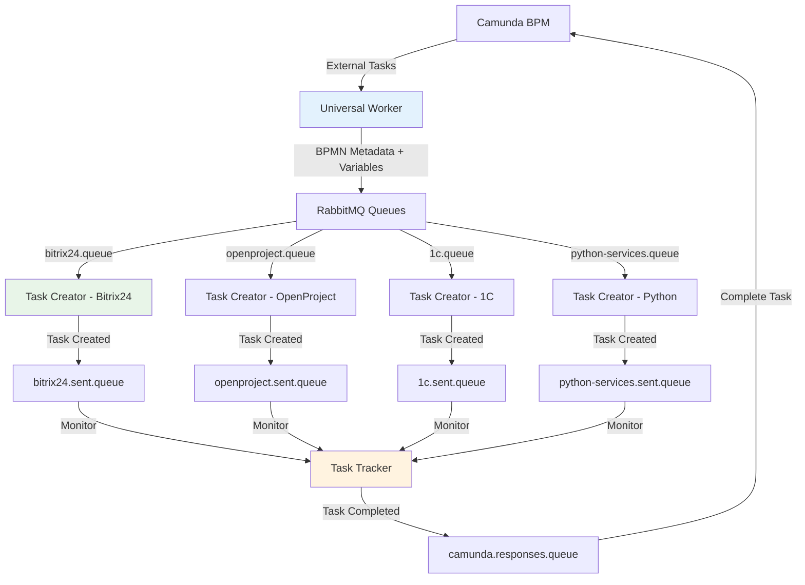

# Exchanger.py - Universal Integration Platform

Комплексная платформа интеграции Camunda BPM с внешними системами через RabbitMQ. Обеспечивает полный цикл обработки бизнес-процессов от получения задач в Camunda до их выполнения во внешних системах и возврата результатов.

## Архитектура решения

```
StormBPMN ←→ Camunda-StormBPMN Sync ←→ Camunda BPM ←→ Camunda Worker ←→ RabbitMQ ←→ Task Creator ←→ External Systems
                                                                         ↓
                                                                   Task Tracker (в планах)
```

## SSL Configuration

### Проблема SSL сертификатов

Библиотека `camunda-external-task-client-python3==4.5.0` не поддерживает настройку SSL параметров, что приводит к ошибкам при подключении к Camunda:
```
SSLError(1, '[SSL: TLSV1_ALERT_DECODE_ERROR] tlsv1 alert decode error (_ssl.c:1000)')
```

### Решение

Проект использует **SSL Patch** - monkey patching библиотеки requests для автоматического добавления `verify=False` ко всем HTTP запросам к Camunda.

**Применение:**
- **Camunda Worker**: Автоматический SSL патч через `ssl_patch.py`
- **Camunda Sync**: Унифицированный SSL подход с `verify=False`
- **Отключение SSL warnings**: `urllib3.disable_warnings()`

**⚠️ Предупреждение о безопасности:**
- `verify=False` отключает проверку SSL сертификатов
- Используйте только в доверенной сетевой среде
- Для production рекомендуется настроить валидные SSL сертификаты

## Компоненты системы

### 🔄 Camunda Worker (`camunda-worker/`)

**Назначение**: Отвечает за получение External Tasks из Camunda BPM, обогащение их метаданными и отправку в RabbitMQ.
📖 **[Полная документация](camunda-worker/README.md)**

---

### 📨 Task Creator (`task-creator/`)

**Назначение**: Слушает очереди RabbitMQ и создает задачи во внешних системах (Bitrix24, OpenProject и др.).
📖 **[Полная документация](task-creator/README.md)**

---

###  синхронизации Camunda-StormBPMN (`camunda-sync.py`)

**Назначение**: Набор инструментов для синхронизации BPMN диаграмм между StormBPMN и Camunda, включая конвертацию и деплой.
📖 **[Полная документация](camunda-sync.py/README.md)**

---

### 📊 Task Tracker (`task-tracker.py`)

**Назначение**: Отслеживание выполнения задач во внешних системах и формирование ответов в Camunda.
**Статус**: 🚧 В разработке

---

### 🛠️ Дополнительные инструменты

- **`process_reset_tool.py`**: Утилита для сброса и отладки экземпляров процессов в Camunda.
- **`other/`**: Набор вспомогательных скриптов, в основном для кастомизации и инспекции Bitrix24.

## Поток данных



### Ключевые особенности архитектуры

- **Прямое использование assigneeId**: Система напрямую использует значения `assigneeId` из BPMN extensionProperties как `responsible_id` в целевых системах
- **Упрощенная конфигурация**: Отсутствует необходимость в маппинге ролей через YAML файлы
- **BPMN метаданные**: Автоматическое извлечение и передача всех метаданных из BPMN диаграмм

## Быстрый старт

### Требования

- Python 3.8+
- RabbitMQ Server
- Camunda BPM Platform
- Доступы к внешним системам (Bitrix24, OpenProject, 1C и др.)

### Установка

```bash
git clone https://github.com/vlikhobabin/exchanger.py.git
cd exchanger.py

# Установка зависимостей из единого файла
pip install -r requirements.txt
```

### Конфигурация

Проект использует единый файл `.env` в корневой директории.

```bash
# Скопируйте пример конфигурации
cp config.env.example .env

# Настройте параметры Camunda, RabbitMQ и внешних систем
nano .env
```

### Запуск

```bash
# Запуск Camunda Worker
cd camunda-worker
python main.py

# Запуск Task Creator (в другом терминале)
cd task-creator
python main.py
```

## Мониторинг и диагностика

### Логирование

Система использует собственные файлы логов (не systemd journal):

```bash
# Просмотр последних записей логов
tail -100 /opt/exchanger.py/logs/camunda_worker.log      # Camunda Worker
tail -100 /opt/exchanger.py/logs/worker.log              # Task Creator
tail -100 /opt/exchanger.py/logs/camunda_worker_errors.log  # Ошибки Camunda Worker
tail -100 /opt/exchanger.py/logs/worker_errors.log          # Ошибки Task Creator

# Мониторинг логов в реальном времени
tail -f /opt/exchanger.py/logs/camunda_worker.log
tail -f /opt/exchanger.py/logs/worker.log

# Системные сервисы
systemctl status exchanger-camunda-worker.service
systemctl status exchanger-task-creator.service
journalctl -u exchanger-camunda-worker.service -f
journalctl -u exchanger-task-creator.service -f
```

**Структура логов:**
- `logs/camunda_worker.log` - основной лог Camunda Worker (ротация 100MB, хранение 30 дней)
- `logs/worker.log` - основной лог Task Creator (ротация 100MB, хранение 30 дней)  
- `logs/*_errors.log` - отдельные файлы ошибок (ротация 10MB)
- `logs/debug/` - отладочные файлы (создаются только при `DEBUG_SAVE_RESPONSE_MESSAGES=true`)

**Отладочное логирование:**
```bash
# Включить сохранение детальных ответов в JSON файл (для диагностики)
DEBUG_SAVE_RESPONSE_MESSAGES=true

# Отключить отладочное логирование (по умолчанию)
DEBUG_SAVE_RESPONSE_MESSAGES=false
```

### Camunda Worker

```bash
# Статус Worker и очередей
cd camunda-worker
python tools/worker_diagnostics.py
python tools/check_queues.py

# Информация о процессах Camunda
python tools/camunda_processes.py --stats
```

## Развертывание

Для развертывания на production-сервере используйте инструкцию:
📖 **[Инструкция по развертыванию](DEPLOY_PROD.md)**

### Development

```bash
# Запуск всех компонентов локально
./start-dev.sh  # (планируется создать)
```

### Production

Подробная установка и управление systemd сервисами описаны здесь:
📖 `scripts/SERVICES_MANAGEMENT.md`

Сервисы:
- `exchanger-camunda-worker.service` — Camunda Worker
- `exchanger-task-creator.service` — Task Creator

## Документация компонентов

- 📖 **[Camunda Worker](camunda-worker/README.md)** - Детальное описание Camunda Worker
- 📖 **[Task Creator](task-creator/README.md)** - Детальное описание RabbitMQ Worker
- 📖 **[Camunda-StormBPMN Sync](camunda-sync/README.md)** - Синхронизация BPMN диаграмм
- 📖 **[Tools Documentation](camunda-worker/tools/README.md)** - Сервисные скрипты и утилиты

## Статус разработки

| Компонент | Статус | Описание |
|-----------|--------|----------|
| Camunda Worker | ✅ Production | Полностью готов, тестирован |
| Task Creator - Bitrix24 | ✅ Production | Готов к использованию с упрощенной архитектурой |
| Camunda-StormBPMN Sync | ✅ Production | Готов к использованию |
| Task Creator - OpenProject | 🚧 Development | В разработке |
| Task Creator - 1C | 🚧 Planning | Планируется |
| Task Creator - Python Services | 🚧 Planning | Планируется |
| Task Tracker | 🚧 Planning | Планируется |

## Архитектурные улучшения v2.1

### Прямое использование assigneeId

Система теперь использует упрощенную архитектуру для определения ответственных:

**BPMN диаграмма:**
```xml
<camunda:property name="assigneeId" value="3" />
```

**Результат:**
- assigneeId="3" → responsible_id=3 в Bitrix24 (напрямую)
- Отсутствует необходимость в маппинге через YAML файлы
- Автоматическое определение ответственного на основе BPMN

**Преимущества:**
- 🚀 **Производительность**: Нет операций загрузки/парсинга конфигурации
- 🛡️ **Надежность**: Отсутствует зависимость от внешних файлов
- 🔧 **Простота**: Упрощенная конфигурация и меньше кода
- 📈 **Гибкость**: Любое значение assigneeId сразу используется

## Roadmap

- [ ] **Завершение Task Creator** - реализация всех планируемых систем
- [ ] **Разработка Task Tracker** - полный цикл обработки задач
- [ ] **Docker контейнеризация** - упрощение развертывания
- [ ] **Общий скрипт установки** - автоматизация настройки
- [ ] **Web-интерфейс мониторинга** - визуальный контроль системы
- [ ] **REST API управления** - программное управление компонентами

## Лицензия

MIT License

---

**Автор**: EG-Holding  
**Версия**: 2.1.0  
**Поддержка**: [GitHub Issues](https://github.com/vlikhobabin/exchanger.py/issues)

## История изменений

### v2.1.0 - Рефакторинг архитектуры
- ✅ **Прямое использование assigneeId**: Удален слой маппинга ролей через YAML файлы
- ✅ **Упрощенная конфигурация**: assigneeId из BPMN напрямую используется как responsible_id
- ✅ **Повышенная надежность**: Отсутствует зависимость от внешних файлов конфигурации
- ✅ **Оптимизация производительности**: Удалено ~100 строк кода, нет операций парсинга YAML 