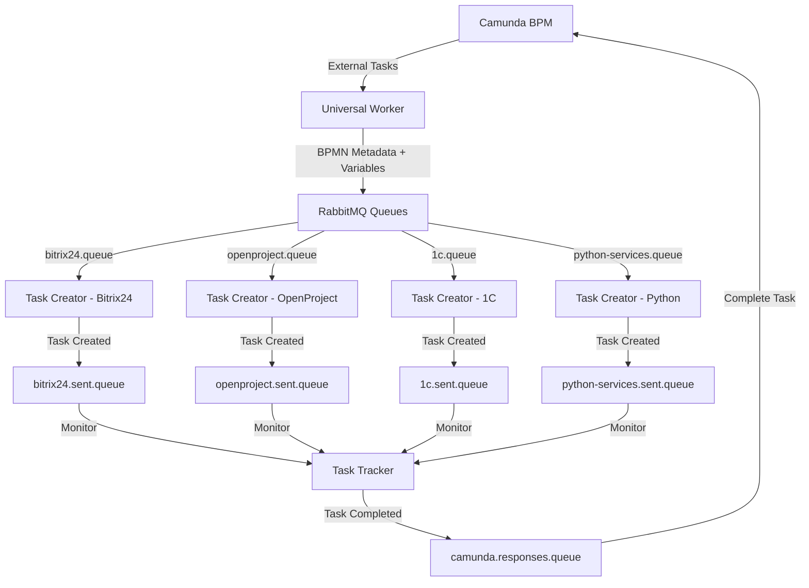

# Exchanger.py - Universal Integration Platform

Комплексная платформа интеграции Camunda BPM с внешними системами через RabbitMQ. Обеспечивает полный цикл обработки бизнес-процессов от получения задач в Camunda до их выполнения во внешних системах и возврата результатов.

## Архитектура решения

```
StormBPMN ←→ Camunda-StormBPMN Sync ←→ Camunda BPM ←→ Universal Worker ←→ RabbitMQ ←→ Task Creator ←→ External Systems
                                                                         ↓
                                                                   Task Tracker (в планах)
```

## Компоненты системы

### 🔄 Universal Worker (`universal-worker.py`)

**Назначение**: Отвечает за получение External Tasks из Camunda BPM, обогащение их метаданными и отправку в RabbitMQ.
📖 **[Полная документация](universal-worker.py/README.md)**

---

### 📨 Task Creator (`task-creator.py`)

**Назначение**: Слушает очереди RabbitMQ и создает задачи во внешних системах (Bitrix24, OpenProject и др.).
📖 **[Полная документация](task-creator.py/README.md)**

---

###  синхронизации Camunda-StormBPMN (`camunda-sync.py`)

**Назначение**: Набор инструментов для синхронизации BPMN диаграмм между StormBPMN и Camunda, включая конвертацию и деплой.
📖 **[Полная документация](camunda-sync.py/README.md)**

---

### 📊 Task Tracker (`task-tracker.py`)

**Назначение**: Отслеживание выполнения задач во внешних системах и формирование ответов в Camunda.
**Статус**: 🚧 В разработке

---

### 🛠️ Дополнительные инструменты

- **`process_reset_tool.py`**: Утилита для сброса и отладки экземпляров процессов в Camunda.
- **`other/`**: Набор вспомогательных скриптов, в основном для кастомизации и инспекции Bitrix24.

## Поток данных



## Быстрый старт

### Требования

- Python 3.8+
- RabbitMQ Server
- Camunda BPM Platform
- Доступы к внешним системам (Bitrix24, OpenProject, 1C и др.)

### Установка

```bash
git clone https://github.com/vlikhobabin/exchanger.py.git
cd exchanger.py

# Установка зависимостей из единого файла
pip install -r requirements.txt
```

### Конфигурация

Проект использует единый файл `.env` в корневой директории.

```bash
# Скопируйте пример конфигурации
cp config.env.example .env

# Настройте параметры Camunda, RabbitMQ и внешних систем
nano .env
```

### Запуск

```bash
# Запуск Universal Worker
cd universal-worker.py
python main.py

# Запуск Task Creator (в другом терминале)
cd task-creator.py
python main.py
```

## Мониторинг и диагностика

### Universal Worker

```bash
# Статус Worker и очередей
cd universal-worker.py
python tools/worker_diagnostics.py
python tools/check_queues.py

# Информация о процессах Camunda
python tools/camunda_processes.py --stats
```

## Развертывание

Для развертывания на production-сервере используйте инструкцию:
📖 **[Инструкция по развертыванию](DEPLOY_PROD.md)**

### Development

```bash
# Запуск всех компонентов локально
./start-dev.sh  # (планируется создать)
```

### Production

Подробная установка и управление systemd сервисами описаны здесь:
📖 `scripts/SERVICES_MANAGEMENT.md`

Сервисы:
- `exchanger-worker.service` — Universal Worker
- `exchanger-creator.service` — Task Creator

## Документация компонентов

- 📖 **[Universal Worker](universal-worker.py/README.md)** - Детальное описание Camunda Worker
- 📖 **[Task Creator](task-creator.py/README.md)** - Детальное описание RabbitMQ Worker
- 📖 **[Camunda-StormBPMN Sync](camunda-sync.py/README.md)** - Синхронизация BPMN диаграмм
- 📖 **[Tools Documentation](universal-worker.py/tools/README.md)** - Сервисные скрипты и утилиты

## Статус разработки

| Компонент | Статус | Описание |
|-----------|--------|----------|
| Universal Worker | ✅ Production | Полностью готов, тестирован |
| Task Creator - Bitrix24 | ✅ Production | Готов к использованию |
| Camunda-StormBPMN Sync | ✅ Production | Готов к использованию |
| Task Creator - OpenProject | 🚧 Development | В разработке |
| Task Creator - 1C | 🚧 Planning | Планируется |
| Task Creator - Python Services | 🚧 Planning | Планируется |
| Task Tracker | 🚧 Planning | Планируется |

## Roadmap

- [ ] **Завершение Task Creator** - реализация всех планируемых систем
- [ ] **Разработка Task Tracker** - полный цикл обработки задач
- [ ] **Docker контейнеризация** - упрощение развертывания
- [ ] **Общий скрипт установки** - автоматизация настройки
- [ ] **Web-интерфейс мониторинга** - визуальный контроль системы
- [ ] **REST API управления** - программное управление компонентами

## Лицензия

MIT License

---

**Автор**: EG-Holding  
**Версия**: 2.0.0  
**Поддержка**: [GitHub Issues](https://github.com/vlikhobabin/exchanger.py/issues) 