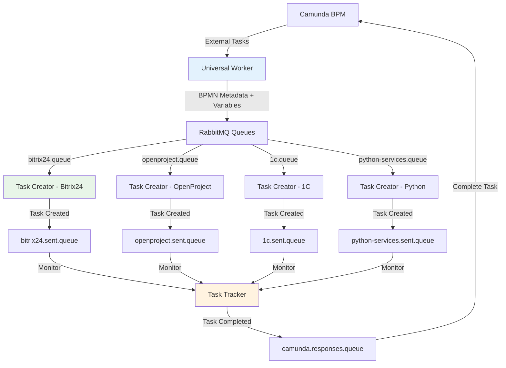

# Exchanger.py - Universal Integration Platform

Комплексная платформа интеграции Camunda BPM с внешними системами через RabbitMQ. Обеспечивает полный цикл обработки бизнес-процессов от получения задач в Camunda до их выполнения во внешних системах и возврата результатов.

## Архитектура решения

```
StormBPMN ←→ Camunda-StormBPMN Sync ←→ Camunda BPM ←→ Camunda Worker ←→ RabbitMQ ←→ Task Creator ←→ External Systems
                                                                         ↓
                                                                   Task Tracker (в планах)
```

## Разделение сред (Production / Development)

Проект поддерживает одновременную работу **production** и **development** сред на одном сервере с единой кодовой базой.

### Архитектура разделения

```
┌─────────────────────────────────────────────────────────────────┐
│                        ЕДИНАЯ КОДОВАЯ БАЗА                      │
│                     /opt/exchanger.py/                          │
├─────────────────────────────────────────────────────────────────┤
│                                                                 │
│  ┌─────────────────────┐      ┌─────────────────────┐          │
│  │   EXCHANGER_ENV=prod │      │   EXCHANGER_ENV=dev  │          │
│  ├─────────────────────┤      ├─────────────────────┤          │
│  │ .env.prod            │      │ .env.dev             │          │
│  │ logs/prod/           │      │ logs/dev/            │          │
│  │ LOG_LEVEL=INFO       │      │ LOG_LEVEL=DEBUG      │          │
│  └─────────────────────┘      └─────────────────────┘          │
│           │                            │                        │
│  ┌────────┴────────┐          ┌────────┴────────┐              │
│  │ systemd services│          │ systemd services│              │
│  │   *-prod.service│          │   *-dev.service │              │
│  └─────────────────┘          └─────────────────┘              │
│                                                                 │
└─────────────────────────────────────────────────────────────────┘
```

### Ключевые особенности

| Аспект | Production | Development |
|--------|------------|-------------|
| Переменная среды | `EXCHANGER_ENV=prod` | `EXCHANGER_ENV=dev` |
| Конфигурация | `.env.prod` | `.env.dev` |
| Логи | `logs/prod/` | `logs/dev/` |
| Уровень логирования | INFO | DEBUG |
| Автозапуск | ✅ Да | ❌ Нет |
| Bitrix24 | Production сервер | Dev сервер |

### Управление сервисами

```bash
# Production (по умолчанию)
./servieces-management/start_services.sh prod
./servieces-management/stop_services.sh prod
./servieces-management/restart_services.sh prod

# Development
./servieces-management/start_services.sh dev
./servieces-management/stop_services.sh dev

# Обе среды
./servieces-management/start_services.sh all

# Статус
./servieces-management/status_services.sh summary
```

📖 **[Полная документация по управлению сервисами](servieces-management/README.md)**

---

## SSL Configuration

### Проблема SSL сертификатов

Библиотека `camunda-external-task-client-python3==4.5.0` не поддерживает настройку SSL параметров, что приводит к ошибкам при подключении к Camunda:
```
SSLError(1, '[SSL: TLSV1_ALERT_DECODE_ERROR] tlsv1 alert decode error (_ssl.c:1000)')
```

### Решение

Проект использует **SSL Patch** - monkey patching библиотеки requests для автоматического добавления `verify=False` ко всем HTTP запросам к Camunda.

**Применение:**
- **Camunda Worker**: Автоматический SSL патч через `ssl_patch.py`
- **Camunda Sync**: Унифицированный SSL подход с `verify=False`
- **Отключение SSL warnings**: `urllib3.disable_warnings()`

**⚠️ Предупреждение о безопасности:**
- `verify=False` отключает проверку SSL сертификатов
- Используйте только в доверенной сетевой среде
- Для production рекомендуется настроить валидные SSL сертификаты

## Компоненты системы

### 🔄 Camunda Worker (`camunda-worker/`)

**Назначение**: Отвечает за получение External Tasks из Camunda BPM, обогащение их метаданными и отправку в RabbitMQ.
📖 **[Полная документация](camunda-worker/README.md)**

---

### 📨 Task Creator (`task-creator/`)

**Назначение**: Слушает очереди RabbitMQ и создает задачи во внешних системах (Bitrix24, OpenProject и др.).
📖 **[Полная документация](task-creator/README.md)**

---

### 🔄 Синхронизация Camunda-StormBPMN (`camunda-sync/`)

**Назначение**: Набор инструментов для синхронизации BPMN диаграмм между StormBPMN и Camunda, включая конвертацию и деплой.
📖 **[Полная документация](camunda-sync/README.md)**

---

### 📊 Task Tracker (`task-tracker/`)

**Назначение**: Отслеживание выполнения задач во внешних системах и формирование ответов в Camunda.
**Статус**: 🚧 В разработке

---

### 🛠️ Дополнительные инструменты

- **`process_reset_tool.py`**: Утилита для сброса и отладки экземпляров процессов в Camunda.
- **`other/`**: Набор вспомогательных скриптов, в основном для кастомизации и инспекции Bitrix24.

## Поток данных



### Ключевые особенности архитектуры

- **Прямое использование assigneeId**: Система напрямую использует значения `assigneeId` из BPMN extensionProperties как `responsible_id` в целевых системах
- **Упрощенная конфигурация**: Отсутствует необходимость в маппинге ролей через YAML файлы
- **BPMN метаданные**: Автоматическое извлечение и передача всех метаданных из BPMN диаграмм

## Быстрый старт

### Требования

- Python 3.8+
- RabbitMQ Server
- Camunda BPM Platform
- Доступы к внешним системам (Bitrix24, OpenProject, 1C и др.)

### Установка

```bash
git clone https://github.com/vlikhobabin/exchanger.py.git
cd exchanger.py

# Установка зависимостей из единого файла
pip install -r requirements.txt
```

### Конфигурация

Проект использует раздельные файлы конфигурации для каждой среды:

```bash
# Скопируйте пример конфигурации
cp config.env.example .env.prod
cp config.env.example .env.dev

# Настройте production
nano .env.prod

# Настройте development
nano .env.dev
```

**Основные различия конфигураций:**

| Параметр | `.env.prod` | `.env.dev` |
|----------|-------------|------------|
| `LOG_LEVEL` | INFO | DEBUG |
| `BITRIX_WEBHOOK_URL` | Production URL | Dev URL |
| `DEBUG_SAVE_RESPONSE_MESSAGES` | false | true |
| `CAMUNDA_DEBUG` | false | true |

### Запуск

#### Через systemd (рекомендуется для production)

```bash
# Установка сервисов
./servieces-management/install_services.sh

# Управление
./servieces-management/start_services.sh prod    # Запуск production
./servieces-management/start_services.sh dev     # Запуск development
./servieces-management/status_services.sh summary # Статус
```

#### Ручной запуск (для отладки)

```bash
cd /opt/exchanger.py
source venv/bin/activate

# Production
EXCHANGER_ENV=prod python camunda-worker/main.py
EXCHANGER_ENV=prod python task-creator/main.py

# Development
EXCHANGER_ENV=dev python camunda-worker/main.py
EXCHANGER_ENV=dev python task-creator/main.py
```

## Мониторинг и диагностика

### Логирование

Логи разделены по средам и содержат метку среды `[PROD]` или `[DEV]`:

```bash
# Production логи
tail -f /opt/exchanger.py/logs/prod/camunda-worker.log
tail -f /opt/exchanger.py/logs/prod/task-creator.log
tail -100 /opt/exchanger.py/logs/prod/camunda-worker-errors.log
tail -100 /opt/exchanger.py/logs/prod/task-creator-errors.log

# Development логи
tail -f /opt/exchanger.py/logs/dev/camunda-worker.log
tail -f /opt/exchanger.py/logs/dev/task-creator.log

# Systemd журнал
journalctl -u exchanger-camunda-worker-prod -f
journalctl -u exchanger-task-creator-prod -f
journalctl -u exchanger-camunda-worker-dev -f
journalctl -u exchanger-task-creator-dev -f
```

**Структура логов:**
```
logs/
├── prod/                           # Production логи
│   ├── camunda-worker.log          # Основной лог (ротация 100MB, 30 дней)
│   ├── camunda-worker-errors.log   # Ошибки (ротация 50MB, 60 дней)
│   ├── task-creator.log            # Основной лог (ротация 20MB, 14 дней)
│   ├── task-creator-errors.log     # Ошибки
│   └── debug/                      # Отладочные файлы
└── dev/                            # Development логи
    ├── camunda-worker.log
    ├── camunda-worker-errors.log
    ├── task-creator.log
    ├── task-creator-errors.log
    └── debug/
```

**Отладочное логирование:**
```bash
# Включить в .env.dev
DEBUG_SAVE_RESPONSE_MESSAGES=true
CAMUNDA_DEBUG=true
```

### Camunda Worker

```bash
# Статус Worker и очередей
cd camunda-worker
python tools/worker_diagnostics.py
python tools/check_queues.py

# Информация о процессах Camunda
python tools/camunda_processes.py --stats
```

## Развертывание

Для развертывания на production-сервере используйте инструкцию:
📖 **[Инструкция по развертыванию](DEPLOY_PROD.md)**

### Установка сервисов

```bash
# Сделать скрипты исполняемыми
chmod +x servieces-management/*.sh

# Установка (создает 4 systemd сервиса)
./servieces-management/install_services.sh
```

### Созданные сервисы

| Сервис | Среда | Автозапуск |
|--------|-------|------------|
| `exchanger-camunda-worker-prod` | Production | ✅ Да |
| `exchanger-task-creator-prod` | Production | ✅ Да |
| `exchanger-camunda-worker-dev` | Development | ❌ Нет |
| `exchanger-task-creator-dev` | Development | ❌ Нет |

📖 **[Полная документация по управлению сервисами](servieces-management/README.md)**

## Документация компонентов

- 📖 **[Camunda Worker](camunda-worker/README.md)** - Детальное описание Camunda Worker
- 📖 **[Task Creator](task-creator/README.md)** - Детальное описание RabbitMQ Worker
- 📖 **[Camunda-StormBPMN Sync](camunda-sync/README.md)** - Синхронизация BPMN диаграмм
- 📖 **[Tools Documentation](camunda-worker/tools/README.md)** - Сервисные скрипты и утилиты
- 📖 **[Services Management](servieces-management/README.md)** - Управление systemd сервисами

## Статус разработки

| Компонент | Статус | Описание |
|-----------|--------|----------|
| Camunda Worker | ✅ Production | Полностью готов, тестирован |
| Task Creator - Bitrix24 | ✅ Production | Готов к использованию с упрощенной архитектурой |
| Camunda-StormBPMN Sync | ✅ Production | Готов к использованию |
| Разделение сред prod/dev | ✅ Production | Полная поддержка двух сред |
| Task Creator - OpenProject | 🚧 Development | В разработке |
| Task Creator - 1C | 🚧 Planning | Планируется |
| Task Creator - Python Services | 🚧 Planning | Планируется |
| Task Tracker | 🚧 Planning | Планируется |

## Архитектурные улучшения v2.2

### Разделение сред Production / Development

Система теперь поддерживает одновременную работу двух независимых сред:

- **Переменная `EXCHANGER_ENV`** определяет среду (`prod` или `dev`)
- **Раздельные конфигурации** (`.env.prod`, `.env.dev`)
- **Раздельные логи** (`logs/prod/`, `logs/dev/`)
- **4 независимых systemd сервиса** с автозапуском только для production
- **Метки среды в логах** (`[PROD]`, `[DEV]`)

### Прямое использование assigneeId (v2.1)

Система использует упрощенную архитектуру для определения ответственных:

**BPMN диаграмма:**
```xml
<camunda:property name="assigneeId" value="3" />
```

**Результат:**
- assigneeId="3" → responsible_id=3 в Bitrix24 (напрямую)
- Отсутствует необходимость в маппинге через YAML файлы
- Автоматическое определение ответственного на основе BPMN

**Преимущества:**
- 🚀 **Производительность**: Нет операций загрузки/парсинга конфигурации
- 🛡️ **Надежность**: Отсутствует зависимость от внешних файлов
- 🔧 **Простота**: Упрощенная конфигурация и меньше кода
- 📈 **Гибкость**: Любое значение assigneeId сразу используется

## Roadmap

- [x] **Разделение сред prod/dev** - поддержка двух независимых сред
- [ ] **Завершение Task Creator** - реализация всех планируемых систем
- [ ] **Разработка Task Tracker** - полный цикл обработки задач
- [ ] **Docker контейнеризация** - упрощение развертывания
- [ ] **Web-интерфейс мониторинга** - визуальный контроль системы
- [ ] **REST API управления** - программное управление компонентами

## Лицензия

MIT License

---

**Автор**: EG-Holding  
**Версия**: 2.2.0  
**Поддержка**: [GitHub Issues](https://github.com/vlikhobabin/exchanger.py/issues)

## История изменений

### v2.2.0 - Разделение сред Production / Development
- ✅ **Переменная EXCHANGER_ENV**: Определение среды через переменную окружения
- ✅ **Раздельные конфигурации**: `.env.prod` и `.env.dev`
- ✅ **Раздельные логи**: `logs/prod/` и `logs/dev/` с метками среды
- ✅ **4 systemd сервиса**: Независимые сервисы для каждой среды
- ✅ **Скрипты управления**: Поддержка параметра `[prod|dev|all]`
- ✅ **Автозапуск только production**: Dev сервисы запускаются вручную

### v2.1.0 - Рефакторинг архитектуры
- ✅ **Прямое использование assigneeId**: Удален слой маппинга ролей через YAML файлы
- ✅ **Упрощенная конфигурация**: assigneeId из BPMN напрямую используется как responsible_id
- ✅ **Повышенная надежность**: Отсутствует зависимость от внешних файлов конфигурации
- ✅ **Оптимизация производительности**: Удалено ~100 строк кода, нет операций парсинга YAML
