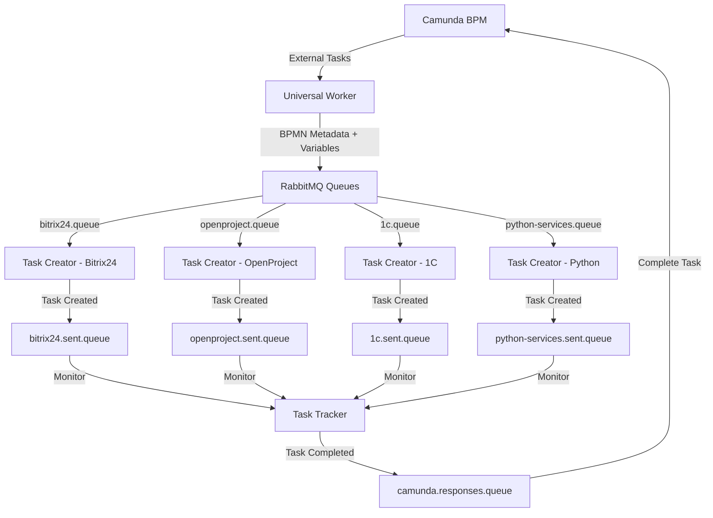

# Exchanger.py - Universal Integration Platform

Комплексная платформа интеграции Camunda BPM с внешними системами через RabbitMQ. Обеспечивает полный цикл обработки бизнес-процессов от получения задач в Camunda до их выполнения во внешних системах и возврата результатов.

## Архитектура решения

```
Camunda BPM ←→ Universal Worker ←→ RabbitMQ ←→ Task Creator ←→ External Systems
                                      ↓
                                Task Tracker (планируется)
```

## Компоненты системы

### 🔄 Universal Worker (`universal-worker.py`)

**Назначение**: Интеграция Camunda BPM с RabbitMQ

**Основные функции**:
- Мониторинг External Tasks от Camunda
- Извлечение BPMN метаданных (Extension Properties, Field Injections, Input/Output Parameters)
- Отправка задач в RabbitMQ с полными метаданными
- Асинхронное завершение задач через Response Handler
- Stateless архитектура с длительными блокировками

**Статус**: ✅ Готов к production

📖 **[Полная документация](universal-worker.py/README.md)**

---

### 📨 Task Creator (`task-creator.py`)

**Назначение**: Создание задач во внешних системах на основе сообщений из RabbitMQ

**Основные функции**:
- Чтение сообщений из RabbitMQ очередей
- Создание задач в различных системах (Bitrix24, OpenProject, 1C, Python services)
- Модульная архитектура с легким добавлением новых систем
- Отправка результатов в "sent" очереди для отслеживания
- Автоматическое подтверждение успешно обработанных сообщений

**Поддерживаемые системы**:
- ✅ **Bitrix24** - создание задач и сделок
- 🚧 **OpenProject** - управление проектами (планируется)
- 🚧 **1C** - интеграция с учетными системами (планируется)
- 🚧 **Python Services** - специализированные сервисы (планируется)

**Статус**: ✅ Готов к production (Bitrix24), 🚧 Разработка остальных систем

📖 **[Полная документация](task-creator.py/README%20(2).md)**

---

### 📊 Task Tracker (`task-tracker.py`)

**Назначение**: Отслеживание выполнения задач и формирование ответов в Camunda

**Планируемые функции**:
- Мониторинг очередей `*.sent.queue`
- Проверка статуса задач в системах-получателях
- Формирование ответов в `camunda.responses.queue`
- Обеспечение полного цикла обработки задач

**Статус**: 🚧 В разработке

---

## Поток данных



## Быстрый старт

### Требования

- Python 3.8+
- RabbitMQ Server
- Camunda BPM Platform
- Доступ к внешним системам (Bitrix24, OpenProject, 1C)

### Установка

```bash
git clone <repository-url>
cd exchanger.py

# Установка зависимостей для всех компонентов
pip install -r universal-worker.py/requirements.txt
pip install -r task-creator.py/requirements.txt
```

### Конфигурация

1. **Universal Worker**:
   ```bash
   cp universal-worker.py/config.env.example universal-worker.py/.env
   # Настройте параметры Camunda и RabbitMQ
   ```

2. **Task Creator**:
   ```bash
   cp task-creator.py/config.env.example task-creator.py/.env
   # Настройте параметры RabbitMQ и внешних систем
   ```

### Запуск

```bash
# Запуск Universal Worker
cd universal-worker.py
python main.py

# Запуск Task Creator (в другом терминале)
cd task-creator.py
python main.py
```

## Мониторинг и диагностика

### Universal Worker

```bash
# Статус Worker и очередей
cd universal-worker.py
python tools/worker_diagnostics.py
python tools/check_queues.py

# Информация о процессах Camunda
python tools/camunda_processes.py --stats
```

### Task Creator

```bash
# Тестирование конфигурации
cd task-creator.py
python simple_test.py

# Проверка Bitrix24 интеграции
python test_bitrix_worker.py
```

## Интеграция с внешними системами

### Настроенные интеграции

- **Bitrix24**: Создание задач, сделок, контактов через Webhook API
- **OpenProject**: Планируется интеграция REST API
- **1C**: Планируется интеграция через web-сервисы
- **Python Services**: Внутренние сервисы (email, telegram, файлы)

### Формат сообщений

Все сообщения включают:
- **Variables** - переменные процесса Camunda
- **BPMN Metadata** - Extension Properties, Field Injections, Input/Output Parameters
- **Process Context** - ID процесса, активности, бизнес-ключ

## Развертывание

### Development

```bash
# Запуск всех компонентов локально
./start-dev.sh  # (планируется создать)
```

### Production

```bash
# Установка как системный сервис
cd universal-worker.py
sudo bash install.sh

# Настройка systemd сервисов для всех компонентов
# (планируется создать общий скрипт установки)
```

## Документация компонентов

- 📖 **[Universal Worker](universal-worker.py/README.md)** - Детальное описание Camunda Worker
- 📖 **[Task Creator](task-creator.py/README%20(2).md)** - Детальное описание RabbitMQ Worker
- 📖 **[Tools Documentation](universal-worker.py/tools/README.md)** - Сервисные скрипты и утилиты

## Статус разработки

| Компонент | Статус | Описание |
|-----------|--------|----------|
| Universal Worker | ✅ Production | Полностью готов, тестирован |
| Task Creator - Bitrix24 | ✅ Production | Готов к использованию |
| Task Creator - OpenProject | 🚧 Development | В разработке |
| Task Creator - 1C | 🚧 Planning | Планируется |
| Task Creator - Python Services | 🚧 Planning | Планируется |
| Task Tracker | 🚧 Planning | Планируется |

## Roadmap

- [ ] **Завершение Task Creator** - реализация всех планируемых систем
- [ ] **Разработка Task Tracker** - полный цикл обработки задач
- [ ] **Docker контейнеризация** - упрощение развертывания
- [ ] **Общий скрипт установки** - автоматизация настройки
- [ ] **Web-интерфейс мониторинга** - визуальный контроль системы
- [ ] **REST API управления** - программное управление компонентами

## Лицензия

MIT License

---

**Автор**: EG-Holding  
**Версия**: 2.0.0  
**Поддержка**: [GitHub Issues](https://github.com/org/exchanger.py/issues) 