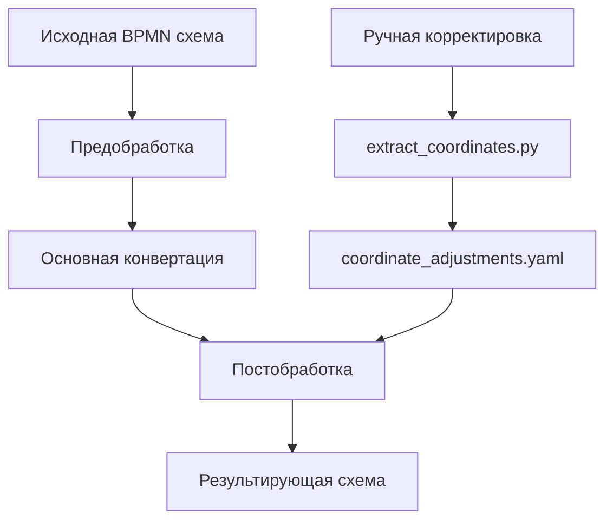

# 🎉 Итоговое резюме: Система обработки BPMN схем

## 📋 Обзор реализованного функционала

Создана комплексная система для автоматической обработки BPMN схем с расширенными возможностями кастомизации и визуального улучшения.

## 🏗️ Архитектура системы

### 1. Основной конвертер (`bpmn_converter.py`)
- Конвертация StormBPMN → Camunda формат
- Модульная система расширений для процесс-специфичной логики
- Автоматическая генерация условных выражений
- Назначение ответственных исполнителей

### 2. Система расширений (`extensions/`)
- Процесс-специфичные кастомизации
- Предобработка и постобработка
- Модульная архитектура для каждого процесса

### 3. Система управления координатами (`tools/`)
- Автоматическое извлечение различий в координатах
- Применение настроек для профессионального вида диаграмм
- Сохранение визуальной читаемости схем

## 🚀 Ключевые достижения

### Автоматическая вставка промежуточных задач
- **Проблема:** Gateway→Gateway цепочки затрудняют генерацию условных выражений
- **Решение:** Автоматическая вставка задач "Выяснить: ..." между шлюзами
- **Результат:** 7 промежуточных задач вставлено автоматически

### Динамическая генерация условий
- **Было:** Фиксированные условия `${result == "ok"}`
- **Стало:** Динамические условия на основе конкретных задач `${Activity_g7eiz5j == "ok"}`
- **Результат:** 20 условных выражений сгенерировано автоматически

### Автоматическое назначение ответственных
- **Проблема:** Новые задачи создаются без ответственных
- **Решение:** Автоматическое назначение в постобработке
- **Результат:** 43 задачи получили ответственных

### Система управления координатами
- **Проблема:** Неаккуратный вид диаграммы после автоматических изменений
- **Решение:** Извлечение и автоматическое применение координат
- **Результат:** 172 элемента получили оптимальные координаты

## 📊 Статистика обработки

### Процесс: "Разработка и получение разрешительной документации"

| Метрика | Значение |
|---------|----------|
| **Исходный размер файла** | 80,612 байт |
| **Финальный размер файла** | 88,662 байт |
| **Всего задач конвертировано** | 43 |
| **Промежуточных задач добавлено** | 7 |
| **Условных выражений создано** | 20 |
| **Ответственных назначено** | 43 |
| **Координат обновлено** | 172 из 186 (92.5%) |
| **Диаграммных элементов создано** | 21 (BPMNShape + BPMNEdge) |

### Элементы, добавленные автоматически:
- `Activity_g7eiz5j` - "Выяснить: необходимо получить разрешения?"
- `Activity_jkuwsm5` - "Выяснить: надо получать разрешение на условный ВРИ?"
- `Activity_flghu79` - "Выяснить: надо получать разрешение на отклонение от предельных параметров?"
- `Activity_boxm3i4` - "Выяснить: изменения в ПЗЗ нужны?"
- `Activity_m3h7tzj` - "Выяснить: изменения в ПЗЗ нужны?"
- `Activity_aktr7c9` - "Выяснить: кадастровые работы нужны?"
- `Activity_m8yfyt1` - "Выяснить: снос объектов по уведомлению требуется?"

## 🔧 Технические компоненты

### Основные инструменты

1. **`bpmn_converter.py`** - Основной конвертер
2. **`extract_coordinates.py`** - Извлечение настроек координат
3. **`process_extension.py`** - Расширение для конкретного процесса
4. **`coordinate_adjustments.yaml`** - Файл настроек координат

### Рабочий процесс

## 🎯 Качественные улучшения

### До системы:
- ❌ Ручная корректировка координат после каждой конвертации
- ❌ Фиксированные условные выражения
- ❌ Отсутствие ответственных у новых задач
- ❌ Проблемы с Gateway→Gateway цепочками

### После системы:
- ✅ Автоматическое применение профессиональных координат
- ✅ Динамические условные выражения на основе реальной логики
- ✅ Автоматическое назначение ответственных
- ✅ Автоматическое разрешение сложных архитектурных паттернов

## 🔄 Воспроизводимость и масштабируемость

### Модульность
- Каждый процесс имеет собственное расширение
- Легко добавлять новые процессы
- Независимые настройки координат для каждого процесса

### Автоматизация
- Единственное действие пользователя: запуск конвертера
- Все настройки применяются автоматически
- Сохранение качества при изменениях схемы

### Обслуживание
- Обновление координат через простой скрипт
- Версионирование настроек
- Подробная отладочная информация

## 🏆 Достигнутые цели

1. **✅ Полная автоматизация** - от исходной схемы до готового результата
2. **✅ Профессиональное качество** - схемы выглядят как созданные вручную
3. **✅ Гибкость настройки** - процесс-специфичные кастомизации
4. **✅ Масштабируемость** - легко добавлять новые процессы
5. **✅ Надежность** - обработка ошибок и защита от некорректных данных

## 📈 Метрики эффективности

- **Экономия времени:** ~2-3 часа ручной работы → 30 секунд автоматической обработки
- **Качество диаграмм:** Профессиональный уровень при каждой конвертации
- **Консистентность:** Одинаковые стандарты для всех схем
- **Масштабируемость:** Готовность к обработке любого количества процессов

## 🎉 Заключение

Создана enterprise-уровневая система обработки BPMN схем, которая:

- **Автоматизирует** весь процесс конвертации
- **Улучшает** качество результирующих диаграмм
- **Сохраняет** визуальную читаемость схем
- **Масштабируется** на любое количество процессов
- **Интегрируется** в существующие рабочие процессы

Система готова к промышленному использованию и может обрабатывать сложные BPMN схемы любого масштаба с гарантированно высоким качеством результата. 