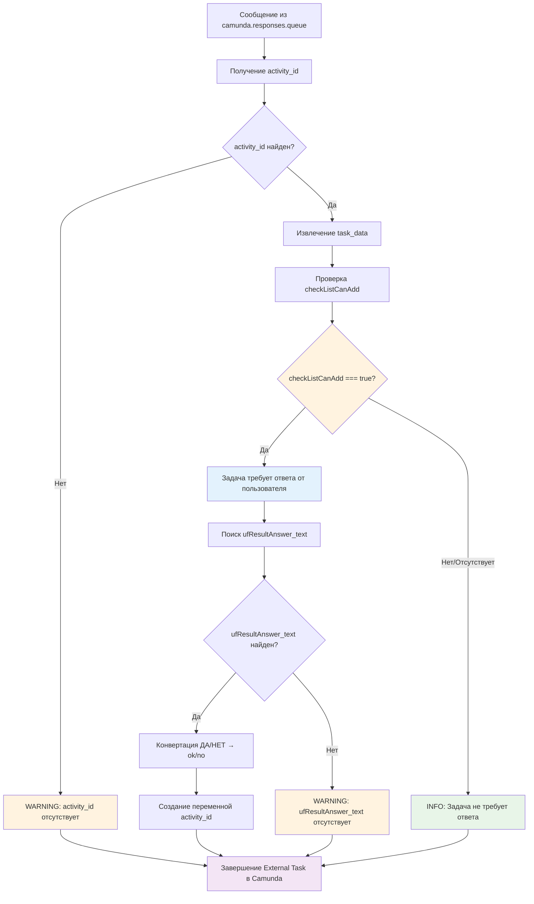

# Camunda Worker

Camunda Worker для обработки External Tasks от Camunda через RabbitMQ с Stateless архитектурой.

## Описание

Camunda Worker - это независимый модуль для интеграции Camunda BPM с внешними системами через RabbitMQ. Реализует Stateless архитектуру с длительными блокировками задач.

### Основные возможности

- Мониторинг всех External Tasks от процессов Camunda
- **Извлечение BPMN метаданных** - Extension Properties, Field Injections, Input/Output Parameters
- Автоматическое определение целевой системы по топику задачи
- Отправка задач в соответствующие очереди RabbitMQ с полными метаданными
- Асинхронное завершение задач через Response Handler
- Блокировка задач на длительный период (по умолчанию 10 минут)
- Интеллектуальное кэширование BPMN XML с lazy loading
- Устойчивость к перезагрузкам и сбоям
- Детальное логирование и мониторинг

### Поддерживаемые системы

- **Bitrix24** - CRM и управление проектами
- **OpenProject** - управление проектами  
- **1C** - учетные системы
- **Python Services** - специализированные сервисы

## SSL Configuration

### Проблема SSL сертификатов

Библиотека `camunda-external-task-client-python3==4.5.0` не поддерживает настройку SSL параметров, что приводит к ошибкам:
```
SSLError(1, '[SSL: TLSV1_ALERT_DECODE_ERROR] tlsv1 alert decode error (_ssl.c:1000)')
```

### Решение

Проект использует **SSL Patch** - monkey patching библиотеки requests для автоматического добавления `verify=False` ко всем HTTP запросам к Camunda.

**Применение патча:**
- Автоматически применяется при импорте модуля `ssl_patch`
- Патч работает глобально для всех `requests` вызовов
- Отключает SSL warnings через `urllib3.disable_warnings()`

**⚠️ Предупреждение о безопасности:**
- `verify=False` отключает проверку SSL сертификатов
- Используйте только в доверенной сетевой среде
- Для production рекомендуется настроить валидные SSL сертификаты

## Архитектура

Camunda Worker использует **интегрированную архитектуру** где обработка External Tasks и Response Handling выполняются в едином процессе для максимальной эффективности.

### Компоненты системы

1. **Camunda Worker** - получение задач из Camunda, отправка в RabbitMQ и обработка ответов
2. **BPMN Metadata Cache** - извлечение и кэширование метаданных из BPMN XML
3. **Интегрированный Response Handler** - встроенная обработка ответов и завершение задач в Camunda
4. **RabbitMQ Client** - взаимодействие с очередями сообщений

### Workflow обработки

1. Worker получает External Task от Camunda
2. Блокирует задачу на указанный период
3. **Извлекает BPMN метаданные** из кэша или парсит XML (lazy loading)
4. Определяет целевую систему по топику
5. Отправляет задачу в соответствующую очередь RabbitMQ **с метаданными**
6. Внешняя система обрабатывает задачу (может занимать длительное время)
7. Система отправляет результат в очередь ответов
8. **Интегрированный Response Handler** (каждые `HEARTBEAT_INTERVAL` секунд) получает ответ и завершает задачу в Camunda

### BPMN Метаданные

Worker автоматически извлекает из BPMN XML и передает в RabbitMQ:

- **Extension Properties** - кастомные свойства элементов (включая `assigneeId`)
- **Field Injections** - инъекции полей в Java Delegates
- **Input Parameters** - входные параметры элементов
- **Output Parameters** - выходные параметры элементов

**Ключевая особенность - прямое использование assigneeId:**
- Значение `assigneeId` из BPMN extensionProperties напрямую используется как `responsible_id` в целевых системах
- Отсутствует необходимость в маппинге ролей через внешние файлы
- Упрощенная конфигурация и повышенная надежность

**Преимущества кэширования:**
- **Lazy Loading** - XML загружается только при первой задаче процесса
- **TTL**: 24 часа (конфигурируется)
- **LRU Eviction** - автоматическая очистка старых записей
- **Thread-safe** операции
- **Производительность**: 6x ускорение после первой загрузки

### Организация очередей RabbitMQ

**Исходящие задачи (Exchange: camunda.external.tasks)**
- `bitrix24.queue` - задачи для Bitrix24
- `openproject.queue` - задачи для OpenProject  
- `1c.queue` - задачи для 1C
- `python-services.queue` - задачи для Python сервисов
- `default.queue` - все остальные задачи

**Ответные сообщения (Exchange: camunda.task.responses)**
- `camunda.responses.queue` - ответы от всех систем

## Установка

### Требования

- Python 3.8+
- RabbitMQ
- Camunda BPM Platform
- Доступ к REST API Camunda

### Быстрая установка

```bash
git clone <repository-url>
cd camunda-worker
pip install -r requirements.txt
```

### Конфигурация

Создайте файл `.env` на основе `config.env.example`:

```bash
# Camunda настройки
CAMUNDA_BASE_URL=https://your-camunda-server.com/engine-rest
CAMUNDA_WORKER_ID=universal-worker
CAMUNDA_MAX_TASKS=10
CAMUNDA_LOCK_DURATION=31536000000
CAMUNDA_AUTH_USERNAME=your_username
CAMUNDA_AUTH_PASSWORD=your_password

# RabbitMQ настройки  
RABBITMQ_HOST=your-rabbitmq-host.com
RABBITMQ_USERNAME=your_username
RABBITMQ_PASSWORD=your_password

# BPMN Metadata Cache
BPMN_CACHE_TTL_HOURS=24
BPMN_CACHE_MAX_SIZE=150

# Логирование
LOG_LEVEL=INFO
```

## Запуск

### Основные команды

```bash
# Запуск интегрированного Worker (рекомендуется)
python main.py

# Запуск только Worker (без обработки ответов)
python camunda_worker.py

# Тестирование BPMN метаданных
python test_metadata_cache.py

# Тестирование обработки ответов
python tools/test_response_processing.py

# Очистка очереди ответов от проблемных сообщений
python tools/clear_response_queue.py

# Тестирование одного сообщения из очереди (безопасно)
python tools/test_single_response.py
```

### Как сервис

См. подробную инструкцию по установке и управлению сервисами в `scripts/SERVICES_MANAGEMENT.md`.
В проекте используются systemd сервисы: `exchanger-worker.service` и `exchanger-creator.service`.

## Конфигурация

### Основные параметры

| Параметр | Описание | По умолчанию |
|----------|----------|--------------|
| `CAMUNDA_BASE_URL` | URL REST API Camunda | `https://camunda.example.com/engine-rest` |
| `CAMUNDA_WORKER_ID` | Идентификатор Worker | `universal-worker` |
| `CAMUNDA_MAX_TASKS` | Максимум задач за запрос | `10` |
| `CAMUNDA_LOCK_DURATION` | Время блокировки (мс) | `31536000000` (1 год) |
| `RABBITMQ_HOST` | Хост RabbitMQ | `localhost` |
| `RABBITMQ_PORT` | Порт RabbitMQ | `5672` |
| `BPMN_CACHE_TTL_HOURS` | TTL кэша метаданных (часы) | `24` |
| `BPMN_CACHE_MAX_SIZE` | Максимум процессов в кэше | `150` |
| `HEARTBEAT_INTERVAL` | Интервал проверки ответов (сек) | `60` |
| `LOG_LEVEL` | Уровень логирования | `INFO` |

### Маппинг топиков

Worker автоматически определяет целевую систему по названию топика:

```python
# Примеры маппинга
"bitrix_create_task" → bitrix24.queue
"op_create_project" → openproject.queue  
"1c_sync_data" → 1c.queue
"send_email" → python-services.queue
```

Полный список маппингов определен в `config.py` в классе `RoutingConfig`.

## Мониторинг

### Логи

Система ведет несколько типов логов:

- **Основные логи**: `logs/camunda_worker.log`
- **Логи ошибок**: `logs/camunda_worker_errors.log`
- **Системные логи**: через `journalctl -u exchanger-worker`

### Статистика

Worker выводит статистику каждые 30 секунд:

```
Monitor - Uptime: 3600s | Обработано: 150 | Успешно: 147 | Ошибки: 3 | Ответов: 25 | Завершено: 24
BPMN Cache - Hits: 142 | Misses: 8 | Hit Rate: 94.7% | Size: 12/150 (0.18 MB)
```

### Мониторинг BPMN кэша

Детальная статистика доступна через API:

```json
{
  "metadata_cache": {
    "cache_hits": 142,
    "cache_misses": 8,
    "hit_rate_percent": 94.67,
    "cache_size": 12,
    "cache_size_mb": 0.18,
    "avg_parse_time_ms": 1.3,
    "avg_cache_access_time_ms": 0.2
  }
}
```

### Проверка состояния

Используйте сервисные скрипты из каталога `tools/`:

```bash
# Статус очередей RabbitMQ
python tools/check_queues.py

# Информация о процессах Camunda
python tools/camunda_processes.py --stats

# Диагностика Worker
python tools/worker_diagnostics.py

# Тестирование обработки ответов
python tools/test_response_processing.py
```

## API для внешних систем

### Формат ответного сообщения

### Переменные возвращаемые в Camunda

После завершения задачи Worker автоматически передает в процесс Camunda следующие переменные:

**Boolean переменные (для условных выражений):**
- `task_completed` = `true` - задача завершена
- `task_success` = `true` - задача выполнена успешно

**Данные результата:**
- `external_task_id` - ID созданной записи во внешней системе
- `external_task_title` - название/заголовок 
- `external_task_status` - статус во внешней системе
- `external_task_description` - описание (до 1000 символов)
- `task_result_json` - полный результат в формате JSON

**Метаинформация:**
- `processing_status_text` - текстовый статус ("completed")
- `processed_at` - время обработки
- `original_topic` - исходный топик задачи
- `external_system` - система, которая обработала задачу

**Исходные переменные:** Все переменные из исходной задачи возвращаются обратно в процесс.

## Формат сообщений

### Исходящие задачи

Внешние системы получают задачи с полными метаданными в очередях RabbitMQ:

```json
{
  "id": "task-uuid",
  "topic": "bitrix_create_task",
  "variables": {
    "projectId": {"value": "123", "type": "String"}
  },
  "metadata": {
    "extensionProperties": {
      "assigneeId": "3",
      "customProperty": "customValue"
    },
    "fieldInjections": {
      "serviceUrl": "https://api.example.com"
    },
    "inputParameters": {
      "inputData": "processedValue"
    },
    "outputParameters": {
      "resultMapping": "responseField"
    }
  }
}
```

**Ключевое поле `assigneeId`:**
- Значение `assigneeId` из BPMN напрямую используется как `responsible_id` в Bitrix24
- Пример: `assigneeId: "3"` → `responsible_id: 3` в создаваемой задаче

### Формат ответа от внешних систем

Внешние системы должны отправлять ответы в очередь `camunda.responses.queue`:

```json
{
  "task_id": "task-uuid",
  "response_type": "complete",
  "worker_id": "universal-worker",
  "variables": {
    "result": {"value": "success", "type": "String"},
    "data": {"value": "{\"key\": \"value\"}", "type": "String"}
  }
}
```

### Типы ответов

- `complete` - успешное завершение задачи
- `failure` - ошибка с возможностью повтора
- `bpmn_error` - BPMN ошибка для обработки в процессе

## Разработка

### Структура проекта

```
camunda-worker/
├── main.py                 # Точка входа
├── camunda_worker.py       # Основной Worker
├── bpmn_metadata_cache.py  # Кэш BPMN метаданных
├── response_handler.py     # Обработчик ответов
├── rabbitmq_client.py      # RabbitMQ клиент
├── config.py              # Конфигурация
├── requirements.txt       # Зависимости
├── test_metadata_cache.py  # Тесты BPMN метаданных
├── TestProcess.xml        # Тестовый BPMN процесс
├── tools/                 # Сервисные скрипты
│   ├── start_process.py   # Запуск процессов
│   ├── camunda_processes.py # Мониторинг процессов
│   ├── check_queues.py    # Проверка очередей
│   ├── unlock_task.py     # Разблокировка задач
│   └── README_METADATA_CACHE.md # Документация кэша
└── logs/                  # Файлы логов
```

Схема анализа ответа от Bitrix24



### Зависимости

- `camunda-external-task-client-python3` - клиент для Camunda
- `pika` - клиент для RabbitMQ
- `pydantic` - валидация конфигурации
- `requests` - HTTP запросы к Camunda API
- `loguru` - расширенное логирование
- `lxml` - парсинг BPMN XML

## Troubleshooting

### Частые проблемы

1. **Задачи не обрабатываются**: Проверьте подключение к Camunda и маппинг топиков
2. **Ошибки RabbitMQ**: Убедитесь в корректности credentials и доступности сервера
3. **Задачи зависают**: Проверьте время блокировки и работу Response Handler
4. **Метаданные не извлекаются**: Проверьте доступ к Camunda REST API для загрузки BPMN XML
5. **Проблемы с кэшем**: Увеличьте `BPMN_CACHE_MAX_SIZE` или проверьте логи парсинга XML
6. **Ошибка "condition expression returns non-Boolean"**: BPMN процесс ожидает Boolean в условном выражении. Для диагностики:
   - Запустите `python tools/test_single_response.py` для безопасного тестирования
   - Проверьте логи Worker - включено подробное логирование запросов к Camunda
   - Убедитесь что условные выражения в BPMN используют правильные переменные

### Диагностика

```bash
# Проверка подключений
python tools/worker_diagnostics.py

# Тестирование BPMN метаданных
python test_metadata_cache.py

# Разблокировка зависших задач
python tools/unlock_task.py --task-id <task-id>

# Просмотр активных процессов
python tools/camunda_processes.py --instances
```

## Лицензия

MIT License 